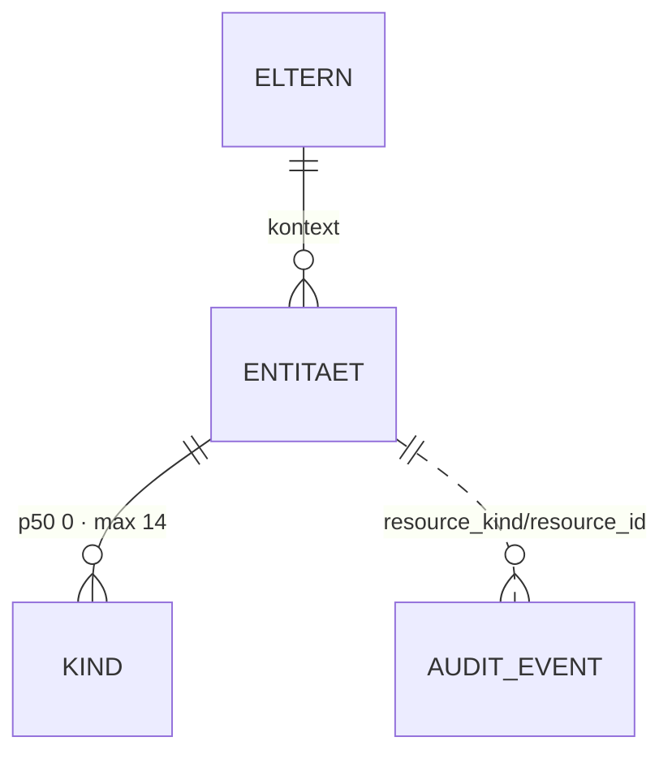

# <Entität deutsch> · `<english name>` — Entitätsprofil

| | |
|---|---|
| Status | analysiert · geprüft · in Specs |
| GLOSSARY | `### <Eintrag>` — englisch `<name>`, Ordner `entities/<slug>/` |
| Tabelle | `ludwig.<tabelle>` (+ Subtyp-Tabellen) |
| Typen | `src/ludwig/modules/<modul>/domain/<datei>.ts` — `<Typ>`, `<ENUM>`, `<Ableitung>()` |
| Status-Achsen | `STATUS_REGISTRY.<achse>`, … |
| Wichtigkeit | hoch · mittel · niedrig (Datenmodell-Review §7) |
| Datenstand | lokal · Staging · Seeds · Nutzer — Datum, n Zeilen |
| Rückfrage | gestellt am … · beantwortet · unbeantwortet (Defaults gelten) |
| Analyse von / am | Agent oder Person, Datum |

## Was sie ist

Zwei Sätze aus dem GLOSSARY in eigenen Worten: was die Sachbearbeiterin damit
tut. Darunter die **Anzeige-Regeln** aus den GLOSSARY-Notes, wörtlich
(„NULL heißt bewusst keins, nicht unbekannt").

## Schaubild



Eltern oben, Kinder unten, FK-lose Verweise gestrichelt. Kardinalitäten aus
den Daten, nicht aus dem Schema.

## Datenpunkte

| Datenpunkt | Quelle | Rolle | Füllgrad | heute in | änderbar | Rang | ab Form | Beleg |
|---|---|---|---|---|---|---|---|---|
| Gegenpart (`counterpartyName`) | Spalte | Identität | 96 % | `CaseRow`, `CaseCell` | Nutzer | 1 | XS | Füllgrad · heute in `CaseRow` |
| … | `abgeleitet: fehlt → Befund` | … | | | | | | Annahme |

Ausgelassen (Technik): `id`, `tenant_id`, …

Freitext-Grenzen: `summary` gekürzt ab … Zeichen (p90 aus den Daten).

## Relationen

| Relation | Richtung | Kardinalität | Rolle | ab Form | Darstellung | Beleg |
|---|---|---|---|---|---|---|
| Klärungen (`clarifications`) | Kind | 62 % ohne · p50 0 · p90 2 · max 14 | Zustand | S | Zähler (S) · Liste (L), eingebettet als `ClarificationRow` → Profil `clarification` | Staging |
| Historie (`platform_audit_events`) | ohne FK | … | Verantwortung | L | Liste | … |

## Heutige Darstellung

Aus `ui-repraesentationen.md` §1 und den gelesenen Feldern je Komponente:

| Komponente | Form | zeigt | fehlt | zu viel |
|---|---|---|---|---|
| `CaseRow` | Zeile | … | … | … |

## Listen

Je Liste ein Job-Satz („Wenn <Situation>, will <Rolle> <Ziel>, damit <Nutzen>")
und der Tabellenschnitt. Grundgesamtheit = was die Liste definiert, Filter =
was die Nutzerin wegnimmt.

| Liste | Job | Grundgesamtheit | Sortierung | Spalten (Ränge) | Filter | Massenaktion | Leerfall | Umfang p50 · p90 | Beleg |
|---|---|---|---|---|---|---|---|---|---|
| `<Entity>List` „Vorrat" | Wenn … will … damit … | offene, eigener Mandant | älteste zuerst | 1–5 + Fälligkeit | Zustand, Mandant | keine | „nichts offen" (Erfolg) ≠ „keine Treffer" (Filter) | 8 · 60 | Staging · `<Screen>` |

Eigene Route → zusätzlich Seitenprofil `docs/seiten/<slug>.md`; hier stehen
nur Job und Schnitt.

## Formen

| Form | Größe | Empfehlung | Grund (§7 Nr.) | zeigt (Ränge) | Relationen | setzt auf | ersetzt |
|---|---|---|---|---|---|---|---|
| `<Entity>Cell` | XS | ja | 3 — FK-Ziel von … | 1–2 | — | `Badge` | `CaseCell` |
| `<Entity>Row` | S | ja | 1 — existiert als `CaseRow` | 1–6 | Klärungen als Zähler | `Row`, `StatusBadge`, `Amount` | `CaseRow`, `PortalCaseList` |
| `<Entity>Card` | M | nein | kein Screen zeigt sie im Kontext einer anderen Entität | | | | |
| `<Entity>View` | L | ja | … | | | | |
| `<Entity>Drawer` | L | ja | 5 — nachgeschlagen aus `<verweisende Ansicht>` heraus | wie View | wie View | `Drawer`, `<Entity>View`-Fakten | `BelegDrawer` |
| `<Entity>Editor` | XL | nein | keine Punkte mit änderbar = Nutzer außer … → `InlineEdit` im View | | | | |

Bau-Reihenfolge: `<Entity>Cell` → `<Entity>Row` → `<Entity>View`.

## Zuschnitt

| Form / Liste | Marke | Grund | Backlog |
|---|---|---|---|
| `<Entity>Row` | jetzt | trägt Liste und Karte | — |
| `<Entity>List` „Archiv" | Backlog | Job nur genannt, kein Screen belegt ihn | `docs/backlog/00NN-…md` |
| `<Entity>Editor` | verworfen | keine Punkte mit änderbar = Nutzer | — |

Höchstens fünf Formen mit Marke **jetzt**.

## Befunde für `ludwig/app`

- fehlender Typ / fehlende Ableitung / fehlender GLOSSARY-Eintrag / fehlende Registry-Achse — je ein Satz mit Fundstelle.

## Offene Fragen

Höchstens drei, jede mit Default: „… — ohne Antwort: …".

## Prüfung

Gehört dem zweiten Agenten. Er prüft zuerst alle Zeilen mit Beleg `Annahme`,
dann die Ränge gegen „Heutige Darstellung", dann die Formen gegen §7.

| Zeile / Form | Einwand | Ergebnis | Geprüft von / am |
|---|---|---|---|
| … | … | bestätigt · geändert auf … · offen | … |

## Weiter

Prüfprompt (neue Sitzung, anderer Agent):

```
Prüfe das Entitätsprofil docs/entitaeten/<slug>.md nach Skill entitaet-analysieren §5–§9.
Zuerst jede Zeile mit Beleg „Annahme": belege oder widerlege sie mit Füllgrad, heutiger
Komponente oder GLOSSARY. Dann die Ränge: deck die Punkte ab Rang k ab — erkennt eine
Sachbearbeiterin den Vorgang noch? Dann die Formen: hat jede empfohlene einen Grund aus
§7, fehlt eine, die die App heute hat? Dann die Listen: hat jede einen Job-Satz, und ist
jede Ausprägung nach §8 eine eigene Komponente wert oder nur ein Prop? Zuletzt der Zuschnitt:
sind höchstens fünf Formen „jetzt", und trägt jede Backlog-Zeile ihren Grund? Trag jeden
Einwand in „Prüfung" ein, ändere die
Tabellen, wo du sicher bist, und setze den Status auf „geprüft". Kundendaten bleiben in
der Datenbank; nur SELECT.
```

Startprompt (neue Sitzung, nach Status `geprüft`):

```
Für die Entität <Entität> (`<english name>`) liegt das geprüfte Profil unter
docs/entitaeten/<slug>.md. Schreibe mit Skill spec-schreiben je Form eine Spec, in dieser
Reihenfolge — nur die Formen mit Marke „jetzt" aus dem Abschnitt Zuschnitt:
<Entity>Cell, <Entity>Row, <Entity>View. Was dort „Backlog" trägt, bleibt liegen. Jede Spec verlinkt das Profil als
Quelle und nimmt Datenpunkte, Ränge, Relationen und „ersetzt" von dort, nicht aus dem
Chat; die Punkte einer Form sind die Ränge bis zu ihrer Größe, in derselben Reihenfolge.
Danach baut Skill v3-komponente jede Spec in derselben Reihenfolge, die größere Form
komponiert die kleinere. Abgenommen wird von einem anderen Agenten gegen die Spec. Nur
eigene Dateien stagen. Setze am Ende den Status des Profils auf „in Specs" und trage die
Backlog-Nummern ein.
```
