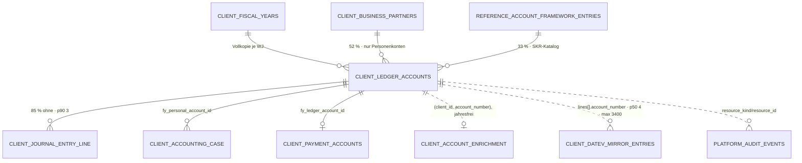

# Konto · `ledger account` — Entitätsprofil

| | |
|---|---|
| Status | in Specs |
| GLOSSARY | `### Ledger account (Konto)` — englisch `ledger account`, Ordner `entities/account/` (Abweichung, siehe Befund 5) |
| Tabelle | `ludwig.client_ledger_accounts` · View `client_ledger_accounts_current` (jahresfreie Leser) · Semantik separat in `client_account_enrichment` |
| Typen | `src/ludwig/modules/accounts/domain/account.ts` — `ACCOUNT_TYPES`, `CLEARING_ACCOUNT_TYPES`; `core/datev/main-function.ts` — `DATEV_MAIN_FUNCTION_NUMBER`; `core/datev/account-number.ts` — Kontonummern-Kanon |
| Status-Achsen | `konto` (Kontostatus) · `konto_typ` (Rolle) · `konto_datev_sync` · `verrechnungskonto`; für die Bewegungen `buchung`, `buchung_datev`, `buchung_origin`, `mirror_match` |
| Wichtigkeit | hoch — Kontonummer ist der Anker jeder Buchung |
| Datenstand | Staging über den Pooler, 2026-09-04, nur `SELECT`: 41.570 Konten · 611 Ludwig-Buchungssätze · 41.826 DATEV-Spiegel-Sätze |
| Rückfrage | gestellt und **beantwortet** am 2026-09-04 — alle drei Defaults bestätigt (siehe „Beantwortete Fragen") |
| Analyse von / am | Claude, 2026-09-04 |

## Was sie ist

Eine Zeile im Kontenrahmen des Mandanten: Nummer, Name, Rolle. Die
Sachbearbeiterin benutzt sie fast nie als Stammsatz, sondern als **Frage**:
Sie steht in einer Buchung auf `1210` und will wissen, was sonst noch auf
diesem Konto liegt — bevor sie das Konto übernimmt. Das Konto ist damit
weniger ein Objekt als ein **Schnitt durch die Buchungen**.

Anzeige-Regeln aus dem GLOSSARY, wörtlich:

- **„Ein Kontenplan existiert nicht ohne Wirtschaftsjahr (F64)."** Jede Zeile
  trägt `fiscal_year_id`, der Unique-Key ist `(client_id, fiscal_year_id,
  account_number)`. Jede Ansicht eines Kontos ist die Ansicht **eines Jahres**.
- **„Quelle ist DATEV"** — Ludwig legt keine Sachkonten an, die DATEV nicht
  kennt (Ausnahme: der 89xxxx-Platzhalter-Range).
- **„Speichern = Anzeigen = logische Nummer"** (Kontonummern-Kanon,
  Owner 2026-08-01). Es gibt keine separate Anzeigeform. `0420` trägt die
  führende Null, nie numerisch casten.
- **„Use `ledger account` in code and docs to avoid collision with
  user-identity 'account'."**
- `datev_sync_state` ist **orthogonal zu `status`**: aktiv/inaktiv ist eine
  fachliche Aussage, keine Sync-Aussage.

## Schaubild



Gestrichelt = ohne FK. Die beiden wichtigsten Kanten des Kontos sind
gestrichelt: der DATEV-Spiegel trägt die Kontonummer als **Text im
`lines`-JSONB**, das Enrichment hängt an `(client_id, account_number)` ohne
Jahresbezug.

## Datenpunkte

| Datenpunkt | Quelle | Rolle | Füllgrad | heute in | änderbar | Rang | ab Form | Beleg |
|---|---|---|---|---|---|---|---|---|
| Kontonummer (`accountNumber`) | Spalte | Identität | 100 % | `AccountRef`, `AccountsTableRow`, Drawer-Titel, `AccountField` | nie | 1 | XS | Füllgrad · heute in `AccountRef` |
| Kontoname (`accountName`) | Spalte | Identität | 100 % | dieselben | Server (DATEV-Import) | 2 | XS | Nachtrag Owner 2026-09-03 zu 0013: „immer beides" |
| Rolle (`accountingRole`) | Spalte, Achse `konto_typ` | Zustand | 100 % — debtor 46 %, general_ledger 43 %, creditor 7 %, revenue 4 % | `AccountClassBadge`, Drawer-`meta` | nie | 3 | S | Registry-Achse `konto_typ` · Verteilung |
| Wirtschaftsjahr (`fiscalYear`) | `fiscal_year_id` → `client_fiscal_years.year` | Kontext | 100 % | Drawer-`meta`, Route, `YearSwitcher` | Nutzer (wechselt das Jahr) | 4 | XS **im Drawer**, sonst S | GLOSSARY F64 · der Drawer steht außerhalb seines Kontexts (§5 Rolle Kontext) |
| Saldo im Jahr (`balance`) | `abgeleitet: Σ Soll − Σ Haben der Bewegungen` | Maß | — | Kontoseite `Stat` „Saldo" | nie | 5 | S | heute in `accounts/[accountNumber]` Z. 302 |
| Bewegungen im Jahr (`entryCount`) | `abgeleitet: count(Bewegungen)` | Maß | — | Drawer-`meta` („n in Ludwig, m in DATEV"), Kontoseite `Stat` | nie | 6 | S | heute in `AccountLedgerDrawer.tsx` Z. 93 |
| Σ Soll / Σ Haben | `abgeleitet` | Maß | — | Kontoseite `Stat`, Drawer-`tfoot` | nie | 7 | M | heute in beiden |
| Geschäftspartner (`partnerName`) | Relation `business_partner_id` | Identität | 52 % (nur Personenkonten, dort ~100 %) | `AccountsTab` im Partner | Server | 8 | M | Füllgrad · GLOSSARY „Creditor account" |
| SKR-Klasse (`skrClass`) | Spalte | Kontext | 100 % — 46 % `personal_debtor` | `AccountsTableRow` | nie | 9 | M | Verteilung |
| Letzte Buchung (`lastBookingDate`) | Spalte | Zeit | 15 % | Kontoseite `Stat` | Server | 10 | M | Füllgrad 15 % → §5 nicht vor M |
| Buchungen insgesamt (`usageBookingCount`) | Spalte | Maß | 100 %, davon 85 % = 0 · p90 3 · max 5.474 | Kontoseite `Stat`, `AccountsTableRow` | Server | 11 | M | Verteilung |
| Kontostatus (`status`) | Spalte, Achse `konto` | Zustand | 100 %, davon 99 % `active` | `AccountsTableRow` | Server | 12 | M | Verteilung — als Zustand fast konstant, deshalb nicht ab XS trotz §5 („Zustand ab XS") |
| DATEV-Sync (`datevSyncState`) | Spalte, Achse `konto_datev_sync` | Zustand | 100 %, davon 100 % `synced` (15 Zeilen `local_only`) | — | Server | 13 | M, **nur wenn ≠ `synced`** | Verteilung · GLOSSARY „orthogonal zu `status`" |
| Kontenfunktion (`datevMainFunctionNumber`) | Spalte | Kontext | 47 % | — | nie (Fremdsystem) | 14 | M, **nur wenn sie etwas sperrt** (12 = Buchungssperre) | GLOSSARY „Kontenfunktion" · `konten.md` R18 |
| Verrechnungskonto (`clearingAccountType`) | Spalte, Achse `verrechnungskonto` | Zustand | 0 % auf Staging | — | Nutzer (bestätigt) | 15 | L | Füllgrad |
| Automatik-Steuersatz (`datevTaxRate`) | Spalte | Kontext | 7 % | — | nie | 16 | L | Füllgrad |
| Kontoherkunft (`source`) | Spalte | Kontext | 100 %, davon 100 % `imported` | `AccountsTableRow` (`accountSourceLabel`) | nie | 17 | L | Verteilung — trägt heute keine Unterscheidung |
| Beschreibung (`description`) | Relation `client_account_enrichment` | Erklärung | nicht erhoben (eigene Tabelle) | Kontoseite Tab „LLM-Profil" | Nutzer | 18 | L, gekürzt ab ~200 Zeichen | heute nur im eigenen Tab |

Ausgelassen (Technik): `id`, `tenant_id`, `client_id`, `created_at`,
`updated_at`, `account_framework_entry_id`, `datev_addressee_id`,
`datev_account_id`, `datev_synced_at`, `datev_main_function` (bewusst ohne
Consumer, GLOSSARY), `original_account_number` (0 %), `is_default`
(durchgehend `false` → Befund 1), `account_kind` (redundant zu
`accountingRole` für die Anzeige: `personal` ⇔ creditor/debtor).

Freitext-Grenzen: `accountName` p50 19 · **p90 39** · max 50 Zeichen — kürzen
ab 40, voller Name im `title`. `description` (Enrichment) nur in L.

### Datenpunkte einer Bewegung

Die Bewegung ist **keine eigene Tabelle**, sondern die Vereinigung zweier
Quellen auf demselben Konto: `client_journal_entry` (+ `_line`) und
`client_datev_mirror_entries`. Sie trägt die Zeile des Kontoauszugs und
bekommt deshalb ihre eigene Bewertung.

| Datenpunkt | Quelle | Rolle | Füllgrad | heute in | Rang | ab Form | Beleg |
|---|---|---|---|---|---|---|---|
| Buchungsdatum (`postingDate`) | beide | Zeit | 100 % | beide Auszüge | 1 | XS | Füllgrad |
| Betrag Soll / Haben (`debit`/`credit`) | beide, auf **diesem** Konto summiert | Maß | 100 % | beide Auszüge | 2 | XS | Füllgrad — die Seite steht darin, in welcher Spalte die Zahl steht |
| Buchungstext (`text`) | beide | Erklärung | 99 % · p50 14 · **p90 31** · max 60 | beide Auszüge | 3 | S | Füllgrad · EXTF-Grenze 60 |
| Gegenkonto (`contraAccounts`) | beide | Identität | 100 % — 56 % genau eins, p90 3 Legs, max 5 | beide Auszüge, als `AccountRef` klickbar | 4 | S | Verteilung — eines nennen, Rest als „+n" |
| **Herkunft** (`origin`) | `abgeleitet: match_state` (DATEV-Seite) bzw. `datev_mirror_entry_id`/`exported_at` (Ludwig-Seite, Achse `buchung_datev`) | Zustand | siehe Tabelle unten | heute **getrennt**: zwei Tabs, ✓-Häkchen nur im Ludwig-Tab | 5 | XS | Owner 2026-09-04 (Nutzer) — Symbol bei Ludwig-Bezug, Chip nur bei „exportiert“ |
| Belegfeld 1 (`belegfeld1`) | beide | Identität | 100 % im Spiegel | beide Auszüge | 6 | S | Füllgrad |
| Laufender Saldo (`runningBalance`) | `abgeleitet`, **nur Ludwig-Auszug** | Maß | — | Ludwig-Tab | 7 | **nicht in der Zeile** — der Kopf trägt beide Salden (`AccountFacts`); die Spalte kehrt im View wieder | Owner 2026-09-04 (Nutzer) |
| Stapel (`accountingSequenceId`) | nur Spiegel | Kontext | 100 % | DATEV-Tab | 8 | M | Füllgrad |
| Buchungszustand (`status`, Achse `buchung`) | nur Ludwig | Zustand | 100 % | Ludwig-Tab, `StatusBadge` | 9 | M | Registry |
| DATEV-Herkunftskennzeichen (`markOfOrigin`) | nur Spiegel | Kontext | 47 % | — | 10 | M | Füllgrad |
| Beleglink (`documentLinkGuid`) | nur Spiegel | Kontext | 33 % | — | 11 | L | Füllgrad |
| Sachverhalt (`ludwigCaseNumber` / `caseId`) | beide | Kontext | **2 %** im Spiegel; Ludwig-Seite über `event_id`/`case_id` | DATEV-Tab als **eigene Spalte** | 12 | M | Füllgrad 2 % → Befund 3 |
| Kreditor (`creditorName`) | nur Ludwig | Identität | 32 % | Ludwig-Tab, hinter dem Text | 13 | M | Füllgrad |

**Die Herkunft in Zahlen** (Staging 2026-09-04) — sie ist der Kern der
Anfrage und der einzige Punkt, den die Zeile selbst ableitet:

| Klasse | Regel | Zahl | Anteil |
|---|---|---|---|
| nur in DATEV | Spiegelsatz, `match_state ∈ {new_unprocessed, unclear, NULL}` | 41.497 | 98 % aller Sätze |
| gespiegelt | Spiegelsatz, `match_state LIKE 'matched_%'` (+ `matched_journal_entry_id`) | 297 | 1 % |
| exportiert, nicht wiedergefunden | Ludwig-Satz, `exported_at` gesetzt, `datev_mirror_entry_id` NULL | 111 | 18 % der Ludwig-Sätze |
| nur in Ludwig | Ludwig-Satz, weder exportiert noch gespiegelt | 216 | 35 % der Ludwig-Sätze |

Nicht in der Tabelle: 32 Spiegelsätze (0,08 %, 3 `disappeared` + 29
`disappeared_committed`, Staging 2026-09-04) — **Tombstones**, Sätze, die ein
späterer Snapshot nicht mehr enthielt. Sie gehören zu keiner der vier
Klassen und **nicht** in die Vereinigung: `listAccountMirrorEntries`
schließt sie aus (`match_state not like 'disappeared%'`, Kommentar
„Verschwundene Sätze (Tombstones) bleiben draußen — der Auszug zeigt den
Stand heute"), und die Registry begründet warum — ein `disappeared`-Satz
kann durch einen Re-Import mit geändertem `content_hash` als *neuer*
`new_unprocessed`-Satz danebenstehen; wer die Tombstone zusätzlich zeigt,
zeigt denselben Vorgang zweimal. `disappeared_committed` ist zudem laut
Registry eine Anomalie („festgeschriebene Stapel können in DATEV eigentlich
nicht verschwinden") und wird mandantenweit separat in `getTruthDashboard`
gezählt (`anomalies`) — hier nirgends sichtbar, auch nicht in der neuen
Zeile. Die Vereinigung ist damit sauber und doppelfrei: **alle Spiegelsätze
außer Tombstones** plus die Ludwig-Sätze **ohne** `datev_mirror_entry_id`.
Ein gespiegelter Satz erscheint genau einmal — als DATEV-Zeile mit
Ludwig-Zeichen.

Die Achse dafür ist bereits da: `buchung_datev` (`BUCHUNG_DATEV_STAGE`)
linearisiert Vorschlag → Freigegeben → Exportiert → In DATEV bestätigt und
hält im eigenen Kommentar fest, warum „exportiert" und „angekommen" zwei
Stufen sind. Auf der Spiegel-Seite trägt `mirror_match` dieselbe Frage aus
DATEVs Sicht.

## Relationen

| Relation | Richtung | Kardinalität | Rolle | ab Form | Darstellung | Beleg |
|---|---|---|---|---|---|---|
| Bewegungen im DATEV-Spiegel | Kind, ohne FK (`lines[].account_number`) | p50 4 · **p90 20** · p99 250 · max 3.400 je Konto+Jahr; 90 % der Konto-Jahre ≤ 20 | Maß | Zähler (S) · Liste (L) | Staging |
| Bewegungen in Ludwig | Kind über `client_journal_entry_line.account_id` | 99 % der Konten ohne · p90 (alle) 0; unter den bebuchten p50 1,5 · p90 6 · max 139 | Maß | Zähler (S) · Liste (L) | Staging (nachgerechnet 2026-09-04; „85 % · p90 3" der ersten Fassung war `usage_booking_count`, keine Zeile dieser Relation) |
| Wirtschaftsjahr | Eltern (composite FK) | 1:1, NOT NULL | Kontext | XS im Drawer, sonst S | Inline im `meta`, wechselbar | GLOSSARY F64 |
| Geschäftspartner | Eltern (composite FK) | 52 % gesetzt; je Partner n Jahre × 2 Rollen | Identität | M | Inline (Name, ein Klick) → Profil `business-partner` fehlt | Füllgrad |
| Konten-Anreicherung | 1:0..1, ohne FK, **jahresfrei** | nicht erhoben | Erklärung | L | jüngstes (Beschreibung) | GLOSSARY |
| Zahlungskonto | Kind, 1:0..1 | selten | Kontext | L | Zähler/Inline | Schema |
| Sachverhalte (`fy_personal_account_id`) | Kind | nicht erhoben | Kontext | L | Liste → Profil `accounting-case` fehlt | Schema |
| Historie (`platform_audit_events`) | ohne FK | viele | Verantwortung | L | Liste → Profil des Audit-Events | Skill §6 |

## Heutige Darstellung

| Komponente | Ort | Form | zeigt | fehlt | zu viel |
|---|---|---|---|---|---|
| `AccountRef` | `ui/booking` | Inline | Nummer (mono) + Name; Klick öffnet den Drawer | Rolle, Jahr | — |
| `AccountField` | **v3** `entities/account` | Auswahl | Nummer + Name, Kandidaten, `onOpenLedger` | — | — (0013 abgenommen) |
| `AccountClassBadge` | `modules/accounts/ui` | Badge | Rolle | — | — |
| `AccountsTableRow` | `modules/accounts/ui` | Zeile | Nummer, Name, Rolle, SKR-Klasse, Status, Herkunft, `usageBookingCount`, letzte Buchung, Beschreibung | Saldo | `source` (100 % `imported`) |
| `AccountLedgerDrawerProvider` | `ui/drawers` | Drawer | Titel `Konto <nr>`, `meta` mit Name · Rolle · „n in Ludwig, m in DATEV"; **zwei Tabs**; Fuß „Volles Konto öffnen" | eine Sicht statt zweier · Jahreswechsel · Saldo auf der DATEV-Seite | Spalte „Sachverhalt" (2 % gefüllt) |
| Kontoseite `accounts/[accountNumber]` | `app/(app)/…` | Detail | 4 Tabs: Übersicht (6 `Stat`, 6-Monats-Verlauf, je 5 neueste beider Quellen), Buchungen (zwei Auszüge, je Suche + Pagination), Monatsübersicht, LLM-Profil | — | — |

Der Drawer der App ist die Vorlage, nicht die Neuerfindung: 365 Zeilen,
`Drawer size="lg"`, Fuß mit genau einem Knopf — er erfüllt A10 bereits.

## Listen

| Liste | Job | Grundgesamtheit | Sortierung | Spalten (Ränge) | Filter | Massenaktion | Leerfall | Umfang p50 · p90 | Beleg |
|---|---|---|---|---|---|---|---|---|---|
| `AccountEntryList` „Kontoauszug" | Wenn die Sachbearbeiterin mitten in einer Buchung auf einem Konto steht, will sie sehen, **was sonst noch auf diesem Konto liegt**, damit sie das Konto bestätigen oder verwerfen kann. | Alle Bewegungen des Kontos **in einem Wirtschaftsjahr**, beide Quellen vereinigt: alle Spiegelsätze außer Tombstones (`match_state not like 'disappeared%'`) + Ludwig-Sätze ohne `datev_mirror_entry_id` | neueste zuerst | 1–6 der Bewegungs-Tabelle | Jahr (Pflicht, kein Filter — Grundgesamtheit) · Herkunft: nein (Default) | keine — der Auszug ist lesend | „Auf diesem Konto ist im Jahr <n> nichts gebucht." (kein Fehler, ein Befund) | 4 · 20; p99 250, max 3.400 → Nachladen nötig | Staging · `AccountLedgerDrawer` |
| `AccountList` „Kontenplan" | Wenn die Kanzlei den Kontenrahmen prüft, will sie alle Konten des Jahres nach Klasse gruppiert sehen, damit sie Lücken und Karteileichen findet. | alle Konten des Mandanten im WJ | Nummer aufsteigend | 1–3, 11, 12 | Rolle, Status, Volltext | keine | „Kein Konto im Jahr <n>." | 41.570 / Mandant+Jahr | `AccountsGroupedTable`, Route `accounts/` |

Der Kontoauszug hat **keine eigene Route** — er lebt im Drawer und im Tab
„Buchungen" der Kontoseite. Der Kontenplan hat eine (`/accounts`) und braucht
deshalb zusätzlich ein Seitenprofil; er geht auf den Backlog.

**Eine Liste, nicht zwei.** Die beiden Tabs von heute unterscheiden sich in
Grundgesamtheit *und* Spaltensatz, wären nach §8 also zwei Komponenten wert —
die Owner-Entscheidung vom 2026-09-04 verwirft die Trennung trotzdem: die
Frage ist eine („was liegt auf dem Konto"), die Quelle ist eine Eigenschaft
der Zeile, kein Sichtwechsel. Damit fällt der Tab-Umschalter weg und die
Herkunft rückt in die Zeile.

**Mechanik nach §8:** p90 = 20 Zeilen, aber p99 = 250 und max 3.400 (das
Bankkonto — genau der Fall aus der Anfrage). Also: kein virtuelles Scrollen,
kein Serverfilter, aber **Nachladen in Seiten** wie heute
(`LEDGER_PAGE_SIZE`), mit Vorratszähler „25 von 2.937".

## Formen

| Form | Größe | Empfehlung | Grund (§7 Nr.) | zeigt (Ränge) | Relationen | setzt auf | ersetzt |
|---|---|---|---|---|---|---|---|
| `AccountCell` | XS | ja | 3 — FK-Ziel jeder Buchungszeile; 5 Aufrufstellen von `<AccountRef>`, 13 Dateien am Drawer-Context | 1–2, Jahr nur außerhalb des Kontexts | — | `MonoCell`, `TextButton` | `AccountRef` |
| `accountEntryColumns()` | S | ja | 1 — die Zeile existiert heute dreimal von Hand (Ludwig- und DATEV-`<tbody>` im Drawer, die zwei Auszüge der Kontoseite) | Bewegung 1–6 (`compact`), 1–11 (`full`) | Gegenkonto als `AccountCell` | `ColumnDef[]` über `MonoCell`, `AmountCell`, `StatusBadge`, `Time` | dieselben drei Stellen. **Funktion, keine Komponente (A11)** — `DataTable` auf der Seite und die nackte `Table` im Drawer bauen beide daraus |
| `AccountEntryList` | L | ja | 6 — ein Listen-Job, von zwei Screens belegt | die Zeile + Kopfzeile + Nachladen | beide Bewegungs-Relationen, vereinigt | `Table`, `EmptyState`, `Skeleton` und **`accountEntryColumns()`** (A11) — dieselbe Spaltenfunktion, die auf der Seite in `DataTable` (0057) geht | `loadAccountLedgerPage`-Tabelle + `listAccountMirrorEntries`-Tabelle |
| `AccountFacts` | M | ja | 1 — ersetzt `meta` und `tfoot` des heutigen Drawers; dieselbe Komponente trägt später den View (0052, Präzedenz `DocumentFacts`) | 1–7 | Partner als Inline | `FieldList bare`, `Amount`, `StatusBadge` | den `meta`- und `tfoot`-Teil des heutigen Drawers · Präzedenz `DocumentFacts` |
| `AccountDrawer` | L | ja | 5 — `AccountRef` verweist von 5 Stellen aus auf das Konto, ohne es zeigen zu können | Zonen 1 · 3 · 4 · 5 (Zone 2 entfällt: ein Konto hat kein Original) | Kontoauszug als Zone 3b | `Drawer`, `AccountFacts`, `AccountEntryList` | `AccountLedgerDrawerProvider` |
| `AccountPicker` | S | **erledigt** | — | — | — | — | steht als `AccountField` (0013, Abnahme) |
| `AccountRow` | S | Backlog | 1 — `AccountsTableRow` existiert, aber kein Screen dieser Welle braucht sie | 1–3, 11, 12 | — | `DataTable`-Spaltendefinition | `AccountsTable*` |
| `AccountView` | L | Backlog | 1 — die Kontoseite existiert mit vier Tabs; sie braucht erst ein Seitenprofil (`docs/seiten/`) | alles ab 20 % Füllgrad | alle | `AccountFacts`, `AccountEntryList`, `BarChart` | `accounts/[accountNumber]/page.tsx` |
| `AccountCard` | M | verworfen | kein Screen zeigt ein Konto im Kontext einer anderen Entität — dort steht die Cell | | | | |
| `AccountEditor` | XL | verworfen | die einzigen Punkte mit änderbar = Nutzer sind `clearingAccountType` (0 % gefüllt, eigenes Bestätigungs-Form) und die Enrichment-Beschreibung (eigener Tab) — `InlineEdit` im View reicht | | | | |

Bau-Reihenfolge: `AccountCell` → `accountEntryColumns()` → `AccountEntryList` →
`AccountFacts` → `AccountDrawer`. Der Drawer folgt zuletzt, er komponiert die
anderen vier.

**Warum die Bewegung in `entities/account/` liegt und nicht in
`journal-entry/`:** Sie beantwortet eine Konto-Frage („was liegt auf diesem
Konto") und trägt Konto-Ordnung — Gegenkonto und laufender Saldo. Die Zeile
eines Buchungs**satzes** (0044 `JournalEntryCard`: Konto · Kontoname ·
Buchungstext · Soll · Haben) beantwortet die andere Frage, wie der Satz
gebaut ist. Zwei Tabellen, dieselben Zellen-Primitives, keine gemeinsame
Komponente mit Spaltenkonfiguration.

## Zuschnitt

| Form / Liste | Marke | Grund | Backlog |
|---|---|---|---|
| `AccountCell` | jetzt | trägt Zeile, Liste und Drawer (Gegenkonto) | Spec `docs/backlog/0066-account-cell-facts.md` |
| `accountEntryColumns()` | jetzt | trägt beide Listen; existiert heute dreimal von Hand (A11) | Spec `docs/backlog/0067-account-entries.md` |
| `AccountEntryList` „Kontoauszug" | jetzt | der Listen-Job der Anfrage | Spec `docs/backlog/0067-account-entries.md` |
| `AccountFacts` | jetzt | Zone 3 des Drawers, Kriterium aus 0052 | Spec `docs/backlog/0066-account-cell-facts.md` |
| `AccountDrawer` | jetzt | die Anfrage vom 2026-09-04 | Spec `docs/backlog/0068-account-drawer.md` |
| `AccountRow` + `AccountList` „Kontenplan" | Backlog | eigene Route → erst Seitenprofil; wird eine Spaltendefinition auf `DataTable` (0057), keine eigene Tabelle | `docs/backlog/0062-account-list.md` |
| `AccountView` | Backlog | vier Tabs, eigene Route, braucht Seitenprofil; `AccountFacts` ist der Teil, den er mit dem Drawer teilt | `docs/backlog/0063-account-view.md` |
| `AccountCard` | verworfen | kein Screen | — |
| `AccountEditor` | verworfen | keine Punkte mit änderbar = Nutzer außerhalb eigener Forms | — |

Fünf Formen „jetzt" — die Obergrenze aus §9.

## Befunde für `ludwig/app`

1. **`client_ledger_accounts.is_default` ist tot** — 41.570 von 41.570 Zeilen
   `false`. Entweder befüllen oder droppen; die Anzeige lässt sie aus.
2. **GLOSSARY „Ledger account status" widerspricht dem Schema**: der Eintrag
   nennt `'active' | 'archived'`, der DB-CHECK erlaubt `'active' |
   'inactive'`, und die Registry (`KONTO_STATUS`) folgt der DB. Der
   GLOSSARY-Satz („`archived` blendet Konten in der Buchungsmaske aus") hat
   damit keinen Wert hinter sich.
3. **Die Spalte „Sachverhalt" im DATEV-Tab ist zu 2 % gefüllt**
   (`ludwig_case_number`, 41.826 Spiegelsätze). Eine Spalte, die in 98 % der
   Zeilen einen Geviertstrich zeigt, kostet Breite, die das Gegenkonto
   braucht. In der neuen Zeile steht sie ab M, nicht ab S.
4. **Kein GLOSSARY-Eintrag für den Kontoauszug** als Sicht — „Kontenblatt",
   „Konto-Auszug" und „Konto-Historie" stehen nebeneinander im Code
   (`AccountLedgerDrawer`, `getAccountLedger`, `listAccountMirrorEntries`,
   Fuß-Text „Volles Konto öffnen"). Ein Wort wählen.
5. **Ordnername** — das GLOSSARY verlangt `ledger account`, „to avoid
   collision with user-identity 'account'". Der v3-Ordner heißt
   `entities/account/`, das Profil folgt ihm. Umbenennen wäre ein eigener
   Auftrag; bis dahin gilt der Ordner.
6. **Der DATEV-Auszug kennt keinen Saldo.** `listAccountMirrorEntries`
   summiert Soll und Haben je Satz, aber die Kontoseite rechnet den laufenden
   Saldo nur über die Ludwig-Sätze. Führt der Spiegel die Liste an, führt er
   auch den Saldo — siehe offene Frage 1.

**Befund fürs Design-System** (nicht die App): `MIRROR_MATCH` in
`src/ui/v3/patterns/status-registry.ts` kennt sechs Werte plus `unreconciled`,
der DB-CHECK aber sieben — **`matched_corrected` fehlte**. Er gehört zur
Klasse „gespiegelt"; ein Umzugsfehler, die App-Registry
(`app/apps/web/src/ui/status/status-registry.ts:1470`) hat ihn. Am 2026-09-04
wortgleich nachgetragen — erledigt.

## Beantwortete Fragen (Owner, 2026-09-04)

Alle drei Defaults bestätigt. Beleg für die betroffenen Zeilen: `Nutzer`.

1. **Saldo in der vereinigten Liste** — *kein laufender Saldo je Zeile.* Der
   Kopf trägt zwei Zahlen: „Saldo in DATEV" und darunter „+ n nur in Ludwig".
   Grund: ein laufender Saldo über zwei Quellen, von denen eine die andere
   spiegelt, mischt Ist und Noch-nicht-angekommen. Die Saldospalte kehrt im
   View wieder, wo eine Quelle allein gezeigt wird. → Rang 7 der Bewegung
   („Laufender Saldo“) entfällt in `accountEntryColumns()` und wandert nach
   `AccountFacts`.
2. **Vier Klassen, nicht drei** — *„exportiert, in DATEV nicht wiedergefunden"
   bleibt eine eigene Ausprägung* (111 Sätze). Darstellung nach Owner-Wahl
   „Symbol nur bei Ludwig-Bezug":

   | Klasse | Zeile |
   |---|---|
   | nur in DATEV (98 %) | nichts — der Normalfall bleibt ruhig |
   | gespiegelt | Herkunfts-Symbol |
   | exportiert, nicht wiedergefunden | Herkunfts-Symbol **plus** `StatusBadge axis="buchung_datev" status="exported"` |
   | nur in Ludwig | Herkunfts-Symbol, Zeile gedämpft |

   **Das Symbol ist keine Status-Darstellung, sondern eine Herkunft** — sonst
   verstieße es gegen R1 („`StatusBadge` ist die einzige erlaubte
   Status-Darstellung"). Es sagt binär: hinter dieser Bewegung steht eine
   Ludwig-Buchung. Dafür gibt es im Set schon ein Zeichen — `BookOpen` aus
   `patterns/entity-icons.ts` (`ENTITY_ICON.buchung`); kein neues Vokabular.
   Die Dämpfung ist Hierarchie, keine Farbe, und lässt A7 unberührt. Wo
   wirklich etwas schiefgegangen ist — die 111 exportierten Sätze —, steht
   ein echter Chip mit Wort.
3. **Jahreswechsel** — *bleibt lokal.* Der Schalter steht in Zone 1 (`meta`),
   nicht im Fuß (A10 hält den der Vollansicht frei). Die Seite hinter dem
   Drawer behält Jahr, Filter und Scrollposition.

## Prüfung

| Zeile / Form | Einwand | Ergebnis | Geprüft von / am |
|---|---|---|---|
| Alle Zeilen (Datenpunkte + Bewegung) | Beleg `Annahme` gesucht (grep über die Datei) und nach Hedge-Wörtern („vermutlich", „wohl" …) gesucht. | bestätigt: keine Zeile trägt `Annahme`, jede hat Füllgrad, `heute in …`, GLOSSARY-Satz, Owner- oder Registry-Beleg. | Claude, 2026-09-04 |
| Relation „Bewegungen in Ludwig" | „85 % der Konten ohne · p90 3" gegen `client_journal_entry_line` nachgerechnet (Staging, alle 41.570 Konten, `left join` auf `account_id`, Bewegung = distinkter `journal_entry`, wie `accountMovements()` in `account-ledger-queries.ts` sie zählt): tatsächlich 99,2 % ohne, p90 (alle Konten) 0. Die „85 % · p90 3" sind exakt die Zahlen der Spalte `usage_booking_count` (Datenpunkt „Buchungen insgesamt", eine Zeile darüber: Fill 100 %, 84,7 % = 0, p90 3, max 5.474) — offenbar beim Ausfüllen verwechselt. „Unter den bebuchten p50 1,5 · p90 6 · max 139" stimmt exakt (nachgerechnet über distinkte `journal_entry`-Header je Konto). | geändert auf 99 % ohne · p90 (alle) 0; „unter den bebuchten" unverändert, Beleg-Spalte ergänzt. | Claude, 2026-09-04 |
| Tabelle „Die Herkunft in Zahlen" — Zeile „nur in DATEV" | „41.497 \| 97 % aller Sätze" nachgerechnet: `match_state`-Verteilung auf Staging (`new_unprocessed` 40.745, `unclear` 752, NULL 0 → 41.497, exakt) — aber 41.497 / (41.826 Spiegelsätze + 111 + 216 Ludwig-Sätze ohne Mirror-ID = 42.153) = 98,4 %, nicht 97 %. Kein anderer plausibler Nenner (auch nicht 41.826 oder 42.042) trifft 97 %. | geändert auf 98 %. | Claude, 2026-09-04 |
| Tabelle „Die Herkunft in Zahlen" + Fließtext „sauber und doppelfrei" | Die Regel „alle Spiegelsätze + Ludwig-Sätze ohne `datev_mirror_entry_id`" ist unvollständig: `match_state` erlaubt laut DB-CHECK auch `disappeared`/`disappeared_committed` (32 Sätze auf Staging, 3+29), die weder „nur in DATEV" (nur `new_unprocessed/unclear/NULL`) noch „gespiegelt" (nur `matched_%`) treffen — die vier Klassen sind nicht erschöpfend. Wichtiger: die heutige App schließt genau diese Sätze aus dem Kontoauszug aus (`listAccountMirrorEntries`, `and coalesce(match_state,'') not like 'disappeared%'`, Kommentar „Tombstones bleiben draußen"), und die Registry begründet warum — ein `disappeared`-Satz kann durch einen Re-Import mit geändertem `content_hash` als neuer `new_unprocessed`-Satz danebenstehen; würde man ihn zusätzlich zeigen, entstünde ein echtes Duplikat. Die Behauptung „doppelfrei" gilt also nur, wenn Tombstones explizit ausgeschlossen bleiben — das stand nicht in der Regel. | geändert: Regel um den Tombstone-Ausschluss ergänzt, Erklärabsatz mit Beleg (`listAccountMirrorEntries`, `MIRROR_MATCH`-Registry, `getTruthDashboard.anomalies`) eingefügt. | Claude, 2026-09-04 |
| Übrige Füllgrad-/Verteilungszahlen der Konto-Datenpunkte (Rolle, Kontostatus, DATEV-Sync inkl. „15 Zeilen local_only", Kontoherkunft, Geschäftspartner-Füllgrad 52 %, `is_default` 0 %, `accountName`-Länge p50/p90/max, `usage_booking_count`, Relation „Bewegungen im DATEV-Spiegel" p50/p90/p99/max/90 %) | Stichprobenartig, aber vollständig für die Konto-Tabelle gegen Staging nachgerechnet. | bestätigt — jede Zahl trifft exakt (z. B. `local_only` = 15 von 15, `is_default` = 41.570/41.570 `false`, `accountName` p50 19/p90 39/max 50). | Claude, 2026-09-04 |
| Befund 2 (GLOSSARY „active/archived" vs. DB „active/inactive") | Gegen `datenmodell.json`-CHECK und `status-registry.ts` (`KONTO_STATUS`) geprüft. | bestätigt — CHECK erlaubt nur `active`/`inactive`, Registry kennt nur diese zwei, GLOSSARY nennt weiterhin `archived`. | Claude, 2026-09-04 |
| Beleg-Zeilen mit Datei+Zeile (`AccountLedgerDrawer.tsx` Z. 93, `accounts/[accountNumber]` Z. 302, „365 Zeilen, `Drawer size=\"lg\"`, Fuß mit genau einem Knopf", „4 Tabs") | Gegen die Datei-Zeilen in `ludwig/app` gelesen. | bestätigt — Z. 93 zeigt exakt „… in Ludwig, … in DATEV", Z. 302 den `Stat label=\"Saldo\"`, Datei hat 365 Zeilen mit `size=\"lg\"` und einem Fuß-Button, die Seite hat exakt die vier genannten Tabs. | Claude, 2026-09-04 |
| Ränge — Deckungstest | Ab Rang k abgedeckt: `AccountCell` (Rang 1–2, Nummer+Name) erkennt das Konto allein an der Identität; `AccountEntryRow` (Bewegung 1–6: Datum, Betrag, Text, Gegenkonto, Herkunft, Belegfeld1) erkennt die Bewegung ohne Rang 7+ (Saldo, Stapel, Buchungszustand, DATEV-Kennzeichen, Beleglink, Sachverhalt, Kreditor). Beide Schnitte tragen. | bestätigt. | Claude, 2026-09-04 |
| Rolle (`accountingRole`, Zustand) ab Form S statt XS | §5 sagt „Zustand ab XS" ohne erkennbare Ausnahme, aber die Zeile bricht das ohne den Vorbehalt, den „Kontostatus" trägt (dort steht „trotz §5" mit Begründung). Geprüft: §7s XS-Budget ist „1–2 Punkte: Identität, Zustand" — der Owner-Nachtrag „immer beides" (Kontonummer + Kontoname) füllt das Budget bereits mit zwei Identitäts-Punkten, für Zustand bleibt in XS kein Platz. Das hält sich an den Budget-Rahmen, auch ohne den ausdrücklichen Vorbehalt. | bestätigt, keine Änderung der Tabelle — die Begründung stand nur nicht explizit da; sie folgt aus dem bereits vorhandenen Owner-Nachtrag zu `accountName`. | Claude, 2026-09-04 |
| `AccountFacts` — Grund „5" | §7 Nr. 5 begründet einen **Drawer** („… → Drawer"), nicht ein Card-/M-Form. `AccountFacts` ist keine eigene Seite/kein Drawer, sondern der `meta`/`tfoot`-Ersatz — das ist Grund 1 (existiert heute, wird ersetzt), nicht Grund 5. Grund 5 ist bereits korrekt bei `AccountDrawer` verbraucht. | geändert auf Grund „1". | Claude, 2026-09-04 |
| Listen — Job-Sätze und Owner-Entscheidung „eine Liste statt zwei Tabs" | Beide Listen (`AccountEntryList`, `AccountList`) haben einen Job-Satz nach Schema. Die Owner-Entscheidung, DATEV- und Ludwig-Tab zu einer Liste zu verschmelzen statt zwei Ausprägungen (§8: zwei von fünf Merkmalen unterschiedlich → an sich zwei Komponenten wert) trägt **nur**, wenn die Vereinigungsregel stimmt (siehe Tombstone-Korrektur oben) — mit der Korrektur ist die Grundgesamtheit sauber eine Menge, und „Herkunft" wird zu Recht eine Zeileneigenschaft statt eines Sichtwechsels. `AccountEntryList` (Kontoauszug) und `AccountList` (Kontenplan) bleiben zu Recht zwei getrennte Listen (verschiedene Grundgesamtheit UND verschiedener Job). | bestätigt (nach der Korrektur oben). | Claude, 2026-09-04 |
| Zuschnitt — Obergrenze und Backlog-Begründungen | Fünf Formen „jetzt" (`AccountCell`, `AccountEntryRow`, `AccountEntryList`, `AccountFacts`, `AccountDrawer`) — genau die Obergrenze, nicht überschritten. Backlog-Dateien `0062-account-list.md` und `0063-account-view.md` existieren, tragen je einen Grund (eigene Route → Seitenprofil fehlt) und sind mit dem Profil konsistent. | bestätigt. | Claude, 2026-09-04 |

> **Nach der Prüfung, Owner-Entscheid A11 (2026-09-04):** Die Form
> `AccountEntryRow`, die oben in zwei Prüfzeilen unter diesem Namen bestätigt
> wurde, heißt jetzt `accountEntryColumns()` und ist eine Spaltenfunktion
> statt einer Komponente. Inhalt und Ränge sind unverändert — die Prüfung
> gilt weiter, nur die Verpackung ist eine andere.

## Weiter

Prüfprompt (neue Sitzung, anderer Agent):

```
Prüfe das Entitätsprofil docs/entitaeten/account.md nach Skill entitaet-analysieren §5–§9.
Zuerst jede Zeile mit Beleg „Annahme": belege oder widerlege sie mit Füllgrad, heutiger
Komponente oder GLOSSARY. Dann die Ränge: deck die Punkte ab Rang k ab — erkennt eine
Sachbearbeiterin das Konto und die Bewegung noch? Prüf besonders die Tabelle „Die Herkunft
in Zahlen" gegen die DB (nur SELECT, Staging über den Pooler) und die Behauptung, die
Vereinigung sei doppelfrei. Dann die Formen: hat jede empfohlene einen Grund aus §7, fehlt
eine, die die App heute hat? Dann die Listen: hat jede einen Job-Satz, und ist jede
Ausprägung nach §8 eine eigene Komponente wert oder nur ein Prop — trägt die
Owner-Entscheidung „eine Liste statt zwei Tabs" das? Zuletzt der Zuschnitt: sind höchstens
fünf Formen „jetzt", und trägt jede Backlog-Zeile ihren Grund? Trag jeden Einwand in
„Prüfung" ein, ändere die Tabellen, wo du sicher bist, und setze den Status auf „geprüft".
Kundendaten bleiben in der Datenbank; nur SELECT.
```

Startprompt (neue Sitzung, nach Status `geprüft`):

```
Für die Entität Konto (`ledger account`) liegt das geprüfte Profil unter
docs/entitaeten/account.md. Schreibe mit Skill spec-schreiben je Form eine Spec, in dieser
Reihenfolge — nur die Formen mit Marke „jetzt" aus dem Abschnitt Zuschnitt:
AccountCell, accountEntryColumns, AccountEntryList, AccountFacts, AccountDrawer. Was dort
„Backlog" trägt, bleibt liegen (0062, 0063). Jede Spec verlinkt das Profil als Quelle und nimmt
Datenpunkte, Ränge, Relationen und „ersetzt" von dort, nicht aus dem Chat; die Punkte einer
Form sind die Ränge bis zu ihrer Größe, in derselben Reihenfolge. Der Drawer folgt A10
(design-guidelines §13) und dem Zonen-Schema aus 0052.
Danach baut Skill v3-komponente jede Spec in derselben Reihenfolge, die größere Form
komponiert die kleinere. Abgenommen wird von einem anderen Agenten gegen die Spec. Nur
eigene Dateien stagen. Setze am Ende den Status des Profils auf „in Specs" und trage die
Backlog-Nummern ein.
```
