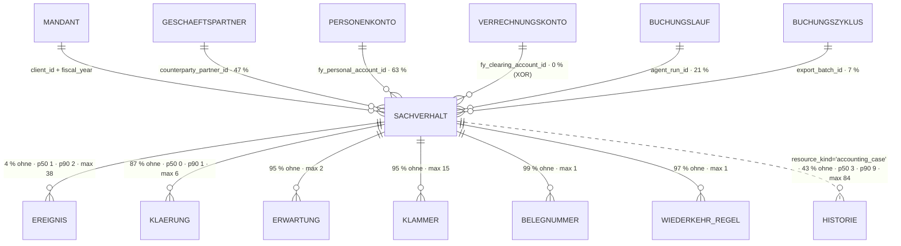

# Sachverhalt · `accounting case` — Entitätsprofil

| | |
|---|---|
| Status | analysiert |
| GLOSSARY | `### Accounting case (Sachverhalt)` — englisch `accounting case`, Ordner `entities/accounting-case/` |
| Tabelle | `ludwig.client_accounting_case` (Refactor 2026-05-27, vorher `ludwig.btx`). Keine Subtypen — die Art steht als `kind` in derselben Zeile |
| Typen | `src/ludwig/modules/accounting-cases/domain/case.ts` — `CaseListItem`, `CaseLifecycle`, `CaseKind`/`CASE_KIND_LABEL`/`caseKindLabel()`, `CaseDisposition`, `CaseDocumentNumberMode`, `CaseExportStatus`/`deriveCaseExportStatus()`, `deriveClarificationLifecycle()`, `CaseFilter`, `CASE_LIST_TABS`; `acceptance-triage.ts` (Triage-Bucket), `document-number.ts`, `convention.ts` |
| Status-Achsen | `sachverhalt` (`lifecycle_status`) · `disposition` (Zuständigkeit) · `export_case` (abgeleitet) · `belegnummern_modus` (`document_number_mode`) · `klaerung` (Zähler der offenen Fragen) · `ereignis` und `erwartung` an den Kindern |
| Wichtigkeit | **hoch** — Kern-ER-Bild, Aggregat-Root der Reviewer-Sicht (Datenmodell-Review 2026-08-27 §7) |
| Datenstand | Staging über den Pooler, 2026-09-05, **915 Sachverhalte** (lokal 0). Alle Füllgrade, Verteilungen, Kardinalitäten und Textlängen unten sind aus diesem Bestand, nur `SELECT`, keine Kundendaten im Dokument |
| Rückfrage | gestellt am 2026-09-05 (Abschnitt „Offene Fragen"), **unbeantwortet** — die Defaults gelten, der Zuschnitt steht |
| Analyse von / am | Claude, 2026-09-05 (Skill `entitaet-analysieren`) |

## Was sie ist

Ein Sachverhalt ist die **fachliche Klammer um einen Geschäftsvorfall**: er
hält 0..N Ereignisse — Belegeingang, Zahlung, Sollstellung — zu *einem*
Vorgang zusammen und ist der Gegenstand, den die Sachbearbeiterin abarbeitet.
Sie fragt ihn drei Dinge, in dieser Reihenfolge: *worum geht es, bin ich dran,
und was fehlt noch bis zur Buchung?*

Anzeige-Regeln aus dem GLOSSARY, wörtlich:

- „**Ein Sachverhalt, ein Personenkonto** (`fy_personal_account_id`) … **NULL
  heißt ‚hat bewusst keins'** (Sammel-Sachverhalt, interne Umbuchung, reine
  Sachbuchung), nicht ‚unbekannt'."
- „**Gegenpartei-Seite** (`counterparty_side`) … `'creditor'` | `'debtor'`,
  **NULL = bewusst keine** … nicht ‚unbekannt'."
- „Drei Felder, drei Fragen — `counterparty_side` (welche Seite),
  `counterparty_partner_id` (wer), `fy_personal_account_id` (wogegen);
  zusammenlegen geht nicht."
- „Recurring (Miete, Versicherung, Abo) bleibt bei `kind=recurring_charge`
  offen über mehrere Realisierungen." — ein Dauersachverhalt ist kein Fehler,
  wenn er lange offen steht.
- „Der Buchungs-Vorschlag ist **kein JSON-Blob mehr am Case**, sondern ein
  eigenständiger `client_journal_entry`." — der Sachverhalt zeigt Buchungen
  nur über seine Ereignisse.
- Aus dem Spaltenkommentar zu `lifecycle_status`:
  „`waiting_for_documents` heißt: am Sachverhalt hängt eine offene
  Beleg-**Erwartung** — keine Klärung. `needs_clarification` sticht sie, weil
  Beantworten actionable ist und Warten nicht."
- Aus dem Spaltenkommentar zu `document_not_required_reason`: „Gesetzt = zu
  diesem Sachverhalt ist fachlich kein Beleg zu erwarten … NULL = Beleg wird
  erwartet." Das Fehlen bedeutet also etwas — es ist kein leeres Feld.

## Schaubild



Die Buchung (`client_journal_entry`) hängt **nicht** am Sachverhalt: sie
erreicht ihn nur über das Ereignis. Eine Spalte `case_id` gibt es dort nicht —
geprüft am 2026-09-05.

## Datenpunkte

Kumulativ: was S zeigt, zeigt M auch. Füllgrade aus 915 Zeilen Staging.

| Datenpunkt | Quelle | Rolle | Füllgrad | heute in | änderbar | Rang | ab Form | Beleg |
|---|---|---|---|---|---|---|---|---|
| Anzeigename | `abgeleitet: fehlt → Befund L-52` — `title`, sonst `<Art>: <Gegenpart>`, sonst `<Art>` | Identität | `title` 53 %, Rückfall greift bei 47 % | `PortalCaseList` (Z. 254–256), `Hero` (`header.title`), `CaseSummaryTooltip` | Nutzer (`title`) | 1 | XS | heute in drei Komponenten · JSDoc an `CaseListItem.title` beschreibt genau diese Kette |
| Bearbeitungsstand (`lifecycleStatus`) | Spalte, Achse `sachverhalt` | Zustand | 100 % | Listen-Spalte „Sachverhalt", `Hero`, Portal | Server (`recomputeCaseLifecycle`) | 2 | XS | Füllgrad · `deriveClarificationLifecycle()` · Seitenprofil Rang 2 |
| Nummer (`caseNumber`) | Spalte, Trigger `assign_case_number` | Identität | 100 % | `CaseCell` (3 fremde Listen), Listen-Spalte „ID", `Hero` | nie | 3 | XS | die einzige Angabe, die `CaseCell` heute trägt |
| Betrag (`totalAmount` · `currency`) | Spalte | Maß | 52 % · 63 % | Listen-Spalte „Betrag", `Hero` („Gesamtbetrag"), Portal-Meta | Server | 4 | S | heute in drei Komponenten · Seitenprofil Rang 1 („wie viel?") |
| Zuständigkeit (`disposition`) | Spalte, Achse `disposition` | Verantwortung | 95 % (`agent` 622 · `accounting` 246 · NULL 47) | Listen-Spalte „Zuständig" | Nutzer (`CASE_DISPOSITION_WRITABLE`: agent, accounting) | 5 | S | Seitenprofil Rang 2 („bin ich dran?") · eigene Registry-Achse |
| Art (`kind`) | Spalte, `CASE_KIND_LABEL` — **kein Status** | Identität | 100 % (`outgoing_invoice` 388 · `incoming_invoice` 307 · `recurring_charge` 104 · `adjustment_only` 91 · Rest 25) | Listen-Spalte „Art", `Hero` (`CaseKindEditor`), Portal-Meta, Auswahl-Dialog | Nutzer (`CaseKindEditor`) | 6 | S | Füllgrad · vier Komponenten · Filter `recurringMode` |
| Offene Klärungen | `abgeleitet: openClarificationsCount` (`clarificationIsOpen`) | Zustand | 92 % = 0 · max 3 | Listen-Spalte „Klärung" (Pille „n offen") | Server | 7 | S | heute eine eigene Spalte · Achse `klaerung` |
| Eröffnet (`openedAt`) | Spalte | Zeit | 100 % | Listen-Spalte „Eröffnet", `Hero`-Fakt, Portal-Meta | nie | 8 | S | Füllgrad · Sortier-Vorgabe der Liste |
| Export-Zustand | `abgeleitet: deriveCaseExportStatus()`, Achse `export_case` | Zustand | 7 % haben `export_batch_id`; die Ableitung zählt Buchungen, nicht die Spalte | Listen-Spalte „Export" | Server | 9 | S | heute eine eigene Spalte · Ableitung liegt im Spiegel |
| Gegenpart (`counterpartyName`) | Spalte | Identität | 95 % (p50 14 · p90 27 · max 57 Zeichen) | Listen-Spalte „Gegenpartei", `Hero` (zweimal: Meta und Fakt) | Nutzer | 10 | M | Füllgrad. **Nicht in S**: in der Zeile trägt ihn Rang 1 schon — Seitenprofil Zweifel 4 („steht dreimal") |
| Zusammenfassung (`summary`) | Spalte | Erklärung | 75 % (p50 231 · **p90 309** · max 720) | `Hero` (`CaseSummaryEditor`), `CaseOverviewBox`, Portal-Karte, Tooltip der Liste | Nutzer | 11 | M | Füllgrad · vier Komponenten. **Kürzen ab 160 Zeichen** in M, voll in L (p90 309 passt in keine Karte) |
| Geschäftspartner (`counterpartyPartnerId`) | Spalte → `client_business_partners` | Kontext | 47 % | `Hero` (Link „Zum Kreditor"), Filter `counterpartyPartnerId` | Server | 12 | M | heute ein Link im Kopf · eigener Listen-Filter |
| Personenkonto (`fyPersonalAccountId`) | Spalte → `client_ledger_accounts` | Kontext | 63 % | `Hero`-Fakt „Personenkonto" | Server (nie Agent, GLOSSARY) | 13 | M | Füllgrad · GLOSSARY-Regel „ein Sachverhalt, ein Personenkonto" |
| Belegnummern-Modus (`documentNumberMode`) | Spalte, Achse `belegnummern_modus` | Zustand | 100 % (`single` 883 · `multiple` 32) | `Hero` (`CaseDocumentNumberModeEditor`), Listen-Filter, Auswahl beim Anlegen | Nutzer, begründungspflichtig (S3) | 14 | M | Füllgrad · eigener Filter · eigener Editor im Kopf |
| Kein Beleg zu erwarten (`documentNotRequiredReason`) | Spalte | Erklärung | 7 % (p50 116 · p90 176 · max 313) | `FehltPanel` | Nutzer | 15 | M | Füllgrad < 20 %, aber das **Fehlen bedeutet etwas** (Spaltenkommentar) — deshalb eigener Punkt, nicht vor M |
| Geschlossen am (`closedAt`) | Spalte | Zeit | 26 % | `Hero`-Fakt („Abgeschlossen"/„laufend") | Server | 16 | L | Füllgrad · heute im Kopf |
| Gegenpartei-Seite (`counterpartySide`) | Spalte | Kontext | 88 % (`debtor` 451 · `creditor` 356 · NULL 108) | nirgends | Server | 17 | L | Füllgrad · GLOSSARY („NULL = bewusst keine"). **Annahme**, dass sie überhaupt sichtbar sein muss — siehe Offene Frage 2 |
| Anker (`batchOposReference`) | Spalte | Kontext | 47 % | nirgends | nie | 18 | L | Füllgrad. Sagt, **woher** der Fall kommt (`mirror-opos:` · `mirror-opos-pool:` · `payment-collect:`) — die einzige Antwort auf „warum gibt es diesen Fall?" bei automatisch gegründeten Sachverhalten |
| Angelegt von (`createdByKind` · `createdByLabel`) | Spalten | Verantwortung | 100 % · 100 % | nirgends | nie | 19 | L | Füllgrad · Vokabular wie `platform_audit_events.actor_kind` (Achse `actor_kind` im Set) |
| Wirtschaftsjahr (`fiscalYear`) | Spalte | Kontext | 100 % | die Route setzt es | nie | 20 | L | Kontext: die Seite trägt es. In XS/S nur, wenn die Form außerhalb ihres Jahres steht (`CaseCell` fällt heute auf das Jahr der URL zurück) |
| Abrechnungsrhythmus (`expectedInterval`) | Spalte | Kontext | 3 % | nirgends | Server | 21 | L | Füllgrad · nur beim Dauersachverhalt sinnvoll |
| Verrechnungskonto (`fyClearingAccountId`) | Spalte → `client_ledger_accounts` | Kontext | **0 %** | `Hero` (Konto + Saldo „ausgeglichen"/„Rest") | Server | 22 | L | Füllgrad 0 in Staging, aber im Kopf gebaut (F104) — im Bestand noch nicht angekommen |
| Buchungslauf (`agentRunId`) | Spalte → `client_agent_runs` | Kontext | 21 % | nirgends | nie | 23 | L | Füllgrad · Grundlage des Run-Resets |
| Buchungszyklus (`exportBatchId`) | Spalte → `client_datev_export_batches` | Kontext | 7 % | nirgends | nie | 24 | L | Füllgrad · Grundlage des Stapel-Resets |

**Ausgelassen (Technik):** `id`, `tenant_id`, `client_id`, `created_at`,
`updated_at`, `created_by_id`.

**Freitext-Grenzen:** `summary` in M auf 160 Zeichen kürzen (p90 309 —
ungekürzt ist es ein Absatz, keine Karte), in L voll.
`document_not_required_reason` in M auf 120 (p90 176). `counterparty_name`
braucht keine Grenze (p90 27), `title` auch nicht (p90 33).

**Zwei Zähler stehen bewusst nicht hier**, sondern in „Relationen":
`documentEventsCount` und `bankEventsCount` sind die Listen-Spalten „Belege"
und „Bank-Tx" — sie zählen Kinder, sie sind keine Spalten des Sachverhalts.

## Relationen

| Relation | Richtung | Kardinalität | Rolle | ab Form | Darstellung | Beleg |
|---|---|---|---|---|---|---|
| Ereignisse (`client_accounting_event`) | Kind | 4 % ohne · p50 1 · p90 2 · **max 38** | Maß + Zustand | S | **Zähler** je Art in S (Belege / Bank-Tx, zwei Listen-Spalten heute) · **Liste** in L über `CaseTimeline` (0040, gebaut) | Staging · Listen-Spalten „Belege"/„Bank-Tx" · Arten: `open_item_carryover` 426, `document_received` 338, `payment_out` 288, `payment_in` 168, `accrual` 26 |
| Klärungen (`client_accounting_case_clarification`) | Kind | 87 % ohne · p50 0 · p90 1 · max 6; **offen**: 92 % = 0 · max 3 | Zustand | S | **Zähler** in S („n offen", Achse `klaerung`) · **eigene Form** in L: `ClarificationRow`/`ClarificationCard` → Profil `clarification` | Staging · Listen-Spalte „Klärung" · `CaseTimeline` nimmt sie schon auf |
| Erwartungen (`client_accounting_case_expectation`) | Kind | 95 % ohne · p50 0 · max 2 | Zustand | L | **Liste**, bereits Teil von `CaseTimeline` (0040) — der einzige Eintrag in der Zukunft | Staging · 0040 §„Entitäten im Verlauf" |
| Klammern (`client_open_item_links`) | Kind | 95 % ohne · p50 0 · max 15 | Kontext | L | **Liste**; die Klammer ist Rechnung ↔ Zahlung *eines* Vorgangs, nicht der Fall (GLOSSARY „Nicht der Sachverhalt") | Staging · GLOSSARY „Ausgleichs-Zuordnung" |
| Belegnummern (`client_case_document_numbers`) | Kind | 99 % ohne · max 1 | Kontext | L | **Zähler**; wird erst mit `document_number_mode ≠ single` interessant (32 Fälle) | Staging |
| Wiederkehr-Regel (`client_accounting_case_rule`) | Kind | 97 % ohne · max 1 | Kontext | L | **jüngstes** — höchstens eine; nur beim Dauersachverhalt | Staging · Datenmodell-Review §7 („zweiter Ring") |
| Buchungen (`client_journal_entry`) | Kind **über das Ereignis** | keine eigene Kante — `client_journal_entry` hat kein `case_id` | Zustand | L | **eigene Form** am Ereignis: `JournalEntryCell`/`JournalEntryCard` → Profil `journal-entry` | Schema 2026-09-05 · GLOSSARY („kein JSON-Blob mehr am Case") |
| Historie (`platform_audit_events`, `resource_kind='accounting_case'`) | ohne FK | 43 % ohne · p50 3 · p90 9 · **max 84** | Verantwortung | L | **Liste** über `Log`/`LogBrowser` (0053) — nicht hier entworfen | Staging · `resourceKind: "accounting_case"` ist einer von zwei Werten im Vokabular der App |
| Geschäftspartner (`client_business_partners`) | Eltern | 47 % | Identität | M | **Inline** mit Link (heute „Zum Kreditor" im Kopf) | `Hero` · Listen-Filter `counterpartyPartnerId` |
| Personenkonto / Verrechnungskonto (`client_ledger_accounts`) | Eltern | 63 % · 0 %, per CHECK **XOR** | Kontext | M · L | **Inline** (Nummer + Name) → Profil `account`; das Verrechnungskonto bringt seinen Saldo mit („ausgeglichen" / „Rest x") | `Hero`-Fakten · CHECK im Schema |
| Buchungslauf · Buchungszyklus | Eltern | 21 % · 7 % | Kontext | L | **Inline** (Server-Stempel, kein Fachwert) | Spaltenkommentare |
| Mandant · Wirtschaftsjahr | Eltern | 100 % | Kontext | — | setzt die Route; erscheint nur, wenn die Form außerhalb steht | Route `[clientSlug]/[year]/cases` |

## Heutige Darstellung

| Komponente | Form | zeigt | fehlt | zu viel |
|---|---|---|---|---|
| `ui/case/CaseCell.tsx` (46 Z.) | XS, in 3 fremden Listen (`documents/page`, `KontoauszugView`, `StuckDocumentsTable`) | Nummer als Mono-Link, Rückfall auf UUID-Präfix, „—" ohne Fall | **der Zustand** (Rang 2) — wer im Kontoauszug den Fall verlinkt sieht, weiß nicht, ob er noch offen ist (Befund L-54) | Hex-freie, aber handgeschriebene Inline-Styles |
| `[year]/cases/page.tsx` (571 Z.) — Kopfzeile + 11 Spalten, `CaseIdCell` · `CaseKindCell` · `StatusCell` · `ExportStatusCell` · `DispositionCell` · `ClarificationCell` | S (Zeile) | Ränge 2–9 vollständig | Rang 1 (Anzeigename) steht nur im **Tooltip** (`CaseSummaryTooltip`), nicht in der Zeile | Gegenpart als eigene Spalte *und* im Tooltip-Titel; die Art als Badge mit Farbe ohne Achse (Befund L-53) |
| `modules/accounting-cases/ui/CaseRow.tsx` (27 Z.) | — | nichts: ein `<tr>`-Wrapper, der den Zeilenklick trägt | — | in v3 macht das `Row href` bzw. `ClickRow` |
| `sachverhalt/parts.tsx` → `Hero` (Z. 152–307) | L (Kopf) | Ränge 1–6, 10–16, 22 sowie Konto-Saldo | — | Gegenpart dreimal (Titel-Rückfall, Meta-Zeile, Faktenzeile) und ein viertes Mal im Personenkonto-Namen — Seitenprofil Zweifel 4 |
| `sachverhalt/SachverhaltScreen.tsx` (1815 Z.) | L (View) | alles, in acht Reitern | — | das Gerüst gehört ins Set (0050), die Datenbeschaffung nicht |
| `CaseOverviewBox.tsx` (173 Z.) | M (Karte) | Zusammenfassung mit Bleistift + Kennzahl-Streifen (Belege · Bank · Ereignisse · Vorschläge · dominanter Gegenpart) | — | rechnet den „dominanten Gegenpart" aus den Ereignissen, obwohl der Fall eine Spalte dafür hat |
| `client-portal/ui/PortalCaseList.tsx` (396 Z.) | M (Karte je Fall) | Anzeigename (mit genau der Rückfallkette aus Rang 1), Nummer, Art, Betrag, Eröffnet, Zusammenfassung, offene Fragen und Belegwünsche als Unterlisten | Zustand und Zuständigkeit — bewusst: der Mandant sieht nur seine Aufgabe | eigene Antwort-Eingabe statt `AnswerInput` (Befund L-32) |
| `CaseListFilters.tsx` (171 Z.) | Filterzeile | Suche, Dauer/einmalig, Zuständigkeit, Belegnummern-Modus | — | gehört zur Liste, nicht zur Entität |
| `BankTransactionAssignmentTable.tsx` Z. 376–388 | S (Auswahl) | `<select>` mit „Nummer · Art · Zusammenfassung (40 Zeichen)" | Zustand, Betrag, Gegenpart — man wählt blind | — |

## Listen

Vier der sechs Reiter der Sachverhaltsliste (`CASE_LIST_TABS`) sind
Sachverhaltslisten; `offen` und `schliessen` sind es nicht —
`caseFilterForListTab()` gibt für sie `null` zurück (Bankzeilen bzw. der
Schließen-Flow). Die vier unterscheiden sich **nur in der Grundgesamtheit**,
nicht in Sortierung, Spaltensatz oder Massenaktion. Nach §8 ist das
**eine** Komponente mit einem Prop, nicht vier.

| Liste | Job | Grundgesamtheit | Sortierung | Spalten (Ränge) | Filter | Massenaktion | Leerfall | Umfang p50 · p90 | Beleg |
|---|---|---|---|---|---|---|---|---|---|
| `CaseList` (ein Baustein, Reiter als Prop) | Wenn **der Vorrat eines Wirtschaftsjahres offen ist**, will **die Sachbearbeiterin** **den nächsten Fall finden, den sie selbst zur Buchung bringen kann**, damit **sie nicht 117 Fälle einzeln öffnet, um zu sehen, wer am Zug ist** | je Reiter: `laufend` = nicht geschlossen · `belege` = `waiting_for_documents` (19 von 915) · `klaerung` = zur Bearbeitung · `alle` = alles; immer ein Mandant, ein Jahr | „Eröffnet" absteigend (heute die einzige) | 1–9 | Suche (`q`), Dauer/einmalig, Zuständigkeit, Belegnummern-Modus, Geschäftspartner | **fehlt heute** — die Freigabe läuft je Zeile (Befund L-16) | „nichts offen" (Erfolg, mit Zahl) ≠ „keine Treffer" (Filter, mit Zurücksetzen) | offen je Mandant+Jahr **p50 86 · p90 190 · max 259**; gesamt p50 147 · p90 220 · max 262 | Staging · `CASE_LIST_TABS` · `caseFilterForListTab()` |
| `PortalCaseList` | Wenn **der Mandant gefragt wurde**, will **er** **seine offenen Fragen und Belegwünsche an einem Ort beantworten**, damit **die Kanzlei weiterarbeiten kann** | `disposition = 'client'` | offen zuerst | 1, 3–4, 6, 8, 11 + Fragen und Belegwünsche als Unterlisten | keiner | keine | „nichts zu tun" | nicht gemessen — Portal-Bestand in Staging klein | GLOSSARY „Client portal" · `PortalCaseList.tsx` |

Über 200 Zeilen im p90 heißt: **`Pagination`, Serverfilter, Lade- und
Fehlerfall in der Spec** — die Liste hat heute schon `Pagination`, aber keine
Sortierung (Befund L-15).

Die Route `[clientSlug]/[year]/cases` hat noch **kein Seitenprofil** unter
`docs/seiten/`; deshalb steht hier nur Job und Schnitt, und `CaseList` geht
auf den Backlog, bis es eines gibt.

## Formen

| Form | Größe | Empfehlung | Grund (§7 Nr.) | zeigt (Ränge) | Relationen | setzt auf | ersetzt |
|---|---|---|---|---|---|---|---|
| `CaseCell` | XS | **ja** | 3 — FK-Ziel; wird in drei fremden Listen genannt | 1–3, **mit der Rückfallkette Anzeigename → Nummer → Kurz-ID** und dem Zustand als Punkt | — | `MonoCell`, `StatusBadge`, `Link` | `ui/case/CaseCell.tsx` in `documents/page`, `KontoauszugView`, `StuckDocumentsTable` |
| `CaseRow` | S | **ja** | 1 — existiert als 11-Spalten-Zeile; 6 — zwei Listen-Jobs | 1–9 | Ereignisse und Klärungen als Zähler | `Row`, `CaseCell`, `StatusBadge`, `Badge`, `Amount`, `Time` | die Zeile in `[year]/cases/page.tsx` samt `CaseIdCell`, `CaseKindCell`, `StatusCell`, `ExportStatusCell`, `DispositionCell`, `ClarificationCell`, `CaseRow.tsx`, `CaseSummaryTooltip` |
| `CaseFacts` | M | **ja** | 1 — existiert dreifach (`Hero`-Faktenzeile, `CaseOverviewBox`-Streifen, Portal-Meta); und 0052 verlangt, dass Drawer und View **dieselbe** Fakten-Komponente teilen | 10–16 (+ 17–24 mit `all`) | Geschäftspartner, Personen-/Verrechnungskonto als Inline | `FieldList`, `Amount`, `Time`, `MonoCell`, `StatusBadge`, `LongText` | die Faktenzeile aus `parts.tsx` `Hero`, den Kennzahl-Streifen aus `CaseOverviewBox` |
| `CaseDetailView` (0050) | L | **ja** | 1 — existiert als `SachverhaltScreen.tsx` (1815 Z.) + `parts.tsx` (522 Z.); die Spec steht fertig und **nur auf dieses Profil blockiert** | Slots, keine Datenprops — die Ränge stehen in `header` (`EntityHeader`) und `CaseFacts` | `CaseTimeline` im `aside` | `MasterDetail`, `EntityHeader`, `RecordPager`, `StatusCallout`, `Tabs`, `CaseTimeline`, `CaseFacts` | `SachverhaltScreen.tsx` + `parts.tsx` (das Gerüst, nicht die Datenbeschaffung) |
| `CaseDrawer` (0052 Schritt 3) | L | **ja** | 5 — aus dem Kontoauszug, der Belegliste und der stecken­gebliebenen Beleg-Tabelle heraus nachgeschlagen: dort steht heute `CaseCell` als Link, der die Seite verlässt | Kopf (1–3), Kernfakten aus `CaseFacts`, Grenze, ein Ausgang in den View | Ereignisse als Zähler | `Drawer`, `CaseFacts`, `CaseCell` | den Seitenwechsel, den `CaseCell` heute erzwingt |
| `CaseCard` | M | **Backlog (0081)** | 1 trifft zu (`PortalCaseList` baut je Fall eine Karte), aber die Karte lebt **im Portal** — einer anderen Rolle mit anderem Leerfall und ohne Zustand. Sie hängt am Profil `clarification` (Fragen und Belegwünsche sind ihr Inhalt) und passt nicht mehr in die Fünf | 1, 3–4, 6, 8, 11 + Fragen, Belegwünsche | Klärungen als eigene Form | `Card`, `CaseFacts`, `ClarificationCard` | `PortalCaseList` |
| `CaseList` + `CaseColumns` | L | **Backlog (0082)** | 6 — zwei Listen-Jobs, `DataTable` (0057) ist gebaut. Es fehlt das **Seitenprofil** für `[clientSlug]/[year]/cases`; ohne es sind Kopfzeile, Vorratszähler und Reiterlogik geraten | wie `CaseRow` | — | `DataTable`, `CaseRow`, `EmptyState`, `Pagination` | die Tabelle in `[year]/cases/page.tsx`, `CaseListFilters`, `CaseListTabsBar` |
| `CaseEditor` | XL | **Backlog (0083)** | 4 trifft zu — vier Punkte mit änderbar = Nutzer (`title`, `summary`, `kind`, `document_number_mode`, dazu `disposition`), und die App hat dafür vier Einzel-Editoren. Der Zuschnitt ist **kein Formular**, sondern `InlineEdit` je Wert im View; deshalb folgt er 0050 statt vor ihm zu stehen | die Punkte mit änderbar = Nutzer, je einzeln | — | `InlineEdit`, `CaseDetailView`, `ReasonDialog` (Umstufung ist begründungspflichtig, S3) | `CaseSummaryEditor`, `CaseKindEditor`, `CaseDocumentNumberModeEditor`, `CaseCommentForm` |
| `CasePicker` | S | **Backlog (0084)** | 3 — der Nutzer wählt einen bestehenden Sachverhalt aus: `BankTransactionAssignmentTable` Z. 376–388, heute ein `<select>` mit „Nummer · Art · 40 Zeichen Zusammenfassung". Er hängt an `CaseRow` (dieselben Ränge in der Trefferzeile) und an der Frage, wonach gesucht wird | 1–4 in der Trefferzeile | — | `Combobox`, `CaseCell` | den `<select>` in `BankTransactionAssignmentTable` |

**Bau-Reihenfolge:** `CaseCell` → `CaseRow` → `CaseFacts` → `CaseDetailView`
(0050) → `CaseDrawer` (0052 Schritt 3). Das sind **fünf** — die Grenze aus §9.
`CaseFacts` steht bewusst vor dem View: 0052 verlangt, dass der Drawer die
Kernfakten aus derselben Komponente zeigt wie der View, und die kann nicht
nach beiden entstehen.

## Zuschnitt

| Form / Liste | Marke | Grund | Backlog |
|---|---|---|---|
| `CaseCell` | **jetzt** | trägt Row, Drawer und drei fremde Listen | — |
| `CaseRow` | **jetzt** | trägt beide Listen; existiert heute als 11 Spalten in einer Seitendatei | — |
| `CaseFacts` | **jetzt** | trägt View und Drawer (0052 Zone 3); existiert heute dreifach | — |
| `CaseDetailView` | **jetzt** | Spec 0050 steht fertig und war nur auf dieses Profil blockiert | `docs/backlog/0050-case-detail-view.md` (Status `spec — blockiert` → freigeben) |
| `CaseDrawer` | **jetzt** | Schritt 3 aus 0052, ausdrücklich auf dieses Profil und 0050 vertagt | `docs/backlog/0052-entity-drawer.md` §Schritt 3 |
| `CaseCard` | Backlog | Portal — andere Rolle, anderer Leerfall, hängt am Profil `clarification`; die Fünf sind voll | `docs/backlog/0081-case-card.md` |
| `CaseList` + `CaseColumns` | Backlog | Seitenprofil für `[clientSlug]/[year]/cases` fehlt | `docs/backlog/0082-case-list.md` |
| `CaseEditor` | Backlog | setzt 0050 voraus (`InlineEdit` im View, kein Formular) | `docs/backlog/0083-case-editor.md` |
| `CasePicker` | Backlog | setzt `CaseRow` voraus; die Suchachse ist offen (Offene Frage 3) | `docs/backlog/0084-case-picker.md` |

## Befunde für `ludwig/app`

- **B1 (L-52)** — Die Ableitung des **Anzeigenamens** fehlt in
  `src/ludwig/modules/accounting-cases/domain/case.ts`. Die Regel `title`,
  sonst `<Art>: <Gegenpart>`, sonst `<Art>` wird an drei Stellen gebaut:
  `PortalCaseList.tsx` Z. 254–256, das JSDoc an `CaseListItem.title`
  beschreibt sie, ohne sie zu implementieren, und die Liste setzt sie über
  `CaseSummaryTooltip(label=counterpartyName, caseTitle=title)` ein drittes
  Mal zusammen. Gebraucht wird **eine** Funktion `caseDisplayTitle()` — sie
  ist Rang 1 aller fünf Formen.
- **B2 (L-53)** — `CaseKindCell` färbt die Art: `recurring_charge` →
  `warning`, alles andere → `info`. `CASE_KIND_LABEL` ist laut eigenem
  Kommentar bewusst **kein Status** („keine Farbe, keine Übergänge, deshalb
  bewusst hier statt in der Status-Registry"). Beides zusammen geht nicht:
  entweder eine Achse in der Registry oder die Farbe weg. Der v3-`CaseRow`
  zeigt die Art ohne Farbe, bis das entschieden ist.
- **B3 (L-54)** — `CaseCell` zeigt in drei fremden Listen nur die Nummer,
  ohne Zustand. Wer im Kontoauszug sieht, dass eine Zahlung an Sachverhalt
  2026-0412 hängt, weiß nicht, ob der noch offen ist — Rang 2 fehlt an der
  kleinsten Form. Der v3-`CaseCell` nimmt ihn mit; die drei Aufrufer müssen
  `lifecycleStatus` in ihre Query aufnehmen.
- **B4** — Der GLOSSARY-Eintrag ist vollständig und trägt seine
  Anzeige-Regeln; nichts zu melden. `client_journal_entry` hat **kein**
  `case_id` — wer eine Buchung am Fall sucht, geht über das Ereignis. Das
  steht im GLOSSARY, aber nicht als Kante im Datenmodell-Bild; hier notiert,
  damit die nächste Spec es nicht neu herausfindet.

## Offene Fragen

1. **Fehlende Anwendungsfälle** — Listen, Ansichten oder Auswahl-Dialoge für
   den Sachverhalt, die es heute in der App noch nicht gibt? *Ohne Antwort:
   es bleibt bei den beiden Listen und den fünf Formen oben; alles Weitere
   steht auf dem Backlog.*
2. **Gegenpartei-Seite sichtbar machen?** `counterparty_side` ist zu 88 %
   gefüllt, wird aber nirgends gezeigt — und NULL heißt „bewusst keine",
   nicht „unbekannt". *Ohne Antwort: sie erscheint erst in L, als Wort neben
   dem Personenkonto („kreditorisch" / „debitorisch"), nirgends als Farbe.*
3. **Wonach sucht der `CasePicker`?** Heute ist es ein `<select>` über alle
   Fälle mit „Nummer · Art · 40 Zeichen Zusammenfassung" — bei p90 190 offenen
   Fällen je Mandant und Jahr ist das keine Auswahl, sondern eine Liste.
   *Ohne Antwort: `Combobox` mit Suche über Nummer, Gegenpart und
   Zusammenfassung; die Trefferzeile trägt Rang 1–4. Entschieden wird das in
   0084, nicht hier.*

## Prüfung

Gehört dem zweiten Agenten. Er prüft zuerst alle Zeilen mit Beleg `Annahme`,
dann die Ränge gegen „Heutige Darstellung", dann die Formen gegen §7.

| Zeile / Form | Einwand | Ergebnis | Geprüft von / am |
|---|---|---|---|
| … | … | bestätigt · geändert auf … · offen | … |

## Weiter

Prüfprompt (neue Sitzung, anderer Agent):

```
Prüfe das Entitätsprofil docs/entitaeten/accounting-case.md nach Skill entitaet-analysieren
§5–§9. Zuerst jede Zeile mit Beleg „Annahme": belege oder widerlege sie mit Füllgrad,
heutiger Komponente oder GLOSSARY — es ist nur eine (Rang 17, Gegenpartei-Seite), also
prüfe zusätzlich jede Zeile, deren Beleg „heute in" heißt, gegen die genannte Datei. Dann
die Ränge: deck die Punkte ab Rang k ab — erkennt eine Sachbearbeiterin den Vorgang noch?
Prüf dabei besonders die Entscheidung, den Gegenpart erst ab M als eigenen Punkt zu führen,
weil Rang 1 ihn in der Rückfallkette schon trägt: hält das in einer Zeile, in der der Fall
einen echten `title` hat und der Gegenpart darin nicht vorkommt? Dann die Formen: hat jede
empfohlene einen Grund aus §7, fehlt eine, die die App heute hat? Prüf besonders `CaseFacts`
— existiert die Komponente wirklich dreifach, oder zählst du dieselbe Stelle zweimal? Dann
die Listen: tragen die vier Reiter wirklich nur eine Grundgesamtheit auseinander, oder
unterscheiden sie sich in einem zweiten der fünf Merkmale aus §8? Zuletzt der Zuschnitt:
sind höchstens fünf Formen „jetzt", und trägt jede Backlog-Zeile ihren Grund? Trag jeden
Einwand in „Prüfung" ein, ändere die Tabellen, wo du sicher bist, und setze den Status auf
„geprüft". Kundendaten bleiben in der Datenbank; nur SELECT.
```

Startprompt (neue Sitzung, nach Status `geprüft`):

```
Für die Entität Sachverhalt (`accounting case`) liegt das geprüfte Profil unter
docs/entitaeten/accounting-case.md. Schreibe mit Skill spec-schreiben je Form eine Spec, in
dieser Reihenfolge — nur die Formen mit Marke „jetzt" aus dem Abschnitt Zuschnitt:
CaseCell, CaseRow, CaseFacts. Für CaseDetailView existiert die Spec bereits
(docs/backlog/0050-case-detail-view.md, Status „spec — blockiert"): schreib sie nicht neu,
sondern nimm den Blocker heraus, trag das Profil als Quelle nach und setze sie auf „spec".
Für CaseDrawer gilt Schritt 3 aus docs/backlog/0052-entity-drawer.md — dafür braucht es
eine eigene Spec nach dem Muster des SourceDocumentDrawer. Was im Zuschnitt „Backlog"
trägt (0081–0084), bleibt liegen.

Jede Spec verlinkt das Profil als Quelle und nimmt Datenpunkte, Ränge, Relationen und
„ersetzt" von dort, nicht aus dem Chat; die Punkte einer Form sind die Ränge bis zu ihrer
Größe, in derselben Reihenfolge. Die tragende Regel: Rang 1 ist der Anzeigename mit der
Rückfallkette title → <Art>: <Gegenpart> → <Art> — er wird in EINER Funktion gebildet, die
das Set lokal definiert und als Befund L-52 an die App meldet, nicht in drei Komponenten.

Danach baut Skill v3-komponente jede Spec in derselben Reihenfolge; die größere Form
komponiert die kleinere, und CaseFacts entsteht vor dem View, weil der Drawer (0052 Zone 3)
dieselbe Fakten-Komponente zeigen muss. Neue Dateien in src/ui/v3/entities/accounting-case/
neben dem vorhandenen CaseTimeline; CSS als eigener Abschnitt am Ende von src/styles/v3.css,
nicht einsortiert; Klassenpräfix vorher greppen. Hier arbeiten mehrere Sitzungen im selben
Arbeitsbaum — nur eigene Dateien stagen, kein git add -A.

pnpm typecheck und pnpm build müssen grün sein, jede Story im Browser angesehen
(pnpm storybook, Port 6107). Abgenommen wird von einem anderen Agenten gegen die Spec; wer
baut, nimmt nicht selbst ab. Setze am Ende den Status des Profils auf „in Specs" und trage
die Spec-Nummern ein.
```
