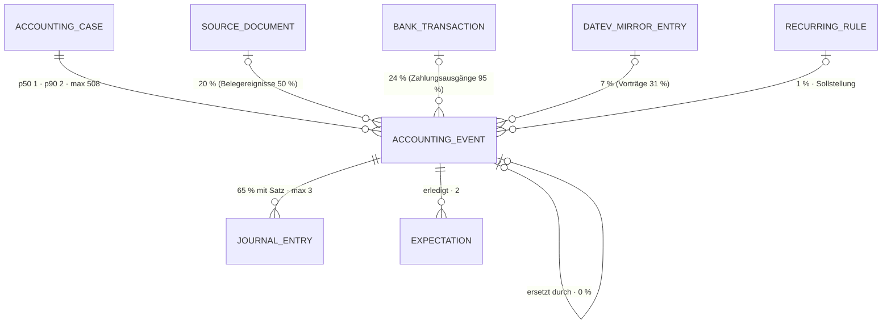

# Geschäftsereignis · `accounting event` — Entitätsprofil

| | |
|---|---|
| Status | **geprüft** — fremde Prüfung am 2026-09-11 (Prüfer-Session im Auftrag `ludwig-manager`, gegen b849ddc); eine Nacharbeit (Ort der `EventPane`), siehe „Prüfung" |
| GLOSSARY | Tabelle „Datenmodell-Schichten" → Zeile **Ereignis** (`client_accounting_event`, „Geschäftsereignis"), `### OPOS-Vortrag (open item carryover)` — Ordner `entities/accounting-event/`. **Kein eigener `###`-Eintrag** für das Ereignis (die Zeile der Schichten-Tabelle trägt Definition und Rolle) |
| Tabelle | `ludwig.client_accounting_event` — „Punkt-in-Zeit-Ereignis (Belegeingang, Bankbewegung, manuelle Erfassung). Hängt 1:N am Sachverhalt, 1:0..1 an genau einer Quelle" (Tabellenkommentar; CHECK `num_nonnulls(source_doc_id, bank_transaction_id, datev_mirror_entry_id) <= 1`). Keine Subtypen |
| Typen | `accounting-cases/domain/case.ts` — `EVENT_KINDS` · `case-event.ts` — `CaseEvent`, `CaseEventSourceDoc`, `CaseEventBankTransaction`, `CaseEventBooking` · `overview-vm.ts` — `TimelineEventVM`, `TimelineState`. **Nicht im Spiegel:** `deriveTitle()` (`accounting-cases/application/case-overview.ts`); die Spiegelbuchung als Quelle fehlt in beiden VMs → L-309 |
| Status-Achsen | `ereignis_art` (`kind`, 7 Wörter — L-02 erledigt) · `ereignis` (abgeleitet aus den Buchungen am Ereignis: `open` „Buchung fehlt" · `proposed` · `accepted` · `posted` · `no_booking_required` · `superseded` „Ersetzt" · `blocked` „Benötigt Antwort" · `planned`) |
| Wichtigkeit | **hoch** — Roadmap der App (9be34746) Rang 4; das Profil `accounting-case` verweist zweimal hierher |
| Datenstand | Staging über den Pooler, **2026-09-11**, schreibgeschützte Sitzung: **2.552 Ereignisse an 1.181 Sachverhalten, 7 Mandanten**, alle in EUR. Nur `SELECT`, keine Kundendaten; Beispielwerte erfunden |
| Bestandswarnung | **Belegereignisse mit Beleg tragen den Betrag 0** (499 von 499), ohne Beleg den Betrag selbst (493) — **keine Oberfläche zeigt den Belegbetrag**: das Set (`CaseTimeline`) liest 0 als „nicht gesetzt" und blendet ihn aus, die App-Timeline zeigt „0,00 €" (L-310 → App P26). Der größte Sammelsachverhalt trägt **508 Ereignisse in einem einzigen Monat** (2026-07) — eine Gruppierung nach Monat, wie die Roadmap sie vorschlägt, ergäbe eine Gruppe. `internal_transfer` und `adjustment` kommen nicht vor |
| Rückfrage | gestellt und **beantwortet** am 2026-09-11 (`ludwig-manager`, aus dem App-Stand): die Defaults der drei Fragen gelten; Ereignisse entstehen nur serverseitig, außerhalb des Sachverhalts gibt es keine Liste und keine Auswahl; L-309–L-311 gehen als P-Einträge an die App |
| Analyse von / am | Claude, 2026-09-11 (Skill `entitaet-analysieren`) |

## Was sie ist

Ein Ereignis ist das, **was passiert ist**: ein Beleg kam, eine Zahlung ging
ein oder hinaus, eine Sollstellung wurde fällig, ein offener Posten wurde aus
DATEV vorgetragen. Die Sachbearbeiterin liest es am Sachverhalt — mit Betrag,
Quelle und der Buchung, die daran hängt — und sieht, wo bewusst **nicht**
gebucht wird und warum.

**Anzeige-Regeln** (wörtlich):

- „Hängt 1:N am Sachverhalt, 1:0..1 an genau einer Quelle" (Tabellenkommentar)
  — die Zeile nennt höchstens eine Quelle.
- Titel: „NULL → die UI leitet einen kurzen Default ab (deriveTitle). Nie der
  volle Bank-Verwendungszweck" (Spaltenkommentar `title`)
- Keine Buchung nötig: „der Text ist die Begründung und wird dem Nutzer
  angezeigt" (`CaseEvent.noBookingRequiredReason`)
- OPOS-Vortrag: „kein Vorgang dieses Jahres, ohne eigenes Dokument" (Registry
  `ereignis_art`) — sein Datum liegt oft im Vorjahr (394 von 593).
- „Buchung fehlt": „Für dieses Ereignis liegt Evidenz vor (Beleg oder
  Bank-Transaktion), aber es gibt noch keinen Buchungssatz." (Registry
  `ereignis`) — im Bestand 85-mal.
- Ereignis und Buchung sind **ein** Vorgang, eine Zeile: „an event and its
  booking are **one** operation" (`CaseTimelineEvent`, 0152).
- Kommt es aus dem Spiegel, steht **das Wort DATEV in der Zeile**, nicht nur
  eine Farbe oder ein Zeichen (0152, V7).

## Schaubild



## Datenpunkte

| Datenpunkt | Quelle | Rolle | Füllgrad | heute in | änderbar | Rang | ab Form | Beleg |
|---|---|---|---|---|---|---|---|---|
| Art (`kind`) | Spalte | Identität (Art) | 100 % — `document_received` 992 · `open_item_carryover` 593 · `payment_in` 567 · `payment_out` 374 · `accrual` 26 | `Timeline.tsx` (Icon), `EventDetail`, `SaldoView`; im Set `CaseTimeline` | nie | 1 | XS | Füllgrad · Registry `ereignis_art` |
| Titel (`title`, sonst `deriveTitle()`) | Spalte · abgeleitet in der App | Identität | 63 % — Rückfall bei 37 %; p50 16 · p90 58 · max 94 Zeichen | `Timeline.tsx`, `EventDetail`, `SaldoView`; im Set `CaseTimelineEvent.title` | Agent · Server (`deriveTitle()`, `application/`) — kein Schreiber in der Oberfläche (Rückfrage) | 2 | XS | Füllgrad · Spaltenkommentar. **Abweichung von der Roadmap** (dort Rang 4) — die Cell braucht ihn → Frage 1 |
| Datum (`event_date`) | Spalte | Zeit | 100 % · 399 außerhalb des Wirtschaftsjahres (Vorträge 394) | `Timeline.tsx`, `EventDetail`, `SaldoView` | nie | 3 | S | Füllgrad · Registry `open_item_carryover` |
| Betrag (`amount`, bei Belegereignissen der Beleg-Betrag) | Spalte · abgeleitet | Maß (Richtung aus der Art) | 100 % gesetzt, aber 499 Belegereignisse mit 0 (L-310); negativ: 72 Vorträge (gewollt, aus DATEV signiert), 20 Zahlungsausgänge (Ausreißer) — 336 von 356 Zahlungsausgängen mit Bankzeile stehen positiv (L-311). Das Set rechnet fest mit „Art trägt Richtung" (`CaseTimeline` setzt bei `payment_out` `-Math.abs()`) | `Timeline.tsx`, `EventDetail`, `SaldoView`, `EventStack` | nie | 4 | S | Staging · heute in; `CaseTimelineEvent.amount`: „0 means not set" |
| Buchungszustand (`ereignis`, mit „Ersetzt" aus `superseded_by_event_id`) | abgeleitet aus den Buchungen am Ereignis | Zustand | 100 % — 65 % mit Satz; „Buchung fehlt" 85; „keine Buchung nötig" 833 | `Timeline.tsx` (`ev.state`), `EventDetail`; im Set `CaseTimelineEvent.state` | Server | 5 | S | Staging · Registry. Nicht in XS: die Cell steht am Buchungssatz, dessen Zustand dort schon steht |
| Quelle (Beleg · Bankzeile · Spiegelbuchung, höchstens eine) | Eltern | Kontext | 51 % — Beleg 20 % · Bank 24 % · Spiegel 7 %; 49 % ohne (Vorträge ohne Spiegel, Sollstellungen) | `EventDetail` (`ev.doc`, `ev.bank`), `EventStack`; im Set `source: "datev"` | nie | 6 | S | Füllgrad · CHECK; die Spiegelbuchung fehlt in den VMs (L-309) |
| Keine Buchung nötig — Grund (`no_booking_required_reason`) | Spalte | Erklärung | 33 % — Vorträge 100 %, Belege 18 %, Zahlungen 3 % bzw. 11 %; p50 65 · p90 319 · max 854 Zeichen | `EventDetail` (`ev.infoNote`); im Set `stateNote` als Tooltip | Agent über MCP — Audit `event.no_booking_required` 454-mal, alle vom Agenten; kein Schreiber in der Oberfläche (Rückfrage) | 7 | S als Zustand mit `title`, ab M als Text | Füllgrad · `CaseEvent` · Freitext ab M (§5) |
| Notizen (`notes`) | Spalte | Erklärung | 58 % — p50 26 · p90 145 · max 165 | `EventStack` (`event.notes`) | Agent über MCP — kein Schreiber in der Oberfläche (Rückfrage) | 8 | M | Füllgrad |
| Buchungssatz (Kind) | Kind | Zustand | 65 % mit Satz · p50 1 · max 3 | `EventDetail` (`ev.booking`), `SaldoView`, `EventStack` | — | 9 | M | Staging |
| Aus Regel und Periode (`recurring_rule_id` · `accrual_period`) | Eltern · Spalte | Kontext · Zeit | 1 % · 1 % (nur Sollstellungen) | `recurringRuleId` an `TimelineEventVM` und `CaseEvent` seit App 09f7b439 — im Spiegel erst mit dem Sync im F210-Fenster | Server | 10 | L, nur wenn gesetzt | Füllgrad |
| Teilzuordnung (`allocated_amount`) | Spalte | Maß | 1 % | — | Agent | 11 | L, nur wenn gesetzt (B4) | Füllgrad · Roadmap |
| Herkunft (`agent_run_id` · `export_batch_id`) | Eltern | Verantwortung · Kontext | 26 % · 16 % | — | Server | 12 | L | Füllgrad · über `ProvenanceNote` (0163) und `BatchCell` |
| Ersetzt durch (`superseded_by_event_id`) | Selbstbezug | Zustand | 2 im Bestand (Merge) | `Timeline.tsx` (`ev.superseded`) | Agent (`supersede_event`) | — | als Zustand „Ersetzt" (Rang 5) | Spaltenkommentar F36 |

Ausgelassen (Technik): `id`, `tenant_id`, `client_id`, `case_id` (Relation),
`fiscal_year`, `fiscal_year_id` (setzt die Route), `currency` (immer EUR,
trägt der Betrag), `created_at`, `updated_at`.

Freitext-Grenzen: Titel p90 58 — in S ab 60 gekürzt mit `title`. Der Grund
„keine Buchung nötig" ist lang (p90 319, max 854): in S nur als Zustand mit
dem Grund im `title`, ganz in den Facts (`LongText`).

## Relationen

| Relation | Richtung | Kardinalität | Rolle | ab Form | Darstellung | Beleg |
|---|---|---|---|---|---|---|
| Sachverhalt (`case_id`) | Eltern | 100 % · je Sachverhalt p50 1 · p90 2 · max 508; 23 % mit mehr als einem, 5 mit mehr als 20 | Kontext | — | setzt der Ort; außerhalb als `CaseCell` | Staging |
| Buchungssatz (`client_journal_entry.accounting_event_id`) | Kind | 65 % mit Satz · p50 1 · max 3 | Zustand | S | Zustand in S · **eigene Form** in M/L: `JournalEntryCell` / `JournalEntryCard` → Profil `journal-entry` | Staging |
| Beleg (`source_doc_id`) | Eltern | 20 % | Kontext | S | **Inline** `SourceDocumentCell` | Staging |
| Bankzeile (`bank_transaction_id`) | Eltern | 24 % | Kontext | S | **Inline** `BankTransactionCell` | Staging |
| Spiegelbuchung (`datev_mirror_entry_id`) | Eltern | 7 % (Vorträge 183 von 593) | Kontext | S | **Inline** `MirrorEntryCell` mit dem Wort DATEV → Profil `datev-mirror-entry` | Staging · 0152 |
| Wiederkehr-Regel (`recurring_rule_id`) | Eltern | 1 % | Kontext | L | **Inline** (Regel-Name) → Profil `recurring-rule` | Staging |
| Agent-Lauf · Stapel | Eltern | 26 % · 16 % | Verantwortung | L | **Inline** über `ProvenanceNote` · `BatchCell` → Profil `export-batch` | Staging |
| Ersatz (`superseded_by_event_id`) | Selbstbezug | 0 % | Zustand | S | Zustand „Ersetzt", Weg zum neuen Ereignis | Schema F36 |
| Erwartungen (`resolved_by_event_id`) | Kind | 2 | Kontext | L | **Inline** | Staging |

## Heutige Darstellung

| Komponente | Form | zeigt | fehlt | zu viel |
|---|---|---|---|---|
| `sachverhalt/Timeline.tsx` (195 Z.) | Zeile im Verlauf | Art, Datum, Titel, Betrag, Zustand, Beleg-Wort, Ersetzt, Hinweis | Quelle Bankzeile / Spiegelbuchung | — |
| `sachverhalt/EventDetail.tsx` (467 Z.) | Detail | Art, Datum, Titel, Betrag, Zustand, Beleg-Fakten, Bankzeile, Buchung, Hinweise, blockierende Klärungen, Ersetzt, storniert | Spiegelbuchung, Regel, Herkunft | — |
| `sachverhalt/SaldoView.tsx` (267 Z.) | Saldo je Konto mit Ereignis-Bezug | Art, Datum, Titel, Betrag, Buchung je Ereignis (`relatedEventIds`) | — | — |
| `EventStack.tsx` (394 Z.) | Karte (Ereignis mit Beleg, Bankzeile, Buchung) | — | — | nur noch als Typ referenziert, 30 Hex-Literale (Roadmap) |
| `stapelabnahme/ui/Schritt3Einzel.tsx` (Z. 884, F181) | Ereignis-Bezug je Buchungssatz in der Einzelprüfung | Art, Titel, Datum, Betrag, Beleg, Bankzeile | — | — |

**Aus der Rückfrage** (Manager, 2026-09-11): Außerhalb des Sachverhalts gibt es
**keine Liste und keine Auswahl** von Ereignissen — die Abnahme (Schritt 3)
listet Buchungssätze (F181: Beleg und Bankzeile je Satz, nicht je Ereignis),
Kontoseite und Konto-Drawer listen `AccountEntries`, die Bank-Arbeitsliste
Bankzeilen, die Belegseite zeigt „Gebucht" über den Satz. Ereignisse entstehen
nur serverseitig: durch Agent-Tools (`create_case_from_doc`/`_bank`,
`attach`), durch das Regelwerk (Sollstellung je Periode) und durch den Merge
(`superseded_by_event_id`, 2 im Bestand).

**Im Set:** `CaseTimeline` (0040, 0152) zeichnet die Ereignisse über den
lokalen Typ `CaseTimelineEvent` (Befund 1 von 0040) — eine eigene
Detailfläche hat sie nicht. Die Detailfläche des Showcase-Sachverhalts ist
`EventPane` (`src/showcase/case/scenario.tsx:291`, über `EntryPane`); dazu der
Sammelsachverhalt (`CaseCollective`). `JournalEntryCard` nennt in ihrem
`@when` den „event stack".

## Listen

| Liste | Job | Grundgesamtheit | Sortierung | Spalten (Ränge) | Filter | Massenaktion | Leerfall | Umfang p50 · p90 | Beleg |
|---|---|---|---|---|---|---|---|---|---|
| `EventList` „Ereignisse des Sammelsachverhalts" | Wenn **ein Sammelsachverhalt Hunderte Ereignisse trägt**, will **die Sachbearbeiterin die finden, an denen noch eine Buchung fehlt oder die zu einer Quelle gehören**, damit **sie nicht 508 Zeilen durchgeht** | Ereignisse eines Sachverhalts | Buchungszustand („Buchung fehlt" zuerst), darin Datum — **nicht** nach Monat (508 in einem Monat) → Frage 2 | 1–6 | Art, Buchungszustand, Quelle | keine | „Noch nichts geschehen." ≠ „Keine Ereignisse für diesen Filter." | p50 1 · p90 2 — die Liste lohnt erst ab rund 20 (5 Sachverhalte), max 508 → **Pagination**, Filter im Client bis 200 | Staging · Showcase `CaseCollective` |

Der **Verlauf des Sachverhalts** ist keine Liste dieser Entität: `CaseTimeline`
mischt Ereignisse, Rückfragen und Erwartungen in einem Strang (0152) — sie
zeichnet ihre Ereignis-Zeilen künftig mit `EventRow`.

## Formen

| Form | Größe | Empfehlung | Grund (§7 Nr.) | zeigt (Ränge) | Relationen | setzt auf | ersetzt |
|---|---|---|---|---|---|---|---|
| `EventCell` | XS | ja | 3 — FK-Ziel des Buchungssatzes (100 %), der Erwartung und des Ersatzes; genannt in `JournalEntryFacts` und `MirrorEntryFacts` (183 Vorträge). **Abweichung von der Roadmap** („kein Cell") | 1–2, Datum im `title`; Weg zum Sachverhalt mit `#event=` | — | `EntityIcon`, `Link` | die Nennung „Ereignis" im Detail des Buchungssatzes |
| `EventRow` | S | ja | 1 — Zeile von `Timeline.tsx` und von `CaseTimeline` im Set · 2 — Kind des Sachverhalts | 1–7 | Buchung als Zustand (+ `JournalEntryCell` ab M), Quelle als `SourceDocumentCell` / `BankTransactionCell` / `MirrorEntryCell` | `StatusBadge` (`ereignis`), `AmountCell`, die Cells der Quellen | die Ereignis-Zeile in `CaseTimeline` (lokaler Typ `CaseTimelineEvent`) und in `Timeline.tsx` |
| `EventFacts` | L | ja | 1 — existiert als `EventDetail.tsx` (467 Z.) und als `EventPane` im Showcase | alle ab 20 %: 1–9; 10–12 nur wenn gesetzt | Buchung als `JournalEntryCard`, Quelle als Cell, Herkunft als `ProvenanceNote` | `FieldList`, `LongText`, `ProvenanceNote` (0163) | `EventDetail`, `EventPane` im Showcase (`scenario.tsx:291`) |
| `EventList` | L | ja | 6 — Job „Sammelsachverhalt" | Zeile + Rahmen | — | `DataTable` (Gruppen, Pagination), `EventRow`, `EmptyState` | die Ereignis-Liste im Showcase `CaseCollective` |
| `EventCard` | M | nein | `EventStack` wird nur noch als Typ referenziert — kein Screen zeigt ein Ereignis als Karte in fremdem Kontext | | | | |
| `EventEditor` | XL | nein | Titel (`deriveTitle()`), Notizen und Grund schreiben Server und Agent — keine Oberfläche (Rückfrage); die Facts zeigen an | | | | |
| `EventView` · `EventDrawer` | L | nein | keine Route je Ereignis; wer es nennt, führt zum Sachverhalt (`#event=`) | | | | |
| `EventPicker` | S | nein | kein Screen wählt ein Ereignis aus — Ereignisse entstehen und verbinden sich serverseitig (Rückfrage) | | | | |

Bau-Reihenfolge: `EventCell` → `EventRow` → `EventFacts` → `EventList`.
`CaseTimeline` stellt danach ihre Ereignis-Zeile auf `EventRow` um — ein
Nachtrag zu 0040, kein neues Pattern.

## Zuschnitt

| Form / Liste | Marke | Grund | Backlog |
|---|---|---|---|
| `EventCell` | jetzt | trägt die Nennung am Buchungssatz und an der Spiegelbuchung | — |
| `EventRow` | jetzt | trägt `CaseTimeline` und die Liste | — |
| `EventFacts` | jetzt | ersetzt zwei Detailflächen (`EventDetail.tsx`, Showcase-`EventPane`) | — |
| `EventList` | jetzt | der Sammelsachverhalt (508) braucht Filter und Pagination | — |
| `EventCard` · `EventEditor` · `EventView` · `EventDrawer` · `EventPicker` | verworfen | siehe Formen | — |

Vier Formen „jetzt".

## Befunde für `ludwig/app`

Alle zusätzlich als Zeile in `docs/befunde-app.md`.

- **L-309** Die Spiegelbuchung als Quelle fehlt in den Formen des Ereignisses: `TimelineEventVM.source` kennt nur `"doc" | "bank"`, `CaseEvent` trägt `sourceDoc` und `bankTransaction`, aber keine Spiegelbuchung, und `case-detail-queries` liest `datev_mirror_entry_id` nicht — obwohl 183 von 593 Vorträgen eine haben. `deriveTitle()` liegt in `application/case-overview.ts` und wird nicht gespiegelt. Bestätigt, App P9.
- **L-310** Belegereignisse mit Beleg tragen den Betrag 0 (499 von 499): `attachSourceDocToCase` schreibt `amount = 0` (`agent-ingest-core.ts:2107`). Den Belegbetrag zeigt keine Oberfläche — das Set blendet 0 aus (`CaseTimeline`), die App zeigt „0,00 €" (`sachverhalt/Timeline.tsx:98`). **Kein eigener Eintrag:** Verweis auf App P26 (Owner-Frage: den Belegbetrag beim Anhängen ins Ereignis schreiben, wie bei Fremdwährung).
- **L-311** Zwei Vorzeichen-Regeln stehen nebeneinander. Bei Zahlungen trägt de facto die Art die Richtung: 336 von 356 Zahlungsausgängen mit Bankzeile stehen positiv, obwohl die Bankzeile negativ ist. Die 20 negativen sind Ausreißer aus zwei Schreibern (5 Split `agent-ingest-core.ts:882`, 15 OPOS-Zuordnung `match-payments-to-opos-cases.ts`). Die 72 negativen Vorträge sind gewollt signiert (`found-opos-cases.ts:281` übernimmt den offenen Betrag aus DATEV, Haben-Überhang). App P10, mit Owner-Frage: trägt der Betrag die Richtung oder die Art?

## Offene Fragen

**Beantwortet am 2026-09-11** (`ludwig-manager`, aus dem App-Stand): alle drei
Defaults gelten; zu Frage 3 — Titel aus `deriveTitle()`, Notizen und Grund nur
vom Agenten, kein Schreiber in der Oberfläche.

1. **Rang 2 ist der Titel** (Roadmap: Rang 4) — die `EventCell` nennt das Ereignis am Buchungssatz, und dort unterscheidet „Rechnung Telekom" mehr als das Datum. — ohne Antwort: Titel Rang 2, Datum 3, Betrag 4.
2. **Der Sammelsachverhalt gruppiert nach Buchungszustand, nicht nach Monat** — der größte trägt 508 Ereignisse in einem Monat. — ohne Antwort: Buchungszustand, „Buchung fehlt" zuerst.
3. **Titel, Notizen und der Grund „keine Buchung nötig" — schreibt sie heute ein Mensch in der Oberfläche?** Der Code-Grep findet für den Grund keinen Schreiber in `.tsx`. — ohne Antwort: kein Editor; die drei stehen in den Facts lesend, `InlineEdit` erst mit einem belegten Schreibweg.

## Prüfung

Gehört dem zweiten Agenten. Er prüft zuerst alle Zeilen mit Beleg `Annahme`,
dann die Ränge gegen „Heutige Darstellung", dann die Formen gegen §7.

| Zeile / Form | Einwand | Ergebnis | Geprüft von / am |
|---|---|---|---|
| Kopf, Datenpunkte, Relationen | 24 Spalten verortet, CHECK `kind` = 7 = `EVENT_KINDS` = `ereignis_art`; Domäne, Registry und Aufrufer wie beschrieben; alle Aggregate reproduziert, auch L-310 (499 / 499) und L-311 (72 + 20) | bestätigt | Prüfer-Session, 2026-09-11 |
| Im Set · `EventFacts` · Zuschnitt | `EventPane` liegt in `src/showcase/case/scenario.tsx:291`, nicht in `CaseTimeline.tsx` — `CaseTimeline` hat keine eigene Detailfläche; `EventFacts` ersetzt zwei, nicht drei | geändert | Prüfer-Session, 2026-09-11 |
| Heutige Darstellung | `Schritt3Einzel` (F181, Z. 884) ist ein Aufrufer | Zeile ergänzt | Prüfer-Session, 2026-09-11 |
| „Buchung fehlt" | 85 oder 83, je nach Ableitung | vermerkt | Prüfer-Session, 2026-09-11 |
| L-309, L-310, L-311 · Bestandswarnung · Betrag | App-Nachzählung: L-309 bestätigt; L-310 ist der bestehende Eintrag P26 (nur das Set blendet 0 aus, die App zeigt 0,00 €); L-311: bei Zahlungen trägt die Art die Richtung, die Vorträge sind gewollt signiert | geändert; App P9, P26 (Verweis), P10 | ludwig-manager (ludwig-worker), 2026-09-11 |

## Weiter

Prüfprompt (neue Sitzung, anderer Agent):

```
Prüfe das Entitätsprofil docs/entitaeten/accounting-event.md nach Skill entitaet-analysieren §5–§9.
Zuerst jede Zeile mit Beleg „Annahme": belege oder widerlege sie mit Füllgrad, heutiger
Komponente oder GLOSSARY. Dann die Ränge: deck die Punkte ab Rang k ab — erkennt eine
Sachbearbeiterin den Vorgang noch? Dann die Formen: hat jede empfohlene einen Grund aus
§7, fehlt eine, die die App heute hat? Dann die Listen: hat jede einen Job-Satz, und ist
jede Ausprägung nach §8 eine eigene Komponente wert oder nur ein Prop? Zuletzt der Zuschnitt:
sind höchstens fünf Formen „jetzt", und trägt jede Backlog-Zeile ihren Grund? Trag jeden
Einwand in „Prüfung" ein, ändere die
Tabellen, wo du sicher bist, und setze den Status auf „geprüft". Kundendaten bleiben in
der Datenbank; nur SELECT.
```

Startprompt (neue Sitzung, nach Status `geprüft`):

```
Für die Entität Geschäftsereignis (`accounting event`) liegt das geprüfte Profil unter
docs/entitaeten/accounting-event.md. Schreibe mit Skill spec-schreiben je Form eine Spec, in dieser
Reihenfolge — nur die Formen mit Marke „jetzt" aus dem Abschnitt Zuschnitt:
EventCell, EventRow, EventFacts, EventList. Was dort „Backlog" trägt, bleibt liegen. Jede Spec verlinkt das Profil als
Quelle und nimmt Datenpunkte, Ränge, Relationen und „ersetzt" von dort, nicht aus dem
Chat; die Punkte einer Form sind die Ränge bis zu ihrer Größe, in derselben Reihenfolge.
Alle sieben Arten aus dem CHECK brauchen eine Story, auch die, die im Bestand nicht vorkommen.
Danach baut Skill v3-komponente jede Spec in derselben Reihenfolge, die größere Form
komponiert die kleinere; CaseTimeline stellt ihre Ereignis-Zeile als Nachtrag zu 0040 auf
EventRow um. Abgenommen wird von einem anderen Agenten gegen die Spec. Nur
eigene Dateien stagen. Setze am Ende den Status des Profils auf „in Specs" und trage die
Backlog-Nummern ein.
```
