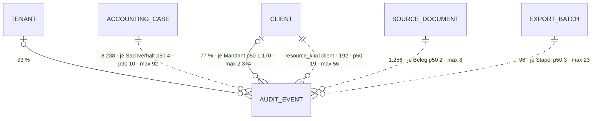

# Audit-Ereignis · `audit event` — Entitätsprofil

| | |
|---|---|
| Status | **analysiert** |
| GLOSSARY | `### Audit event` — Ordner `entities/audit-event/` (bleibt leer, siehe Formen) |
| Tabelle | `ludwig.platform_audit_events` — „Generisches Audit-Log: Nutzer-/Systemaktionen mit Actor, Action, Outcome und optionalem Resource-/Tenant-Kontext. Immutable (kein updated_at)." (Tabellenkommentar). Polymorph über `resource_kind` / `resource_id` — die Historie **jeder** Entität |
| Typen | `audit-log/domain/types.ts` — `ACTOR_KINDS`, `AuditOutcome`, `AuditSource`, `AuditEvent`, `AuditEventFilter`, **`auditEventToLogEntry()`** (die Abbildung auf die Zeile des Sets) · `shared/log-views.ts` — `LOG_VIEWS`, `LOG_VIEW_DEPTH` (Verlauf · Protokoll · Technik) · `datev-export/domain/batch-log.ts` — `batchLogDepth()` (Tiefe je Aktion, nur für den Stapel) |
| Status-Achsen | `actor_kind` (5) · `log_level` — `outcome` wird in `auditEventToLogEntry()` zur Schwere (`failure` → Fehler, `partial` → Warnung), bewusst ohne eigene Achse |
| Wichtigkeit | **mittel** — Roadmap der App (9be34746) Rang 7; `web-ui.md` R10 („die eine Admin-Log"), R11 |
| Datenstand | Staging über den Pooler, **2026-09-11**, schreibgeschützte Sitzung: **10.372 Ereignisse**, 2026-07-11 bis 2026-09-11, 7 Mandanten, 111 verschiedene Aktionen. Nur `SELECT`, keine Kundendaten; Beispielwerte erfunden |
| Bestandswarnung | **92 % schreibt der Agent** (9.528). `source` fehlt bei 23 % (Zeilen vor F49). Die Nachricht ist p50 77 · p90 339 Zeichen, aber **max 12.397**; die Nutzlast p90 986 Zeichen |
| Rückfrage | gestellt und **beantwortet** am 2026-09-11 (`ludwig-manager`, aus dem App-Stand): die Defaults der drei Fragen gelten; die drei Tiefen sind Owner-Regel für **jede** Entität (Z6, Owner 2026-08-28); sieben Anwendungsfälle zugeordnet; keine Auswahl-Dialoge; L-318–L-320 gehen als P-Einträge an die App |
| Analyse von / am | Claude, 2026-09-11 (Skill `entitaet-analysieren`) |

## Was sie ist

Ein Audit-Ereignis ist ein unveränderlicher Eintrag: **wer** hat **wann**
**was** mit welchem **Ergebnis** an welcher Ressource getan. Die
Sachbearbeiterin fragt damit am Sachverhalt, Beleg oder Stapel „wer hat das
entschieden?", in der Konfiguration „was ist bei diesem Mandanten passiert?";
die Admin fragt plattformweit. Dieselbe Zeile, drei Grundgesamtheiten.

**Anzeige-Regeln** (wörtlich):

- „`outcome` wird zur **Schwere**, nicht zu einer eigenen Spalte: ein
  fehlgeschlagener Vorgang ist ein Fehler, ein teilweiser eine Warnung."
  (`auditEventToLogEntry()`)
- „`action` wird zum **Code**, nicht zur Meldung. Der Code ist der stabile
  Filterschlüssel; die Meldung ist der Satz für den Menschen" (ebd.)
- „Verlauf, Protokoll, Technik — dieselbe Liste, drei Tiefen … gelten für
  **jedes** Protokoll, nicht nur für den Stapel" (`log-views.ts`)
- „Fehlgeschlagenes steigt immer in den Verlauf auf" (`batchLogDepth()`)
- Immutable: kein Editor, keine Korrektur — ein falscher Eintrag wird durch
  einen neuen richtiggestellt, nie überschrieben.

## Schaubild



Gestrichelt: `resource_kind` / `resource_id` ohne FK — 21 Arten im Bestand.

## Datenpunkte

| Datenpunkt | Quelle | Rolle | Füllgrad | heute in | änderbar | Rang | ab Form | Beleg |
|---|---|---|---|---|---|---|---|---|
| Meldung (`message`) | Spalte | Erklärung (der Satz für den Menschen) | 100 % · p50 77 · p90 339 · max 12.397 Zeichen | `LogList` über `auditEventToLogEntry()` (`AuditLogTable`), `HistorieTab` | nie | 1 | S | Füllgrad · Domäne: „die Meldung ist der Satz für den Menschen" |
| Zeit (`occurred_at`) | Spalte | Zeit | 100 % | `LogList`, `HistorieTab` | nie | 2 | S | Füllgrad |
| Akteur (`actor_kind` · `actor_label`) | Spalten | Verantwortung | 100 % · 99 % — Agent 9.528 · Nutzer 553 · API 174 · System 109 · CLI 8 | `LogList` (Akteur), `HistorieTab` (lokales Wort „Mensch") | nie | 3 | S | Füllgrad · Registry `actor_kind` („Nutzer") |
| Ergebnis als Schwere (`outcome` → `level`) | Spalte · abgeleitet | Zustand (`log_level`) | 100 % — Erfolg 10.190 · Fehler 157 · teilweise 25 | `LogList` (Schwere) | nie | 4 | S | Domäne |
| Aktion (`action`) | Spalte | Identität (Code, Filterschlüssel) | 100 % — 111 Codes in 30 Namensräumen (`case` 25 · `document` 11 · `datev_export` 7 · `booking` 6 …) | `LogList` (Code), `HistorieTab` (lokale Wörter für 11) | nie | 5 | S (Code), Wort fehlt (L-318) | Staging · Domäne |
| Bezug (`resource_kind` · `resource_id`) | Spalten, ohne FK | Kontext | 100 % (22 ohne) — 21 Arten | `LogList` (Bezug, heute `kind:id` roh) | nie | 6 | S, nur außerhalb der Entität | Staging · Domäne (L-319) |
| Quelle (`source`) | Spalte | Kontext (Technik) | 77 % — web 7.815 · bridge 112 · workflows 43 · worker 16 | `LogList` (Quelle) | nie | 7 | S (Admin) | Füllgrad |
| Mandant · Kanzlei (`client_id` · `tenant_id`) | Eltern | Kontext | 77 % · 93 % | Betriebs-Log | nie | 8 | S, nur im Betriebs-Log | Füllgrad |
| Nutzlast (`payload`) | Spalte (jsonb) | Erklärung (Tiefe) | 100 % · p50 376 · p90 986 · max 13.395 Zeichen | `LogList` (aufgeklappt als JSON) | nie | 9 | L | Staging · Vorher/Nachher über B3 `DiffView`, wo die Nutzlast beide Stände trägt |
| Vorgang (`correlation_id`) | Spalte | Kontext | 2 % | — | nie | — | Technik | Füllgrad |

Ausgelassen (Technik): `id`, `created_at`, `actor_id` (5 %).

Freitext-Grenzen: Meldung in der Zeile ab 340 Zeichen (p90) gekürzt, ganz
aufgeklappt (`LongText`); die Nutzlast bleibt zugeklappt.

## Relationen

| Relation | Richtung | Kardinalität | Rolle | ab Form | Darstellung | Beleg |
|---|---|---|---|---|---|---|
| Ressource (`resource_kind` / `resource_id`) | Eltern, polymorph, ohne FK | Sachverhalt 8.238 · Beleg 1.256 (+ Rechnung 107, Vertrag 7) · Mandant 192 · Bridge-Vorgang 110 · Stapel 96 · Agent-Lauf 94 · Produktbefund 67 · … (21 Arten) | Kontext | S | **Inline** über die Cell der jeweiligen Entität — heute roh (L-319) | Staging |
| Mandant (`client_id`) | Eltern | 77 % | Kontext | S | **Inline** `ClientCell` im Betriebs-Log | Staging |
| Kanzlei (`tenant_id`) | Eltern | 93 % | Kontext | — | setzt die Sitzung | Staging |

## Heutige Darstellung

| Komponente | Form | zeigt | fehlt | zu viel |
|---|---|---|---|---|
| `audit-log/ui/AuditLogTable.tsx` (53 Z.) auf `admin/audit-log` und `configuration/logs` | Liste | **`LogList` des Sets** über `auditEventToLogEntry()`: Zeit, Schwere, Akteur, Quelle, Meldung, Code, Bezug, Nutzlast | Wörter für die Aktion; der Bezug ist `kind:id` | — |
| `accounting-cases/ui/tabs/HistorieTab.tsx` (116 Z.) | Verlauf am Sachverhalt | Zeit, Akteur, Aktion als Wort, Meldung, Nutzlast | die Tiefe (Verlauf / Protokoll / Technik) | eine **lokale Wortliste** für 11 von 111 Aktionen (`ACTION_LABEL`) und eigene Akteur-Wörter („Mensch" statt „Nutzer") |
| Reiter „Audit-Log" der Admin-Mandantenakte · `SourceDocVerlaufTab` (Beleg) | Verlauf | wie oben | — | — |

**Aus der Rückfrage** (Manager, 2026-09-11) — die Anwendungsfälle der App und
wo sie hier stehen: (a) der Verlauf am Sachverhalt (`HistorieTab`, L-320) und
die Reiter aus dem Umbau 0152 (Technik: DATEV-Wahrheit, Protokoll, Herkunft,
Rohdaten); (b) die Belegseite — die vier jüngsten Schritte am Beleg, der Rest
im Verlauf, die Pipeline als Tiefe im Verlauf (L-270); Owner-Regel: das
Beleg-Log ist nur Interpretation, Begründungen des Agenten gehören an den
Sachverhalt (`proposal_rationale` + Audit), nie ins Beleg-Log; (c) die
Historie-Reiter an Konto und Partner; (d) Mandanten-Log und Betriebs-Log →
die zwei `LogBrowser`-Konfigurationen; (e) der Reiter Log am Stapel mit
`batchLogDepth()` und der Staffel (`BatonBar` aus dem Audit); (f) der
Buchungslauf (`client_agent_runs`, Step-Log) ist eine eigene Entität, kein
Audit; (g) künftig das MCP-Aufrufprotokoll (F211, `ops_mcp_call_logs`) als
Quelle der Technik-Tiefe — Anmerkung, nicht bauen.

**Die drei Tiefen sind Owner-Regel für jede Entität** („Log mit Sichten
Verlauf / Protokoll / Technik", Owner 2026-08-28, Z6). Das Muster dafür steht
im Set schon: `LogEntry.depth` (1 · 2 · 3) und die Sicht von `LogBrowser`. Was
fehlt, ist allein die Zuordnung der Aktionen je Modul (L-320) — nicht je
Aufrufer neu, sondern einmal je Modul in der Domäne.

**Im Set:** `LogList` (0053) und `LogBrowser` (0054) sind die Form — mit
`LogEntry.depth` für die drei Sichten, `refs` für den Bezug, `payload` zum
Aufklappen. `Timeline` trägt die fachliche Geschichte eines Objekts (@when „Why
does this stand the way it stands?"), `NoteFeed` die Kommentare.

## Listen

| Liste | Job | Grundgesamtheit | Sortierung | Spalten | Filter | Massenaktion | Leerfall | Umfang p50 · p90 | Beleg |
|---|---|---|---|---|---|---|---|---|---|
| „Historie dieser Entität" | Wenn **die Sachbearbeiterin an einem Sachverhalt, Beleg oder Stapel fragt, wer was entschieden hat**, will sie **dessen Einträge in der Reihenfolge sehen** | `resource_kind` + `resource_id` | Zeit | Zeit, Akteur, Meldung (Code und Bezug fallen weg) | Sicht (Verlauf / Protokoll / Technik) | keine | „Noch nichts geschehen." | Sachverhalt 4 · 10, max 92; Beleg 2 · 3, max 8; Stapel 3 · 14, max 23 → keine Pagination | Staging · `HistorieTab` |
| „Log des Mandanten" | Wenn **die Kanzlei fragt, was bei einem Mandanten passiert ist**, will sie **das Log nach Akteur, Aktion, Zeitraum und Ergebnis eingrenzen** | `client_id` | Zeit absteigend | alle außer Mandant | Akteur, Aktion, Zeitraum, Ergebnis, Sicht | keine | „Keine Einträge für diesen Filter." | je Mandant 1.170 (max 2.374); je Mandant und Tag 50 · 444, max 1.222 → **Pagination, Serverfilter** | Staging · `configuration/logs` |
| „Betriebs-Log" | Wenn **die Admin einen Fehler plattformweit sucht**, will sie **alle Einträge mit zehn Filtern eingrenzen** | alles | Zeit absteigend | alle | zehn Felder, darunter Quelle und Fehlschläge (157 + 25 teilweise) | keine | „Keine Einträge für diesen Filter." | 10.372 in zwei Monaten → Pagination, Serverfilter | Staging · `admin/audit-log` |

**Alle drei sind `LogList` bzw. `LogBrowser`** (§3 Regel 1: ein `@when` deckt
den Fall) — mit Grundgesamtheit, Filtern und Sicht als Konfiguration. Die App
nutzt `LogList` dafür schon (`AuditLogTable`). „Fehlschläge" ist ein Filter,
keine Liste.

## Formen

| Form | Größe | Empfehlung | Grund (§7 Nr.) | zeigt (Ränge) | Relationen | setzt auf | ersetzt |
|---|---|---|---|---|---|---|---|
| `AuditEventRow` | S | nein | die Zeile ist `LogList` (0053); die Abbildung liefert `auditEventToLogEntry()` in der Domäne (§3 Regel 1) | | | | |
| `AuditEventList` | L | nein | drei Ausprägungen, alle Konfigurationen von `LogList` / `LogBrowser` | | | | |
| `AuditEventCell` · `Card` · `Drawer` · `View` | — | nein | nie genannt, nie nachgeschlagen — ein Eintrag steht nur in seiner Liste | | | | |
| `AuditEventEditor` | XL | nein | immutable | | | | |

**Null Formen „jetzt".** Der Beitrag dieses Profils sind die Abbildung, die
schon in der Domäne liegt, und drei Befunde, ohne die die Listen den
Menschen nicht erreichen: Wörter für die Aktion, ein lesbarer Bezug, die Tiefe
außerhalb des Stapels. `HistorieTab` wird mit ihnen zu `LogBrowser` — ein
Umbau der App, keine Form des Sets.

## Zuschnitt

| Form / Liste | Marke | Grund | Backlog |
|---|---|---|---|
| Zeile, Listen | verworfen als eigene Form | `LogList` / `LogBrowser` decken sie (0053, 0054) | — |
| `Cell` · `Card` · `Drawer` · `View` · `Editor` | verworfen | siehe Formen | — |

## Befunde für `ludwig/app`

Alle zusätzlich als Zeile in `docs/befunde-app.md`.

- **L-318** Die Aktionen haben keine Wortliste: 111 Codes in 30 Namensräumen. `HistorieTab.tsx` hält eine lokale Liste für 11 (`ACTION_LABEL`), dazu eigene Akteur-Wörter („Mensch" statt „Nutzer" wie in der Registry). Ein Filter nach Aktion zeigt sonst Codes.
- **L-319** Der Bezug ist technisch: `auditEventToLogEntry()` nennt die Ressource als `${resourceKind}:${resourceId}` (eine UUID). Die Abbildung braucht einen Namen je Ressource — Sachverhaltsnummer, Belegtitel, Stapelnummer —, etwa über einen `resourceLabel`-Resolver neben `resourceHref`.
- **L-320** Die Tiefe (Verlauf · Protokoll · Technik, `LogEntry.depth`) gibt es nur für den Stapel (`batchLogDepth()`, `STORY_ACTIONS`). Für Sachverhalt, Beleg und Mandant fehlt die Einordnung; ihre Historie kennt nur eine Tiefe, und der Sachverhalt baut deshalb seinen eigenen Verlauf.

## Offene Fragen

**Beantwortet am 2026-09-11** (`ludwig-manager`, aus dem App-Stand): alle drei
Defaults gelten; zu Frage 3 — die Zuordnung je Modul ist richtig, das Muster
(`depth` + Filter) gehört an `LogList` / `LogBrowser` und steht dort schon.

1. **Keine eigene Form** — `LogList` / `LogBrowser` tragen alle drei Listen, die Abbildung liegt in der Domäne. — ohne Antwort: so.
2. **Der Bezug nennt die Ressource mit Namen** — über einen Resolver des Aufrufers neben `resourceHref`. — ohne Antwort: ja (L-319).
3. **Wer ordnet die Aktionen den Tiefen zu?** — ohne Antwort: je Modul eine Liste wie `STORY_ACTIONS` beim Stapel, Fehlschläge steigen immer in den Verlauf (L-320).

## Prüfung

Gehört dem zweiten Agenten. Er prüft zuerst alle Zeilen mit Beleg `Annahme`,
dann die Ränge gegen „Heutige Darstellung", dann die Formen gegen §7.

| Zeile / Form | Einwand | Ergebnis | Geprüft von / am |
|---|---|---|---|
| | | | |

## Weiter

Prüfprompt (neue Sitzung, anderer Agent):

```
Prüfe das Entitätsprofil docs/entitaeten/audit-event.md nach Skill entitaet-analysieren §5–§9.
Zuerst jede Zeile mit Beleg „Annahme": belege oder widerlege sie mit Füllgrad, heutiger
Komponente oder GLOSSARY. Dann die Ränge: deck die Punkte ab Rang k ab — erkennt eine
Sachbearbeiterin den Vorgang noch? Dann die Formen: hat jede empfohlene einen Grund aus
§7, fehlt eine, die die App heute hat? Dann die Listen: hat jede einen Job-Satz, und ist
jede Ausprägung nach §8 eine eigene Komponente wert oder nur ein Prop? Zuletzt der Zuschnitt:
sind höchstens fünf Formen „jetzt", und trägt jede Backlog-Zeile ihren Grund? Trag jeden
Einwand in „Prüfung" ein, ändere die
Tabellen, wo du sicher bist, und setze den Status auf „geprüft". Kundendaten bleiben in
der Datenbank; nur SELECT.
```

Startprompt (neue Sitzung, nach Status `geprüft`):

```
Für die Entität Audit-Ereignis (`audit event`) liegt das geprüfte Profil unter
docs/entitaeten/audit-event.md. Es empfiehlt keine eigene Form: die Zeile ist LogList, die Listen
sind LogBrowser-Konfigurationen, und LogEntry trägt Tiefe (`depth`) und Bezug mit Namen
(`refs[].label`) schon. Schreibe keine Spec. Sobald L-318 bis L-320 in der App erledigt sind,
prüfe mit Skill spec-schreiben nur, ob LogBrowser die Tiefe in allen drei Listen ohne neue Prop
trägt; wenn nicht, ein Nachtrag zu 0054. Nur eigene Dateien stagen. Setze am Ende den Status des
Profils auf „in Specs".
```
