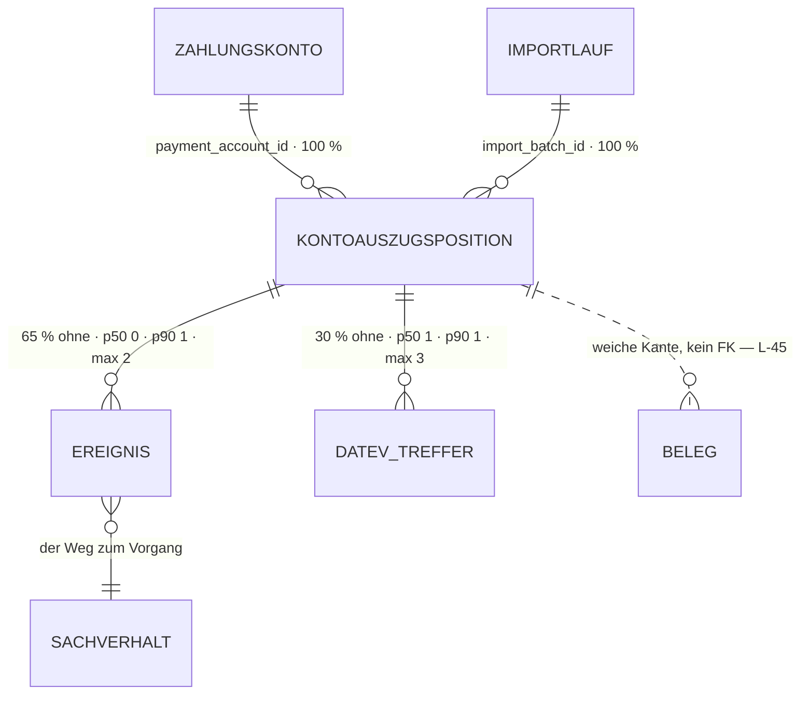

# Kontoauszugsposition · `bank transaction` — Entitätsprofil

| | |
|---|---|
| Status | **in Specs** — 0099 Purpose · 0100 Cell · 0101 Row · 0102 Facts · 0103 Drawer (alle `spec`, 2026-09-05) |
| GLOSSARY | `### Bank transaction` — englisch `bank transaction`, Ordner `entities/bank-transaction/`. **Der deutsche Name ist strittig**, siehe Befund B1 und Offene Frage 1 |
| Tabelle | `ludwig.client_bank_transactions`. Keine Subtypen |
| Typen | `modules/bank-transactions/infrastructure/bank-transactions-queries.ts` — `BankTransactionAssignmentRow`, `AssignedCaseLink`, `ProposalIndicatorStatus`; `ui/PurposeDisplay.tsx` — `PurposeParts`, `derivePurposeParts()`; `ui/kontoauszug-presentation.tsx` — `ZState`, `deriveZ()`, `restOf()`, `DATEV_MATCHED_STAGES`, `datevMatchTitle()`; `ui/case-indicators.ts` — `CaseIndicator`, `deriveCaseIndicators()`. Der Spiegel hat `src/ludwig/modules/bank-transactions/domain/` — aber nur den **Import**-Typ `BankTransactionRow` (Parser-Ausgabe) und `raw-sheet`. Der **Anzeige**-Typ und alle Ableitungen fehlen (Befund B2, im Prüflauf korrigiert) |
| Status-Achsen | `ereignis` (über `resolveEventBookingState`, am Ereignis hinter der Zeile) · `buchung` (Vorschlags-Indikator) · `klaerung` (Zähler am Sachverhalt). **Für `match_stage` gibt es keine Achse** (Befund B3) |
| Wichtigkeit | **hoch** — Quelle der Schicht „Quelle" im Datenmodell (Quelle → Ereignis → Sachverhalt → Buchung) |
| Datenstand | Staging über den Pooler, 2026-09-05, **1281 Positionen** (lokal 0). Alle Zahlen unten aus diesem Bestand, nur `SELECT`, keine Kundendaten im Dokument |
| Rückfrage | gestellt am 2026-09-05 (Abschnitt „Offene Fragen"), **unbeantwortet** — die Defaults gelten, der Zuschnitt steht |
| Analyse von / am | Claude, 2026-09-05 (Skill `entitaet-analysieren`) |
| Prüfung von / am | Claude (zweiter Agent), 2026-09-05 — alle Zahlen gegen denselben Bestand nachgerechnet, jede Zeile mit Beleg „heute in" gegen die genannte Datei gelesen |

## Was sie ist

Eine Kontoauszugsposition ist **eine Zeile eines Kontoauszugs**: eine
Zahlungsbewegung auf einem Zahlungskonto, importiert aus CSV oder der
Qonto-API. Sie ist der äußerste Rand der Kette Quelle → Ereignis →
Sachverhalt → Buchung — an ihr entscheidet sich, ob Geld, das geflossen ist,
zu einem Vorgang gehört, den jemand bucht. Die Sachbearbeiterin fragt sie
zwei Dinge: *was war das, und ist es schon einem Sachverhalt zugeordnet?*

Anzeige-Regeln aus dem GLOSSARY und den Spaltenkommentaren, wörtlich:

- „Vorzeichen: **positiv = Eingang, negativ = Ausgang**" — die Richtung ist
  keine eigene Spalte, sie steckt im Betrag.
- „Originalwährung wird gespeichert, EUR-Wert in `amount_eur` (Phase 1: nur
  EUR)." — heute sind beide identisch, `fx_rate` ist immer 1.
- „**Vergangene Zeiträume sind immutable** — Re-Imports werden auf
  max(`posting_date`) cutoff-gefiltert." Der Satz gilt dem **Import**, nicht
  der Zeile: `match_stage` und `payment_account_id` werden sehr wohl
  fortgeschrieben (Prüflauf, siehe unten). Was gilt: **kein einziger
  Datenpunkt ist änderbar = Nutzer** — keine Hand schreibt hier, nur Matcher,
  Agent und Import.
- Aus dem Spaltenkommentar zu `match_stage`: „denormalisierter Match-Zustand.
  Matched: `beleg|exact|pair|near|alias|split|residual|manual`. Offen:
  `unclear_multi|unclear_none|beyond_bookings|no_account`. NULL = Matcher nie
  gelaufen. **`manual` überlebt Re-Runs**, alles andere wird jeder Lauf neu
  berechnet."
- Aus `kontoauszug-presentation.tsx`, wörtlich und tragend: „Buchungs-Zustand
  des **EREIGNISSES** hinter dieser Zeile — nicht der Status des
  Sachverhalts. Eine Zeile im Auszug ist genau eine Zahlung; steht derselbe
  Sachverhalt zweimal im Auszug, kann eine gebucht und die andere offen sein."
- Aus `PurposeDisplay.tsx`: „Der Rohwert einer SEPA-Zahlung ist für Menschen
  unlesbar … Angezeigt wird deshalb nur der SVWZ-Freitext; die Referenzen
  kommen als Chips bzw. hinter ein Info-Icon. Der unveränderte Originalblock
  bleibt über dasselbe Icon erreichbar."

## Schaubild



Der Sachverhalt hängt **nicht** direkt an der Position: der Weg führt über das
Ereignis (`client_accounting_event.bank_transaction_id`). Die Kante zum
**Beleg** (dem Kontoauszugs-PDF) ist weich und hat keinen FK — zwei Wege,
79 Umsätze an 6 Belegen, Owner-Entscheid steht aus (Befund L-45).

## Datenpunkte

Kumulativ. Füllgrade aus 1281 Zeilen Staging.

| Datenpunkt | Quelle | Rolle | Füllgrad | heute in | änderbar | Rang | ab Form | Beleg |
|---|---|---|---|---|---|---|---|---|
| Verwendungszweck (`purpose`) | Spalte + `abgeleitet: derivePurposeParts()` — SVWZ-Freitext, Referenzen hinter dem (i), Original erreichbar | Identität | 100 % (p50 35 · **p90 84** · max 447) | `PurposeDisplay` in **fünf** Dateien und **zwei** Modulen: `BankTransactionAssignmentTable`, `BankTransactionDetail`, `CsvImportWizard` (bank-transactions) · `EventStack`, `SachverhaltScreen` (accounting-cases). **`KontoauszugView` nutzt sie nicht** — die Auszugszeile rendert `deriveSepa(row).text` als nacktes `<span class="ka-svwz-txt">`, ohne Chips und ohne Zugang zum Originalblock | nie | 1 | XS | breiteste (einzige ungesetzte) Spalte in **beiden** Listen · 100 % Füllgrad · das einzige Feld mit eigener Komponente und eigener CSS-Datei |
| Betrag (`amount` · `currency`) | Spalte; **Vorzeichen ist die Richtung** | Maß | 100 % (Ausgang 650 · Eingang 631) | Kontoauszugs-Spalte „Betrag", Zuordnungstabelle, Drawer | nie | 2 | XS | Füllgrad · Spaltenkommentar · in jeder Ansicht |
| Gegenpartei (`counterparty_name`) | Spalte | Identität | 97 % (p50 20 · p90 31 · max 53) | Kontoauszugs-Spalte „Gegenpartei", Drawer | nie | 3 | S | Füllgrad · eigene Spalte |
| Buchungsdatum (`posting_date`) | Spalte | Zeit | 100 % | Kontoauszugs-Spalte „Datum" (heute **ohne Jahr**: `fmtDateShort` → „15.04.") | nie | 4 | S | Füllgrad · Sortierachse der Liste |
| DATEV-Haken | `abgeleitet: datevMatchTitle(match_stage)` über `DATEV_MATCHED_STAGES` | Zustand | `match_stage` 100 %; **71 % matched** (`exact` 605 · `beleg` 263 · `split` 24 · `near` 7 · `pair` 4), 29 % offen (`beyond_bookings` 328 · `unclear_none` 38 · `unclear_multi` 12) | `DatevMatchTick` vor der Gegenpartei | nie | 5 | S | die Verteilung: an drei von vier Zeilen sagt der Haken etwas |
| Sachverhalts-Zuordnung | `abgeleitet: deriveZ()` — Z0 keiner · Z1 einer, erklärt · Z2 mehrere, erklärt · Z3 Rest offen; dazu `restOf()` | Zustand | 65 % **ohne** Ereignis, also ohne Sachverhalt | „offen"-Pille, `ka-casestack` mit Links, Rest-/Voll-Marke im Zweck | nie | 6 | S | eigene Spalte + eigene Ableitung · trägt die Worklist |
| Buchungs-Zustand des Ereignisses | `abgeleitet: resolveEventBookingState()`, Achse `ereignis` | Zustand | nur wo ein Ereignis hängt (35 %) | Kontoauszugs-Spalte „Buchung", `EventStatusInline`, `CaseIndicatorBadges` | nie | 7 | S | eigene Spalte · Achse in der Registry · der Kommentar oben nennt sie ausdrücklich |
| Offene Klärungen | `abgeleitet: deriveCaseIndicators()`, Achse `klaerung` — hängt am **Sachverhalt**, nicht an der Zeile | Zustand | wo ein Sachverhalt hängt | `ClarBubble` + Badge „Klärung" | nie | 8 | S | eigene Ableitung · eigene Zelle |
| Valuta (`value_date`) | Spalte | Zeit | 97 % | Drawer („Valuta") | nie | 9 | M | Füllgrad · im Drawer, nicht in der Zeile |
| IBAN der Gegenpartei (`counterparty_iban`) | Spalte | Identität | 85 % | Drawer, mono | nie | 10 | M | Füllgrad · die belastbare Identität, wenn der Name variiert |
| SEPA-Referenzen (**sieben**: EREF · KREF · MREF · CRED · ABWA · PURP · OAMT) | `abgeleitet: derivePurposeParts()` aus `raw_payload.parsed_sepa_tags`, mit `extractSepaTags()` als Rückfall | Kontext | **90 %** tragen mindestens eine (1156/1281) — EREF 82 % · KREF 34 % · MREF 31 % · CRED 30 % · ABWA 11 % · PURP 3 % | `PurposeDisplay` (Chips im Block, (i) inline) | nie | 11 | M | Füllgrad · die Suche der Liste sucht über **alle** Referenzwerte, nicht nur EREF/KREF |
| BIC (`counterparty_bic`) | Spalte | Kontext | 85 % | Drawer, mono | nie | 12 | L | Füllgrad · nur im Drawer |
| Match-Stufe im Klartext (`match_stage`) | Spalte, **ohne Registry-Achse** (Befund B3) | Zustand | 100 % (kein NULL im Bestand) | Drawer („DATEV-Historie"), sonst nur als Haken | **Server · Agent** — der Matcher rechnet sie bei jedem Lauf neu (`match-client-core.ts`), der OPOS-Watchdog setzt `manual` (`opos-watchdog-answer.ts`). Nie Nutzer | 13 | L | zwölf Werte, vier davon „offen" — der Haken sagt nur ja/nein |
| Quelle (`source`) | Spalte | Kontext | 100 % (`csv` 1202 · `manual` 79) | Drawer („Quelle", in Versalien — A2-Verstoß) | nie | 14 | L | Füllgrad · im Drawer |
| Import-Lauf (`import_batch_id` · `imported_at`) | Spalten → `client_bank_import_batches` | Verantwortung | 100 % · 100 % | Drawer („Import-Batch", „Import-Zeitpunkt") | nie | 15 | L | Füllgrad · GLOSSARY „Import run" |
| Betrag in EUR (`amount_eur` · `fx_rate`) | Spalten | Maß | 100 %, heute **identisch** zu `amount`, `fx_rate` immer 1 | Drawer, nur wenn abweichend | nie | 16 | L | GLOSSARY („Phase 1: nur EUR") · der Drawer zeigt ihn schon bedingt |
| Externe ID (`external_transaction_id`) | Spalte | Kontext | **6 %** | Drawer, bedingt | nie | 17 | L | Füllgrad · nur Qonto-Zeilen haben eine |
| Rohdaten (`raw_payload`) | Spalte | Kontext | 100 % | nirgends | nie | 18 | L | Spaltenkommentar „für Audit/Debugging" → `RawRecord` (0051), nicht als Feldliste |
| **Zuordnungs-Vorschlag** (Kreditor · wartender Beleg-Sachverhalt) | `abgeleitet: listOpenTransactionsForClient()` in SQL — Kreditor über IBAN- oder Namenstreffer (`signal: iban \| name`), Sachverhalt über den wartenden Beleg | Verantwortung | nur offene Zeilen (Z0); im Bestand nicht messbar, weil die Ableitung nicht persistiert wird | `BankTransactionAssignmentTable`: „→ *Name*" unter der Gegenpartei (grün bei IBAN-Treffer) und der Knopf „→ Beleg *Nr.*" in der Sachverhalts-Spalte | nie | **offen — im Prüflauf nachgetragen** | S (nur Worklist) | die Zeile zeigt ihn heute; Rang und Einordnung gehören in die Überarbeitung, nicht in die Prüfung |

**Ausgelassen (Technik):** `id`, `tenant_id`, `client_id`, `created_at`,
`updated_at`. Dazu `source_file_storage_path` — **0 % gefüllt** und ein
Speicherpfad, kein Fachwert.

**Freitext-Grenzen:** `purpose` in XS/S auf **eine Zeile mit Ellipse**
(p90 84, max 447 — der Rohblock einer SEPA-Zahlung sprengt jede Zelle), in M
und L voll mit Referenz-Chips. `counterparty_name` braucht keine Grenze
(p90 31).

**Kein einziger Punkt ist änderbar = Nutzer** — das entscheidet §7 Nr. 4:
**es gibt keinen Editor.** Der Grund ist aber nicht, dass die Tabelle
unbeschreibbar wäre; im Prüflauf wurden **vier** Schreibpfade gefunden, und
keiner davon ist eine Nutzerhand:

| Pfad | schreibt | Auslöser |
|---|---|---|
| `bank-transactions-writes.insertBankTransactions` | die ganze Zeile (INSERT) | Import — CSV, Qonto, und über das Agenten-Werkzeug `record_statement_transactions` der Abtipp-Weg (`source='manual'`, 79 Zeilen = 6 % des Bestands) |
| `bank-match/match-client-core.ts` | `match_stage` | Matcher-Lauf (Server); alles außer `manual` wird jedes Mal neu gerechnet |
| `accounting-cases/opos-watchdog-answer.ts` | `match_stage = 'manual'` | Agenten-Antwort am OPOS-Watchdog |
| `bank-transactions/reassign-batch-core.ts` | `payment_account_id` | Korrektur eines Fehlimports — **hat im ganzen Repo keinen Aufrufer** (kein UI, keine Server Action, kein Agenten-Werkzeug, kein Skript) |

Die Zuordnungs-Aktionen (`assignment-actions.ts`) schreiben **nicht** an der
Zeile — nachgezählt: kein `update`/`insert` auf `client_bank_transactions`.
Sie legen Ereignisse an. Die Ablehnung des Editors trägt also, ihre
Begründung war nur zu breit formuliert.

## Relationen

| Relation | Richtung | Kardinalität | Rolle | ab Form | Darstellung | Beleg |
|---|---|---|---|---|---|---|
| Ereignisse (`client_accounting_event.bank_transaction_id`) | Kind | **65 % ohne** · p50 0 · p90 1 · max 2 | Zustand | S | **Zähler + Zustand**: Z0–Z3 in S, die Liste der zugeordneten Sachverhalte mit Teilbeträgen in M/L (heute `ka-casestack` und die Unterzeilen) | Staging · `deriveZ()` |
| Sachverhalt (über das Ereignis) | Kind des Kindes | wo ein Ereignis hängt | Identität | S | **Inline** als `CaseCell` → Profil `accounting-case`; im Rest-Fall (Z3) mehrere mit je eigenem Teilbetrag | `ka-caselink` in `KontoauszugView` · `AssignedCaseLink` |
| DATEV-Treffer (`client_bank_transaction_matches`) | Kind | 30 % ohne · p50 1 · p90 1 · **max 3** | Zustand | S | **Haken** in S (`DatevMatchTick`), **Liste** in L | Staging |
| Zahlungskonto (`client_payment_accounts`) | Eltern | 100 % | Kontext | — | die Route `[year]/banks/[accountId]` setzt es; als **Inline** nur, wenn die Zeile kontoübergreifend steht — genau der Fall in der Zuordnungs-Worklist | Route · `BankTransactionAssignmentTable` gruppiert nach Konto |
| Import-Lauf (`client_bank_import_batches`) | Eltern | 100 % | Verantwortung | L | **Inline** (Bezeichnung + Zeitpunkt) | Drawer · GLOSSARY „Import run" |
| Beleg — das Kontoauszugs-PDF | ohne FK, **weiche Kante** | 79 Umsätze an 6 Belegen (Befund L-45) | Kontext | — | **gar nicht**, solange der Owner-Entscheid zu L-45 aussteht. Keine Form zeigt „dieser Umsatz stammt aus Beleg X" | L-45 · `entitaeten/source-document.md` B11 |
| Historie (`platform_audit_events`) | ohne FK | `resource_kind` kennt die Position nicht — nur `payment_account` und den Import-Lauf | Verantwortung | — | **gar nicht** an der Zeile; die Herkunft steht über den Import-Lauf | Vokabular `resourceKind` in der App: `journal_entry`, `accounting_case` |

## Heutige Darstellung

| Komponente | Form | zeigt | fehlt | zu viel |
|---|---|---|---|---|
| `PurposeDisplay.tsx` (174 Z.) | XS | Rang 1 vollständig: SVWZ-Freitext, Referenz-Chips, Original hinter dem (i); zwei Varianten (Block, Inline) | — | die einzige Komponente der Familie, die schon richtig geschnitten ist — sie wandert fast unverändert. Hängt an `infrastructure/sepa-tags.extractSepaTags` und an der Label-Map `PURP_LABELS`, die im UI steht |
| `KontoauszugView.tsx` (631 Z.) | L (Liste) mit Zeile · Filterzeile · Suche · Aufklapper | Ränge 1–8 in sieben Spalten (Datum · Gegenpartei · Zweck · Betrag · Sachverhalt · Buchung · ⓘ); Unterzeilen je zugeordnetem Sachverhalt mit Teilbetrag und Summe; Volltext über Zweck, Gegenpartei, **IBAN**, Betrag, Sachverhalt und **alle** SEPA-Referenzen | **der laufende Saldo** — die Kontoübersicht zeigt ihn je Konto, der Auszug selbst nicht (Befund B4). Das Jahr im Datum (`fmtDateShort` → „15.04."). **Und die Chips**: die Zeile rendert nur `sepa.text`, der Originalblock ist aus der Liste heraus nicht erreichbar — das (i) der Zeile öffnet den Drawer, nicht den Zweck | die Zeile, die Liste, die Filter, die Suche und der Aufklapper in einer Datei |
| `kontoauszug-presentation.tsx` (174 Z.) | Helfer | `deriveZ`, `restOf`, `DATEV_MATCHED_STAGES`, `datevMatchTitle`, `DatevMatchTick`, `ClarBubble`, `EventStatusInline`, `KV`, vier Formatierer | — | vier Formatierer (`fmtEUR`, `fmtDateShort`, `fmtDateFull`, `fmtTimestamp`), die v3 als `Amount` und `Time` schon hat |
| `CaseIndicatorBadges.tsx` + `case-indicators.ts` (34 + 69 Z.) | XS | Vorschlag offen · Gebucht · Klärung mit Zähler, Farben aus der Registry | — | — |
| `BankTransactionAssignmentTable.tsx` (658 Z.) | L (Worklist) | dieselbe Zeile ohne Zuordnungsspalten, dafür Auswahl, Sammelaktion, zwei Formulare (neuer Sachverhalt / bestehender) | — | die Auswahl einer Bankzeile **und** die Auswahl eines Sachverhalts (`<select>`, → Backlog 0084) in einer Datei |
| `BankTransactionDetail.tsx` (150 Z.) | M (Fakten) | **Ränge 1–17, also alle außer den Rohdaten**, in **fünf** Blöcken (Zahlung · Verwendungszweck · Gegenpartei · Zuordnung · Import) — nicht nur 1–3 und 9–17: Buchungsdatum, DATEV-Haken, Zuordnung, Ereignis-Zustand und Klärungszähler stehen ebenfalls drin, die SEPA-Chips über `PurposeDisplay variant="block"` | Rang 18 (Rohdaten) | nur im Drawer benutzt — es gibt **keine** Seite für eine einzelne Position |
| `EventStack.BankTransactionBlock` (in `accounting-cases`) | XS/S (Inline in fremder Liste) | Gegenpartei (Rang 3, mit Rückfall „Bankbewegung"), Zahlungskonto, Buchungsdatum, Zweck über `PurposeDisplay` | Betrag, Zustand | **im Profil bisher gar nicht verzeichnet** — der Beleg dafür, dass die Position aus einer fremden Ansicht heraus genannt wird |
| `SachverhaltScreen.BankPane` / `.bankcard` (in `accounting-cases`) | M (Karte in fremder Ansicht) | Betrag, ein Datum, Gegenkonto, Zweck, Bankkonto — als Karte im Zeitstrahl des Sachverhalts | Zustand, DATEV-Haken | **im Profil bisher gar nicht verzeichnet**; eine handgebaute Karte der Position im Sachverhaltsschirm. Achtung beim Übernehmen: die Karte beschriftet das Datum mit **„Wertstellung"**, füllt es aber aus `postingDate` (`overview-vm.bankFacts`) — also Rang 4, nicht Rang 9. Das Label ist falsch, nicht der Wert |
| `Schritt4.tsx` (Stapelabnahme, Gate 2a/4d) | XS (Zeile in fremder Liste) | Bezeichnung der Auszugszeile, Betrag, das gerissene Gate — der Link öffnet den Drawer | Datum, Gegenpartei | **im Profil bisher gar nicht verzeichnet**; die Zeile kommt aus `domain/gate-zeile.leseGateZeile`, nicht aus dieser Familie |
| `ui/drawers/BankTransactionDrawer.tsx` (96 Z.) | L (Drawer) | lädt selbst, trägt Lade-, Fehler- und Leerfall; aufgerufen aus `KontoauszugView`, `Schritt3Einzel`, `Schritt4` | — | Klasse A nach F113 — der v3-Drawer (0052) ist Klasse B und bekommt die Daten als Props |

## Listen

| Liste | Job | Grundgesamtheit | Sortierung | Spalten (Ränge) | Filter | Massenaktion | Leerfall | Umfang p50 · p90 | Beleg |
|---|---|---|---|---|---|---|---|---|---|
| `BankTransactionList` — der Kontoauszug | Wenn **ein Kontoauszug importiert ist**, will **die Sachbearbeiterin** **sehen, welche Zahlungen noch keinem Vorgang gehören**, damit **kein Geldfluss ungebucht durchrutscht** | ein Zahlungskonto, ein Zeitraum | Buchungsdatum | 1–8 | Zeitraum, Zustand, Volltext (Zweck, Gegenpartei, Betrag, Sachverhalt, EREF/KREF) | keine | „Konto ohne Bewegung" (Erfolg) ≠ „keine Treffer" (Filter) | je Konto und Jahr **p50 36 · p90 251 · max 952** | Staging · `KontoauszugView` · Route `[year]/banks/[accountId]` |
| `BankTransactionWorklist` — offene Zahlungen | Wenn **Zahlungen ohne Vorgang liegen**, will **die Sachbearbeiterin** **sie in einem Zug einem neuen oder bestehenden Sachverhalt zuordnen**, damit **sie nicht Konto für Konto durchgeht** | **ein Konto** (nicht kontoübergreifend, siehe unten), nur ohne Sachverhalt (Z0), ein Wirtschaftsjahr | Datum absteigend; die **Seite** gruppiert nach Konto und rendert je Konto eine eigene Tabelle | Auswahl · 1 · 2 · 3 · 4 · 6 (+ 7/8 über `CaseIndicatorBadges`, sobald zugeordnet) — **kein** DATEV-Haken, **keine** Konto-Spalte | keiner in der Komponente | **ja** — Auswahl → neuer Sachverhalt oder bestehendem zuordnen; dazu je Zeile „Einzeln", „Dauer" und der Vorschlags-Knopf „→ Beleg *Nr.*" | „nichts offen" (Erfolg, mit Zahl) | 65 % aller Positionen haben kein Ereignis | `BankTransactionAssignmentTable` · Reiter „Offene Zahlungen" der Sachverhaltsseite |
| dieselbe Komponente, zweiter Aufrufer — **Transaktionen eines Kontos** in der Konfiguration | Wenn **ein Import gelaufen ist**, will **wer das Konto einrichtet** **sehen, was tatsächlich angekommen ist, und Liegengebliebenes gleich zuordnen**, damit **er den Import beurteilen kann, ohne ins Buchungsjahr zu wechseln** | ein Konto, **alle** Zeilen (nicht nur offene), `limit 500`, **ohne** Jahresfilter | Datum absteigend | wie oben | keiner | wie oben | keiner | dieselbe Verteilung | Route `configuration/bankkonten/[accountId]/transactions`, verlinkt aus der Bankkonten-Übersicht und aus der Import-Seite — **im Profil bisher nicht verzeichnet** |

**Es bleiben zwei Komponenten — aber aus anderen Gründen als angenommen.**
Im Prüflauf nachgezählt, unterscheiden sich Auszug und Worklist in **drei**
der fünf Merkmale aus §8:

- **Spaltensatz** — sieben Spalten mit DATEV-Haken, Buchungs-Zustand und ⓘ
  gegen sechs mit Auswahlkästchen und Zuordnungs-Knöpfen.
- **Filter** — der Auszug hat Zeitraum, Zustandsfilter und Volltextsuche, die
  Worklist keinen einzigen.
- **Massenaktion** — keine gegen Auswahl → neuer oder bestehender Sachverhalt.

Die **Grundgesamtheit** ist dagegen **kein** Unterschied: die
`BankTransactionAssignmentTable` verlangt eine `accountId` und bekommt immer
die Zeilen **eines** Kontos. Kontoübergreifend ist die *Seite*
(`[year]/cases`), die selbst nach Konto gruppiert und je Gruppe eine eigene
Tabelle mit eigener Überschrift rendert. Das gehört ins Seitenprofil, nicht
in die Liste — und es ist der Grund, warum die Worklist in 0086 **keine**
Konto-Spalte braucht, wohl aber einen Gruppenkopf von außen.

Denselben Aufbau nutzt ein **dritter** Aufrufer in der Konfiguration mit
anderer Grundgesamtheit (alle Zeilen statt nur der offenen). Nach §8 ist das
ein `rows`-Prop, keine dritte Komponente — aber 0086 muss beide Aufrufer
tragen, sonst bleibt die Konfigurationsseite auf der Altkomponente stehen.

`banks/offen` ist keine Route mehr: die Worklist lebt im Reiter „Offene
Zahlungen" der Sachverhaltsseite; ein Seitenmodul dafür existiert nicht
(geprüft 2026-09-05, nur ein Kommentar verweist auf die alte URL).

Keine der **drei** Routen hat ein Seitenprofil unter `docs/seiten/` — deshalb
steht hier nur Job und Tabellenschnitt, und beide Listen gehen auf den Backlog.

Zum Umfang: die Werte p50 36 · p90 251 · max 952 stehen auf **neun** Gruppen
(neun Zahlungskonten, ein Wirtschaftsjahr im Bestand). p50 und max sind
belastbar, das p90 ruht auf zu wenigen Punkten — für die Mechanik reicht es:
das Maximum liegt über 200, also braucht 0085 `Pagination`, Serverfilter und
einen Lade- und Fehlerfall. Der zweite Aufrufer schneidet heute hart bei
`limit 500` ab, ohne das anzuzeigen.

## Formen

| Form | Größe | Empfehlung | Grund (§7 Nr.) | zeigt (Ränge) | Relationen | setzt auf | ersetzt |
|---|---|---|---|---|---|---|---|
| `BankTransactionPurpose` | XS | **ja** | 1 — existiert als `PurposeDisplay` in sechs Dateien und drei Modulen | 1 (+ 11 als Chips bzw. hinter dem (i)) | — | `LongText`, `Badge`, `Popover`, `Kbd` | `PurposeDisplay.tsx` samt `purpose.css` |
| `BankTransactionRow` | S | **ja** | 1 — existiert in zwei Listen; 6 — zwei Listen-Jobs | 1–8 | Sachverhalt als `CaseCell` inline, Ereignisse als Z-Zustand | `Row`, `BankTransactionPurpose`, `CaseCell`, `Amount`, `Time`, `StatusBadge`, `Badge` | die Zeile aus `KontoauszugView` (Z. 229–320) und aus `BankTransactionAssignmentTable`, dazu `CaseIndicatorBadges`, `DatevMatchTick`, `ClarBubble`, `EventStatusInline` |
| `BankTransactionFacts` | M | **ja** | 1 — existiert als `BankTransactionDetail` (150 Z.); und 0052 verlangt, dass der Drawer die Kernfakten aus **derselben** Komponente zeigt wie eine spätere Detailansicht | **1–18 in fünf Blöcken** (Zahlung · Verwendungszweck · Gegenpartei · Zuordnung · Import) — so viel zeigt die Vorlage heute schon, bis auf Rang 18 | Sachverhalte mit Teilbetrag als Liste, Import-Lauf als Inline | `FieldList`, `Amount`, `Time`, `MonoCell`, `RawRecord` | `BankTransactionDetail.tsx` samt `KV` aus `kontoauszug-presentation.tsx` |
| `BankTransactionDrawer` | L | **ja** | 5 — aus drei Ansichten heraus nachgeschlagen: `KontoauszugView`, `Schritt3Einzel`, `Schritt4` der Stapelabnahme. Es gibt **keine** Seite für eine einzelne Position — der Drawer *ist* die Antwort | Kopf (1–2), Fakten aus `BankTransactionFacts`, Zuordnung, ein Ausgang in den Sachverhalt | wie `BankTransactionFacts` | `Drawer`, `BankTransactionFacts`, `CaseCell` | `ui/drawers/BankTransactionDrawer.tsx` (Klasse A → Klasse B, F113) |
| `BankTransactionView` | L | **verworfen** | kein §7-Grund: es gibt keine Route für eine einzelne Position, `BankTransactionDetail` wird ausschließlich vom Drawer benutzt (geprüft 2026-09-05), und die Position hat nichts, was einen eigenen Bildschirm füllt — 18 Datenpunkte, keine Unterlisten außer zwei Sachverhalten. Der Auszug ist der Bildschirm, der Drawer die Vertiefung | | | | |
| `BankTransactionList` + `BankTransactionColumns` | L | **Backlog (0085)** | 6 — der Kontoauszug als Liste. Es fehlt das **Seitenprofil** für `[clientSlug]/[year]/banks/[accountId]`; ohne es sind Kopfzeile, Zeitraum, Saldo und die beiden Leerfälle geraten | wie `BankTransactionRow` | — | `DataTable`, `BankTransactionRow`, `EmptyState`, `Pagination` | `KontoauszugView.tsx` (631 Z.) |
| `BankTransactionWorklist` | L | **Backlog (0086)** | 6 — eigener Job, drei Unterschiede zur Auszugsliste. Sie hängt zusätzlich am `CasePicker` (0084) und an einer Sammelaktion, die es serverseitig heute nur je Zeile gibt (L-16) | 1–5 + Konto | Zahlungskonto als Gruppenkopf | `DataTable`, `BankTransactionRow`, `SelectionBar`, `CasePicker` | `BankTransactionAssignmentTable.tsx` (658 Z.) |
| `BankTransactionCell` | XS | **jetzt** (im Prüflauf von „verworfen" gedreht) | 1 **und** 3 — die Ablehnung trägt nicht: die Position wird an **drei** Stellen aus einer fremden Ansicht heraus genannt, jedes Mal handgebaut. `EventStack.BankTransactionBlock` (Gegenpartei · Konto · Datum · Zweck) im Zeitstrahl des Sachverhalts, `Schritt4` der Stapelabnahme (Bezeichnung · Betrag · Gate, Link in den Drawer) und — eine Größe darüber — `SachverhaltScreen.BankPane`. Genannt wird eben **nicht** nur der Zweck | 1–3 (Gegenpartei als Kopf, Datum und Betrag daneben, Zweck einzeilig) | Zahlungskonto als Inline, wenn die Cell kontofern steht | `Inline`, `BankTransactionPurpose`, `Amount`, `Time` | `EventStack.BankTransactionBlock`, die Auszugszeile aus `Schritt4` |
| `BankTransactionPicker` | S | **verworfen** | niemand wählt eine Bankzeile aus einer Liste aus. In der Worklist wird sie **angehakt** (Mehrfachauswahl in der Tabelle), und gewählt wird auf der anderen Seite: der Sachverhalt (→ 0084 `CasePicker`) | | | | |
| `BankTransactionEditor` | XL | **verworfen** (im Prüflauf bestätigt, Begründung geschärft) | §7 Nr. 4 trifft nicht zu: **kein einziger Datenpunkt ist änderbar = Nutzer.** Vier Schreibpfade gibt es (Tabelle unter „Datenpunkte"), aber sie gehören Import, Matcher und Agent; `reassignImportBatch` hat gar keinen Aufrufer. Die einzige menschliche Handlung an einer Position ist ihre **Zuordnung** — und die schreibt am Ereignis, nicht an dieser Zeile: `assignment-actions.ts` fasst `client_bank_transactions` nicht an | | | | |
| `BankTransactionCard` | M | **offen** — im Prüflauf aufgeworfen | `SachverhaltScreen.BankPane` (`.bankcard`) ist heute eine handgebaute Karte der Position im Sachverhaltsschirm (Betrag · „Wertstellung" · Gegenkonto · Zweck · Bankkonto). Damit greift §7 Nr. 1. Ob daraus eine eigene Karte wird oder ob `BankTransactionCell` plus `BankTransactionFacts` sie ersetzen, entscheidet die Überarbeitung — eine sechste Form „jetzt" verbietet §9 | | | | |

**Bau-Reihenfolge:** `BankTransactionPurpose` → `BankTransactionCell` →
`BankTransactionRow` → `BankTransactionFacts` → `BankTransactionDrawer`. Das
sind nach dem Prüflauf **fünf** — genau die Grenze aus §9; die zwei Listen
warten auf ihre Seitenprofile, und die Karte bleibt offen.

**Namenskollision, vor der ersten Spec zu klären:** der Spiegel exportiert
bereits `BankTransactionRow` — als **Import**-Typ (Parser-Ausgabe) in
`src/ludwig/modules/bank-transactions/domain/types.ts`. Die v3-Komponente
gleichen Namens importiert nicht denselben Begriff; der Anzeige-Typ heißt in
der App `BankTransactionAssignmentRow` und ist nicht gespiegelt.

## Zuschnitt

| Form / Liste | Marke | Grund | Backlog |
|---|---|---|---|
| `BankTransactionPurpose` | **jetzt** | trägt Zeile, Fakten und Drawer — und sechs Stellen in der App, drei davon außerhalb dieses Moduls | — |
| `BankTransactionCell` | **jetzt** (Prüflauf) | drei fremde Ansichten bauen sie heute von Hand nach | — |
| `BankTransactionRow` | **jetzt** | trägt beide Listen; existiert heute zweimal | — |
| `BankTransactionFacts` | **jetzt** | trägt den Drawer (0052 Zone 3); existiert als `BankTransactionDetail` | — |
| `BankTransactionDrawer` | **jetzt** | aus drei Ansichten nachgeschlagen; nach 0052, Klasse B | — |
| `BankTransactionList` | Backlog | Seitenprofil für `[year]/banks/[accountId]` fehlt | `docs/backlog/0085-bank-transaction-list.md` |
| `BankTransactionWorklist` | Backlog | hängt an 0084 `CasePicker` und an der fehlenden Sammelaktion (L-16) | `docs/backlog/0086-bank-transaction-worklist.md` |
| `BankTransactionView` · `BankTransactionPicker` · `BankTransactionEditor` | verworfen (im Prüflauf alle drei bestätigt) | je ein Satz in der Formen-Tabelle | — |
| `BankTransactionCard` | **offen** | `SachverhaltScreen.BankPane` erfüllt §7 Nr. 1, aber §9 lässt keine sechste Form „jetzt" zu. Der Prüfagent legt keine Backlog-Datei an — das entscheidet die Überarbeitung | — |

## Befunde für `ludwig/app`

- **B1 (L-55)** — **Zwei deutsche Namen für dieselbe Tabelle, beide im
  GLOSSARY.** Der Eintrag `### Bank transaction` sagt „German:
  `Banktransaktion`"; die Schichten-Tabelle desselben Dokuments sagt
  „Kontoauszugsposition". Die App sagt im UI durchgehend „Kontoauszug"
  (`KontoauszugView`, `kontoauszug-presentation`, Route `banks`). Das ist der
  Befund L-20 in seiner zweiten Ausprägung: erst **ein** Wort wählen, dann
  den Eintrag nachziehen. Dieses Profil folgt der Schichten-Tabelle und dem
  UI und schreibt **Kontoauszugsposition** — der englische Name
  `bank transaction` ist unstrittig und trägt den Code.
- **B2 (L-56)** — *im Prüflauf korrigiert; L-56 im Register ist in seiner
  jetzigen Fassung falsch und muss nachgezogen werden.*
  `src/ludwig/modules/bank-transactions/domain/` **existiert** (`types.ts`,
  `raw-sheet.ts`) — es spiegelt aber nur die **Import**-Seite:
  `BankTransactionRow` als Parser-Ausgabe, `BankTransactionSource`,
  `BankCsvAnalysis`, `BankImportError`. Es fehlen (a) der **Anzeige**-Typ, in
  der App `BankTransactionAssignmentRow` aus `infrastructure/`, (b) die
  Ableitungen — und es sind **fünf**, nicht vier: `derivePurposeParts`,
  `deriveZ`/`restOf`, `datevMatchTitle`, `deriveCaseIndicators` **und
  `extractSepaTags`** aus `infrastructure/sepa-tags`, ohne das
  `derivePurposeParts` nicht läuft, (c) die Label-Map `PURP_LABELS`, die im
  UI steht. Alle sind rein und hängen an keiner DB. Immerhin:
  `resolveEventBookingState` gibt es in v3 schon
  (`src/ui/v3/patterns/status-registry.ts`), die Achse `ereignis` ist
  gesetzt — dieser Teil ist kein Befund.
- **B3 (L-57)** — **`match_stage` hat keine Registry-Achse**, obwohl es zwölf
  Werte mit Bedeutung sind (acht „gematcht", vier „offen"). Heute wird daraus
  ein grüner Haken und ein handgeschriebener Titel (`datevMatchTitle`), und
  die vier offenen Klassen — `beyond_bookings` allein 328 von 1281 — sind
  **unsichtbar**. Die Achse `mirror_match` ist eine andere: sie gehört
  `client_datev_mirror_entries.match_state`.
- **B4 (L-58)** — **Der Kontoauszug zeigt keinen Saldo.** Die Kontoübersicht
  (`[year]/banks`) führt je Konto eine Saldo-Spalte, der Auszug selbst
  (`KontoauszugView`) keinen laufenden Saldo — wer gegen den Bankauszug
  abgleicht, hat keine Anschlusszahl. Schwesterbefund zu L-30 (der
  DATEV-Auszug kennt ebenfalls keinen Saldo).
- **B5** — Zwei Kleinigkeiten fürs Protokoll, ohne eigene Nummer: das Datum
  der Zeile wird **ohne Jahr** gezeigt (`fmtDateShort` → „15.04."), was in
  einer über Jahresgrenzen gefilterten Liste mehrdeutig ist; und der Drawer
  schreibt die Quelle in Versalien (`row.source.toUpperCase()` → „CSV"),
  was A2 verbietet. Beides fällt beim Umzug auf `Time` und `Badge` von selbst.

## Offene Fragen

1. **Wie heißt sie auf Deutsch?** *Ohne Antwort: **Kontoauszugsposition** —
   die Schichten-Tabelle des GLOSSARY und das UI der App sagen das, der
   Einzeleintrag sagt „Banktransaktion". Der Code heißt `bank transaction`,
   daran ändert die Antwort nichts; die Labels ändert sie.*
2. **Fehlende Anwendungsfälle** — Listen, Ansichten oder Auswahl-Dialoge für
   die Kontoauszugsposition, die es heute in der App noch nicht gibt? *Ohne
   Antwort: es bleibt bei den beiden Listen und den vier Formen oben.*
3. **Gehört der laufende Saldo in die Zeile oder unter die Liste?** *Ohne
   Antwort: unter die Liste (Kartenfuß: Anfangs- und Endsaldo des Zeitraums)
   und **nicht** in die Zeile — eine Saldo-Spalte je Zeile stimmt nur bei
   genau einer Sortierung, und die Liste ist filterbar. Entschieden wird das
   in 0085, nicht hier.*

## Prüfung

Zweiter Agent, 2026-09-05, Skill `entitaet-analysieren` §5–§9. Kein Beleg
`Annahme` im Dokument, also wie im Prüfprompt verlangt: **jede** Zeile mit
Beleg „heute in" gegen die genannte Datei gelesen, **jeder** Füllgrad gegen
denselben Bestand nachgerechnet (Staging über den Pooler, 1281 Zeilen,
2026-09-05, nur `SELECT`, nur Aggregate).

**Zahlen: 24 von 24 bestätigt, keine Abweichung.** Zeilenzahl 1281 ·
Füllgrade 100/97/85/85/6/0 · `purpose` p50 35 · p90 84 · max 447 ·
`counterparty_name` p50 20 · p90 31 · max 53 · Richtung 650 aus / 631 ein ·
`match_stage` `exact` 605 · `beyond_bookings` 328 · `beleg` 263 ·
`unclear_none` 38 · `split` 24 · `unclear_multi` 12 · `near` 7 · `pair` 4
(= 71 % gematcht, 29 % offen, **kein NULL**) · `source` csv 1202 / manual 79 ·
`amount_eur` ≡ `amount` und `fx_rate` = 1 in allen 1281 Zeilen, eine einzige
Währung · Ereignisse 65 % ohne · p50 0 · p90 1 · max 2 · DATEV-Treffer 30 %
ohne · p50 1 · p90 1 · max 3 · Umfang je Konto und Jahr p50 36 · p90 251 ·
max 952 · L-45 79 Umsätze an 6 Belegen. Die Zahlen dieses Profils sind sauber.

| Zeile / Form | Einwand | Ergebnis | Geprüft von / am |
|---|---|---|---|
| Rang 1 · Beleg „heute in" | **`KontoauszugView` benutzt `PurposeDisplay` nicht.** Die Datei enthält den String `purpose` kein einziges Mal; sie rendert `deriveSepa(row).text` als nacktes `<span class="ka-svwz-txt">`. Es sind fünf Dateien und zwei Module, nicht sechs und drei — und die wichtigste Liste zeigt den Zweck **ohne** Chips und ohne Originalblock | **geändert** auf fünf/zwei, mit dem Verhalten der Auszugszeile als eigener Satz. Rang 1 selbst **bestätigt**, aber mit tragfähigerem Beleg (breiteste Spalte in beiden Listen, 100 % Füllgrad, einziges Feld mit eigener Komponente und eigener CSS-Datei) | Claude, 2026-09-05 |
| Rang 1 gegen Rang 3 — „liest ein Mensch erst den Zweck?" | Beide Listen widersprechen der Reihenfolge: der Auszug ordnet Datum · **Gegenpartei** · Zweck · Betrag, die Worklist Datum · **Betrag** · Zweck · Gegenpartei. In keiner steht der Zweck vorn | **offen.** Für Rang 1 spricht der Platz (in beiden Tabellen die einzige Spalte ohne feste Breite) und der Füllgrad (100 % gegen 97 %); dagegen die Blickführung beider Listen. Der Rang ändert am Zuschnitt nichts — 1, 2 und 3 liegen alle in XS/S —, deshalb hier nur vermerkt und nicht gedreht. Zu entscheiden in 0085 zusammen mit der Spaltenreihenfolge | Claude, 2026-09-05 |
| Rang-Probe „ab k abdecken" | Ränge ab 5 abgedeckt (Zweck · Betrag · Gegenpartei · Datum bleiben): die Zahlung ist erkennbar, ihr Arbeitsstand nicht. Ab 7 abgedeckt: erkennbar **und** die Frage „gehört sie schon irgendwohin" beantwortet | **bestätigt** — der Zeilenschnitt 1–8 ist richtig, und er deckt sich mit den sieben Spalten, die die App heute baut | Claude, 2026-09-05 |
| Rang 11 · Füllgrad und Aufzählung | „nur SEPA-Zeilen" ist zu vage und die Liste zu kurz: **90 %** (1156/1281) tragen mindestens eine Referenz, und `derivePurposeParts` kennt **sieben** Schlüssel — EREF 82 %, KREF 34 %, MREF 31 %, CRED 30 %, **ABWA 11 %**, PURP 3 %, OAMT. ABWA fehlte und ist häufiger als PURP | **geändert** | Claude, 2026-09-05 |
| Rang 13 · `änderbar` | **Falsch.** `match_stage` steht in zwei Schreibpfaden: `bank-match/match-client-core.ts` rechnet bei jedem Lauf alles außer `manual` neu, `accounting-cases/opos-watchdog-answer.ts` setzt `manual`. Das Profil zitiert den Spaltenkommentar („alles andere wird jeder Lauf neu berechnet") und schreibt zwei Zeilen später „nie" | **geändert** auf `Server · Agent` | Claude, 2026-09-05 |
| Datenpunkte · fehlender Punkt | Die Worklist zeigt einen **Zuordnungs-Vorschlag**, den das Profil nicht kennt: Kreditor über IBAN- oder Namenstreffer (grün bei IBAN) unter der Gegenpartei, und der Knopf „→ Beleg *Nr.*" für den wartenden Beleg-Sachverhalt. Beides kommt aus `listOpenTransactionsForClient` | **geändert** — Zeile nachgetragen, Rang bewusst `offen` gelassen: eine Neuordnung der achtzehn Ränge ist Sache der Überarbeitung, nicht der Prüfung | Claude, 2026-09-05 |
| „Kein Punkt änderbar = Nutzer" / Editor | Der Prüfprompt verlangt Widerlegung durch eine schreibende Server Action. Gesucht und gefunden wurden **vier** Schreibpfade auf `client_bank_transactions`: INSERT beim Import (darunter das Agenten-Werkzeug `record_statement_transactions`, das die 79 `manual`-Zeilen erzeugt), `match_stage` durch den Matcher, `match_stage='manual'` durch den OPOS-Watchdog, und `payment_account_id` durch `reassignImportBatch`. **Keiner ist eine Nutzerhand**: `reassignImportBatch` ist aus `server.ts` exportiert, hat aber im ganzen Repo keinen Aufrufer (kein UI, keine Server Action, kein Agenten-Werkzeug, kein Skript — nur zwei Erwähnungen in `docs/topics/`), und `assignment-actions.ts` fasst die Tabelle überhaupt nicht an | **Ablehnung des Editors bestätigt**, Begründung geändert: nicht „die Tabelle ist immutable", sondern „keiner der vier Schreiber ist der Nutzer". Die vier Pfade stehen jetzt als Tabelle im Profil | Claude, 2026-09-05 |
| Form `BankTransactionCell` | **Ablehnung trägt nicht.** Die Begründung („wird nirgends aus einer fremden Zeile heraus genannt … genannt wird nur der Zweck") ist an drei Stellen widerlegt: `EventStack.BankTransactionBlock` zeigt Gegenpartei, Zahlungskonto, Datum **und** Zweck; `Schritt4` der Stapelabnahme zeigt Bezeichnung, Betrag und Gate mit Link in den Drawer; `SachverhaltScreen.BankPane` zeigt eine ganze Karte. Alle drei sind von Hand gebaut. §7 Nr. 1 und Nr. 3 greifen | **geändert: verworfen → jetzt**, zweite Stelle der Bau-Reihenfolge. Damit sind es fünf Formen „jetzt" — genau die Grenze aus §9 | Claude, 2026-09-05 |
| Formen · fehlende Form | `SachverhaltScreen.BankPane` (`.bankcard`) ist eine **Karte** der Position in fremder Ansicht und erfüllt §7 Nr. 1. Das Profil kennt sie nicht | **offen.** Als Zeile in „Heutige Darstellung" und als Form mit Marke `offen` eingetragen. Nicht auf „Backlog" gesetzt, weil das nach §9 eine Datei unter `docs/backlog/` verlangt und der Prüfauftrag nur dieses Dokument freigibt | Claude, 2026-09-05 |
| Form `BankTransactionView` | Geprüft: keine Route für eine einzelne Position (`find` über `app/(app)` — nur `configuration/…/transactions`, eine Liste), und `BankTransactionDetail` wird ausschließlich von `ui/drawers/BankTransactionDrawer.tsx` gerendert | **bestätigt** | Claude, 2026-09-05 |
| Form `BankTransactionPicker` | Geprüft: die einzige Auswahl ist das Ankreuzen in der Worklist (Mehrfachauswahl in der Tabelle). Wo ein Server eine einzelne Bankzeile bräuchte — `opos-watchdog-answer` —, bekommt er sie vom Agenten und **weigert sich ausdrücklich zu raten**, wenn mehrere Legs passen. Gewählt wird der Sachverhalt, nicht die Zahlung | **bestätigt** | Claude, 2026-09-05 |
| Form `BankTransactionDrawer` | Geprüft: drei Aufrufer, wie behauptet — `KontoauszugView` Z. 624, `Schritt3Einzel` Z. 900, `Schritt4` Z. 110 | **bestätigt** | Claude, 2026-09-05 |
| Listen · Grundgesamtheit der Worklist | **„kontoübergreifend" ist falsch.** `BankTransactionAssignmentTable` verlangt eine `accountId` und bekommt immer die Zeilen eines Kontos; kontoübergreifend ist die Seite `[year]/cases`, die selbst nach Konto gruppiert und je Gruppe eine eigene Tabelle mit eigener Überschrift rendert. Folgerichtig hat die Tabelle auch keine Konto-Spalte — „1–5 + Konto" stimmt ebenfalls nicht, es sind Auswahl · 1 · 2 · 3 · 4 · 6, ohne DATEV-Haken | **geändert** — Zeile und Merkmalsvergleich neu geschrieben; der Gruppenkopf gehört ins Seitenprofil | Claude, 2026-09-05 |
| Listen · fehlende Liste | Es gibt eine **dritte** Route auf dieselbe Komponente: `configuration/bankkonten/[accountId]/transactions`, verlinkt aus der Bankkonten-Übersicht und aus der Import-Seite, mit **allen** Zeilen eines Kontos (`limit 500`, ohne Jahresfilter) statt nur der offenen | **geändert** — als zweiter Aufrufer in die Listen-Tabelle aufgenommen. Nach §8 ein `rows`-Prop, keine dritte Komponente; 0086 muss ihn aber tragen | Claude, 2026-09-05 |
| Listen · §8-Frage „zwei oder eine?" | Nachgezählt bleiben **drei** Unterschiede von fünf, aber es sind andere als die genannten: Spaltensatz, **Filter** (der Auszug hat Zeitraum, Zustand, Volltext — die Worklist keinen) und Massenaktion. Die Grundgesamtheit zählt nicht mit | **bestätigt: zwei Komponenten**, Begründung geändert | Claude, 2026-09-05 |
| Heutige Darstellung · `BankTransactionDetail` | „Ränge 1–3, 9–17 … in vier Blöcken" ist zu wenig. Die Datei hat **fünf** Blöcke (Zahlung · Verwendungszweck · Gegenpartei · Zuordnung · Import) und zeigt **Rang 1 bis 17**: Buchungsdatum, DATEV-Haken, Zuordnung, Ereignis-Zustand, Klärungszähler und die SEPA-Chips stehen alle drin. Nur die Rohdaten fehlen | **geändert**, in „Heutige Darstellung" und in der Formen-Zeile zu `BankTransactionFacts` (jetzt 1–18 in fünf Blöcken) | Claude, 2026-09-05 |
| Heutige Darstellung · Vollständigkeit | Drei Komponenten fehlten ganz: `EventStack.BankTransactionBlock`, `SachverhaltScreen.BankPane`, die Auszugszeile in `Schritt4`. Genau sie tragen den Einwand gegen die Cell-Ablehnung | **geändert** — drei Zeilen nachgetragen | Claude, 2026-09-05 |
| Befund B2 (L-56) | **Falsch.** `src/ludwig/modules/bank-transactions/domain/` existiert sehr wohl, mit `types.ts` und `raw-sheet.ts`. Gespiegelt ist die Import-Seite; es fehlen der Anzeige-Typ, die Ableitungen — und es sind **fünf**, nicht vier: `extractSepaTags` gehört dazu, ohne das `derivePurposeParts` nicht läuft — und die Label-Map `PURP_LABELS`. Umgekehrt ist `resolveEventBookingState` in v3 bereits vorhanden, das ist kein Befund | **geändert.** Die Zeile L-56 in `docs/befunde-app.md` sagt „der Ordner existiert nicht" und ist damit ebenfalls falsch — nachzuziehen; der Prüfauftrag gibt das Register nicht frei | Claude, 2026-09-05 |
| Befund B3 (L-57) | Geprüft: `STATUS_REGISTRY` kennt `ereignis`, `klaerung`, `buchung`, `sachverhalt`, aber keine Achse für `match_stage`; `mirror_match` gehört tatsächlich `client_datev_mirror_entries.match_state`. Der CHECK bestätigt die zwölf Werte | **bestätigt** | Claude, 2026-09-05 |
| Befund B4 (L-58) und B5 | Geprüft: `[year]/banks/page.tsx` hat eine Spalte „Saldo", `KontoauszugView` enthält weder „Saldo" noch „balance". `fmtDateShort` gibt `${d}.${m}.` zurück, `BankTransactionDetail` schreibt `row.source.toUpperCase()` | **bestätigt** | Claude, 2026-09-05 |
| Umfang der Listen | p50 36 · p90 251 · max 952 stimmen, ruhen aber auf **neun** Gruppen (neun Konten, ein Wirtschaftsjahr im Bestand). Für die Mechanik reicht das Maximum; das p90 ist schwach belegt | **bestätigt mit Vorbehalt**, Satz ergänzt | Claude, 2026-09-05 |
| Namen | Die v3-Komponente `BankTransactionRow` kollidiert mit dem bereits gespiegelten Typ `BankTransactionRow` (Parser-Ausgabe). Der Anzeige-Typ heißt in der App `BankTransactionAssignmentRow` | **offen** — als Warnung vor die erste Spec gesetzt, nicht entschieden | Claude, 2026-09-05 |

## Weiter

Prüfprompt — **am 2026-09-05 ausgeführt, Ergebnis im Abschnitt „Prüfung".**
Steht hier nur noch als Beleg, was geprüft wurde:

```
Prüfe das Entitätsprofil docs/entitaeten/bank-transaction.md nach Skill entitaet-analysieren
§5–§9. Es hat keine Zeile mit Beleg „Annahme" — prüf deshalb jede Zeile, deren Beleg „heute
in" heißt, gegen die genannte Datei, und jeden Füllgrad gegen die Staging-Datenbank (nur
SELECT). Dann die Ränge: deck die Punkte ab Rang k ab — erkennt eine Sachbearbeiterin die
Zahlung noch? Prüf besonders die Entscheidung, den Verwendungszweck auf Rang 1 zu setzen und
die Gegenpartei erst auf Rang 3: liest ein Mensch wirklich erst den Zweck? Dann die vier
verworfenen Formen — View, Cell, Picker, Editor: trägt jede Ablehnung, oder gibt es doch eine
Stelle in der App, die eine davon baut? Die Ablehnung des Editors hängt an „kein Punkt ist
änderbar = Nutzer"; widerleg das mit einer Server Action, die an client_bank_transactions
schreibt, oder bestätige es. Dann die Listen: sind es wirklich zwei Komponenten, oder
unterscheiden sich Auszug und Worklist in weniger als zwei der fünf Merkmale aus §8? Trag
jeden Einwand in „Prüfung" ein, ändere die Tabellen, wo du sicher bist, und setze den Status
auf „geprüft". Kundendaten bleiben in der Datenbank; nur SELECT.
```

Startprompt (neue Sitzung; Status ist seit 2026-09-05 `geprüft`):

```
Für die Entität Kontoauszugsposition (`bank transaction`) liegt das geprüfte Profil unter
docs/entitaeten/bank-transaction.md. Schreibe mit Skill spec-schreiben je Form eine Spec, in
dieser Reihenfolge — nur die Formen mit Marke „jetzt" aus dem Abschnitt Zuschnitt:
BankTransactionPurpose, BankTransactionCell, BankTransactionRow, BankTransactionFacts,
BankTransactionDrawer. Was dort „Backlog" trägt (0085, 0086), „offen" (BankTransactionCard)
oder „verworfen", bleibt liegen. Jede Spec verlinkt das Profil als Quelle und nimmt
Datenpunkte, Ränge, Relationen und „ersetzt" von dort, nicht aus dem Chat — und aus dem
Abschnitt „Prüfung", wo der zweite Agent Zeilen korrigiert hat.

BankTransactionCell kam erst in der Prüfung dazu: drei fremde Ansichten bauen die Position
heute von Hand nach (EventStack.BankTransactionBlock, SachverhaltScreen.BankPane, die
Auszugszeile in Schritt4). Ihre Spec braucht zwei ImEinsatz-Stories aus zwei dieser Stellen.

Vor der Spec zu BankTransactionRow den Namen klären: der Spiegel exportiert bereits einen Typ
BankTransactionRow — das ist die Parser-Ausgabe des Imports, nicht die Anzeigezeile. Die heißt
in der App BankTransactionAssignmentRow und ist nicht gespiegelt.

Drei Regeln tragen die ganze Familie:
1. Der Zustand an der Zeile ist der des EREIGNISSES, nicht der des Sachverhalts — eine Zeile
   im Auszug ist genau eine Zahlung. Steht derselbe Sachverhalt zweimal im Auszug, kann eine
   Zahlung gebucht und die andere offen sein. Der Klärungszähler dagegen hängt am
   Sachverhalt und ist bewusst fallweit.
2. Der Verwendungszweck wird nie roh gerendert: SVWZ-Freitext sichtbar, Referenzen als Chips
   bzw. hinter dem (i), der Originalblock über dasselbe (i) erreichbar. Das ist Rang 1 und
   der Grund, warum BankTransactionPurpose zuerst gebaut wird. Achtung, das ist noch kein
   Ist-Zustand: die Auszugszeile zeigt heute nur den Freitext und kommt ohne die Inline-
   Variante aus. Die neue Zeile benutzt sie — sonst ist der Originalblock aus der Liste
   heraus weiterhin unerreichbar (90 % der Zeilen tragen mindestens eine SEPA-Referenz).
3. Die Richtung steckt im Vorzeichen des Betrags, nicht in einer eigenen Spalte — und ein
   Vorzeichen bekommt keine Farbe (V3/V7).

Der Spiegel kennt nur die Import-Seite (Befund L-56, in der Prüfung korrigiert):
src/ludwig/modules/bank-transactions/domain/ gibt es, dort steht aber die Parser-Ausgabe.
Es fehlen der Anzeige-Typ und FÜNF Ableitungen — derivePurposeParts, deriveZ/restOf,
datevMatchTitle, deriveCaseIndicators und extractSepaTags, ohne das derivePurposeParts nicht
läuft; dazu die Label-Map PURP_LABELS. Das Set definiert sie strukturell deckungsgleich lokal
und meldet sie als Befund — es erfindet keine Begriffe. resolveEventBookingState dagegen gibt
es in v3 schon, das wird nicht neu gebaut. Ebenso hat
match_stage keine Registry-Achse (L-57): bis sie da ist, bleibt es beim Haken plus Titel,
und keine Komponente baut eine lokale Label-Map dafür (R1).

BankTransactionFacts entsteht vor dem Drawer, weil der Drawer (0052 Zone 3) dieselbe
Fakten-Komponente zeigen muss. Neue Dateien in src/ui/v3/entities/bank-transaction/; CSS als
eigener Abschnitt am Ende von src/styles/v3.css, nicht einsortiert; Klassenpräfix vorher
greppen. Hier arbeiten mehrere Sitzungen im selben Arbeitsbaum — nur eigene Dateien stagen,
kein git add -A.

pnpm typecheck und pnpm build müssen grün sein, jede Story im Browser angesehen
(pnpm storybook, Port 6107). Abgenommen wird von einem anderen Agenten gegen die Spec; wer
baut, nimmt nicht selbst ab. Setze am Ende den Status des Profils auf „in Specs" und trage
die Spec-Nummern ein.
```
