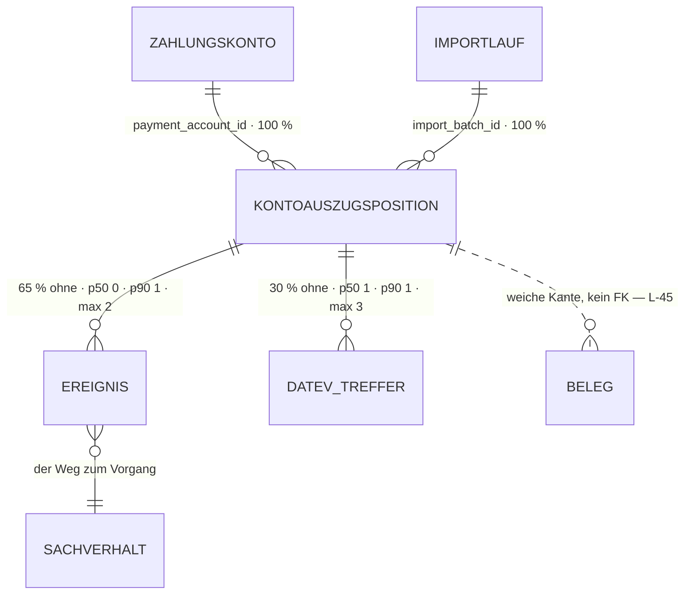

# Kontoauszugsposition · `bank transaction` — Entitätsprofil

| | |
|---|---|
| Status | analysiert |
| GLOSSARY | `### Bank transaction` — englisch `bank transaction`, Ordner `entities/bank-transaction/`. **Der deutsche Name ist strittig**, siehe Befund B1 und Offene Frage 1 |
| Tabelle | `ludwig.client_bank_transactions`. Keine Subtypen |
| Typen | `modules/bank-transactions/infrastructure/bank-transactions-queries.ts` — `BankTransactionAssignmentRow`, `AssignedCaseLink`, `ProposalIndicatorStatus`; `ui/PurposeDisplay.tsx` — `PurposeParts`, `derivePurposeParts()`; `ui/kontoauszug-presentation.tsx` — `ZState`, `deriveZ()`, `restOf()`, `DATEV_MATCHED_STAGES`, `datevMatchTitle()`; `ui/case-indicators.ts` — `CaseIndicator`, `deriveCaseIndicators()`. **Nichts davon liegt in `src/ludwig/`** — der Spiegel kennt die Entität nicht (Befund B2) |
| Status-Achsen | `ereignis` (über `resolveEventBookingState`, am Ereignis hinter der Zeile) · `buchung` (Vorschlags-Indikator) · `klaerung` (Zähler am Sachverhalt). **Für `match_stage` gibt es keine Achse** (Befund B3) |
| Wichtigkeit | **hoch** — Quelle der Schicht „Quelle" im Datenmodell (Quelle → Ereignis → Sachverhalt → Buchung) |
| Datenstand | Staging über den Pooler, 2026-09-05, **1281 Positionen** (lokal 0). Alle Zahlen unten aus diesem Bestand, nur `SELECT`, keine Kundendaten im Dokument |
| Rückfrage | gestellt am 2026-09-05 (Abschnitt „Offene Fragen"), **unbeantwortet** — die Defaults gelten, der Zuschnitt steht |
| Analyse von / am | Claude, 2026-09-05 (Skill `entitaet-analysieren`) |

## Was sie ist

Eine Kontoauszugsposition ist **eine Zeile eines Kontoauszugs**: eine
Zahlungsbewegung auf einem Zahlungskonto, importiert aus CSV oder der
Qonto-API. Sie ist der äußerste Rand der Kette Quelle → Ereignis →
Sachverhalt → Buchung — an ihr entscheidet sich, ob Geld, das geflossen ist,
zu einem Vorgang gehört, den jemand bucht. Die Sachbearbeiterin fragt sie
zwei Dinge: *was war das, und ist es schon einem Sachverhalt zugeordnet?*

Anzeige-Regeln aus dem GLOSSARY und den Spaltenkommentaren, wörtlich:

- „Vorzeichen: **positiv = Eingang, negativ = Ausgang**" — die Richtung ist
  keine eigene Spalte, sie steckt im Betrag.
- „Originalwährung wird gespeichert, EUR-Wert in `amount_eur` (Phase 1: nur
  EUR)." — heute sind beide identisch, `fx_rate` ist immer 1.
- „**Vergangene Zeiträume sind immutable** — Re-Imports werden auf
  max(`posting_date`) cutoff-gefiltert." Es gibt an dieser Entität nichts zu
  bearbeiten: **kein einziger Datenpunkt ist änderbar = Nutzer.**
- Aus dem Spaltenkommentar zu `match_stage`: „denormalisierter Match-Zustand.
  Matched: `beleg|exact|pair|near|alias|split|residual|manual`. Offen:
  `unclear_multi|unclear_none|beyond_bookings|no_account`. NULL = Matcher nie
  gelaufen. **`manual` überlebt Re-Runs**, alles andere wird jeder Lauf neu
  berechnet."
- Aus `kontoauszug-presentation.tsx`, wörtlich und tragend: „Buchungs-Zustand
  des **EREIGNISSES** hinter dieser Zeile — nicht der Status des
  Sachverhalts. Eine Zeile im Auszug ist genau eine Zahlung; steht derselbe
  Sachverhalt zweimal im Auszug, kann eine gebucht und die andere offen sein."
- Aus `PurposeDisplay.tsx`: „Der Rohwert einer SEPA-Zahlung ist für Menschen
  unlesbar … Angezeigt wird deshalb nur der SVWZ-Freitext; die Referenzen
  kommen als Chips bzw. hinter ein Info-Icon. Der unveränderte Originalblock
  bleibt über dasselbe Icon erreichbar."

## Schaubild



Der Sachverhalt hängt **nicht** direkt an der Position: der Weg führt über das
Ereignis (`client_accounting_event.bank_transaction_id`). Die Kante zum
**Beleg** (dem Kontoauszugs-PDF) ist weich und hat keinen FK — zwei Wege,
79 Umsätze an 6 Belegen, Owner-Entscheid steht aus (Befund L-45).

## Datenpunkte

Kumulativ. Füllgrade aus 1281 Zeilen Staging.

| Datenpunkt | Quelle | Rolle | Füllgrad | heute in | änderbar | Rang | ab Form | Beleg |
|---|---|---|---|---|---|---|---|---|
| Verwendungszweck (`purpose`) | Spalte + `abgeleitet: derivePurposeParts()` — SVWZ-Freitext, Referenzen hinter dem (i), Original erreichbar | Identität | 100 % (p50 35 · **p90 84** · max 447) | `PurposeDisplay` in **sechs** Dateien und drei Modulen: `KontoauszugView`, `BankTransactionAssignmentTable`, `BankTransactionDetail`, `CsvImportWizard`, `EventStack`, `SachverhaltScreen` | nie | 1 | XS | die einzige Komponente der Familie, die schon geteilt ist |
| Betrag (`amount` · `currency`) | Spalte; **Vorzeichen ist die Richtung** | Maß | 100 % (Ausgang 650 · Eingang 631) | Kontoauszugs-Spalte „Betrag", Zuordnungstabelle, Drawer | nie | 2 | XS | Füllgrad · Spaltenkommentar · in jeder Ansicht |
| Gegenpartei (`counterparty_name`) | Spalte | Identität | 97 % (p50 20 · p90 31 · max 53) | Kontoauszugs-Spalte „Gegenpartei", Drawer | nie | 3 | S | Füllgrad · eigene Spalte |
| Buchungsdatum (`posting_date`) | Spalte | Zeit | 100 % | Kontoauszugs-Spalte „Datum" (heute **ohne Jahr**: `fmtDateShort` → „15.04.") | nie | 4 | S | Füllgrad · Sortierachse der Liste |
| DATEV-Haken | `abgeleitet: datevMatchTitle(match_stage)` über `DATEV_MATCHED_STAGES` | Zustand | `match_stage` 100 %; **71 % matched** (`exact` 605 · `beleg` 263 · `split` 24 · `near` 7 · `pair` 4), 29 % offen (`beyond_bookings` 328 · `unclear_none` 38 · `unclear_multi` 12) | `DatevMatchTick` vor der Gegenpartei | nie | 5 | S | die Verteilung: an drei von vier Zeilen sagt der Haken etwas |
| Sachverhalts-Zuordnung | `abgeleitet: deriveZ()` — Z0 keiner · Z1 einer, erklärt · Z2 mehrere, erklärt · Z3 Rest offen; dazu `restOf()` | Zustand | 65 % **ohne** Ereignis, also ohne Sachverhalt | „offen"-Pille, `ka-casestack` mit Links, Rest-/Voll-Marke im Zweck | nie | 6 | S | eigene Spalte + eigene Ableitung · trägt die Worklist |
| Buchungs-Zustand des Ereignisses | `abgeleitet: resolveEventBookingState()`, Achse `ereignis` | Zustand | nur wo ein Ereignis hängt (35 %) | Kontoauszugs-Spalte „Buchung", `EventStatusInline`, `CaseIndicatorBadges` | nie | 7 | S | eigene Spalte · Achse in der Registry · der Kommentar oben nennt sie ausdrücklich |
| Offene Klärungen | `abgeleitet: deriveCaseIndicators()`, Achse `klaerung` — hängt am **Sachverhalt**, nicht an der Zeile | Zustand | wo ein Sachverhalt hängt | `ClarBubble` + Badge „Klärung" | nie | 8 | S | eigene Ableitung · eigene Zelle |
| Valuta (`value_date`) | Spalte | Zeit | 97 % | Drawer („Valuta") | nie | 9 | M | Füllgrad · im Drawer, nicht in der Zeile |
| IBAN der Gegenpartei (`counterparty_iban`) | Spalte | Identität | 85 % | Drawer, mono | nie | 10 | M | Füllgrad · die belastbare Identität, wenn der Name variiert |
| SEPA-Referenzen (EREF · MREF · KREF · CRED · PURP) | `abgeleitet: derivePurposeParts()` aus `raw_payload.parsed_sepa_tags`, mit Nachparsen als Rückfall | Kontext | nur SEPA-Zeilen | `PurposeDisplay` (Chips im Block, (i) inline) | nie | 11 | M | die Suche der Liste sucht ausdrücklich über „EREF/KREF" |
| BIC (`counterparty_bic`) | Spalte | Kontext | 85 % | Drawer, mono | nie | 12 | L | Füllgrad · nur im Drawer |
| Match-Stufe im Klartext (`match_stage`) | Spalte, **ohne Registry-Achse** (Befund B3) | Zustand | 100 % | Drawer („DATEV-Historie"), sonst nur als Haken | nie | 13 | L | zwölf Werte, vier davon „offen" — der Haken sagt nur ja/nein |
| Quelle (`source`) | Spalte | Kontext | 100 % (`csv` 1202 · `manual` 79) | Drawer („Quelle", in Versalien — A2-Verstoß) | nie | 14 | L | Füllgrad · im Drawer |
| Import-Lauf (`import_batch_id` · `imported_at`) | Spalten → `client_bank_import_batches` | Verantwortung | 100 % · 100 % | Drawer („Import-Batch", „Import-Zeitpunkt") | nie | 15 | L | Füllgrad · GLOSSARY „Import run" |
| Betrag in EUR (`amount_eur` · `fx_rate`) | Spalten | Maß | 100 %, heute **identisch** zu `amount`, `fx_rate` immer 1 | Drawer, nur wenn abweichend | nie | 16 | L | GLOSSARY („Phase 1: nur EUR") · der Drawer zeigt ihn schon bedingt |
| Externe ID (`external_transaction_id`) | Spalte | Kontext | **6 %** | Drawer, bedingt | nie | 17 | L | Füllgrad · nur Qonto-Zeilen haben eine |
| Rohdaten (`raw_payload`) | Spalte | Kontext | 100 % | nirgends | nie | 18 | L | Spaltenkommentar „für Audit/Debugging" → `RawRecord` (0051), nicht als Feldliste |

**Ausgelassen (Technik):** `id`, `tenant_id`, `client_id`, `created_at`,
`updated_at`. Dazu `source_file_storage_path` — **0 % gefüllt** und ein
Speicherpfad, kein Fachwert.

**Freitext-Grenzen:** `purpose` in XS/S auf **eine Zeile mit Ellipse**
(p90 84, max 447 — der Rohblock einer SEPA-Zahlung sprengt jede Zelle), in M
und L voll mit Referenz-Chips. `counterparty_name` braucht keine Grenze
(p90 31).

**Kein einziger Punkt ist änderbar = Nutzer.** Die Tabelle ist immutable
(GLOSSARY). Das entscheidet §7 Nr. 4: **es gibt keinen Editor.**

## Relationen

| Relation | Richtung | Kardinalität | Rolle | ab Form | Darstellung | Beleg |
|---|---|---|---|---|---|---|
| Ereignisse (`client_accounting_event.bank_transaction_id`) | Kind | **65 % ohne** · p50 0 · p90 1 · max 2 | Zustand | S | **Zähler + Zustand**: Z0–Z3 in S, die Liste der zugeordneten Sachverhalte mit Teilbeträgen in M/L (heute `ka-casestack` und die Unterzeilen) | Staging · `deriveZ()` |
| Sachverhalt (über das Ereignis) | Kind des Kindes | wo ein Ereignis hängt | Identität | S | **Inline** als `CaseCell` → Profil `accounting-case`; im Rest-Fall (Z3) mehrere mit je eigenem Teilbetrag | `ka-caselink` in `KontoauszugView` · `AssignedCaseLink` |
| DATEV-Treffer (`client_bank_transaction_matches`) | Kind | 30 % ohne · p50 1 · p90 1 · **max 3** | Zustand | S | **Haken** in S (`DatevMatchTick`), **Liste** in L | Staging |
| Zahlungskonto (`client_payment_accounts`) | Eltern | 100 % | Kontext | — | die Route `[year]/banks/[accountId]` setzt es; als **Inline** nur, wenn die Zeile kontoübergreifend steht — genau der Fall in der Zuordnungs-Worklist | Route · `BankTransactionAssignmentTable` gruppiert nach Konto |
| Import-Lauf (`client_bank_import_batches`) | Eltern | 100 % | Verantwortung | L | **Inline** (Bezeichnung + Zeitpunkt) | Drawer · GLOSSARY „Import run" |
| Beleg — das Kontoauszugs-PDF | ohne FK, **weiche Kante** | 79 Umsätze an 6 Belegen (Befund L-45) | Kontext | — | **gar nicht**, solange der Owner-Entscheid zu L-45 aussteht. Keine Form zeigt „dieser Umsatz stammt aus Beleg X" | L-45 · `entitaeten/source-document.md` B11 |
| Historie (`platform_audit_events`) | ohne FK | `resource_kind` kennt die Position nicht — nur `payment_account` und den Import-Lauf | Verantwortung | — | **gar nicht** an der Zeile; die Herkunft steht über den Import-Lauf | Vokabular `resourceKind` in der App: `journal_entry`, `accounting_case` |

## Heutige Darstellung

| Komponente | Form | zeigt | fehlt | zu viel |
|---|---|---|---|---|
| `PurposeDisplay.tsx` (174 Z.) | XS | Rang 1 vollständig: SVWZ-Freitext, Referenz-Chips, Original hinter dem (i); zwei Varianten (Block, Inline) | — | die einzige Komponente der Familie, die schon richtig geschnitten ist — sie wandert fast unverändert |
| `KontoauszugView.tsx` (631 Z.) | L (Liste) mit Zeile · Filterzeile · Suche · Aufklapper | Ränge 1–8 in sieben Spalten; Unterzeilen je zugeordnetem Sachverhalt mit Teilbetrag und Summe | **der laufende Saldo** — die Kontoübersicht zeigt ihn je Konto, der Auszug selbst nicht (Befund B4). Das Jahr im Datum (`fmtDateShort` → „15.04.") | die Zeile, die Liste, die Filter, die Suche und der Aufklapper in einer Datei |
| `kontoauszug-presentation.tsx` (174 Z.) | Helfer | `deriveZ`, `restOf`, `DATEV_MATCHED_STAGES`, `datevMatchTitle`, `DatevMatchTick`, `ClarBubble`, `EventStatusInline`, `KV`, vier Formatierer | — | vier Formatierer (`fmtEUR`, `fmtDateShort`, `fmtDateFull`, `fmtTimestamp`), die v3 als `Amount` und `Time` schon hat |
| `CaseIndicatorBadges.tsx` + `case-indicators.ts` (34 + 69 Z.) | XS | Vorschlag offen · Gebucht · Klärung mit Zähler, Farben aus der Registry | — | — |
| `BankTransactionAssignmentTable.tsx` (658 Z.) | L (Worklist) | dieselbe Zeile ohne Zuordnungsspalten, dafür Auswahl, Sammelaktion, zwei Formulare (neuer Sachverhalt / bestehender) | — | die Auswahl einer Bankzeile **und** die Auswahl eines Sachverhalts (`<select>`, → Backlog 0084) in einer Datei |
| `BankTransactionDetail.tsx` (150 Z.) | M (Fakten) | Ränge 1–3, 9–17 als `KV`-Paare in vier Blöcken (Zahlung · Gegenpartei · Zuordnung · Herkunft) | — | nur im Drawer benutzt — es gibt **keine** Seite für eine einzelne Position |
| `ui/drawers/BankTransactionDrawer.tsx` (96 Z.) | L (Drawer) | lädt selbst, trägt Lade-, Fehler- und Leerfall; aufgerufen aus `KontoauszugView`, `Schritt3Einzel`, `Schritt4` | — | Klasse A nach F113 — der v3-Drawer (0052) ist Klasse B und bekommt die Daten als Props |

## Listen

| Liste | Job | Grundgesamtheit | Sortierung | Spalten (Ränge) | Filter | Massenaktion | Leerfall | Umfang p50 · p90 | Beleg |
|---|---|---|---|---|---|---|---|---|---|
| `BankTransactionList` — der Kontoauszug | Wenn **ein Kontoauszug importiert ist**, will **die Sachbearbeiterin** **sehen, welche Zahlungen noch keinem Vorgang gehören**, damit **kein Geldfluss ungebucht durchrutscht** | ein Zahlungskonto, ein Zeitraum | Buchungsdatum | 1–8 | Zeitraum, Zustand, Volltext (Zweck, Gegenpartei, Betrag, Sachverhalt, EREF/KREF) | keine | „Konto ohne Bewegung" (Erfolg) ≠ „keine Treffer" (Filter) | je Konto und Jahr **p50 36 · p90 251 · max 952** | Staging · `KontoauszugView` · Route `[year]/banks/[accountId]` |
| `BankTransactionWorklist` — offene Zahlungen | Wenn **Zahlungen ohne Vorgang liegen**, will **die Sachbearbeiterin** **sie in einem Zug einem neuen oder bestehenden Sachverhalt zuordnen**, damit **sie nicht Konto für Konto durchgeht** | **kontoübergreifend**, nur ohne Sachverhalt (Z0) | nach Konto gruppiert, dann Datum | 1–5 + Konto | Konto | **ja** — Auswahl → neuer Sachverhalt oder bestehendem zuordnen | „nichts offen" (Erfolg, mit Zahl) | 65 % aller Positionen haben kein Ereignis | `BankTransactionAssignmentTable` · Reiter „Offene Zahlungen" der Sachverhaltsseite |

Die beiden unterscheiden sich in **drei** der fünf Merkmale aus §8 —
Grundgesamtheit (ein Konto / kontoübergreifend), Massenaktion (keine / ja) und
Spaltensatz (mit Zuordnung / ohne, dafür mit Konto). Das sind **zwei**
Komponenten, nicht eine mit Prop.

`banks/offen` ist keine Route mehr: die Worklist lebt im Reiter „Offene
Zahlungen" der Sachverhaltsseite; ein Seitenmodul dafür existiert nicht
(geprüft 2026-09-05, nur ein Kommentar verweist auf die alte URL).

Beide Routen haben **kein Seitenprofil** unter `docs/seiten/` — deshalb steht
hier nur Job und Tabellenschnitt, und beide Listen gehen auf den Backlog.

## Formen

| Form | Größe | Empfehlung | Grund (§7 Nr.) | zeigt (Ränge) | Relationen | setzt auf | ersetzt |
|---|---|---|---|---|---|---|---|
| `BankTransactionPurpose` | XS | **ja** | 1 — existiert als `PurposeDisplay` in sechs Dateien und drei Modulen | 1 (+ 11 als Chips bzw. hinter dem (i)) | — | `LongText`, `Badge`, `Popover`, `Kbd` | `PurposeDisplay.tsx` samt `purpose.css` |
| `BankTransactionRow` | S | **ja** | 1 — existiert in zwei Listen; 6 — zwei Listen-Jobs | 1–8 | Sachverhalt als `CaseCell` inline, Ereignisse als Z-Zustand | `Row`, `BankTransactionPurpose`, `CaseCell`, `Amount`, `Time`, `StatusBadge`, `Badge` | die Zeile aus `KontoauszugView` (Z. 229–320) und aus `BankTransactionAssignmentTable`, dazu `CaseIndicatorBadges`, `DatevMatchTick`, `ClarBubble`, `EventStatusInline` |
| `BankTransactionFacts` | M | **ja** | 1 — existiert als `BankTransactionDetail` (150 Z.); und 0052 verlangt, dass der Drawer die Kernfakten aus **derselben** Komponente zeigt wie eine spätere Detailansicht | 1–3, 9–18 in vier Blöcken | Sachverhalte mit Teilbetrag als Liste, Import-Lauf als Inline | `FieldList`, `Amount`, `Time`, `MonoCell`, `RawRecord` | `BankTransactionDetail.tsx` samt `KV` aus `kontoauszug-presentation.tsx` |
| `BankTransactionDrawer` | L | **ja** | 5 — aus drei Ansichten heraus nachgeschlagen: `KontoauszugView`, `Schritt3Einzel`, `Schritt4` der Stapelabnahme. Es gibt **keine** Seite für eine einzelne Position — der Drawer *ist* die Antwort | Kopf (1–2), Fakten aus `BankTransactionFacts`, Zuordnung, ein Ausgang in den Sachverhalt | wie `BankTransactionFacts` | `Drawer`, `BankTransactionFacts`, `CaseCell` | `ui/drawers/BankTransactionDrawer.tsx` (Klasse A → Klasse B, F113) |
| `BankTransactionView` | L | **verworfen** | kein §7-Grund: es gibt keine Route für eine einzelne Position, `BankTransactionDetail` wird ausschließlich vom Drawer benutzt (geprüft 2026-09-05), und die Position hat nichts, was einen eigenen Bildschirm füllt — 18 Datenpunkte, keine Unterlisten außer zwei Sachverhalten. Der Auszug ist der Bildschirm, der Drawer die Vertiefung | | | | |
| `BankTransactionList` + `BankTransactionColumns` | L | **Backlog (0085)** | 6 — der Kontoauszug als Liste. Es fehlt das **Seitenprofil** für `[clientSlug]/[year]/banks/[accountId]`; ohne es sind Kopfzeile, Zeitraum, Saldo und die beiden Leerfälle geraten | wie `BankTransactionRow` | — | `DataTable`, `BankTransactionRow`, `EmptyState`, `Pagination` | `KontoauszugView.tsx` (631 Z.) |
| `BankTransactionWorklist` | L | **Backlog (0086)** | 6 — eigener Job, drei Unterschiede zur Auszugsliste. Sie hängt zusätzlich am `CasePicker` (0084) und an einer Sammelaktion, die es serverseitig heute nur je Zeile gibt (L-16) | 1–5 + Konto | Zahlungskonto als Gruppenkopf | `DataTable`, `BankTransactionRow`, `SelectionBar`, `CasePicker` | `BankTransactionAssignmentTable.tsx` (658 Z.) |
| `BankTransactionCell` | XS | **verworfen** | die Position wird nirgends aus einer fremden Zeile heraus genannt: `client_bank_transactions` ist FK-**Ziel** nur des Ereignisses, und dort steht sie als volle Zeile, nicht als Kurzform. Was in fremden Listen genannt wird, ist der **Zweck** — und das ist `BankTransactionPurpose` | | | | |
| `BankTransactionPicker` | S | **verworfen** | niemand wählt eine Bankzeile aus einer Liste aus. In der Worklist wird sie **angehakt** (Mehrfachauswahl in der Tabelle), und gewählt wird auf der anderen Seite: der Sachverhalt (→ 0084 `CasePicker`) | | | | |
| `BankTransactionEditor` | XL | **verworfen** | §7 Nr. 4 trifft nicht zu: **kein einziger Datenpunkt ist änderbar = Nutzer.** Vergangene Zeiträume sind immutable (GLOSSARY), die einzige menschliche Handlung an einer Position ist ihre **Zuordnung** — und die schreibt am Ereignis, nicht an dieser Zeile | | | | |

**Bau-Reihenfolge:** `BankTransactionPurpose` → `BankTransactionRow` →
`BankTransactionFacts` → `BankTransactionDrawer`. Das sind **vier** — unter
der Grenze aus §9, weil die zwei Listen auf ihre Seitenprofile warten.

## Zuschnitt

| Form / Liste | Marke | Grund | Backlog |
|---|---|---|---|
| `BankTransactionPurpose` | **jetzt** | trägt Zeile, Fakten und Drawer — und sechs Stellen in der App, drei davon außerhalb dieses Moduls | — |
| `BankTransactionRow` | **jetzt** | trägt beide Listen; existiert heute zweimal | — |
| `BankTransactionFacts` | **jetzt** | trägt den Drawer (0052 Zone 3); existiert als `BankTransactionDetail` | — |
| `BankTransactionDrawer` | **jetzt** | aus drei Ansichten nachgeschlagen; nach 0052, Klasse B | — |
| `BankTransactionList` | Backlog | Seitenprofil für `[year]/banks/[accountId]` fehlt | `docs/backlog/0085-bank-transaction-list.md` |
| `BankTransactionWorklist` | Backlog | hängt an 0084 `CasePicker` und an der fehlenden Sammelaktion (L-16) | `docs/backlog/0086-bank-transaction-worklist.md` |
| `BankTransactionView` · `BankTransactionCell` · `BankTransactionPicker` · `BankTransactionEditor` | verworfen | je ein Satz in der Formen-Tabelle | — |

## Befunde für `ludwig/app`

- **B1 (L-55)** — **Zwei deutsche Namen für dieselbe Tabelle, beide im
  GLOSSARY.** Der Eintrag `### Bank transaction` sagt „German:
  `Banktransaktion`"; die Schichten-Tabelle desselben Dokuments sagt
  „Kontoauszugsposition". Die App sagt im UI durchgehend „Kontoauszug"
  (`KontoauszugView`, `kontoauszug-presentation`, Route `banks`). Das ist der
  Befund L-20 in seiner zweiten Ausprägung: erst **ein** Wort wählen, dann
  den Eintrag nachziehen. Dieses Profil folgt der Schichten-Tabelle und dem
  UI und schreibt **Kontoauszugsposition** — der englische Name
  `bank transaction` ist unstrittig und trägt den Code.
- **B2 (L-56)** — **Der Spiegel kennt die Entität nicht.** In
  `src/ludwig/modules/` gibt es kein `bank-transactions/domain/`; alle Typen
  und alle vier Ableitungen (`derivePurposeParts`, `deriveZ`/`restOf`,
  `datevMatchTitle`, `deriveCaseIndicators`) liegen in `ui/` bzw.
  `infrastructure/` der App. Eine v3-Komponente kann sich dort nicht
  bedienen. Gebraucht wird ein Domain-Modul mit `BankTransactionRow`-Typ und
  den vier Ableitungen — sie sind rein und hängen an keiner DB.
- **B3 (L-57)** — **`match_stage` hat keine Registry-Achse**, obwohl es zwölf
  Werte mit Bedeutung sind (acht „gematcht", vier „offen"). Heute wird daraus
  ein grüner Haken und ein handgeschriebener Titel (`datevMatchTitle`), und
  die vier offenen Klassen — `beyond_bookings` allein 328 von 1281 — sind
  **unsichtbar**. Die Achse `mirror_match` ist eine andere: sie gehört
  `client_datev_mirror_entries.match_state`.
- **B4 (L-58)** — **Der Kontoauszug zeigt keinen Saldo.** Die Kontoübersicht
  (`[year]/banks`) führt je Konto eine Saldo-Spalte, der Auszug selbst
  (`KontoauszugView`) keinen laufenden Saldo — wer gegen den Bankauszug
  abgleicht, hat keine Anschlusszahl. Schwesterbefund zu L-30 (der
  DATEV-Auszug kennt ebenfalls keinen Saldo).
- **B5** — Zwei Kleinigkeiten fürs Protokoll, ohne eigene Nummer: das Datum
  der Zeile wird **ohne Jahr** gezeigt (`fmtDateShort` → „15.04."), was in
  einer über Jahresgrenzen gefilterten Liste mehrdeutig ist; und der Drawer
  schreibt die Quelle in Versalien (`row.source.toUpperCase()` → „CSV"),
  was A2 verbietet. Beides fällt beim Umzug auf `Time` und `Badge` von selbst.

## Offene Fragen

1. **Wie heißt sie auf Deutsch?** *Ohne Antwort: **Kontoauszugsposition** —
   die Schichten-Tabelle des GLOSSARY und das UI der App sagen das, der
   Einzeleintrag sagt „Banktransaktion". Der Code heißt `bank transaction`,
   daran ändert die Antwort nichts; die Labels ändert sie.*
2. **Fehlende Anwendungsfälle** — Listen, Ansichten oder Auswahl-Dialoge für
   die Kontoauszugsposition, die es heute in der App noch nicht gibt? *Ohne
   Antwort: es bleibt bei den beiden Listen und den vier Formen oben.*
3. **Gehört der laufende Saldo in die Zeile oder unter die Liste?** *Ohne
   Antwort: unter die Liste (Kartenfuß: Anfangs- und Endsaldo des Zeitraums)
   und **nicht** in die Zeile — eine Saldo-Spalte je Zeile stimmt nur bei
   genau einer Sortierung, und die Liste ist filterbar. Entschieden wird das
   in 0085, nicht hier.*

## Prüfung

Gehört dem zweiten Agenten. Er prüft zuerst alle Zeilen mit Beleg `Annahme`,
dann die Ränge gegen „Heutige Darstellung", dann die Formen gegen §7.

| Zeile / Form | Einwand | Ergebnis | Geprüft von / am |
|---|---|---|---|
| … | … | bestätigt · geändert auf … · offen | … |

## Weiter

Prüfprompt (neue Sitzung, anderer Agent):

```
Prüfe das Entitätsprofil docs/entitaeten/bank-transaction.md nach Skill entitaet-analysieren
§5–§9. Es hat keine Zeile mit Beleg „Annahme" — prüf deshalb jede Zeile, deren Beleg „heute
in" heißt, gegen die genannte Datei, und jeden Füllgrad gegen die Staging-Datenbank (nur
SELECT). Dann die Ränge: deck die Punkte ab Rang k ab — erkennt eine Sachbearbeiterin die
Zahlung noch? Prüf besonders die Entscheidung, den Verwendungszweck auf Rang 1 zu setzen und
die Gegenpartei erst auf Rang 3: liest ein Mensch wirklich erst den Zweck? Dann die vier
verworfenen Formen — View, Cell, Picker, Editor: trägt jede Ablehnung, oder gibt es doch eine
Stelle in der App, die eine davon baut? Die Ablehnung des Editors hängt an „kein Punkt ist
änderbar = Nutzer"; widerleg das mit einer Server Action, die an client_bank_transactions
schreibt, oder bestätige es. Dann die Listen: sind es wirklich zwei Komponenten, oder
unterscheiden sich Auszug und Worklist in weniger als zwei der fünf Merkmale aus §8? Trag
jeden Einwand in „Prüfung" ein, ändere die Tabellen, wo du sicher bist, und setze den Status
auf „geprüft". Kundendaten bleiben in der Datenbank; nur SELECT.
```

Startprompt (neue Sitzung, nach Status `geprüft`):

```
Für die Entität Kontoauszugsposition (`bank transaction`) liegt das geprüfte Profil unter
docs/entitaeten/bank-transaction.md. Schreibe mit Skill spec-schreiben je Form eine Spec, in
dieser Reihenfolge — nur die Formen mit Marke „jetzt" aus dem Abschnitt Zuschnitt:
BankTransactionPurpose, BankTransactionRow, BankTransactionFacts, BankTransactionDrawer. Was
dort „Backlog" trägt (0085, 0086) oder „verworfen", bleibt liegen. Jede Spec verlinkt das
Profil als Quelle und nimmt Datenpunkte, Ränge, Relationen und „ersetzt" von dort, nicht aus
dem Chat.

Drei Regeln tragen die ganze Familie:
1. Der Zustand an der Zeile ist der des EREIGNISSES, nicht der des Sachverhalts — eine Zeile
   im Auszug ist genau eine Zahlung. Steht derselbe Sachverhalt zweimal im Auszug, kann eine
   Zahlung gebucht und die andere offen sein. Der Klärungszähler dagegen hängt am
   Sachverhalt und ist bewusst fallweit.
2. Der Verwendungszweck wird nie roh gerendert: SVWZ-Freitext sichtbar, Referenzen als Chips
   bzw. hinter dem (i), der Originalblock über dasselbe (i) erreichbar. Das ist Rang 1 und
   der Grund, warum BankTransactionPurpose zuerst gebaut wird.
3. Die Richtung steckt im Vorzeichen des Betrags, nicht in einer eigenen Spalte — und ein
   Vorzeichen bekommt keine Farbe (V3/V7).

Der Spiegel kennt diese Entität nicht (Befund L-56): es gibt kein
src/ludwig/modules/bank-transactions/. Das Set definiert die vier Ableitungen
(derivePurposeParts, deriveZ/restOf, datevMatchTitle, deriveCaseIndicators) strukturell
deckungsgleich lokal und meldet sie als Befund — es erfindet keine Begriffe. Ebenso hat
match_stage keine Registry-Achse (L-57): bis sie da ist, bleibt es beim Haken plus Titel,
und keine Komponente baut eine lokale Label-Map dafür (R1).

BankTransactionFacts entsteht vor dem Drawer, weil der Drawer (0052 Zone 3) dieselbe
Fakten-Komponente zeigen muss. Neue Dateien in src/ui/v3/entities/bank-transaction/; CSS als
eigener Abschnitt am Ende von src/styles/v3.css, nicht einsortiert; Klassenpräfix vorher
greppen. Hier arbeiten mehrere Sitzungen im selben Arbeitsbaum — nur eigene Dateien stagen,
kein git add -A.

pnpm typecheck und pnpm build müssen grün sein, jede Story im Browser angesehen
(pnpm storybook, Port 6107). Abgenommen wird von einem anderen Agenten gegen die Spec; wer
baut, nimmt nicht selbst ab. Setze am Ende den Status des Profils auf „in Specs" und trage
die Spec-Nummern ein.
```
