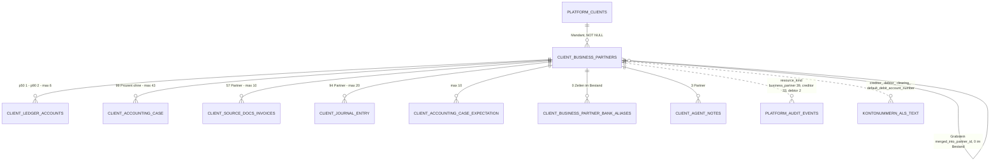

# Geschäftspartner · `business partner` — Entitätsprofil

| | |
|---|---|
| Status | **in Specs** (2026-09-09) — 0139–0143 geschrieben; geprüft am 2026-09-09 vom zweiten Agenten |
| GLOSSARY | `### Business partner (Geschäftspartner)` — englisch `business partner`, Ordner `entities/business-partner/` |
| Tabelle | `ludwig.client_business_partners` (46 Spalten) + `ludwig.client_business_partner_bank_aliases` (Lookup-Schlüssel, kein Subtyp) |
| Typen | `src/ludwig/modules/business-partners/domain/business-partner.ts` — `BusinessPartnerListItem`, `BusinessPartnerDetail`, `PartnerAccountRef`, `PartnerPersonalAccount`, `BusinessPartnerFilter`, `VAT_PROFILE`, `TYPICAL_NATURE`, `PARTNER_NATURE_LABEL`, `ONBOARDING_STATE`, `PARTNER_ROLE_LABEL`; `domain/tabs.ts` — `PARTNER_TABS`, `PARTNER_TAB_LABEL` |
| Status-Achsen | `STATUS_REGISTRY.partner` (`onboarding_state`: draft · proposed · confirmed). Die Rolle ist **keine** Achse — sie steht am Personenkonto (`accounting_role`), und `vat_profile` / `typical_nature` sind Eigenschaften, keine Zustände |
| Wichtigkeit | **hoch** — F76 hat `client_creditors` + `client_debtors` in dieser Tabelle zusammengeführt; sie ist FK-Ziel von Sachverhalt, Konto, Rechnung, Buchungssatz und Erwartung |
| Datenstand | **Staging-Bestand, 2026-09-08 — 14.890 Geschäftspartner über 6 Mandanten**, davon 3.319 mit mindestens einer Buchung auf einem ihrer Konten und **189** mit Beleg, Sachverhalt oder Buchungssatz — derselbe Bestand, aus dem die Profile `account`, `accounting-case` und `source-document` rechnen (915 Sachverhalte, 41.570 Konten, 384 Belege). Nur `SELECT`; keine Kundendaten im Dokument, alle Beispielwerte erfunden (Musterfirma GmbH) |
| Wo die Zahlen herkommen | **Korrigiert bei der Prüfung.** Staging ist der Pooler aus `apps/web/.env.staging.local` — `aws-1-eu-central-1.pooler.supabase.com:5432`. `127.0.0.1:55452` ist der **lokale** Docker-Container (`supabase_db_buchassi_local`), der Endpunkt aus `.env.local`; er trägt 2 Partner. Der Kopf nannte beide vertauscht, und der Prüfprompt hat den zweiten Agenten deshalb auf die leere Datenbank geschickt |
| Nachgerechnet am | **2026-09-09** (zweiter Agent). Der Bestand lebt: **14.950** Partner, benutzte Kohorte **197** statt 189, 994 Sachverhalte statt 915. Ränge und Größenordnungen ändert die Drift nirgends; wo eine einzelne Zahl unter „Datenpunkte" abweicht, steht sie dort korrigiert |
| Rückfrage | gestellt am 2026-09-08, **unbeantwortet** — die Defaults der drei offenen Fragen gelten |
| Analyse von / am | Claude, 2026-09-08 (Skill `entitaet-analysieren`) |

## Was sie ist

Der Geschäftspartner ist die **zeitlose Identität** einer Firma oder Person, mit
der ein Mandant Geschäfte macht: Name, Anschrift, USt-IdNr., Bank und das, was
Ludwig über ihr Verhalten gelernt hat. Die Sachbearbeiterin schlägt ihn nach,
wenn sie wissen will, wer hinter einer Kontonummer steht, und sie wählt ihn aus,
wenn ein Beleg oder eine Zahlung noch keinen Gegenpart hat. Anlegen und Pflegen
tut sie ihn heute nicht — der DATEV-Import und der Agent schreiben ihn, die
Kanzlei bestätigt.

Anzeige-Regeln aus den GLOSSARY-Notes, wörtlich:

- „Ein Partner kann Lieferant UND Kunde zugleich sein: die Rolle steht nicht am
  Partner, sondern an seinen Personenkonten (`client_ledger_accounts.accounting_role`)."
- „Ein Partner ohne Personenkonto ist ein erlaubter Normalfall (F76 R3)."
- „Keine Historisierung (R4, last-write-wins wie DATEV-Addressees; ‚wie hieß der
  2024‘ beantworten die Snapshots an der Buchungszeile)."
- „Keine DATEV-GUID am Partner — `datev_addressee_id` ist Sync-Attribut am
  Personenkonto (R5); n GUIDs pro Partner sind der gewollte Normalfall."
- „Nachträgliches Zusammenführen über den Grabstein `merged_into_partner_id`
  (Leser folgen dem Zeiger; kein Merge-Journal)." Spaltenkommentar dazu:
  „Grabsteine erscheinen in keiner Auswahl-Liste mehr."
- Gegenpartei-Seite (F92): „Drei Felder, drei Fragen — `counterparty_side`
  (welche Seite), `counterparty_partner_id` (wer), `fy_personal_account_id`
  (wogegen); zusammenlegen geht nicht, weil Diverse-Konten viele Identitäten
  teilen und eine Identität auch ganz ohne Konto existieren darf (F76 R3)."
- Abrechner (Auslagen): „Sie ist Geschäftspartner **ohne eigene Kontonummer**:
  ihr Kreditor *ist* das Auslagenkonto." Und: „Kein Partner-Typ ‚Mitarbeiter‘ —
  die Eigenschaft steckt in `clearing_account_type` des verknüpften Kontos."

Daraus folgt die wichtigste Anzeige-Regel dieser Familie: **die Zeile zeigt,
welche Konten der Partner trägt, und leer ist ein Wert, kein Fehlen.** Kein
Kreditorkonto heißt „ist kein Kreditor", nicht „Nummer unbekannt".

## Schaubild



Eltern oben, Kinder unten, FK-lose Verweise gestrichelt. Zwei Besonderheiten:

1. **Die Kontonummern stehen doppelt.** Die Wahrheit ist die Kante
   `client_ledger_accounts.business_partner_id` (Konto → Partner, je Jahr und
   Rolle höchstens eines); `creditor_account_number`, `debtor_account_number`
   und `clearing_account_numbers` sind der **jahrgangsinvariante Cache** am
   Partner, als Text ohne FK — weil der Kontenplan je Wirtschaftsjahr vorliegt
   (F64) und der Partner zeitlos ist. Im Bestand weichen sie nirgends ab.
2. **Die Historie liegt unter drei `resource_kind`-Werten** — `business_partner`
   (39), `creditor` (33), `debtor` (2). Seit F76 ist das eine Entität; das
   Audit-Vokabular ist der Zusammenführung nicht gefolgt (Befund L-226).

## Datenpunkte

Von 46 Spalten tragen **16 Ränge** (17 Zeilen wurden es vor der Prüfung — Rang 2
führt seither Kreditor- und Debitorkonto als **einen** Punkt, siehe dort). Der
Rest steht unter der Tabelle: er ist entweder Technik, DATEV-Sync-Attribut oder
im Bestand leer.

| Datenpunkt | Quelle | Rolle | Füllgrad | heute in | änderbar | Rang | ab Form | Beleg |
|---|---|---|---|---|---|---|---|---|
| Name (`legalName`) | Spalte | Identität | 100 % | Partnerliste (Link), Partnerkopf, `MasterDataTab`, `CreditorCombobox`, Karte „Gegenpartei"; als Fremdfeld in `case-columns`, `account-columns`, `CaseFacts` | Server (Import) · Agent | 1 | XS | Füllgrad · heute in sechs Formen |
| **Personenkonto** (`creditorAccount` \| `debtorAccount`, je `PartnerAccountRef`: **nur** Nummer und `isInternal` — die Rolle steht im Schlüssel, unter dem er hängt, nicht im Satz) | Spalten `creditor_account_number` / `debtor_account_number`, Wahrheit über `client_ledger_accounts` | Identität | **99,9 % tragen genau eines** (14.936 von 14.950). Einzeln gelesen: Debitor 87 %, Kreditor 13 % — **beide zusammen nur 27 Partner (0,18 %)**, keines nur 14 (davon 12 Abrechner) | Partnerliste (zwei Spalten), Partnerkopf (`AccountChip`: Rolle + Nummer + „intern"), `CreditorCombobox` (führt die Optionszeile) | Nutzer (beim Bestätigen) · Server | 2 | XS | **Prüfung 2026-09-09 — ein Datenpunkt, nicht zwei.** Der Partner trägt praktisch nie beide Nummern; getrennt gezählt fällt der Kreditor auf 13 % und stolperte über die 20-%-Regel aus §5, obwohl das Feld „Nummer, die dieser Partner trägt" fast lückenlos gefüllt ist. Es ist zugleich der schärfste Unterscheider im Satz: **6.288 verschiedene Debitornummern unter 6.396 Geschwistern**. Der Kopf rendert es schon so (`AccountChip`), die Freitextsuche sucht darüber („Name, USt-ID oder Kontonummer…"), und `CreditorCombobox` zeigt die Nummer **vor** dem Namen. `isInternal` gehört dazu: `PartnerAccountRef` verlangt wörtlich, dass der 89xxxx-Platzhalter **gezeigt** wird (F101 E2) — 15 solche Konten im Bestand |
| Reifegrad (`onboardingState`) | Spalte, Achse `partner` | Zustand | 100 % (`confirmed` 14.912 · `proposed` 36 · `draft` 2) | Partnerliste (`StatusBadge axis="partner"`, Spaltenkopf heißt dort „Onboarding"), Partnerkopf, Reiter „Alle / Bestätigt / Vorgeschlagen / Entwurf" | Nutzer (`proposed → confirmed`, einbahnig) | 3 | XS | Registry-Achse · V7 · nachgerechnet 2026-09-09 |
| Buchungen (`usageBookingCount`) | `abgeleitet: Σ über die Personenkonten` — steht im Spiegel | Maß | **77 % haben 0** · p90 6 · max 4.298 | Partnerliste (Spalte), `MasterDataTab`, `AccountsTab` je Konto | Server | 4 | S | Staging · Präzedenz `account.md` Nachtrag: die Buchungsspalte beantwortet „Karteileiche oder nicht", nicht der Status |
| Letzte Buchung (`lastBookingDate`) | `abgeleitet: max über die Personenkonten` — steht im Spiegel | Zeit | wie oben | Partnerliste, `MasterDataTab`, `AccountsTab` | Server | 5 | S | heute in der Liste |
| Ort (`city`) | Spalte | Identität | 77 % gesamt · 47 % der benutzten (`postalCode` 74 % / 45 %) | Partnerliste (Spalte „Stadt"), `MasterDataTab` | Server | 6 | S | **Beleg bei der Prüfung korrigiert.** Der GLOSSARY-Satz („Debtor") nennt als Match-Schlüssel `ust_ids`, `tax_ids`, `normalized_name + postal_code` — die **Postleitzahl**, nicht den Ort; er belegt den Ort also nicht. Gemessen beim größten Mandanten (6.396 Partner): 149 Zeilen teilen sich einen `legalName`, die PLZ löst davon 63 auf (42 %), der Ort 52 (35 %). Der Ort bleibt auf Rang 6, weil ihn die Liste zeigt und er lesbarer ist als eine PLZ — aber er **entscheidet den Zweifelsfall nicht**, und darum steht er hinter der Kontonummer, nicht davor |
| Kurzname (`shortName`) | Spalte | Identität | 98 %, davon 50 % ungleich `legalName`. **Länge 3–15 Zeichen, 53 % liegen exakt bei 15** — das ist die DATEV-Grenze, nicht eine eigene Bezeichnung | Partnerliste (zweite Zeile), Partnerkopf (`· …`), `MasterDataTab` | Server | 7 | S (als zweite Zeile) | Füllgrad · offene Frage 1. **Prüfung:** „genau 15 Zeichen" stimmte nicht. Über die Hälfte der Werte steht am Anschlag, `legalName` ist im p90 21 Zeichen lang — die 50 % „ungleich" sind zum guten Teil derselbe Name, abgeschnitten. Als Unterscheider trägt der Kurzname deshalb nichts: beim größten Mandanten kollidieren 143 Zeilen über den Kurznamen, über den `legalName` 149. Er gehört nicht vor die Kontonummer |
| USt-IdNr. (`ustIds`) | Spalte (`text[]`, wo gesetzt **immer genau eine** — 111 Zeilen, alle Kardinalität 1) | Identität | 0,7 % gesamt · 9 % der benutzten | Partnerliste (Spalte), `MasterDataTab`, Freitextsuche | Server | 8 | M | Füllgrad unter 20 % → nicht vor M (§5). Trotzdem Rang 8: Stufe 3 der Resolver-Kaskade |
| Umsatzsteuer-Profil (`vatProfile`) | Spalte | Erklärung | 11 % ≠ `unknown` gesamt · **75 %** der benutzten (`domestic_standard` 1.506 · `eu_acquisition_or_service` 69 · `tax_exempt` 28 · Rest < 20) | Partnerliste (**roher Enum-Wert**, L-223), `MasterDataTab` | Server (Import/Workflows) | 9 | M | Füllgrad unter den benutzten · GLOSSARY „A hint for proposals and verification, never a rule" |
| Typische Lieferung (`typicalNature`) | Spalte | Erklärung | 14 % ≠ `unknown` gesamt · **79 %** der benutzten (`service` 1.290 · `goods` 474 · `expense` 164 · `mixed` 59 · `investment` 48) | Partnerliste (Spalte „Art", `PARTNER_NATURE_LABEL`), `MasterDataTab` | Server (Import/Workflows) | 10 | M | Füllgrad. **Prüfung: L-222 ist erledigt** — die App führt seit 2026-09-08 alle sechs Werte samt Wort (`Dienstleistung`, `Anlagegut`) und einen Regressionstest gegen den DB-CHECK; nur der Spiegel unter `src/ludwig/` hängt hinterher. Und „änderbar = Agent (einziger Update-Pfad)" stimmt nicht mehr: das Agenten-Tool `update_business_partner` ist mit F127 gestrichen |
| Verrechnungskonten (`clearingAccounts`) | Spalte `clearing_account_numbers` (`text[]`) | Identität | **12 Partner** (0,08 %) — und **alle zwölf tragen weder Kreditor- noch Debitornummer** | Partnerliste (Spalte „Verrechnung") | Server · Onboarding (`link_expense_partner` schreibt das **Konto**, nicht diese Spalte) | 11 | M | GLOSSARY „Abrechner": ohne eigene Kontonummer, ihr Kreditor *ist* das Auslagenkonto. Leer heißt „kein Abrechner", nicht „unbekannt". **Prüfung: die Ausschließlichkeit ist gemessen** — damit trägt der Default der offenen Frage 2 (der Abrechner erkennt sich an der allein gefüllten Verrechnungsspalte) einen Beleg statt einer Vermutung |
| Beschreibung (`businessDescription`) | Spalte | Erklärung | 17 % gesamt · **80 %** der benutzten; p50 31 · p90 46 · max 101 Zeichen | `MasterDataTab` | Server (Import/Workflows) | 12 | M | Füllgrad unter den benutzten. Kürzen unnötig: max 101 Zeichen passen in eine Zeile der `FieldList` |
| Anschrift (`addressLine1`, `postalCode`, `countryCode`) | Spalten | Kontext | 73 % / 74 % / **4 %** | `MasterDataTab` (Box „Adresse") | Server | 13 | L | Füllgrad. `countryCode` bleibt in der Box, wird aber nie eigene Zeile. Die **PLZ** ist zusätzlich Teil des Match-Schlüssels (GLOSSARY „Debtor") — sie steht hier, weil sie den Zweifelsfall nur in 42 % der Namensdubletten löst, also keine Zeile in S verdient |
| Kontakt (`contactEmail`, `contactPhone`) | Spalten | Kontext | 14 % / 39 % | heute **nirgends** — weder Liste noch `MasterDataTab` noch `TechnicalTab` | Server | 14 | L | Füllgrad. Zwei Spalten mit Wert, die keine Form zeigt |
| Herkunft (`source`) | Spalte | Verantwortung | 100 % (`onboarding_import` 14.912 · `manual` 38) | `MasterDataTab`, `TechnicalTab` — je **roh, ohne Wort** | Server | 15 | L | GLOSSARY „Creditor source": zusammen mit `onboardingState` die Vertrauenskette. Kein Label (L-225) |
| Grabstein (`mergedIntoPartnerId`) | Spalte, Selbst-FK | Zustand | **0 im Bestand** | heute nur in SQL (`searchCreditors` filtert ihn weg) | Nutzer (manuelles Zusammenführen) | 16 | L | Spaltenkommentar: „Leser folgen dem Zeiger; Grabsteine erscheinen in keiner Auswahl-Liste mehr" — er ändert das Verhalten der Auswahl, nicht nur die Anzeige |

**Ausgelassen — Technik** (7 Spalten, nie zeigen): `id`, `tenant_id`,
`client_id`, `created_at`, `updated_at`, `normalized_name` (Match-Schlüssel,
kein Anzeigewert), `profiling_metadata_json` (0 % gefüllt).

**Ausgelassen — DATEV-Sync-Attribute** (5 Spalten): `datev_last_modified_at`
(50 %), `datev_is_business_partner_active` (50 %), `datev_term_of_payment_id`
(1 %, unaufgelöste DATEV-Id), `datev_payment_medium` (0,6 %),
`datev_bank_accounts` (0,9 %). Sie gehören in den Reiter „Technik", nicht in
eine Form der Familie — Präzedenz `TechnicalTab`.

**Ausgelassen — im Bestand leer oder tot** (13 Spalten, je mit Zahl):
`typical_tax_keys` 0 · `observed_vat_ids` 0 · `payment_terms` 0 ·
`sepa_mandate_reference` 0 · `typical_currency` 0 ·
`typical_payment_term_days` 0 · `default_debit_account_number` 0 ·
`vat_notes` 0 · `datev_is_various_account` 0 · `website_url` 6 ·
`observed_vendor_names` 36 · `tax_ids` 44 · `typical_payment_type` 84 (alle
`bank_transfer`). Sie kommen zurück, sobald ein Wert darin steht — die Präzedenz
für dieses Vorgehen ist L-201. Zwei davon sind mehr als leer:
`default_debit_account_number` ist das typische Gegenkonto, das jeder
Buchungsvorschlag bräuchte, und `datev_is_various_account` ist das Kennzeichen,
über das `searchCreditors` die Diverse-Konten aus der Auswahl hält — im
Bestand trägt es **keine** Zeile (Befund L-227).

**Text-Grenzen:** `legalName` p50 15 · p90 21 · max 50 im ganzen Bestand,
p50 17 · p90 33 · max 49 unter den benutzten → in der Zelle bei **36 Zeichen**
hinten kürzen; das ist `MAX_COUNTERPARTY` aus `SourceDocument.tsx`, dort schon
über `clipEnd()` auf denselben Namen angewandt, und es deckt den p90 (33) ab.
In Zeile und Kopf ungekürzt. `shortName` ist auf 15 Zeichen begrenzt und wird nie
gekürzt — er **ist** schon die Kürzung (Länge 3–15, 53 % am Anschlag).
`businessDescription` max 101 → ungekürzt.

**Eine Ableitung fehlt und wird gebraucht:** ein `partnerDisplayName()`, das
zwischen `shortName` und `legalName` entscheidet. Heute rendert jede Stelle
`legalName` roh und hängt `shortName` dekorativ daran; die Präzedenz für die
Ableitung sind `documentCounterparty()` (L-36) und `caseDisplayTitle()` (L-52).
Befund **L-224** — bei der Prüfung bestätigt: `partnerDisplayName` kommt in
`apps/web/src` **nirgends** vor. Die Prüfung schärft zugleich, was die Ableitung
zu entscheiden hat: `shortName` ist keine zweite Bezeichnung, sondern derselbe
Name auf 15 Zeichen gestutzt (53 % stehen exakt am Anschlag). Sie darf ihn
darum nicht als „besseren" Namen vorziehen — sie wählt ihn nur, wo Platz für
mehr nicht da ist. Offene Frage 1, deren Default („`legalName` führt") damit
belegt ist statt vermutet.

## Relationen

| Relation | Richtung | Kardinalität | Rolle | ab Form | Darstellung | Beleg |
|---|---|---|---|---|---|---|
| Personenkonten (`client_ledger_accounts.business_partner_id`) | Kind | **0 % ohne** (genau **2** Partner von 14.950 haben keins — der GLOSSARY-Normalfall F76 R3 ist im Bestand die Ausnahme) · p50 1 · p90 2 · max 6; 6.515 Partner über zwei Wirtschaftsjahre, 8.433 über eines; **3 Partner** mit Nummernwechsel zwischen den Jahren; 15 Konten sind Ludwig-Platzhalter (`system_allocated`, 89xxxx, `local_only`) | Identität | Nummer ab XS, Liste ab L | Nummer im Kopf (Rang 2, Rolle + Nummer + „intern") · Liste je Wirtschaftsjahr eingebettet als `accountColumns()` → Profil `account` | Staging · `AccountsTab` |
| Sachverhalte (`counterparty_partner_id`) | Kind | 99 % ohne; unter den 168 mit: p50 1 · p90 4 · max 43 (nur 10 Partner über 5). Von 915 Sachverhalten tragen **429 (47 %)** einen Partner | Kontext | Zähler ab S, Liste ab L | Zähler (S) · Liste (L) eingebettet als `CaseRow` → Profil `accounting-case` | Staging · `CasesTab` · `CaseRow` trägt den Fall im `@when` bereits („the tab of a business partner") |
| Rechnungen (`client_source_docs_invoices.business_partner_id`) | Kind | 100 % ohne; unter den 57 mit: p50 1 · p90 3 · max 10 | Kontext | L | Liste eingebettet als `SourceDocumentList` → Profil `source-document` | Staging · `InvoicesTab` |
| Buchungssätze (`client_journal_entry.business_partner_id`) | Kind | 99 % ohne; unter den 94 mit: p50 1 · p90 3 · max 20 | Maß | L | Liste eingebettet als `JournalEntryCompact` → Profil `journal-entry` | Staging · Karte „Letzte Buchungen Kreditor" |
| Erwartungen (`expected_counterparty_partner_id`) | Kind | 100 % ohne · max 10 | Kontext | L | Zähler → Profil `accounting-case` | Staging |
| Bank-/Namens-Aliase (`client_business_partner_bank_aliases`) | Kind | **0 Zeilen im Bestand**; Wertebereich `alias_kind` = `iban` \| `name`, unique je Mandant | Kontext | L | Liste im Reiter „Technik" | Schema · GLOSSARY (Stufe 4 der Resolver-Kaskade) |
| Agenten-Notizen (`client_agent_notes.business_partner_id`) | Kind | **3 Partner** (42 Notizen gesamt, 3 mit Partner) — bei der Analyse noch 0 | Erklärung | L | jüngstes → wartet auf L-27 (Notizstrang) | Staging 2026-09-09 |
| Grabstein (`merged_into_partner_id`) | Selbst-FK | 0 im Bestand | Zustand | L | Inline auf den Zielpartner; in jeder Auswahl weggefiltert | Spaltenkommentar |
| Mandant (`platform_clients`) | Eltern | 1:1, NOT NULL | Kontext | nur außerhalb des Mandanten-Kontexts | Inline | Schema |
| Historie (`platform_audit_events`) | ohne FK, **drei** `resource_kind`-Werte | `business_partner` 39 (`account_assigned` 16, `linked_to_clearing_account` 16, `created_by_agent` 7), `creditor` 33, `debtor` 2 | Verantwortung | L | Liste → Profil des Audit-Ereignisses; **erst nach L-226**, sonst zeigt sie die halbe Geschichte | Staging |

Die drei eingebetteten Listen (Konten, Belege, Sachverhalte) gehören **nicht**
dieser Familie: sie zeigen die Zeile ihrer eigenen Entität. Das Profil legt nur
fest, welche — und dass alle drei erst ab L erscheinen.

## Heutige Darstellung

Aus `ui-repraesentationen.md` §1 („Geschäftspartner", 7 Komponenten) und den je
Komponente gelesenen Feldern:

| Komponente | Ort | Form | zeigt | fehlt | zu viel |
|---|---|---|---|---|---|
| Partnerliste `[year]/partners/page.tsx` | `app/(app)/…` | Liste (rohe `<table className="tbl">`, kein `DataTable`) | Name (Link) + Kurzname als Subzeile · Kreditorkonto · Debitorkonto · Verrechnung · Stadt · Reifegrad (`StatusBadge`) · USt-Profil · Art · USt-IDs · Buchungen · Letzte Buchung · Aktion „Akzeptieren". Dazu Stat-Leiste, Status-Reiter, Freitext + Rollenfilter, `EmptyState`, `Pagination` | Sortierung (L-15) | USt-Profil und USt-IDs in derselben Zeile — beide unter 10 % gefüllt, beide vor der Buchungsspalte |
| Partnerkopf `[partnerId]/page.tsx` | `app/(app)/…` | Kopf | `legalName` (h2) · `shortName` · `StatusBadge axis="partner"` · `AccountChip` für Kreditor und Debitor (Rolle + Nummer + „intern") | Verrechnungskonten (der Abrechner hat im Kopf keine Nummer) | — |
| `MasterDataTab` | `modules/business-partners/ui/tabs` | Detail (5 Key-Value-Boxen) | 21 Felder: Identität · Adresse · USt-Profil · Typisches Verhalten · Aktivität | `contactEmail`, `contactPhone` (14 % / 39 % gefüllt, nirgends gezeigt) | 8 Felder mit 0 % Füllgrad (`typicalTaxKeys`, `vatNotes`, `typicalCurrency`, `typicalPaymentTermDays`, `websiteUrl`, `taxIds` …) |
| `TechnicalTab` | dito | Detail (Entwicklung) | Ids, `normalizedName`, `defaultDebitAccountNumber`, `profilingMetadata`, kompletter Rohsatz als JSON | — | — (das ist der Ort dafür; Präzedenz `RawRecord`) |
| `AccountsTab` · `InvoicesTab` · `CasesTab` | dito | Listen fremder Entitäten | Konten (`PartnerPersonalAccount`), Belege, Sachverhalte | — | — |
| `CreditorCombobox` | `modules/business-partners/ui` | Auswahl | `accountNumber` (mono) + `legalName`; gewählt: „70032 · Musterfirma GmbH". Server-Suche über `searchCreditors` (limit 8, nur Kreditoren mit Konto, ohne Grabsteine, ohne Diverse, sortiert nach Buchungszahl) | Reifegrad, Ort, USt-IdNr. — bei zwei gleichnamigen Partnern entscheidet nichts | — |
| `AcceptCreditorForm` | dito | Editor in der Zeile | **nur** `datevAccountNumber` (4–20 Ziffern, 89xxxx vorbelegt) | — | — |
| `CreditorProposalsReview` | dito | Liste | Vorschlags-**Kandidaten** (`vendor_name`, `vendor_ust_id`, `invoice_count`, Zeitraum, `match_signal`) — nicht Partner | — | — (andere Entität, siehe §Listen) |
| Karte „Gegenpartei" `Schritt3Einzel.tsx` | `modules/stapelabnahme/ui` | Karte | Name · Kontonummer · frühere Buchungen · USt-IdNr. · übliches Gegenkonto + Steuerschlüssel · letzte Buchungen · „Öffnen" | — | — die reichhaltigste Partner-Darstellung der App, und die einzige, die den Partner **im Kontext einer anderen Entität** zeigt |
| `GlanceCard` (Beleg) | `modules/invoices/ui` | Inline | Label wechselt „Kreditor" / „Kunde" je `docDirection`, Wert `partnerLegalName ?? vendorName` , Link nur bei `inbound` | — | — |
| ~~Dashboard „Top Kreditoren"~~ | `[year]/page.tsx` | **gibt es nicht mehr** | — | — | **Bei der Prüfung gestrichen.** Die Kachel ist mit Owner-Entscheid (`seitenprofil-mandantenjahr.md`) von der Seite genommen worden; der Kopfkommentar der Seite begründet es: „57 Kreditoren tragen überhaupt einen Beleg, der größte zehn, der Median einen. Über eine so flache Verteilung sortiert eine ‚Top'-Liste Rauschen." Die Abfrage lebt als `topVendors` in `dashboard-queries.ts` weiter und wird **nirgends gerendert** (toter Code — Befund L-228) |
| als Fremdfeld in **v3**: `CaseFacts` („Geschäftspartner", `partnerHref` + `counterpartyPartnerId`), `account-columns` (Spalte „Geschäftspartner", `businessPartnerName` seit L-89 + `partnerHref`), `Account.tsx`/`AccountFacts` (Zeile „Geschäftspartner", `partnerName`, ohne Link) | `src/ui/v3/entities/**` | Cell / Spalte | den Namen, teils verlinkt über einen Callback des Aufrufers | eine gemeinsame Zelle — alle drei setzen Name, Link und Kürzung selbst | — |
| **kein** Partner, obwohl „Gegenpart" darüber steht: `case-columns` + `CaseCard` (`counterpartyName`, und `CaseListItem` trägt **keine** Partner-Id — L-69), `source-document-columns` (`counterparty` = `partnerLegalName ?? vendorName`, oft nur ein Lieferantentext), `BankTransactionCell` (`counterpartyName` vom Kontoauszug — `client_bank_transactions` hat `counterparty_name/iban/bic` und **keine** `business_partner_id`) | `src/ui/v3/entities/**` | Inline | einen Namensstring der **eigenen** Entität | — | **Prüfung:** die Analyse zählte diese drei zu den „sechs v3-Stellen" des Partners. Sie sind es nicht — eine `BusinessPartnerCell` kann sie nicht ersetzen, weil dort kein Partner steht |

**Der nachgewiesene Bedarf ist damit:** eine Zelle (**dreimal** von Hand in v3,
nicht sechsmal), eine Zeile (die Liste), eine Auswahl (`CreditorCombobox`), ein
Faktenblock (`MasterDataTab`) und ein Kopf. Der Kopf bekommt keine eigene Form:
`EntityHeader` ist das Muster dafür, und View wie Drawer setzen ihn mit
`BusinessPartnerFacts` zusammen — Präzedenz `source-document.md`.

Was **nicht** nachgewiesen ist: ein Editor — kein einziges Stammfeld ist über
die Oberfläche änderbar. **Die Prüfung macht das noch härter:** es gibt in der
App überhaupt keinen Schreibpfad auf die Stammdaten mehr. `updateBusinessPartner`
existiert als Server Action nicht, und das Agenten-Tool `update_business_partner`
ist mit F127 gestrichen — ein Test hält fest, dass es nicht mehr registriert ist.
Geschrieben wird der Partner nur vom Onboarding-Import und vom Workflows-Dienst.

## Listen

| Liste | Job | Grundgesamtheit | Sortierung | Spalten (Ränge) | Filter | Massenaktion | Leerfall | Umfang p50 · p90 | Beleg |
|---|---|---|---|---|---|---|---|---|---|
| `BusinessPartnerList` „Stammsätze" | Wenn eine Sachbearbeiterin eine Kontonummer oder einen Namen vor sich hat und nicht weiß, wer dahintersteht, will sie **alle Geschäftspartner des Mandanten durchsuchen**, damit sie den vorhandenen Stammsatz findet, statt einen zweiten anzulegen. | alle Partner des Mandanten **ohne Grabsteine** | Name aufsteigend (`PARTNER_SORT_KEYS`; sortiert heute nicht, L-15) | 1–7 (Name + Kurzname, Kreditorkonto, Debitorkonto, Reifegrad, Buchungen, Letzte Buchung, Ort) + Verrechnung, wo gefüllt — Rang 2 steht als **zwei** Spalten, weil die Tabelle den Platz hat und die Rolle so ohne eigenes Wort dasteht | Reifegrad (Reiter) · Rolle (`PARTNER_ROLE_LABEL`) · Freitext über Name, USt-IdNr. **und Kontonummer** | keine — „Alle bestätigen" gehört der Vorschlagsliste | **zwei** (Forderung aus §8, heute steht dort **ein** `EmptyState` „Keine Geschäftspartner gefunden"): „Für diesen Mandanten sind keine Geschäftspartner importiert" (Bestand, Verweis aufs Onboarding) ≠ „Keine Treffer" (Filter) | **563 · 6.363** je Mandant (544 / 552 / 555 / 572 / 6.331 / 6.396) | Staging 2026-09-09 · `partners/page.tsx` |

**Eine Liste, nicht drei.** Die Reiter „Alle / Bestätigt / Vorgeschlagen /
Entwurf" unterscheiden sich nur in der Grundgesamtheit und in nichts sonst —
nach §8 also ein `filter`-Prop, keine zweite Komponente. Die
**Vorschlagsliste** (`CreditorProposalsReview`) ist keine Ausprägung dieser
Liste, sondern eine **andere Entität**: sie zeigt Kandidaten aus dem
Belegbestand (`vendor_name`, `invoice_count`, `match_signal`), die noch kein
Partner sind. Sie braucht ein eigenes Profil, wenn sie drankommt.

**Eine Liste, und „Top Kreditoren" ist auch keine zweite.** Die Analyse führte
sie als zweite Zeile und schob sie auf den Backlog. Die Prüfung streicht sie
ganz: die Kachel **existiert nicht mehr**. Sie ist mit Owner-Entscheid
(`seitenprofil-mandantenjahr.md`) von der Mandantenjahr-Seite genommen worden,
und zwar mit genau dem Argument, das eine Spec sonst hätte finden müssen — über
57 Kreditoren mit Beleg, Median einer, sortiert eine „Top"-Liste Rauschen.
Übrig ist eine Abfrage ohne Leser (`topVendors`, L-228). Damit ist die Antwort
auf die Prüffrage nicht „keine eigene Ausprägung, aber später" sondern
**verworfen**; die Abgrenzung in `0128` beschreibt sie noch als existierende
Kachel und gehört dort nachgezogen.

**Mechanik nach §8:** p50 563, p90 6.363 Zeilen je Mandant, weit über 200 →
`Pagination`, **Serverfilter** und Serversuche (steht heute schon so), Lade- und
Fehlerfall in der Spec. Kein virtuelles Scrollen.

Die Liste hat eine eigene Route (`/clients/:slug/:year/partners`) und braucht
deshalb zusätzlich ein Seitenprofil unter `docs/seiten/`; hier stehen nur Job
und Tabellenschnitt.

## Formen

| Form | Größe | Empfehlung | Grund (§7 Nr.) | zeigt (Ränge) | Relationen | setzt auf | ersetzt |
|---|---|---|---|---|---|---|---|
| `BusinessPartnerCell` | XS | **ja** | 3 — FK-Ziel von Sachverhalt, Konto, Rechnung, Buchungssatz und Erwartung. **Der Grund trägt, die Zählung nicht:** es sind **drei** v3-Stellen, die wirklich einen Partner nennen (`CaseFacts` mit `partnerHref` + `counterpartyPartnerId`, `account-columns` mit `businessPartnerName`/`partnerHref`, `Account.tsx` mit `partnerName`), jede mit eigener Kürzung und eigenem Link-Callback. `case-columns` ist der Grenzfall: es verlinkt den Gegenpart, hat aber keine Partner-Id (L-69) | 1, dazu 2 als Nummer im `HoverCard` | — | `Link`, `TextButton`, `Icons.partner`, `clipEnd()` + `MAX_COUNTERPARTY` aus `SourceDocument.tsx` | die drei handgeschriebenen Namensausgaben; `GlanceCard`-Partnerzeile. **Nicht** `CaseCard`, `source-document-columns` und `BankTransactionCell` — dort steht ein Gegenpart-String ohne Partner dahinter |
| `businessPartnerColumns()` | S | **ja** | 1 — die Zeile existiert als rohe `<table>` in `partners/page.tsx` mit 11–12 Spalten. Wie bei Konto und Beleg wird daraus eine **Spaltendefinition**, keine Zeilen-Komponente: `DataTable` (0057) baut sie, und zwei Zeilenbauten für eine Entität verbietet R17 | 1–7 (Rang 2 als zwei Spalten) | Personenkonten als Nummern, Verrechnungskonten als Nummern | `ColumnDef[]` über `MonoCell`, `StatusBadge axis="partner"`, `Time`, `LongText`, `BusinessPartnerCell` | die Tabelle in `partners/page.tsx` samt lokalem `AccountCell` und `ClearingCell` |
| `BusinessPartnerPicker` | S | **ja** | 3 — der Nutzer wählt ihn aus: `CreditorCombobox` im Ask-Dialog „Lieferant des Einzelsachverhalts" (`OffenePostenWorklist`), und laut GLOSSARY löst der Picker für Ausgangsrechnungen den Empfänger gegen die Partner auf | 1–2, Ort als Unterscheider; „ohne konkreten Lieferanten" als gültige Wahl (Diverse-Pool) | — | `Combobox` (`@when` nennt „partner" wörtlich), `MonoCell`; Präzedenz `AccountField` (0013) und `CasePicker` | `CreditorCombobox` |
| `BusinessPartnerFacts` | M | **ja** | 1 — `MasterDataTab` existiert mit 21 Feldern in 5 Boxen; und es ist der Teil, den Drawer und View teilen (0052, Präzedenz `SourceDocumentFacts`, `AccountFacts`, `CaseFacts`) | 1–15 | Personenkonten als Zähler + Nummern | `FieldList bare`, `StatusBadge`, `Time`, `Amount`, `BusinessPartnerCell` (Grabstein-Ziel) | `MasterDataTab` und den Kopfblock der Partnerseite |
| `BusinessPartnerDrawer` | L | **ja** | 5 — **vier** fremde Ansichten verweisen auf ihn, ohne ihn zeigen zu können: `CaseFacts` (`partnerHref`), `case-columns` (`counterpartyHref`), `account-columns` (`partnerHref`) und `GlanceCard` am Beleg. Alle vier verlassen heute die Seite. Er beantwortet die eine Frage, die dort aufkam („wer ist das, und wird da gebucht?"), und bietet den Weg in den View. **Prüfung:** die fünfte Stelle war die Dashboard-Kachel — die gibt es nicht mehr; §7 Nr. 5 verlangt eine, vier reichen | wie `BusinessPartnerFacts` + Personenkonten | Personenkonten als Liste; Belege, Sachverhalte, Buchungssätze **nicht** (offene Frage 3) | `Drawer`, `BusinessPartnerFacts`, `accountColumns()` | den Sprung auf `/partners/[partnerId]` aus vier Stellen |
| `BusinessPartnerView` | L | Backlog | 1 — die Seite mit fünf Reitern existiert. Eigene Route → nach `docs/backlog/README.md` Schritt 0b erst ein Seitenprofil; ob es bei fünf Reitern bleibt, entscheidet das Profil, nicht die Spec | | | | `partners/[partnerId]/page.tsx` |
| `BusinessPartnerList` | L | Backlog | 6 — ein Listen-Job, von einem Screen belegt. Eigene Route → Seitenprofil. Die Spalten entstehen vorher; die Seite baut sie mit `DataTable` zusammen | | | | die Tabelle samt Stat-Leiste, Reitern und Filterform |
| `BusinessPartnerCard` | M | Backlog | 1 + 2 — die Karte „Gegenpartei" in Schritt 3 der Stapelabnahme zeigt den Partner im Kontext eines Sachverhalts. Vertagt, weil ihre stärksten Felder (übliches Gegenkonto, üblicher Steuerschlüssel, letzte Buchungen, „erstmals gebucht") **Ableitungen sind, die es im Spiegel nicht gibt** — `default_debit_account_number` und `typical_tax_keys` sind zu 0 % gefüllt | | | | Karte „Gegenpartei" in `Schritt3Einzel.tsx` |
| `BusinessPartnerEditor` | XL | **verworfen** | kein Punkt mit änderbar = Nutzer — und **überhaupt kein Schreibpfad**: eine Server Action `updateBusinessPartner` gibt es in `apps/web/src` nicht, das Agenten-Tool `update_business_partner` ist mit F127 gestrichen (Test: „ist nicht mehr registriert"). Geschrieben wird der Partner nur vom Onboarding-Import und vom Workflows-Dienst. `AcceptCreditorForm` ändert die DATEV-Kontonummer, und die gehört dem **Personenkonto**, nicht dem Partner. Der einzige Nutzer-Eingriff am Partner ist `proposed → confirmed` — eine Handlung, kein Feld, und sie trägt `ActionButton` mit `ask` (0121) | | | | |

Bau-Reihenfolge: `BusinessPartnerCell` → `businessPartnerColumns()` →
`BusinessPartnerPicker` → `BusinessPartnerFacts` → `BusinessPartnerDrawer`.
Die Zelle trägt die Spalten und die Fakten, die Fakten tragen den Drawer.

**Warum der Drawer vor dem View entsteht:** §7 sagt, der Drawer folgt dem View,
weil er dessen Kern-Fakten aus derselben Komponente zeigt. Diese Komponente ist
`BusinessPartnerFacts` — und die steht vorher (Präzedenz 0052 `SourceDocumentFacts`,
0066/0068 `AccountFacts`/`AccountDrawer`). Der View wartet auf sein Seitenprofil,
der Drawer nicht.

**Warum keine `BusinessPartnerRow`:** Es gibt genau eine Partnerliste, und sie
hat 6.335 Zeilen im p90 — also `DataTable` mit Serverfilter. Eine zweite,
kurze Liste von Partnern gibt es nirgends (die Reiter am Partner zeigen
*andere* Entitäten). Damit hat die Zeile nur einen Rahmen, und der ist eine
Spaltendefinition. Präzedenz: `accountColumns()` (0062),
`sourceDocumentColumns()`, `bankTransactionColumns()`.

## Zuschnitt

| Form / Liste | Marke | Grund | Backlog |
|---|---|---|---|
| `BusinessPartnerCell` | **jetzt** | trägt Spalten, Fakten und Drawer; sechs v3-Stellen bauen sie heute nach | **0139** |
| `businessPartnerColumns()` | **jetzt** | die Liste existiert als rohe Tabelle und blockiert deren Ablösung | **0140** |
| `BusinessPartnerPicker` | **jetzt** | existiert als `CreditorCombobox`; die Ausgangsrechnung braucht ihn laut GLOSSARY ebenfalls | **0141** |
| `BusinessPartnerFacts` | **jetzt** | Zone 3 des Drawers und später des Views (0052); ersetzt `MasterDataTab` | **0142** |
| `BusinessPartnerDrawer` | **jetzt** | fünf fremde Ansichten verweisen auf den Partner, ohne ihn zeigen zu können | **0143** |
| `BusinessPartnerView` | Backlog | eigene Route mit fünf Reitern → erst Seitenprofil (`docs/backlog/README.md` Schritt 0b) | `docs/backlog/0127-business-partner-view.md` |
| `BusinessPartnerList` „Stammsätze" | Backlog | eigene Route → erst Seitenprofil; die Spalten entstehen vorher | `docs/backlog/0128-business-partner-list.md` |
| `BusinessPartnerCard` | Backlog | hängt an Ableitungen, die es nicht gibt (übliches Gegenkonto, üblicher Steuerschlüssel, letzte Buchungen) — und sie passt nicht mehr in die Fünf | `docs/backlog/0129-business-partner-card.md` |
| Dashboard „Top Kreditoren" | **verworfen** (bei der Prüfung von „Backlog" herabgesetzt) | Die Kachel ist mit Owner-Entscheid von der Mandantenjahr-Seite genommen; über 57 Kreditoren mit Beleg sortiert eine „Top"-Liste Rauschen. Kein Screen, kein Job — §9 lässt dafür keine Marke außer „verworfen". Geblieben ist die ungenutzte Abfrage `topVendors` (L-228) | Abgrenzung in `0128` beschreibt sie noch als bestehende Kachel → dort nachziehen |
| `BusinessPartnerEditor` | **verworfen** | kein Punkt mit änderbar = Nutzer; die einzige Nutzer-Eingabe der Familie schreibt das Personenkonto | — |
| Vorschlagsliste (`CreditorProposalsReview`) | **verworfen** (für dieses Profil) | zeigt Kandidaten aus dem Belegbestand, nicht Partner — eigene Entität, eigenes Profil, wenn sie drankommt | — |

Fünf Formen „jetzt" — die Obergrenze aus §9.

## Befunde für `ludwig/app`

Sechs standen nach der Analyse als Zeile in `docs/befunde-app.md` (L-222 …
L-227). Die Prüfung schließt einen und legt zwei nach (L-228, L-229).

- **L-222 · `TYPICAL_NATURE` kennt vier von sechs Werten — ERLEDIGT.**
  Die App hat das am 2026-09-08 behoben: `TYPICAL_NATURE` führt jetzt alle
  sechs Werte, `PARTNER_NATURE_LABEL` hat für `service` „Dienstleistung" und
  für `investment` „Anlagegut", und `__tests__/typical-nature.test.ts` liest die
  erlaubten Werte aus der Migration, damit die beiden Seiten nicht wieder
  auseinanderlaufen. **Offen bleibt nur der Spiegel:**
  `src/ludwig/modules/business-partners/domain/business-partner.ts` in diesem
  Repo führt weiterhin die alten vier Werte. Das ist kein App-Befund, sondern
  ein fälliger `scripts/sync-ludwig.sh` — und bis dahin eine Falle für jede
  Spec, die den Spiegel als Wahrheit liest.
- **L-223 · `VAT_PROFILE_LABEL` lebt privat in `MasterDataTab.tsx`.** Neun
  Werte, deutsche Wörter nirgends zentral — die Partnerliste zeigt deshalb den
  rohen Enum (`domestic_reverse_charge` statt eines Wortes). Rang 10, unter den
  benutzten Partnern zu 73 % gefüllt.
- **L-224 · Keine Anzeigename-Ableitung.** `shortName` ist zu 98 % gefüllt und
  in **49 %** ein anderer Text als `legalName` (DATEV-Kurzbezeichnung,
  15 Zeichen); trotzdem rendert jede Stelle `legalName` roh und hängt
  `shortName` dekorativ an. Präzedenz: `documentCounterparty()` (L-36),
  `caseDisplayTitle()` (L-52).
- **L-225 · GLOSSARY-Eintrag „Creditor source" ist der Zusammenführung nicht
  gefolgt.** Er heißt nach der Rolle statt nach der Entität, zählt **sechs** von
  acht CHECK-Werten auf (`opos_import` und `recurring_import` fehlen) — und
  eine Label-Map gibt es nicht; `MasterDataTab` und `TechnicalTab` zeigen die
  Herkunft roh.
- **L-226 · Die Historie eines Partners liegt unter drei `resource_kind`-Werten**
  (`business_partner` 39, `creditor` 33, `debtor` 2). Seit F76 ist das eine
  Entität; eine Verlaufsliste am Partner zeigt heute je nach Filter ein Drittel
  bis die Hälfte.
- **L-227 · `BusinessPartnerListItem` trägt weder `mergedIntoPartnerId` noch
  `datevIsVariousAccount`.** `searchCreditors` filtert beide in SQL — ein Picker,
  der den gespiegelten Typ benutzt, kann Grabsteine und Diverse-Konten nicht
  ausschließen, obwohl der Spaltenkommentar es verlangt („Grabsteine erscheinen
  in keiner Auswahl-Liste mehr"). Dazu: `datev_is_various_account` ist im
  Bestand in **0 von 14.950** Zeilen gesetzt (die Spalte ist NOT NULL, alle
  `false`), obwohl es die einzige Wahrheit für Sammelkonten sein soll — entweder
  ist der Import unvollständig oder das Kennzeichen ist tot. *Prüfung
  bestätigt:* `searchCreditors` filtert beide Spalten in SQL, und **beide
  Filter greifen heute ins Leere** (0 Grabsteine, 0 Sammelkonten).

**Bei der Prüfung neu (2026-09-09) — gehören ins Register:**

- **L-228 · „Top Kreditoren" ist eine Abfrage ohne Leser.** Die Kachel ist mit
  Owner-Entscheid (`seitenprofil-mandantenjahr.md`) von der Mandantenjahr-Seite
  genommen worden. `getClientDashboard` rechnet den Block aber weiter:
  `topVendors` in `modules/clients/infrastructure/dashboard-queries.ts` (Join
  über `client_source_docs_invoices` + `client_business_partners`, `limit 5`)
  wird in `apps/web/src` **nirgends** gelesen. Eine Aggregation je Seitenaufruf
  für niemanden.
- **L-229 · `update_business_partner` ist weg, und damit jeder Schreibpfad auf
  die Stammdaten.** Das Tool ist mit F127 gestrichen; eine Server Action
  `updateBusinessPartner` gibt es nicht. Für das Design-System ist das die
  Begründung gegen einen Editor (gut), fachlich ist es eine offene Frage: die
  Kanzlei kann einen falschen Ort, eine falsche USt-IdNr. oder ein falsches
  `vat_profile` heute durch keine Oberfläche und kein Tool korrigieren — nur
  über einen erneuten Import. Owner-Frage, kein Design-System-Thema.

## Offene Fragen

1. **Führt `legalName` oder `shortName` den Namen?** `shortName` ist zu 98 %
   gefüllt, in der Hälfte der Fälle ein echter DATEV-Kurzname, auf 15 Zeichen
   begrenzt — und `configuration/stammdaten` beschreibt ihn als Bestandteil des
   Buchungstexts. — **Beantwortet vom Owner am 2026-09-09: `legalName` führt.**
   `shortName` steht als zweite Zeile in Zeile, Kopf und Fakten (so wie heute).
   Die Ableitung heißt trotzdem `partnerDisplayName()` und gehört in die App
   (L-224); sie wählt den Kurznamen **nur, wo für mehr kein Platz ist**, nie als
   den besseren Namen. Die Prüfung stützt das: Längen 3–15 Zeichen, **53 %
   liegen exakt bei 15** — der Kurzname ist derselbe Name am DATEV-Anschlag
   gestutzt, und er kollidiert fast so oft wie `legalName` (143 gegen 149
   Dubletten beim größten Mandanten).
2. **Braucht die Zeile ein Wort für die Rolle** (Kreditor · Debitor · beides ·
   Abrechner · ohne Konto)? `PARTNER_ROLE_LABEL` gibt es nur als
   Filter-Wortlaut („Nur Kreditoren"). — **Beantwortet vom Owner am
   2026-09-09: keine eigene Spalte.**
   die beiden Nummernspalten und die Verrechnungsspalte sagen es, und der
   Abrechner erkennt sich daran, dass nur die Verrechnungsspalte gefüllt ist.
   **Prüfung: der Default ist gemessen, nicht geraten.** Alle 12 Abrechner
   tragen weder Kreditor- noch Debitornummer, nur 27 Partner von 14.950 tragen
   beide Nummern, 14 tragen keine. Die drei Spalten kodieren die Rolle also
   eindeutig. In der **Zelle** (XS), wo nur eine Nummer Platz hat, kommt das
   Wort über die Prop mit, unter der die Nummer hereinkommt (`creditorAccount`
   gegen `debtorAccount`) — **nicht** über ein Feld: `PartnerAccountRef` trägt
   nur `accountNumber` und `isInternal`. Berichtigt am 2026-09-09; die Prüfung
   hatte hier ein `role` angenommen, das es nicht gibt. So macht es auch der
   `AccountChip`
   im Partnerkopf schon macht.
3. **Welche Kind-Liste zeigt der Drawer?** — **Beantwortet vom Owner am
   2026-09-09, und anders als der Default:** der Drawer ist eine **Übersicht**.
   Er zeigt **drei** Abrisse — Personenkonten, Sachverhalte und
   Buchungsverhalten —, jeder mit einem **eigenen** Weg „mehr dazu" in den
   zugehörigen Reiter des Views. Nicht ein Fuß-Knopf für alles, sondern je
   Abriss ein Ziel.

   **Was ein Abriss zeigt, entscheidet die Deckung** — der Owner-Wortlaut sagt
   „die neuesten Informationen oder aggregierte Informationen, je nachdem", und
   das ist genau die Mechanik von **D15**:

   | Abriss | Deckung | Form |
   |---|---|---|
   | Personenkonten | p90 2 Zeilen, 99,9 % genau eins | **Liste** — der einzige Abriss mit `p50 ≥ 2`-Charakter, weil ein Konto immer da ist |
   | Sachverhalte | 168 Partner von 14.950 haben überhaupt einen | **Zahl mit Weg** (D15: `p50 ≤ 1` → Zone 3), und wo es keinen gibt, steht nichts |
   | Buchungsverhalten | übliches Gegenkonto und Steuerschlüssel sind **zu 0 % gefüllt** | **heute nichts.** Der Abriss ist als Slot vorgesehen und bleibt leer, bis die Felder da sind — siehe Befund unten. Ein Aufrufer, der ihn nicht füllt, bekommt keine leere Karte |

   **Was daran ein Befund ist:** das Buchungsverhalten (übliches Gegenkonto,
   üblicher Steuerschlüssel, letzte Buchungen) rechnet die App heute im
   Sichtmodell `ReviewCasePartner` der Stapelabnahme zusammen, nicht am
   Partner; `default_debit_account_number` und `typical_tax_keys` sind im
   Bestand zu 0 % gefüllt. Der Drawer bekommt dafür einen **optionalen
   Callback**, keinen Platzhalter (A12) — fehlt er, fehlt der Abriss.

## Prüfung

Geprüft von einem zweiten Agenten am **2026-09-09** gegen den Staging-Bestand
(Pooler aus `.env.staging.local`), `apps/web/src` und `docs/ludwig/GLOSSARY.md`.

**Keine Zeile trug den Beleg `Annahme`** — alle 17 Datenpunkte und alle 11
Relationen nannten Füllgrad, Komponente, Schema oder GLOSSARY. Geprüft wurden
darum alle 28 Belege plus die 6 Befunde: **25 hielten, 9 nicht.** Das Gerüst —
fünf Formen, keine Row, kein Editor, eine Liste — steht unverändert; die
Einwände treffen Ränge, Zählungen und drei Aussagen, die die App inzwischen
überholt hat.

| Zeile / Form | Einwand | Ergebnis | Geprüft von / am |
|---|---|---|---|
| Kopf, „Datenstand" | Die Endpunkte sind vertauscht: `127.0.0.1:55452` ist der **lokale** Container aus `.env.local` (2 Partner), die 14.890 stehen auf dem **Pooler** aus `.env.staging.local`. Der Prüfprompt hat den zweiten Agenten damit auf die leere Datenbank geschickt | **Einwand trägt** — Kopf korrigiert, Zeile „Wo die Zahlen herkommen" ergänzt | Claude, 2026-09-09 |
| Kopf, „Datenstand" | Der Bestand lebt: 14.950 statt 14.890 Partner, benutzte Kohorte 197 statt 189, 994 Sachverhalte statt 915 | **Drift, kein Fehler** — Ränge und Größenordnungen unberührt; Zeile „Nachgerechnet am" ergänzt, einzelne Zahlen in der Tabelle nachgezogen | Claude, 2026-09-09 |
| Datenpunkte, Rang 2 + 3 | Kreditor- und Debitorkonto sind **ein** Datenpunkt, nicht zwei: nur 27 Partner (0,18 %) tragen beide, 14.936 (99,9 %) genau einen. Getrennt gezählt rutscht der Kreditor auf 13 % und stolpert über die 20-%-Regel aus §5, obwohl „die Nummer, die dieser Partner trägt" fast lückenlos gefüllt ist | **Einwand trägt** — zusammengeführt zu Rang 2 (ab XS), Ränge 4–17 rücken auf 3–16. `isInternal` als Teil des Punktes ergänzt (F101 E2 verlangt, dass der 89xxxx-Platzhalter gezeigt wird) | Claude, 2026-09-09 |
| Datenpunkte, Rang 2 (Prüffrage) | **Verdient die Kontonummer Rang 2?** Gemessen beim größten Mandanten: 6.288 verschiedene Debitornummern unter 6.396 Geschwistern; die Freitextsuche sucht ausdrücklich darüber; `CreditorCombobox` stellt sie **vor** den Namen | **Ja** — sie ist der schärfste Unterscheider im Satz und bleibt Rang 2 | Claude, 2026-09-09 |
| Datenpunkte, Ort (7) | **Gehört der Ort davor?** Nein. Der zitierte GLOSSARY-Satz nennt `normalized_name + postal_code` — die **PLZ**, nicht den Ort; er belegt die Zeile also nicht. Gemessen: 149 Zeilen teilen sich einen `legalName`, die PLZ löst 42 % davon auf, der Ort 35 % | **Einwand trägt** (Beleg falsch) · **Rang hält** — Ort bleibt auf 6, weil die Liste ihn zeigt, aber er entscheidet den Zweifelsfall nicht | Claude, 2026-09-09 |
| Datenpunkte, Kurzname (8) | **Gehört der Kurzname davor?** Nein. „Genau 15 Zeichen" stimmt nicht: die Längen laufen von 3 bis 15, 53 % stehen exakt am Anschlag — er ist derselbe Name, auf die DATEV-Grenze gestutzt. Als Unterscheider trägt er nichts: 143 Kurznamen-Kollisionen gegen 149 beim `legalName` | **Einwand trägt** · **Rang hält** — bleibt zweite Zeile auf 7. Stützt zugleich den Default von Frage 1 | Claude, 2026-09-09 |
| Datenpunkte, Typische Lieferung | „924 Partner tragen einen Wert, für den es kein Wort gibt (L-222)" ist überholt — die App führt seit 2026-09-08 alle sechs Werte samt Wort und einen Regressionstest gegen den DB-CHECK. Und „änderbar = Agent (einziger Update-Pfad)" gilt nicht mehr: `update_business_partner` ist mit F127 gestrichen | **Einwand trägt** — Zeile und L-222 umgeschrieben; „änderbar" auf Server (Import/Workflows) korrigiert, ebenso bei USt-Profil und Beschreibung | Claude, 2026-09-09 |
| Relationen, Agenten-Notizen | „0 Zeilen im Bestand" gilt nicht mehr: 42 Notizen, davon 3 mit Partner | **Drift** — Zeile und Schaubild nachgezogen; die Folge (wartet auf L-27) bleibt | Claude, 2026-09-09 |
| Heutige Darstellung, v3-Fremdfeld | **Die „sechs v3-Stellen" sind drei.** `BankTransactionCell` zeigt den Namen vom Kontoauszug — `client_bank_transactions` hat `counterparty_name/iban/bic` und **keine** `business_partner_id`; `source-document-columns` zeigt `partnerLegalName ?? vendorName`, oft nur einen Lieferantentext; `CaseCard`/`case-columns` zeigen `counterpartyName`, und `CaseListItem` trägt keine Partner-Id (L-69). Echt sind `CaseFacts`, `account-columns` und — von der Analyse übersehen — `Account.tsx`/`AccountFacts` | **Einwand trägt** — Zeile geteilt, Cell-Grund und „ersetzt" korrigiert. **Die Zelle bleibt „ja"** (§7 Nr. 3 hängt am FK-Ziel, nicht an der Zahl), aber sie darf die drei Gegenpart-Strings nicht einsammeln | Claude, 2026-09-09 |
| Heutige Darstellung + Listen + Zuschnitt, „Top Kreditoren" | **Ist sie eine eigene Ausprägung?** Nein — und sie existiert gar nicht mehr. Owner-Entscheid (`seitenprofil-mandantenjahr.md`), im Kopfkommentar der Seite begründet: über 57 Kreditoren mit Beleg sortiert eine „Top"-Liste Rauschen. `topVendors` wird noch berechnet und nirgends gerendert | **Einwand trägt** — Zeile in „Heutige Darstellung" gestrichen, Listen-Zeile entfernt, Marke von **Backlog auf verworfen**. Neuer Befund L-228; die Abgrenzung in `0128` beschreibt die Kachel noch als bestehend und gehört nachgezogen | Claude, 2026-09-09 |
| Formen, `BusinessPartnerDrawer` | „Fünf fremde Ansichten" — die fünfte war die Dashboard-Kachel, die es nicht mehr gibt | **Einwand trägt, Empfehlung hält** — vier Verweise, §7 Nr. 5 verlangt einen | Claude, 2026-09-09 |
| Formen, `BusinessPartnerEditor` | Die Begründung nennt `updateBusinessPartner` als „einzigen Update-Pfad". Den gibt es nicht: keine Server Action dieses Namens, und das Agenten-Tool ist mit F127 gestrichen (Test hält fest, dass es nicht mehr registriert ist) | **Einwand trägt, Verdikt wird stärker** — es gibt überhaupt keinen Schreibpfad auf die Stammdaten. Neuer Befund L-229 (fachlich offen: niemand kann einen falschen Ort korrigieren) | Claude, 2026-09-09 |
| Formen (Prüffrage) | **Ist die Entscheidung gegen eine `BusinessPartnerRow` richtig?** Ja. Es gibt genau eine Partnerliste, p90 6.363 Zeilen je Mandant → `DataTable` mit Serverfilter. Eine zweite, kurze Partnerliste existiert weder in der App noch in v3; die Reiter am Partner zeigen fremde Entitäten, und die acht Optionszeilen der Combobox sind der Picker, nicht eine Zeile. R17 verbietet zwei Zeilenbauten | **Kein Einwand** — `businessPartnerColumns()` bleibt | Claude, 2026-09-09 |
| Formen (Prüffrage) | **Fehlt eine Form, die die App heute hat?** Nein. Liste, Kopf, `MasterDataTab`, `CreditorCombobox`, `GlanceCard`-Zeile, Karte „Gegenpartei" und die drei Reiter fremder Entitäten sind alle zugeordnet. Der Partnerkopf bekommt bewusst keine eigene Form — `EntityHeader` ist das Muster, Präzedenz `source-document.md`; `TechnicalTab` bleibt `RawRecord`; `AcceptCreditorForm` schreibt das Personenkonto | **Kein Einwand** — Satz zur Kopf-Entscheidung ergänzt, weil er nirgends stand | Claude, 2026-09-09 |
| Zuschnitt (Prüffrage) | **Höchstens fünf „jetzt", jede Backlog-Zeile mit Grund?** Ja: Cell, Columns, Picker, Facts, Drawer — genau fünf, und jede trägt eine andere. 0127, 0128 und 0129 existieren und nennen je einen konkreten Vertagungsgrund (Seitenprofil fehlt · Seitenprofil fehlt · Ableitungen fehlen und die Sechs ist voll) | **Kein Einwand** — nur „Top Kreditoren" wechselt von Backlog auf verworfen | Claude, 2026-09-09 |
| Listen, Leerfall | Die Zeile nennt „zwei" `EmptyState` mit Beleg `partners/page.tsx`; die Seite hat **einen** („Keine Geschäftspartner gefunden") | **Einwand trägt** — als Forderung aus §8 gekennzeichnet statt als Ist-Zustand | Claude, 2026-09-09 |
| Listen, Umfang | p50/p90 waren 553 · 6.335; gerechnet sind es 563 · 6.363 | **Korrigiert** — an der Mechanik (weit über 200 → Pagination, Serverfilter) ändert es nichts | Claude, 2026-09-09 |
| Befunde L-223 · L-224 · L-225 · L-226 · L-227 | Alle fünf gegen die App nachgeprüft: `VAT_PROFILE_LABEL` liegt weiterhin privat in `MasterDataTab.tsx` und die Liste zeigt den rohen Enum · `partnerDisplayName` kommt in `apps/web/src` nirgends vor · `platform_audit_events` trägt exakt 39/33/2 unter drei `resource_kind`-Werten · `BusinessPartnerListItem` führt weder `mergedIntoPartnerId` noch `datevIsVariousAccount`, `searchCreditors` filtert beide in SQL | **Alle fünf halten** | Claude, 2026-09-09 |

## Weiter

Die Prüfung ist erledigt (Status `geprüft`); der Prüfprompt steht nur noch als
Beleg dessen, was beauftragt war. **Er nennt den falschen Endpunkt** —
`127.0.0.1:55452` ist die lokale Datenbank mit 2 Partnern, der Staging-Bestand
liegt auf dem Pooler aus `.env.staging.local`. Wer ihn wiederverwendet, tauscht
die beiden.

**Vor der ersten Spec:** `scripts/sync-ludwig.sh` laufen lassen. Der Spiegel
`src/ludwig/modules/business-partners/domain/business-partner.ts` führt noch die
alten vier `TYPICAL_NATURE`-Werte; die App hat sechs (L-222 erledigt). Eine Spec,
die den Spiegel als Wahrheit liest, baut den behobenen Fehler nach.

Prüfprompt (neue Sitzung, anderer Agent) — **erledigt am 2026-09-09**:

```
Prüfe das Entitätsprofil docs/entitaeten/business-partner.md nach Skill entitaet-analysieren
§5–§9. Zuerst jede Zeile mit Beleg „Annahme": belege oder widerlege sie mit Füllgrad,
heutiger Komponente oder GLOSSARY. Dann die Ränge: deck die Punkte ab Rang k ab — erkennt
eine Sachbearbeiterin den Partner zwischen 6.000 Geschwistern noch? Prüf besonders, ob die
beiden Kontonummern wirklich Rang 2 und 3 verdienen und ob Ort (7) und Kurzname (8) nicht
davor gehören. Dann die Formen: hat jede empfohlene einen Grund aus §7, fehlt eine, die die
App heute hat — und ist die Entscheidung gegen eine BusinessPartnerRow zugunsten von
businessPartnerColumns() richtig? Dann die Listen: ist „Top Kreditoren" wirklich keine
eigene Ausprägung? Zuletzt der Zuschnitt: sind höchstens fünf Formen „jetzt", und trägt
jede Backlog-Zeile ihren Grund? Die Zahlen stammen aus dem Staging-Bestand über
127.0.0.1:55452 (LUDWIG_DATABASE_URL in apps/web/.env.staging.local), 14.890 Partner —
rechne stichprobenartig nach. Trag jeden Einwand in „Prüfung" ein, ändere die Tabellen, wo
du sicher bist, und setze den Status auf „geprüft". Kundendaten bleiben in der Datenbank;
nur SELECT.
```

Startprompt (neue Sitzung, nach Status `geprüft`):

```
Für die Entität Geschäftspartner (`business partner`) liegt das geprüfte Profil unter
docs/entitaeten/business-partner.md. Schreibe mit Skill spec-schreiben je Form eine Spec, in
dieser Reihenfolge — nur die Formen mit Marke „jetzt" aus dem Abschnitt Zuschnitt:
BusinessPartnerCell, businessPartnerColumns(), BusinessPartnerPicker, BusinessPartnerFacts,
BusinessPartnerDrawer. Was dort „Backlog" trägt (0127 View, 0128 List, 0129 Card), bleibt
liegen. Jede Spec verlinkt das Profil als Quelle und nimmt Datenpunkte, Ränge, Relationen
und „ersetzt" von dort, nicht aus dem Chat; die Punkte einer Form sind die Ränge bis zu
ihrer Größe, in derselben Reihenfolge. Danach baut Skill v3-komponente jede Spec in
derselben Reihenfolge, die größere Form komponiert die kleinere. Abgenommen wird von einem
anderen Agenten gegen die Spec. Nur eigene Dateien stagen. Setze am Ende den Status des
Profils auf „in Specs" und trage die Backlog-Nummern ein.
```
