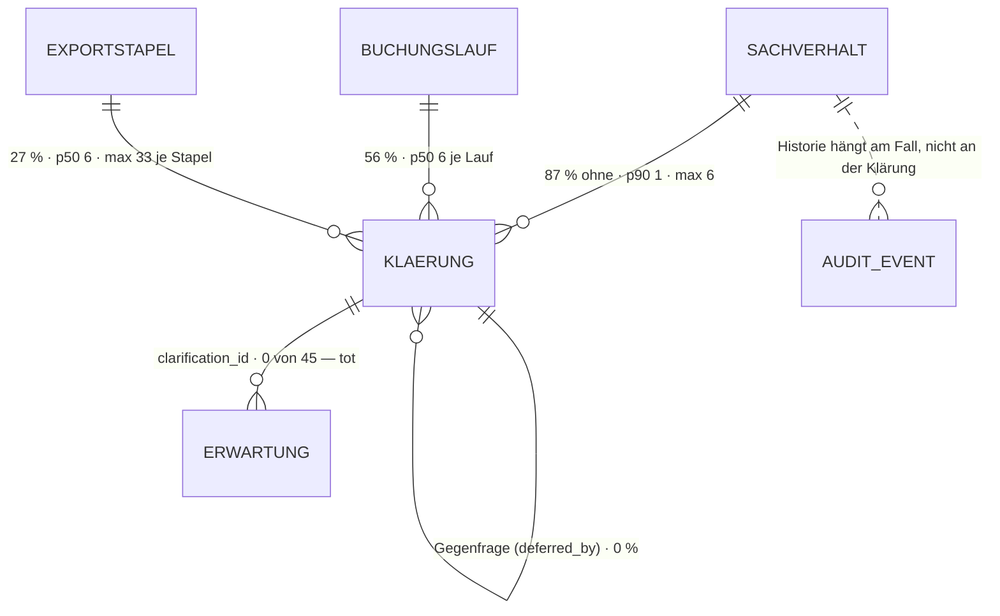

# Klärung · `clarification` — Entitätsprofil

| | |
|---|---|
| Status | in Specs — 0059 · 0060 · 0061 |
| GLOSSARY | `### Clarification question` — englisch `clarification question`, Ordner `entities/clarification/` |
| Tabelle | `ludwig.client_accounting_case_clarification` (vormals `client_invoice_clarifications`), keine Subtypen |
| Typen | `src/ludwig/modules/accounting-cases/domain/case.ts` — `CLARIFICATION_STATES`, `clarificationState()`, `CLARIFICATION_TYPES`; `modules/invoices/domain/invoice.ts` — `ClarificationSeverity`, `ClarificationAnswerKind` |
| Status-Achsen | `STATUS_REGISTRY.klaerung` (Schwere) · `.klaerung_status` (offen/zurückgestellt/beantwortet, abgeleitet) · `.klaerung_typ` (Frage/Kommentar) |
| Wichtigkeit | mittel — kein eigener Screen, aber auf vier Flächen sichtbar |
| Datenstand | Staging über den Pooler, 2026-09-04, 166 Zeilen (153 Fragen, 13 Kommentare), faktisch **ein Mandant** — Verteilungen belastbar, Mengen je Mandant nicht |
| Rückfrage | gestellt und **beantwortet** am 2026-09-04 (Owner) — Formen, Kommentare, Erstellungsansicht, Antwortverlauf |
| Analyse von / am | Claude, 2026-09-04 (Skill `entitaet-analysieren`) |

## Was sie ist

Eine strukturierte Frage, die ein Verarbeitungsschritt stellt, wenn er allein
nicht entscheiden kann — an die Kanzlei, an den Mandanten oder zurück an den
Agenten. Sie hängt immer an einem Sachverhalt und ist erst weg, wenn jemand
sie beantwortet; `severity = 'required'` hält die Buchung so lange auf.

Anzeige-Regeln aus dem GLOSSARY und den Spaltenkommentaren, wörtlich:

- „**Offen** heißt `answered_at is null` UND `type='question'` — die Definition
  wohnt in `core/db/clarification-open.ts`, nicht in den Queries." Wer sie
  selbst schreibt, zählt Kommentare als offene Fragen.
- „Zurückgestellt ist weder offen noch beantwortet. Die Frage ist nicht
  erledigt, sie ist bewusst **nicht jetzt** dran." Ein Sachverhalt, dessen
  letzte Fragen nur zurückgestellt sind, schließt **nicht**.
- „Carries two phrasings — `professional_text` für die Kanzlei,
  `client_text` für den Mandanten." Ins Portal geht ausschließlich
  `client_text`; ein professional-Text darf den Mandanten nie erreichen.
- Seit F125 gibt es **keine Beleg-Nachforderung als Klärung** mehr — der
  fehlende Beleg ist eine `Erwartung`. Bestand mit `question_type =
  'document_missing'` ist Altlast (8 Zeilen).

## Eine Antwort, nicht mehrere — Stand heute

Belegt im Kern (`clarification-core.ts`), nicht angenommen:

- `answerClarification` **verweigert die zweite Antwort**:
  `if (q.answered_at) throw domainError("Klärungsfrage ist bereits
  beantwortet.")`. Es gibt genau ein `answer_payload`, ein `answered_at`,
  ein `answered_by`.
- Ein zweiter Anlauf ist deshalb heute eine **neue Klärung** — und die Kante
  zwischen beiden fehlt: `deferred_by_clarification_id` ist die einzige
  Selbstbeziehung und in 0 % gesetzt. `batch-clarifications.ts` sagt es
  selbst: „Der Klärungs-**Faden** (Gegenfrage → frühere Antwort) fehlt:
  zwischen zwei Klärungen gibt es keine Kante."
- Es gibt einen **zweiten Ausgang**: `resolveClarification` schließt eine
  Frage, ohne dass die Gefragte antwortet — 57-mal im Audit, `resolution`
  ist dabei entweder `answered` (35, der Agent hat die Antwort inzwischen
  selbst gefunden) oder `obsolete` (22, die Frage ist gegenstandslos
  geworden). Beide Wege setzen `answered_at` **und** `answer_payload`; bei
  `obsolete` steht dort der Marker `"(gegenstandslos)"`. In der Tabelle
  unterscheidbar, aber nur an diesem String — die Karte muss den Fall
  benennen, statt ihn wie eine Antwort zu zeigen.
- **Wer gefragt hat, steht nicht in der Tabelle.** Es gibt kein
  `created_by`; `answered_by` gibt es (6 % gefüllt, der Agent antwortet ohne
  User). Wer, wann, was — das trägt der **Audit**, und zwar vollständig:
  `case.clarification_raised` (403), `_answered` (70, davon 41 durch einen
  User), `_resolved` (57), `_deferred` (0). Jedes Ereignis trägt
  `payload->>'clarificationId'`, also ist der Verlauf **je Frage**
  rekonstruierbar — er wird heute nur nirgends geladen (`ClarificationVM`
  kennt ihn nicht).

**Folge für die Bausteine:** Die Karte zeigt einen **Verlauf mit 0…n
Einträgen** (gestellt von · Antwort · Auflösung, je mit Datum und Person),
nicht ein einzelnes Antwortfeld. Aus heutigen Daten sind das ein bis drei
Einträge; das Format hält auch, wenn die Datenbank später mehrere Antworten
speichert. Die Zeilen kommen als Prop vom Aufrufer — die Komponente lädt
nichts und rechnet nichts.

**Folge für `ludwig/app`:** ob mehrere Antworten je Frage gespeichert werden
sollen, ist eine Datenmodell-Entscheidung, kein Design-System-Thema →
Befund B8.

## Schaubild



Die Klärung hat **keine eigene Historie**: `platform_audit_events` kennt kein
`resource_kind = 'clarification'`, alles läuft unter `accounting_case`.

## Datenpunkte

| Datenpunkt | Quelle | Rolle | Füllgrad | heute in | änderbar | Rang | ab Form | Beleg |
|---|---|---|---|---|---|---|---|---|
| Überschrift (`title`) | Spalte | Identität | 99 % | `RueckfragenListe`, `ClarificationsBanner` (mit Fallback `derivedTitle`) | Agent · Server | 1 | XS | Füllgrad · erste Zeile in beiden Listen · p50 64, p90 85, max 112 Zeichen |
| Zustand (`clarificationState()`) | `abgeleitet: clarificationState(answeredAt, deferredUntil)` | Zustand | 100 % | `ClarificationsBanner` (nur offen), `RueckfragenListe` (Gruppe) | nie | 2 | XS | Achse `klaerung_status` · 56 % beantwortet, 0 % zurückgestellt |
| Schwere (`severity`) | Spalte | Zustand | 100 % (83 % `required`) | `ClarificationsBanner` (Reihenfolge + Aufklapp-Vorgabe) | nie | 3 | XS | Achse `klaerung` · blockiert die Buchung |
| Zielgruppe (`audience`) | Spalte | Verantwortung | 100 % — 73 % `accounting`, 22 % `agent`, 5 % `client` | `Schritt2Liste` (drei Gruppen), Portal (Filter) | nie | 4 | S | Verteilung · die Abnahme gruppiert genau danach |
| Gestellt am (`created_at`) | Spalte | Zeit | 100 % | `ClarificationsBanner`, `RueckfragenListe` | nie | 5 | S | 60 offene Fragen, p50 13 Tage alt, p90 31 — das Alter ist der Druck |
| Sachverhalt (`case_id`) | Spalte → `client_accounting_case` | Kontext | 100 % | `RueckfragenListe` (Nummer + Titel **vor** der Frage) | nie | 6 | S in fremder Liste, sonst nie | Am Fall ist er gesetzt; in der Stapel-Liste ist er der Anker |
| Art (`type`) | Spalte | Zustand | 100 % (92 % `question`) | `HistorieTab` | nie | 7 | S | Achse `klaerung_typ` · Kommentare gehören nicht auf die Arbeitsliste |
| Frage (`question`) | Spalte | Erklärung | 16 % | `RueckfragenListe` (unter dem Titel, wenn abweichend) | Agent | 8 | M | p50 119, p90 181 Zeichen — passt ungekürzt |
| Erläuterung (`professional_text` / `client_text`) | Spalte, Auswahl nach Fläche | Erklärung | 100 % | `ClarificationsBanner` (client), Portal (client), `Schritt2Liste` (professional) | Agent | 9 | M, gekürzt ab **1 000 Zeichen** (p90 1 014) | p50 511 / 280, max 1 808 · **79 % identisch** → Befund B3 |
| Beobachtung (`context`) | Spalte | Erklärung | 16 % | — | Agent | 10 | M | p50 166, p90 289 — passt ungekürzt |
| Empfehlung (`recommendation`) | Spalte | Erklärung | 10 % | — | Agent | 11 | M | p90 183 Zeichen · benennt bei Choice-Fragen eine Option wörtlich → `ChoicePrompt.defaultOptionId` |
| Fakten (`facts_json`) | Spalte `[{label,value,source?}]` | Erklärung | **7 %** nicht leer | — | Agent | 12 | M | „damit niemand suchen muss" (Spaltenkommentar) · `FieldList` |
| Quellen (`sources_json`) | Spalte `RationaleSource[]` | Erklärung | **31 %** nicht leer | `RationaleSources` (Konto-/Belegverweise) | Agent | 13 | M | Füllgrad · `rationale-source.ts` |
| Antwort (`answer_payload`, `answered_at`) | Spalte | Erklärung · Zeit | 56 % | `RueckfragenListe`, `ClarificationsBanner`, Portal | Nutzer · Agent | 14 | S (Datum) · M (Text) | Antwortdauer p50 **10 Stunden**, p90 1,7 Tage |
| Antwortende (`answered_by` → Anzeigename) | Spalte | Verantwortung | **6 %** | `RueckfragenListe` (`authorName`) | Server | 15 | M | Füllgrad — der Agent beantwortet ohne User |
| Fragesteller (Person) | `abgeleitet: fehlt → Befund B7` — nur im Audit `case.clarification_raised` | Verantwortung | 403 Ereignisse, 3 mit User | — | Server | 15 | M | Audit-Verteilung · **keine Spalte `created_by`** |
| Verlauf (gestellt · beantwortet · aufgelöst, je mit Datum und Person) | `abgeleitet: fehlt` — aus `platform_audit_events` über `payload->>'clarificationId'` | Erklärung · Zeit | 100 % rekonstruierbar, 0 % geladen | — | Server | 16 | M | 530 Ereignisse zu 166 Zeilen |
| Auflösung ohne Antwort (`resolution`) | `abgeleitet: fehlt` — Audit `case.clarification_resolved` | Erklärung | 57 Ereignisse | `GrundDialog` schreibt sie, niemand liest sie zurück | Nutzer | 17 | M | Audit · Pflichtgrund |
| Frageart (`question_type`) | Spalte, 9 Werte | Identität | 100 % | `ClarificationsBanner` via `humanizeType()` (Unterstriche ersetzt) | nie | 18 | M | **kein Label-Katalog** → Befund B1 |
| Herkunft (`source_module`) | Spalte, 3 Werte im Bestand | Verantwortung | 100 % — 57 % `agent`, 22 % `web`, 21 % `datev-mirror` | `ClarificationsBanner` via lokalem `MODULE_LABEL` | nie | 19 | M | Verteilung → Befund B2 |
| Wiedervorlage (`deferred_until`, `deferred_reason`) | Spalte | Zeit · Erklärung | **0 %** | `RueckfragenListe` (Pille „zurückgestellt bis") | Nutzer · Agent | 20 | XS wenn gesetzt, Grund ab M | Füllgrad 0, Regelwerk vollständig (F105) → offene Frage 1 |
| Verschoben (`deferred_count`) | Spalte | Maß | 100 % (immer 0) | — | Server | 21 | L | „ab der dritten Verschiebung darf nur noch ein Mensch verschieben" |
| Buchungslauf (`agent_run_id`) | Spalte → `client_agent_runs` | Kontext | 56 % | `agent-runs/[runId]` | Server | 22 | L | Server-Stempel, Grundlage des Run-Resets |
| Stapel (`export_batch_id`) | Spalte → `client_datev_export_batches` | Kontext | 27 % | `Schritt2Liste` | Server | 23 | L | Server-Stempel, Grundlage des Stapel-Resets |

**Steuernd, nicht angezeigt:** `answer_kind` (60 % `free_text`, 28 %
`single_choice`, 8 % `yes_no`, 5 % `document_upload`), `answer_options_json`
(28 % nicht leer, p50 **2**, max 4 Optionen) und `allow_free_text` (90 %)
wählen die Antwortfläche, sie stehen nirgends als Text. Zwei bis vier
Optionen heißt: Knöpfe, kein Auswahlfeld — genau der Bereich von
`ChoicePrompt`.

**Ausgelassen (Technik):** `id`, `tenant_id`, `workflow_run_id` (0 %),
`expected_document` (5 %, Altlast aus der Zeit vor F125),
`deferred_by_user_id`, `deferred_by_kind` (beide 0 %).

## Relationen

| Relation | Richtung | Kardinalität | Rolle | ab Form | Darstellung | Beleg |
|---|---|---|---|---|---|---|
| Sachverhalt (`case_id`) | Eltern | 1:1, immer gesetzt | Kontext | S, nur in fremder Liste | Inline (Nummer + Titel, ein Klick) → Profil `accounting-case` (fehlt noch) | `RueckfragenListe` zeigt ihn zuerst |
| Buchungslauf (`agent_run_id`) | Eltern | 56 % · p50 6 Klärungen je Lauf, max 26 | Kontext | L | Inline | Staging |
| Exportstapel (`export_batch_id`) | Eltern | 27 % · p50 6 je Stapel, p90 28, max 33 | Kontext | L | Inline | Staging · trägt die Abnahme-Liste |
| Gegenfrage (`deferred_by_clarification_id`) | Kind (Selbstbezug) | **0 %** | Zustand | — | keine — der Klärungs-**Faden** ist nicht belegt (so auch `batch-clarifications.ts`) | Füllgrad 0 |
| Erwartung (`expectation.clarification_id`) | Kind | **0 von 45** | — | — | keine, Kante faktisch tot (F125) | Staging → Befund B4 |
| Historie | — | — | — | — | keine eigene: `platform_audit_events` kennt kein `resource_kind='clarification'` | Audit-Verteilung |

## Heutige Darstellung

| Komponente | Ort | Form | zeigt | fehlt | zu viel |
|---|---|---|---|---|---|
| `ClarificationsBanner` | `modules/accounting-cases/ui` | Liste + Karte am Fall | Schwere, Titel (mit Fallback), Frageart, Herkunft, `client_text`, Datum; aufklappbar | Zustand „zurückgestellt", Fakten, Quellen, Antwort | Antwortfeld **ohne Funktion** („nur visuell", Kommentar im Code) |
| `RueckfragenListe` + `Schritt2Liste` | `modules/stapelabnahme/ui` | Liste über den Stapel | Sachverhalt, Titel, Frage, Wiedervorlage-Pille, Antwort, drei Gruppen nach `audience` | Schwere, Frageart, Fakten | — |
| `AnswerInput` | `.../sachverhalt/parts.tsx` | Antwortfläche | alle vier `answer_kind`, Optionen als Knöpfe, Freitext-Ergänzung | Empfehlung als Vorauswahl, Fakten daneben | — |
| Antwort-Eingabe im Portal | `modules/client-portal/ui/PortalCaseList.tsx` | Antwortfläche | dieselbe Logik **noch einmal**, mandantentauglich | — | zweite Umsetzung derselben Frage → Befund B5 |
| `RaiseClarificationForm` · `CaseCommentForm` | `modules/accounting-cases/ui` | Editor | eigene Frage / Kommentar stellen (22 % des Bestands, `source_module='web'`) | Frageart-Auswahl (kein Katalog) | — |

Das Inventar (`ui-repraesentationen.md` §1, Abschnitt Klärung) nennt nur vier
Komponenten und kennt weder `RueckfragenListe`/`Schritt2Liste` noch die
Portal-Eingabe — es ist an dieser Stelle unvollständig.

## Listen

| Liste | Job | Grundgesamtheit | Sortierung | Spalten (Ränge) | Filter | Massenaktion | Leerfall | Umfang p50 · p90 | Beleg |
|---|---|---|---|---|---|---|---|---|---|
| **Am Fall** | Wenn ein Sachverhalt vor ihr liegt, will die Sachbearbeiterin sehen, **was ihn aufhält**, und es an Ort und Stelle beantworten, damit der Fall weiterläuft. | alle Klärungen des Falls | offen zuerst, dann blockierend, dann jüngste | 1–5 | keiner | keine | „keine Rückfragen" — Erfolg, die Liste verschwindet ganz | 0 · 1 (max 6) | `ClarificationsBanner` · Staging |
| **Im Stapel** (Abnahme, Schritt 2) | Wenn sie einen Buchungsstapel abnimmt, will sie **alle Rückfragen des Stapels an einem Stück** abarbeiten, statt in dreißig Sachverhalte zu springen. | Klärungen eines Exportstapels | nach `audience` gruppiert, darin chronologisch | 1–6 (mit Sachverhalt) | Zustand | keine (heute) | „keine Rückfragen in diesem Stapel" — Erfolg | 6 · 28 (max 33) | `Schritt2Liste` · Staging |
| **Im Portal** | Wenn der Mandant ins Portal kommt, will er sehen, **was seine Kanzlei von ihm braucht**, und es beantworten, ohne zu verstehen, warum gefragt wird. | `audience='client'`, offen | älteste zuerst | 1, 5 (ohne Schwere, ohne Herkunft) | keiner | keine | „Aktuell liegen keine offenen Fragen für Sie vor" — Erfolg | 9 Zeilen gesamt | `PortalCaseList` |
| **Im Lauf** | Wenn jemand einen Buchungslauf nachvollzieht, will er sehen, **was der Lauf gefragt hat**, ohne antworten zu können. | Klärungen eines `agent_run` | chronologisch | 1–6, nur lesend | keiner | keine | „dieser Lauf hat nichts gefragt" | 6 · 22 (max 26) | `agent-runs/[runId]` |

**Eine Komponente, vier Ausprägungen.** Nach §8 wird eine Ausprägung erst
eine eigene Komponente, wenn sie einen eigenen Job hat **und** sich in
mindestens zwei von {Grundgesamtheit, Sortierung, Filter, Massenaktion,
Spaltensatz} unterscheidet. Die Grundgesamtheit liefert hier immer der
Aufrufer als Zeilen; übrig bleiben Gruppierung, Sachverhalts-Spalte,
Textquelle und Schreibrecht — vier Props, keine vier Listen:
`groupBy`, `showCase`, `text: "professional" | "client"`, `readOnly`.
Keine der vier Listen ist länger als 33 Zeilen: **keine Pagination, kein
virtuelles Scrollen, Filter im Client.**

Keine dieser Listen hat eine eigene Route — kein Seitenprofil nötig.

**Drei Rahmen, dieselbe Zeile** (Owner, 2026-09-04). Die Liste ist nicht
immer eine Liste:

| Rahmen | wann | trägt |
|---|---|---|
| schlichte Liste | am Fall, im Stapel, im Portal | `ClarificationRow`, gruppiert |
| **Timeline** | wenn die Frage im Ablauf des Falls steht | `Timeline` (0040) nimmt die Zeile als Eintrag |
| **To-do** | wenn die Fragen abzuarbeiten sind statt nachzulesen | `TodoList` nimmt die Zeile als Posten |

**Abgrenzung zu `DataTable` (0057).** Die Aufgabe 0057 klammert die
Listen**seiten**: Pagination, Spaltensortierung, Auswahl, Massenaktionen —
und nennt `ClarificationsBanner` unter den acht Modulen, deren lokales
Auf-/Zuklappen sie ablöst. Keine der vier Klärungslisten ist eine
Listenseite: 0 bis 33 Zeilen, keine Route, keine Pagination, keine
Sortierung, gruppiert statt spaltenweise. `ClarificationList` baut deshalb
keine Tabelle, sondern reiht Zeilen — das Auf-/Zuklappen kommt aus
`ExpandableRow`, nicht aus einer zweiten Tabellen-Klammer. Bekommt die
Stapel-Liste später Massenaktionen („alle drei an den Mandanten"), ist das
der Punkt, an dem sie auf `DataTable` wechselt.

**Kommentare gehören nicht in die Timeline** (Owner: „das würde sie
vollmüllen"). `type='comment'` steht ausschließlich in der Klärungsliste am
Fall; in die Timeline geht nur `type='question'`. Das ist eine Regel der
Liste, kein Prop des Aufrufers — sonst landet sie beim dritten Aufrufer
wieder falsch.

## Formen

| Form | Größe | Empfehlung | Grund (§7 Nr.) | zeigt (Ränge) | Relationen | setzt auf | ersetzt |
|---|---|---|---|---|---|---|---|
| `ClarificationCell` | XS | ja | 3 — FK-Ziel als Begründungs-Quelle (`RationaleSource.kind='clarification'`) und als Gegenfrage; zugleich die **Vorschau** | 1–3 | — | `Badge`, `StatusBadge` (`klaerung`, `klaerung_status`) | die Klärungs-Zeile in `RationaleSources` |
| `ClarificationRow` | S | ja | 1 + 2 — existiert dreifach; Kind des Sachverhalts, der eine View hat; muss in drei Rahmen passen (Liste, Timeline, To-do) | 1–7 (Sachverhalt nur mit `showCase`) | Sachverhalt inline | `ExpandableRow`, `StatusBadge`, `Time` | Zeilen in `ClarificationsBanner`, `RueckfragenListe`, `PortalCaseList` |
| `ClarificationCard` | M | ja | 1 — die aufgeklappte Frage samt Verlauf und Antwortfläche, heute zweimal gebaut | 1–19 | Quellen als Links, Fakten als `FieldList` | `ChoicePrompt` (Empfehlung → `defaultOptionId`), `FieldList`, `LongText`, `Markdown` | `AnswerInput` **und** die Portal-Kopie |
| `ClarificationList` | L | ja | 1 + §8 — vier belegte Jobs, drei Rahmen | Zeilen, gruppiert | — | `ClarificationRow`, `Timeline`, `TodoList`, `EmptyState`, `Disclosure` | `ClarificationsBanner`, `Schritt2Liste`, Portal-Liste |
| `ClarificationEditor` | XL | ja | 4 — die Kanzlei stellt selbst Fragen und Kommentare (22 % des Bestands, `source_module='web'`); **bewusst schmal**: Textfelder, Zielgruppe, Schwere — keine Quellen, keine Fakten, keine Frageart | Titel, Frage, Zielgruppe, Schwere, Art | keine | `Field`, `Textarea`, `RadioGroup`, `ActionBar` | `RaiseClarificationForm`, `CaseCommentForm` |
| `ClarificationView` | L | **nein** | kein Screen zeigt eine Klärung allein — ihr Detail **ist** der Sachverhalt. Alles, was ein View zeigen würde, zeigt die Karte. | | | | |
| `ClarificationDrawer` | L | nein (Backlog) | 5 gilt dem Grunde nach (Buchungs-Begründung verweist auf eine beantwortete Frage), aber ohne View wäre der Drawer nur die Karte im Rahmen — dafür genügt `EntityDrawer` (0052) | | | | |

**Drei Zustände, eine Karte.** Die vom Owner genannten Fälle sind Modi, keine
Komponenten — sonst driften sie auseinander, wie es Kanzlei- und
Portal-Eingabe schon vorgemacht haben:

| Modus | wann | Unterschied |
|---|---|---|
| `read` | beantwortet oder aufgelöst; Nachlesen im Lauf, im Stapel, im Archiv | Verlauf statt Eingabe; die Antwort steht als Text mit Person und Datum |
| `answer` | offen und die Betrachterin ist gefragt (`audience` trifft ihre Rolle) | `ChoicePrompt` mit den Optionen; Empfehlung als Vorauswahl; zweiter Ausgang „ohne Antwort auflösen" mit Pflichtgrund |
| `preview` | die Frage wird woanders erwähnt (Buchungs-Begründung, Gegenfrage) | `ClarificationCell` — Titel, Zustand, Schwere, ein Klick |

**Zwei Herkünfte, eine Karte.** Eine Agenten-Frage bringt Quellen, Fakten und
eine Empfehlung mit; eine von Hand gestellte Frage bringt nur Text. Die Karte
zeigt, was da ist, und blendet die leeren Blöcke weg — kein zweiter Bauplan.
Der Editor erzeugt ausschließlich die einfache Sorte.

Bau-Reihenfolge: `ClarificationCell` → `ClarificationRow` → `ClarificationCard`
→ `ClarificationList` → `ClarificationEditor`.

Die **Wiedervorlage** bekommt keine eigene Form: Datum plus Pflichtgrund sind
`ReasonDialog` mit Datumsfeld, die Sperre ab der dritten Verschiebung ist eine
Regel des Aufrufers.

## Zuschnitt

| Form / Liste | Marke | Grund | Backlog |
|---|---|---|---|
| `ClarificationCell` | jetzt | trägt Vorschau und den Verweis aus der Buchungs-Begründung | `0059` |
| `ClarificationRow` | jetzt | trägt alle vier Listen in allen drei Rahmen | `0059` |
| `ClarificationCard` | jetzt | löst die doppelte Antwort-Eingabe (Kanzlei + Portal) auf; trägt Lesen, Beantworten und den Verlauf | `0060` |
| `ClarificationList` | jetzt | vier belegte Jobs, alle mit derselben Zeile | `0059` |
| `ClarificationEditor` | jetzt | vom Owner bestellt (2026-09-04); der `question_type`-Katalog (B1) blockiert nicht mehr, weil die Erstellung bewusst schmal ist | `0061` |
| `ClarificationDrawer` | Backlog | Verweis existiert, Bedarf noch nicht belegt; `EntityDrawer` (0052) + Karte reichen vorerst | `docs/backlog/0058-clarification-drawer.md` |
| `ClarificationView` | verworfen | der View der Klärung ist der Sachverhalt | — |

Fünf Formen „jetzt" — genau am Deckel. Sie werden **drei** Bau-Einheiten
(`spec-schreiben` §4): Vorschau, Zeile und Liste teilen sich eine Datei und
bleiben Server-Komponenten (0059); die Karte braucht `"use client"` für die
Antwort (0060); der Editor schreibt statt zu lesen (0061).

## Befunde für `ludwig/app`

- **B1 — kein Label-Katalog für `question_type`.** Neun Werte im Bestand,
  `ClarificationsBanner` behilft sich mit `humanizeType()` (Unterstriche →
  Leerzeichen, erster Buchstabe groß). Gehört als
  `CLARIFICATION_QUESTION_TYPE_LABEL` neben `CLARIFICATION_TYPES` in
  `modules/accounting-cases/domain/case.ts`; die Komponente rechnet nichts.
- **B2 — `MODULE_LABEL` lebt in der Komponente.** Die deutsche Herkunft
  („Buchungsvorschlag", „Beleg-Interpretation") steht in
  `ClarificationsBanner.tsx` und kennt `agent`, `web` und `datev-mirror`
  nicht — also 78 % des Bestands. Gehört in die Domain.
- **B3 — `professional_text` und `client_text` sind in 79 % identisch.** Die
  Zwei-Text-Regel wird faktisch nicht gelebt. Entweder erzeugen die Module
  wirklich zwei Fassungen, oder die Regel wird auf eine reduziert — die UI
  kann beides tragen, aber nicht beides gleichzeitig behaupten.
- **B4 — `client_accounting_case_expectation.clarification_id` ist tot.**
  0 von 45 Zeilen belegt, seit F125 auch fachlich abgelöst. Kandidat zum
  Entfernen.
- **B5 — zwei Antwort-Eingaben für dieselbe Frage.** `AnswerInput`
  (Kanzlei) und die Kopie in `PortalCaseList.tsx`. `RueckfragenListe` nutzt
  bewusst dieselbe Eingabe wie der Sachverhalt und begründet das im Kommentar
  — das Portal ist ausgeschert.
- **B7 — kein `created_by`.** Wer eine Frage gestellt hat, steht nur im Audit
  (`case.clarification_raised`, 403 Ereignisse, 3 davon mit User-Actor). Die
  Tabelle kennt `answered_by`, aber keinen Fragesteller. Der Owner will
  Erstellung **und** Beantwortung mit Person und Datum sehen — dafür muss
  entweder die Spalte kommen oder der Audit-Verlauf in `ClarificationVM`
  geladen werden. Die Bausteine nehmen ihn als Prop; rechnen tun sie nichts.
- **B8 — eine Antwort je Frage, kein Faden.** `answerClarification` lehnt die
  zweite Antwort ab; ein zweiter Anlauf ist eine neue Zeile ohne Kante zur
  ersten. Ob n Antworten je Frage gespeichert werden sollen (Owner-Frage
  2026-09-04) oder ob der Faden über eine `parent_clarification_id` läuft,
  ist eine Datenmodell-Entscheidung. Die Karte zeigt schon heute einen
  Verlauf mit 0…n Einträgen, damit sie beide Antworten übersteht.
- **B9 — `ClarificationAnswerKind` ist unvollständig.** Der TS-Typ
  (`modules/invoices/domain/invoice.ts`) kennt vier Werte, der DB-CHECK fünf:
  `document_upload` fehlt, obwohl acht Zeilen ihn tragen. Beim Bauen von 0060
  aufgefallen; die Komponente weitet die Union lokal und begründet es.
- **B6 — Altlast `document_missing` / `document_upload`.** Je 8 Zeilen,
  seit F125 fachlich abgeschafft. Die neue Karte darf `document_upload`
  nicht als Antwortform anbieten; der Bestand braucht eine Migration oder
  eine bewusste Duldung.

## Offene Fragen

Entschieden am 2026-09-04 (Owner): Kommentare bleiben in der Klärungsliste
und gehen **nicht** in die Timeline. Die Erstellungsansicht wird gebaut,
bewusst schmal. Offen bleiben:

1. ~~**Wiedervorlage: gebaut, nie benutzt**~~ — **entschieden am 2026-09-04
   (Owner): der Weg fehlt, nicht das Feature.** Beleg: 60 offene Fragen,
   Median 13 Tage alt, p90 31; die 57 Auflösungen sind kein Ersatz (35
   `answered`, 22 `obsolete`, keine heißt „später"). Wird gebaut als
   `docs/backlog/0065-clarification-defer.md` — eine Prop `onDefer` an der
   Karte, kein neuer Baustein.
2. **Portal**: eigene Ausprägung oder dieselbe Liste mit `text="client"`? —
   ohne Antwort: dieselbe Liste, ein Prop.
3. **Antwortverlauf**: soll die Datenbank mehrere Antworten je Frage
   speichern (B8)? — ohne Antwort: die Karte zeigt den Verlauf aus dem Audit,
   das Schema bleibt, wie es ist. Unabhängig davon entschieden (Owner
   2026-09-04): **`created_by` wird gebraucht**; die Karte nimmt Fragesteller
   und Antwortende schon heute als optionale Props (`string` oder `Actor`),
   damit die Spalte später nichts an der Schnittstelle ändert.

## Prüfung

Gehört dem zweiten Agenten. Er prüft zuerst alle Zeilen mit Beleg `Annahme`,
dann die Ränge gegen „Heutige Darstellung", dann die Formen gegen §7.

| Zeile / Form | Einwand | Ergebnis | Geprüft von / am |
|---|---|---|---|
| | | | |

## Weiter

Prüfprompt (neue Sitzung, anderer Agent):

```
Prüfe das Entitätsprofil docs/entitaeten/clarification.md nach Skill entitaet-analysieren §5–§9.
Zuerst jede Zeile mit Beleg „Annahme": belege oder widerlege sie mit Füllgrad, heutiger
Komponente oder GLOSSARY. Dann die Ränge: deck die Punkte ab Rang k ab — erkennt eine
Sachbearbeiterin die Frage noch? Dann die Formen: hat jede empfohlene einen Grund aus §7,
fehlt eine, die die App heute hat? Dann die Listen: hat jede einen Job-Satz, und ist jede
Ausprägung nach §8 eine eigene Komponente wert oder nur ein Prop — besonders die
Portal-Ausprägung? Zuletzt der Zuschnitt: sind höchstens fünf Formen „jetzt", und trägt
jede Backlog-Zeile ihren Grund? Trag jeden Einwand in „Prüfung" ein, ändere die Tabellen,
wo du sicher bist, und setze den Status auf „geprüft". Datenstand ist Staging mit einem
Mandanten — Mengen je Mandant sind nicht belastbar. Kundendaten bleiben in der Datenbank;
nur SELECT.
```

Startprompt (neue Sitzung, nach Status `geprüft`):

```
Für die Entität Klärung (`clarification`) liegt das geprüfte Profil unter
docs/entitaeten/clarification.md. Schreibe mit Skill spec-schreiben je Form eine Spec, in
dieser Reihenfolge — nur die Formen mit Marke „jetzt" aus dem Abschnitt Zuschnitt:
ClarificationCell, ClarificationRow, ClarificationCard, ClarificationList,
ClarificationEditor. Was dort
„Backlog" trägt, bleibt liegen. Jede Spec verlinkt das Profil als Quelle und nimmt
Datenpunkte, Ränge, Relationen und „ersetzt" von dort, nicht aus dem Chat; die Punkte einer
Form sind die Ränge bis zu ihrer Größe, in derselben Reihenfolge. ClarificationCard setzt
auf ChoicePrompt (0028) auf und definiert die Antwortfläche nicht neu; ClarificationList
trägt die vier Jobs aus dem Abschnitt Listen als Props, nicht als vier Komponenten, und
muss in drei Rahmen passen (Liste, Timeline, To-do); Kommentare gehen nie in die Timeline.
ClarificationCard hat drei Modi (read/answer/preview) und zeigt einen Verlauf mit 0…n
Einträgen, den der Aufrufer liefert. ClarificationEditor bleibt bewusst schmal: Textfelder,
Zielgruppe, Schwere — keine Quellen, keine Fakten, keine Frageart. Danach
baut Skill v3-komponente jede Spec in derselben Reihenfolge, die größere Form komponiert
die kleinere. Abgenommen wird von einem anderen Agenten gegen die Spec. Nur eigene Dateien
stagen. Setze am Ende den Status des Profils auf „in Specs" und trage die Backlog-Nummern
ein.
```
