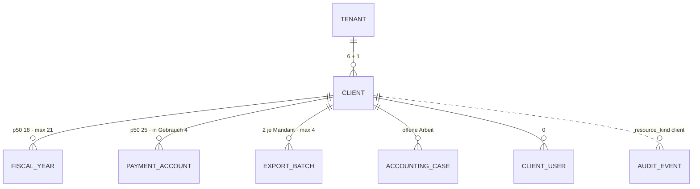

# Mandant · `client` — Entitätsprofil

| | |
|---|---|
| Status | **analysiert** |
| GLOSSARY | `### Client`, `### Replay client (Replay-Mandant)`, `### Client number`, `### Mandanten-Profil`, `### Client onboarding`, `### Booking style`, `### Booking interval`, `### Booking closed until` — Ordner `entities/client/` |
| Tabelle | `ludwig.platform_clients` — „A company or business entity managed by a tenant … A client belongs to exactly one tenant" (GLOSSARY). Keine Subtypen; der Replay-Mandant ist ein Mandant mit `replay_cutoff_date` |
| Typen | `clients/domain/client.ts` — `ClientListItem`, `ClientDetail`. **Nicht im Spiegel:** die offene Arbeit je Mandant (`ClientOpenWork`, `OpenWorkCounts` in `accounting-cases/infrastructure/case-queries.ts:799/883`) → L-316; die Abbildung der Rechtsform (`LEGAL_FORM_MAP`, `onboarding/application/derive-client-config.ts:51`) → L-315 |
| Status-Achsen | `mandant_betrieb` (aktiv · stillgelegt · Replay — abgeleitet aus `is_active` + `replay_cutoff_date`) · `mandant_onboarding` (`onboarding_state`, 6 Werte) · `mandant_onboarding_verdict` (abgeleitet) |
| Wichtigkeit | **mittel** — Roadmap der App (9be34746) Rang 6; FK-Ziel von 44 Tabellen, aber fast überall Kontext der Route |
| Datenstand | Staging über den Pooler, **2026-09-11**, schreibgeschützte Sitzung: **7 Mandanten in 2 Kanzleien** (6 + 1), 3 aktiv. Nur `SELECT`, keine Kundendaten; Beispielwerte erfunden |
| Bestandswarnung | Sieben Zeilen tragen keine Verteilung: alle `ready`, alle `creditor`, alle `soll`, alle monatliche USt. **Das Mandanten-Profil ist leer:** `vat_specialties` und `expense_profile` sind bei allen sieben leere Listen (der Füllgrad 100 % täuscht), `business_model` und `industry` 0 %, Geschäftsbeschreibung und Leitlinien je bei einem |
| Rückfrage | gestellt am 2026-09-11 an `ludwig-manager` — **offen**, die Defaults gelten |
| Analyse von / am | Claude, 2026-09-11 (Skill `entitaet-analysieren`) |

## Was sie ist

Ein Mandant ist das Unternehmen, dessen Buchhaltung die Kanzlei führt. Jeden
Morgen wählt die Sachbearbeiterin den Mandanten, bei dem Arbeit liegt; in der
Konfiguration liest sie seine Stammdaten und Konventionen (Buchungsstil,
Intervall, SKR, DATEV-Identität) und ändert sie selten. Fast überall sonst ist
er der Rahmen der Route, nicht der Gegenstand.

**Anzeige-Regeln** (wörtlich):

- „A client belongs to exactly one tenant. Do not mix with `creditor` /
  `debtor` concepts from accounting documents." (GLOSSARY, Client)
- Replay-Mandant: „Original und Replay-Stand teilen sich DATEV-GUID/-Nummer …
  solange nur **einer aktiv** ist" (GLOSSARY) — die DATEV-Nummer allein
  unterscheidet sie nicht; der Betriebszustand muss daneben stehen.
- `is_active`: „Inaktiv = stillgelegt (Daten bleiben, kein Sync, kein
  Agentenzugriff)" (Spaltenkommentar)
- Abgeschlossen bis: „Stored as a **date**, not a period, so a later interval
  change does not distort the state." (GLOSSARY, Booking closed until)
- Mandanten-Profil: „der einzige Hebel, um Standard-Vorschläge
  mandantenspezifisch zu verzerren" (GLOSSARY) — ein leeres Profil ist eine
  Aussage, keine Lücke im Layout.

## Schaubild



Dazu 38 weitere Kind-Tabellen — der Mandant ist Kontext fast aller Daten.

## Datenpunkte

| Datenpunkt | Quelle | Rolle | Füllgrad | heute in | änderbar | Rang | ab Form | Beleg |
|---|---|---|---|---|---|---|---|---|
| Name (`display_name`) | Spalte | Identität | 100 % · max 33 Zeichen | `dashboard/page.tsx`, `MandantSwitcher`, `MandantBand` | Nutzer | 1 | XS | Füllgrad · heute in |
| DATEV-Mandantennummer (`datev_client_number`) | Spalte | Identität | 100 % (Beraternummer 0 %) | `dashboard/page.tsx` | Server (Onboarding) | 2 | XS | Füllgrad · GLOSSARY Client number |
| Betriebszustand (`mandant_betrieb`) | abgeleitet: `is_active` + `replay_cutoff_date` | Zustand | 100 % — aktiv 3 · stillgelegt 4 · davon Replay 2 | `dashboard/page.tsx` (`c.isActive`, `c.replayCutoffDate`) | Nutzer (aktivieren) · nie (Replay) | 3 | XS | Registry · GLOSSARY Replay → Frage 1 |
| Offene Arbeit (aktiv · mit Rückfrage · wartet auf Unterlagen · Wirtschaftsjahr) | abgeleitet: `countOpenWorkByClient()` | Maß | 100 % | `dashboard/page.tsx` (`c.work.*`, sortiert nach `active`) | Server | 4 | S | heute in · VM in der Infrastruktur (L-316) |
| Offener Stapel | Relation → `BatchCell` | Zustand | 2 Stapel je Mandant | — (die Startseite als Weiche, Owner-Entscheid 2026-09-08) | Server | 5 | S | Roadmap · Rückfrage `export-batch` (f) |
| Abgeschlossen bis (`booking_closed_until`) | Spalte | Zeit | 86 % | Konfiguration | Server (Export) | 6 | S | Füllgrad · GLOSSARY |
| Onboarding (`onboarding_state`) | Spalte | Zustand (`mandant_onboarding`) | 100 % `ready` | Admin, Onboarding-Wizard | Server | 7 | S, nur wenn nicht `ready` | Füllgrad → Frage 2 |
| Rahmen (`account_framework_code` · `datev_account_length` · `taxation_type` · `vat_period` · `is_kleinunternehmer`) | Spalten | Kontext | 100 % — SKR03 4 · SKR04 3; Länge 4; alle `soll`, monatlich, kein Kleinunternehmer | `uebersicht` („SKR-Variante"), Admin | Server · Nutzer | 8 | M | Füllgrad |
| Konventionen (`booking_style` · `booking_interval` · `diverse_strategy` · `default_payment_term_days` · `payroll_via_clearing_account` · `expects_client_batches` · `posting_text_convention`) | Spalten | Konvention | 100 % — `creditor` 7 · monatlich 6 / wöchentlich 1 · 30 Tage · Lohn über Verrechnung 3 · Mandantenstapel 1 · Buchungstext-Konvention 0 % | `stammdaten/page.tsx` (Buchungsstil, Intervall, Diverse-Strategie, Buchungstext-Konvention, Mandantenstapel) | Nutzer | 9 | M | Füllgrad · heute in · GLOSSARY Booking style (Werte veraltet, L-317) |
| DATEV-Anbindung (`datev_export_method` · `datev_guid` · `datev_bank_accounts`) | Spalten | Kontext | 100 % — `csv` 4 · `bridge` 3; Bankverbindungen p50 2 · max 4 | `stammdaten/page.tsx` („Stammdaten (DATEV)") | Server | 10 | L | Füllgrad |
| Identität und Adresse (`legal_name` · `legal_form` · `vat_id` · `address` · `country_code` · `slug`) | Spalten | Identität | 100 % — `legal_form` roh: `S00009` 4 · `S00001` 2 · `GmbH` 1 | Admin (`ClientMasterDataForm`), `stammdaten` | Nutzer · Server | 11 | L | Füllgrad · Rechtsform ohne Wörter (L-315) |
| Profil und Leitlinien (`trade_names` · `vat_specialties` · `expense_profile` · `business_model` · `industry` · `business_description` · `bookkeeping_guidelines`) | Spalten | Erklärung | Firmierungen p50 1 · max 7; USt-Besonderheiten und Aufwandsprofil **leer bei allen**; Modell und Branche 0 %; Beschreibung 1 von 7 (max 100); Leitlinien 1 von 7 (max 1.215 Zeichen) | `uebersicht` (Geschäftsmodell, -beschreibung, Leitlinien), `profil/page.tsx` | Nutzer | 12 | L | Staging · GLOSSARY Mandanten-Profil |
| Replay-Stichtag (`replay_cutoff_date`) | Spalte | Zustand · Zeit | 29 % (2) | `dashboard/page.tsx` | nie (nach Anlage unveränderlich) | 13 | L (in XS nur als Betriebszustand) | Füllgrad · GLOSSARY |
| Ohne Wert im Bestand (`phone`, `email`, `website`, `short_name`, `steuernummer`, `registration_number`, `datev_import_max_age_days`) | Spalten | Identität · Kontext | 0 % | `ClientMasterDataForm` | Nutzer | — | L, nur wenn gesetzt | Füllgrad |

Ausgelassen (Technik): `id`, `tenant_id`, `metadata`,
`ludwig_document_number_seq`, `creditor_number_system_prefix_start`,
`diverse_creditor_account_number`, `datev_surrogate_name`,
`cost_centers_enabled` (bei allen aus), `base_currency`,
`onboarding_completed_at`, `created_at`, `updated_at`.

Freitext-Grenzen: Leitlinien bis 1.215 Zeichen — in den Facts als `LongText`.

## Relationen

| Relation | Richtung | Kardinalität | Rolle | ab Form | Darstellung | Beleg |
|---|---|---|---|---|---|---|
| Kanzlei (`tenant_id`) | Eltern | 2 Kanzleien (6 + 1) | Kontext | — | setzt die Sitzung | Staging |
| Offene Arbeit (Sachverhalte) | Kind, abgeleitet | je Mandant und Wirtschaftsjahr | Maß | S | **Zähler** mit Weg (aktiv, mit Rückfrage, wartet auf Unterlagen) → Profil `accounting-case` | `dashboard/page.tsx` |
| Stapel | Kind | 2 je Mandant · max 4 | Zustand | S | **Inline** `BatchCell` (der offene) → Profil `export-batch`, 0166 | Staging |
| Wirtschaftsjahre (`client_fiscal_years`) | Kind | p50 18 · max 21 | Kontext | L | **Zähler** | Staging |
| Zahlungskonten | Kind | p50 25 · in Gebrauch 4 | Kontext | L | Defaults je Zahlungsart (`uebersicht`) über `PaymentAccountCell` → Profil `payment-account` | Staging |
| Konventionen (`client_agent_notes`) | Kind | — | Erklärung | L | → Profil `convention` (Roadmap #8) | Roadmap |
| Nutzer (`platform_client_users`) | Kind | 0 | — | — | nicht gezeigt | Staging |
| Verlauf (`platform_audit_events`, `resource_kind = client`) | ohne FK | Notizen 89 · Monat vorbereitet 47 · Onboarding nicht bereit 11 · OPOS-Wächter 9 · Review abgeschlossen 8 · Neu-Onboarding 6 · stillgelegt 5 · Intervall abgeschlossen 4 · … | Verantwortung | L | Liste über `LogBrowser` | Staging |

## Heutige Darstellung

| Komponente | Form | zeigt | fehlt | zu viel |
|---|---|---|---|---|
| `dashboard/page.tsx` (231 Z.) | Liste, Tabelle inline | Name, DATEV-Nr, aktiv / Replay, offene Arbeit (aktiv · mit Rückfrage · wartet auf Unterlagen), Wirtschaftsjahr; sortiert nach aktiver Arbeit | offener Stapel, abgeschlossen bis | — |
| `MandantSwitcher`, `MandantBand` (`ui/components/layout`) | Auswahl, Band | Name, Wechsel | — | bleiben App (Roadmap, Lückenliste 27) |
| `configuration/stammdaten/page.tsx` (152 Z.) | Detail | DATEV-Stammdaten, Buchungsstil, Intervall, Diverse-Strategie, Buchungstext-Konvention, Mandantenstapel, alternative Firmierungen | — | — |
| `configuration/uebersicht/page.tsx` (168 Z.) | Detail | „Was ist konfiguriert?", SKR-Variante, Kontenplan, Kreditoren, Default-Konten je Zahlungsart, Geschäftsmodell, -beschreibung, Leitlinien, Embedding-Abdeckung | — | — |
| `configuration/profil/page.tsx` (72 Z.) | Editor | Profil und Leitlinien | — | — |
| `ClientCreateForm`, `ClientMasterDataForm` (101 Z.), `ClientActiveToggle`, `DeleteClientButton`, `OnboardingWizard`, Admin-Mandantenseite (969 Z.) | Admin | Anlage, Stammdaten, Aktivierung, Löschen, Onboarding | — | — |

**Im Set:** kein Baustein. `Icons.tsx` führt `client` im Zeichen-Register;
`StatusCallout` trägt eine Bereitschaft, deren Inhalt App bleibt.

## Listen

| Liste | Job | Grundgesamtheit | Sortierung | Spalten (Ränge) | Filter | Massenaktion | Leerfall | Umfang p50 · p90 | Beleg |
|---|---|---|---|---|---|---|---|---|---|
| `ClientList` „Meine Mandanten" | Wenn **die Sachbearbeiterin morgens anfängt**, will sie **den Mandanten wählen, bei dem Arbeit liegt**, damit **sie nicht jeden einzeln öffnet** | Mandanten der Kanzlei; stillgelegte und Replay gekennzeichnet | aktive Arbeit absteigend | 1–6 | Suche ab 20 Mandanten (P14: skaliert auf die Kanzlei-Größe) | keine | „Nirgends liegt Arbeit." (Erfolg) ≠ „Kein Mandant für diese Suche." | 6 bzw. 1 je Kanzlei im Bestand → heute keine Pagination; ab 20 Suche und Pagination | Staging · `dashboard/page.tsx` · Roadmap |
| „Mandanten der Kanzlei" (Admin) | Wenn **die Admin einen Mandanten anlegt, stilllegt oder neu onboardet**, will sie **alle Mandanten mit Onboarding-Zustand und Anbindung sehen** | alle, auch stillgelegte | Name | 1–3, 7, 10 | Betriebszustand | aktivieren · stilllegen · löschen · neu onboarden | „Noch kein Mandant." | 7 im Bestand | Roadmap · Admin-Seiten → Backlog 0169 |

„Offene Stapel aller Mandanten" (0166) ist keine dritte Liste dieser Entität,
sondern eine Spalte der ersten: die Zeile trägt den offenen Stapel als
`BatchCell`.

## Formen

| Form | Größe | Empfehlung | Grund (§7 Nr.) | zeigt (Ränge) | Relationen | setzt auf | ersetzt |
|---|---|---|---|---|---|---|---|
| `ClientCell` | XS | ja | 3 — FK-Ziel von 44 Tabellen; genannt in Übersichten über Mandanten (0166), in Admin-Listen, im Verlauf | 1–3 (Name, DATEV-Nr im `title`, Betriebszustand als Wort bei stillgelegt/Replay) | — | `EntityIcon` (`client`), `StatusBadge` (`mandant_betrieb`) | die Nennungen im Dashboard und in Admin-Tabellen |
| `ClientRow` | S | ja | 1 — Zeile der Dashboard-Tabelle | 1–7 | offene Arbeit als Zähler mit Weg, offener Stapel als `BatchCell` | `Row`/`DataTable`-Spalten, `KpiTile`-artige Zähler, `BatchCell` | Zeilen von `dashboard/page.tsx` |
| `ClientList` | L | ja | 6 — Job „Meine Mandanten" | Zeile + Rahmen | — | `DataTable`, `ClientRow`, `FilterBar` (ab 20), `EmptyState` | Tabelle in `dashboard/page.tsx` |
| `ClientFacts` | L | ja | 1 — drei Konfigurationsseiten (`stammdaten`, `uebersicht`, `profil`) zeigen dieselben Gruppen | alle ab 20 % in Gruppen: Rahmen (8), Konventionen (9), DATEV (10), Identität (11), Profil und Leitlinien (12) | Zahlungskonten-Defaults über `PaymentAccountCell` | `FieldList` je Gruppe, `LongText` | die Anzeige in `stammdaten`, `uebersicht`, `profil` |
| `ClientAdminList` | L | ja, **Backlog** | 6 — Admin-Job, eigene Ausprägung nach §8 (Grundgesamtheit, Spalten, Aktionen) | | | | Admin-Mandantenliste |
| `ClientCard` | M | nein | die Bereitschaft („Was ist konfiguriert?") ist App-Inhalt über `StatusCallout`; der Kopf der Konfiguration ist `EntityHeader` mit `ClientCell` | | | | |
| `ClientPicker` | S | nein | der einzige Auswahlort ist der Mandanten-Switcher, und der bleibt App (Lückenliste 27) | | | | |
| `ClientEditor` | XL | nein | neun Editoren bleiben App (Lückenliste 33); Einzelwerte über `InlineEdit` | | | | |
| `ClientView` · `ClientDrawer` | L | nein | die Konfiguration ist eine Seitenfamilie; wer einen Mandanten nennt, will dorthin | | | | |

Bau-Reihenfolge: `ClientCell` → `ClientRow` → `ClientList` → `ClientFacts`.

## Zuschnitt

| Form / Liste | Marke | Grund | Backlog |
|---|---|---|---|
| `ClientCell` | jetzt | trägt Row, 0166 und die Admin-Nennungen | — |
| `ClientRow` | jetzt | trägt die Liste | — |
| `ClientList` „Meine Mandanten" | jetzt | ersetzt die Dashboard-Tabelle | — |
| `ClientFacts` | jetzt | ersetzt die Anzeige dreier Konfigurationsseiten | — |
| `ClientAdminList` „Mandanten der Kanzlei" | Backlog | Admin-Sicht (R11), eigene Ausprägung; hängt an einem Seitenprofil der Admin-Mandantenseite | `docs/backlog/0169-client-admin-list.md` |
| `ClientCard` · `ClientPicker` · `ClientEditor` · `ClientView` · `ClientDrawer` | verworfen | siehe Formen | — |

Vier Formen „jetzt".

## Befunde für `ludwig/app`

Alle zusätzlich als Zeile in `docs/befunde-app.md`.

- **L-315** `legal_form` hält rohe DATEV-Codes: `S00009` (4), `S00001` (2), dazu einmal `GmbH` als Text. Die Abbildung `LEGAL_FORM_MAP` (`onboarding/application/derive-client-config.ts:51`) greift für diese Codes nicht und liegt in `application/`; die Domäne hat keine Wortliste.
- **L-316** Die offene Arbeit je Mandant (`ClientOpenWork`, `OpenWorkCounts`) liegt in `accounting-cases/infrastructure/case-queries.ts:799/883` und wird nicht gespiegelt. Die Zeile des Dashboards hat im Set keinen Typ.
- **L-317** Das GLOSSARY nennt für den Buchungsstil noch `kreditorisch` / `direkt`, der Bestand trägt `creditor` (App cccccac1). Dasselbe gilt für den CHECK in `datenmodell.json` (Generator, vgl. L-300).

## Offene Fragen

1. **Der Betriebszustand steht schon in XS** — ein Replay-Mandant teilt DATEV-GUID und -Nummer mit dem Original; ohne das Wort ist die Nennung mehrdeutig. — ohne Antwort: ja, als Wort bei stillgelegt und Replay, nichts bei aktiv.
2. **Der Onboarding-Zustand erscheint nur, wenn er nicht `ready` ist** — im Bestand sind alle `ready`. — ohne Antwort: so.
3. **Die Admin-Liste ist Backlog (0169)** — sie gehört der Admin-Sicht (R11) und hat kein Seitenprofil. — ohne Antwort: so.

## Prüfung

Gehört dem zweiten Agenten. Er prüft zuerst alle Zeilen mit Beleg `Annahme`,
dann die Ränge gegen „Heutige Darstellung", dann die Formen gegen §7.

| Zeile / Form | Einwand | Ergebnis | Geprüft von / am |
|---|---|---|---|
| | | | |

## Weiter

Prüfprompt (neue Sitzung, anderer Agent):

```
Prüfe das Entitätsprofil docs/entitaeten/client.md nach Skill entitaet-analysieren §5–§9.
Zuerst jede Zeile mit Beleg „Annahme": belege oder widerlege sie mit Füllgrad, heutiger
Komponente oder GLOSSARY. Dann die Ränge: deck die Punkte ab Rang k ab — erkennt eine
Sachbearbeiterin den Vorgang noch? Dann die Formen: hat jede empfohlene einen Grund aus
§7, fehlt eine, die die App heute hat? Dann die Listen: hat jede einen Job-Satz, und ist
jede Ausprägung nach §8 eine eigene Komponente wert oder nur ein Prop? Zuletzt der Zuschnitt:
sind höchstens fünf Formen „jetzt", und trägt jede Backlog-Zeile ihren Grund? Trag jeden
Einwand in „Prüfung" ein, ändere die
Tabellen, wo du sicher bist, und setze den Status auf „geprüft". Kundendaten bleiben in
der Datenbank; nur SELECT.
```

Startprompt (neue Sitzung, nach Status `geprüft`):

```
Für die Entität Mandant (`client`) liegt das geprüfte Profil unter
docs/entitaeten/client.md. Schreibe mit Skill spec-schreiben je Form eine Spec, in dieser
Reihenfolge — nur die Formen mit Marke „jetzt" aus dem Abschnitt Zuschnitt:
ClientCell, ClientRow, ClientList, ClientFacts. Was dort „Backlog" trägt, bleibt liegen. Jede Spec verlinkt das Profil als
Quelle und nimmt Datenpunkte, Ränge, Relationen und „ersetzt" von dort, nicht aus dem
Chat; die Punkte einer Form sind die Ränge bis zu ihrer Größe, in derselben Reihenfolge.
Danach baut Skill v3-komponente jede Spec in derselben Reihenfolge, die größere Form
komponiert die kleinere. Abgenommen wird von einem anderen Agenten gegen die Spec. Nur
eigene Dateien stagen. Setze am Ende den Status des Profils auf „in Specs" und trage die
Backlog-Nummern ein.
```
