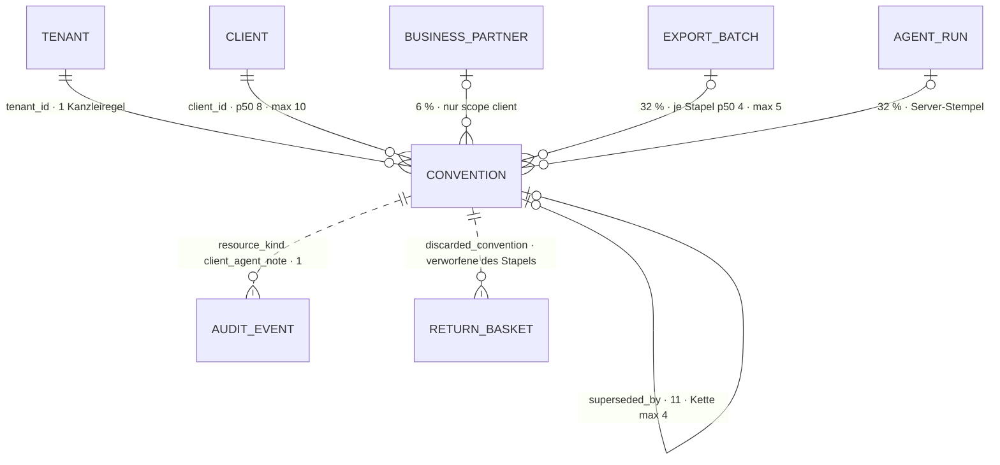

# Konvention · `convention` — Entitätsprofil

| | |
|---|---|
| Status | **analysiert** |
| GLOSSARY | `### Convention (Konvention)` — englisch `convention`, Ordner `entities/convention/` |
| Tabelle | `ludwig.client_agent_notes` — „Konventionsspeicher (F106): Wissen, das über den Einzelfall hinaus gilt und nicht aus den Daten ableitbar ist — je Zeile eine Regel, kein Inventar" (Tabellenkommentar). Keine Subtypen |
| Typen | `accounting-cases/domain/convention.ts` — `CONVENTION_SCOPES`, `CONVENTION_STATUSES`, `CONVENTION_ORIGINS`, `isConfirmed()`. **Nicht im Spiegel:** die Zeile selbst — `ClientNote` (`accounting-cases/application/client-notes-core.ts:99`), `NoteVM` (im UI-File `ClientAgentNotesPanel.tsx`), `BatchConvention` (`batch-review/application/batch-conventions.ts`) → L-322 |
| Status-Achsen | `convention` (`status`: Wartet auf Freigabe · Gilt · Archiviert) · `convention_origin` (`origin`: vier Stufen, drei davon „bestätigt") |
| Wichtigkeit | Roadmap Rang 8 (Entitäten-Roadmap 2026-09). Datenmodell-Review 2026-08-27: K3 (drei Grabstein-Mechanismen, niedrig) und K4 (Prompt-Kontext am Mandanten gegen den Speicher, mittel) |
| Datenstand | Staging über den Pooler, **2026-09-11**, schreibgeschützte Sitzung: **47 Konventionen**, 46 für einen Mandanten (6 von 7 Mandanten), 1 für eine Kanzlei. Nur `SELECT`, keine Kundendaten; Beispielwerte erfunden. Perzentile diskret |
| Bestandswarnung | **Alle 47 stammen vom Agenten** (`source = agent`), keine von einem Menschen; `origin = onboarding` kommt nicht vor. Knapp die Hälfte ist nach R15b keine Konvention (L-323) |
| Rückfrage | gestellt am 2026-09-11 an `ludwig-manager` — Defaults gelten, bis sie beantwortet ist |
| Analyse von / am | Claude, 2026-09-11 (Skill `entitaet-analysieren`) |

## Was sie ist

Eine Konvention ist eine Regel, die der Agent bei jeder Buchung eines
Mandanten liest — „Kartenumsätze laufen über 1617". Die Sachbearbeiterin sieht
sie an, wenn der Agent anders bucht als erwartet: sie bestätigt, was stimmt,
archiviert, was nicht mehr gilt, und gibt frei, was für die ganze Kanzlei
gelten soll.

**Anzeige-Regeln**, wörtlich:

- „Eine Konvention ist eine **Regel, kein Inventar**: Listen von Konten,
  Personen oder Partnern sind Stammdaten; was einen Betrag, ein Datum oder eine
  Belegnummer enthält, ist ein Merkposten und gehört an den Sachverhalt."
  (GLOSSARY)
- „Mandantenregel gilt sofort und sticht die Kanzleiregel zum selben Thema;
  eine Kanzleiregel gilt erst nach Freigabe durch einen Menschen." (GLOSSARY)
- „Der Agent liest primär note, der Mensch primär rationale — eine Wahrheit,
  zwei Lesarten." (Spaltenkommentar `rationale`)
- „Vermutung, bis ein Mensch sie bestätigt. Gilt trotzdem — der Status ist
  eine Qualitätsangabe, kein Gate." (Registry, `convention_origin.agent_observed`)
- Eine gestochene Kanzleiregel „steht durchgestrichen da statt still zu
  verschwinden" — sonst „wendet der Agent eine aufgehobene Regel an und
  niemand versteht warum" (`ClientAgentNotesPanel`, R15c).
- Zwei Wege hinaus: **Archivieren** heißt „gilt nicht mehr", **Löschen** heißt
  „hätte nie hier stehen dürfen" (`ClientAgentNotesPanel`, R15d).

**Keine Konvention in diesem Sinn:** die Buchungstext-Konvention
(`platform_clients.posting_text_convention`) und die übrigen
Konventions-Spalten am Mandanten — sie gehören dem Profil `client`; die
Buchungsleitlinien (`bookkeeping_guidelines`, K4); die Notizen am Sachverhalt
(`NoteFeed`, 0158); die Wiederkehr-Regel (Profil `recurring-rule`).

## Schaubild



## Datenpunkte

| Datenpunkt | Quelle | Rolle | Füllgrad | heute in | änderbar | Rang | ab Form | Beleg |
|---|---|---|---|---|---|---|---|---|
| Thema (`topic`) | Spalte | Identität | 100 % | Panel, Schritt 7, Kanzlei-Tabelle | Agent · Nutzer beim Anlegen | 1 | S | Füllgrad · heute in allen drei |
| Regel (`note`) | Spalte | Identität | 100 % | alle drei, **ungekürzt** | Agent · Nutzer beim Anlegen | 2 | S, gekürzt auf 200 Zeichen | GLOSSARY („`note` die Regel") · R15b („rund 200 Zeichen") · Länge p50 727 · p90 2.376 · max 3.966 |
| Stand (`status`, dazu gestochen und abgelöst) | Spalte + `abgeleitet: fehlt → Befund` (L-321) | Zustand | 100 % | Panel und Kanzlei-Tabelle (`StatusBadge convention`), Schritt 7 mit eigenen Wörtern | Nutzer (archivieren, freigeben) · Server (ablösen) | 3 | S | Registry `convention` · R15c · 11 abgelöste mit `active` |
| Herkunft (`origin`, „bestätigt" = `isConfirmed()`) | Spalte + `abgeleitet: isConfirmed` | Zustand | 100 % — beobachtet 34 · bestätigt 7 · aus Buchungen 6 · Onboarding 0 | Panel, Kanzlei-Tabelle (`StatusBadge convention_origin`), Schritt 7 („beobachtet") | Nutzer (bestätigen, freigeben) | 4 | S | Registry `convention_origin` · R15d |
| aus n Buchungen (`derived_from_count`) | Spalte | Maß | 13 % = 100 % der Herkunft „aus Buchungen" (CHECK) | Panel, Schritt 7 | Agent | 5 | S, nur bei dieser Herkunft | CHECK `(origin = 'derived_from_bookings') = (derived_from_count IS NOT NULL)` |
| Geltung (`scope` + `business_partner_id`) | `abgeleitet: fehlt → Befund` (L-322) | Kontext | 100 % · Partner 6 % | Panel („Kanzlei"/„Mandant"), Schritt 7 („ganze Kanzlei"/„nur dieser Mandant") | nie | 6 | S | heute in zwei Wortlauten · CHECK `scope ↔ client_id` |
| Angelegt (`created_at`) | Spalte | Zeit | 100 % — Alter p50 20 · max 41 Tage | Panel, Kanzlei-Tabelle | nie | 7 | S | heute in |
| Begründung (`rationale`) | Spalte | Erklärung | 34 % — beobachtet 3 von 34, bestätigt 13 von 13 | alle drei, ungekürzt | Agent | 8 | M; in S als Satz der Herkunfts-Marke (`ProvenanceMark`), in L als Herleitung (`ProvenanceNote`) | Spaltenkommentar („der Mensch liest primär rationale") · Füllgrad · Länge p50 546 · p90 700 · max 935 |
| Quelle (`source`) | Spalte | Verantwortung | 100 % — alle `agent` | Panel, Kanzlei-Tabelle („vom Agenten"/„manuell") | nie | 9 | M | Füllgrad: keine Verteilung; die Herkunft sagt dasselbe genauer |
| Entstanden im Stapel (`export_batch_id`) | Spalte | Kontext | 32 % | Schritt 7 (als Grundgesamtheit) | Server | 10 | L | `batch-conventions.ts` |
| Gestochen von (`overriddenByNoteId`) | `abgeleitet: listClientNotes()` in `application/` → L-322 | Zustand (Teil des Stands) | 0 % heute — die eine Kanzleiregel wartet noch | Panel (durchgestrichen und ein Satz) | Server | — | S | R15c |
| Abgelöst durch (`superseded_by`) | Spalte | Zustand (Teil des Stands) | 23 % | nirgends — die Listen des Mandanten und des Stapels blenden Abgelöstes aus, die Kanzlei-Liste nicht (L-321) | Server | — | L | `listClientNotes()`, `listTenantConventions()` |
| Früher verworfen (`previouslyDiscarded`) | `abgeleitet: batch-conventions.ts` in `application/` → L-322 | Zustand | — | Schritt 7 | — | — | nur 0170 | Code |

Ausgelassen (Technik): `id`, `tenant_id`, `client_id` (Kontext der Route; in
der Kanzlei-Liste leer), `agent_run_id` (Server-Stempel für den Lauf-Reset),
`created_by` (0 %), `deleted_at` (0 %, Altlast K3).

Freitext-Grenzen: `note` gekürzt ab **200** Zeichen — nicht nach der p90 (2.376),
sondern nach R15b, weil die Länge des Bestands selbst der Befund ist (L-323);
der Rest eingeklappt, nie abgeschnitten. `rationale` als Satz der Marke ab 160
(`ProvenanceMark`, 0163), ganz in der Herleitung. `topic` ungekürzt (max 114).

## Relationen

| Relation | Richtung | Kardinalität | Rolle | ab Form | Darstellung | Beleg |
|---|---|---|---|---|---|---|
| Mandant (`client_id`) | Eltern | 98 % gesetzt · je Mandant p50 8 · p90 10 · max 10 (6 von 7); davon geltend p50 5 · p90 8 · max 8 | Kontext | — | nie gezeigt, die Seite setzt ihn | Staging |
| Kanzlei (`tenant_id`) | Eltern | 100 % · Kanzleiregeln: 1 | Kontext | — | in der Geltung als „ganze Kanzlei", nicht als Name | Staging · R15c |
| Geschäftspartner (`business_partner_id`) | Eltern | 6 % (3) | Kontext, Teil der Geltung | S | Inline `BusinessPartnerCell` hinter der Geltung | Staging · Panel |
| Stapel (`export_batch_id`) | Eltern | 32 % · 4 Stapel, je Stapel p50 4 · max 5 | Kontext | L | Grundgesamtheit der Stapel-Liste (0170); in der Zeile nicht | `batch-conventions.ts` |
| Lauf (`agent_run_id`) | Eltern | 32 % | Technik | — | nicht gezeigt | Spaltenkommentar |
| Vorgängerin (`superseded_by`, auf sich selbst) | Kind | 11 abgelöst · je Regel höchstens eine Vorgängerin · Kette max 4 Fassungen | Erklärung | L | Zähler „ersetzt n frühere Fassungen" — erst, wenn die App ihn liefert (offene Frage 1) | Staging |
| Historie (`platform_audit_events`) | ohne FK | `resource_kind = client_agent_note`: **1** Eintrag im Bestand | Verantwortung | — | entfällt, kein Strang (L-324) | Staging · `approveTenantConvention` |
| Rücklauf-Korb (`return-basket.ts`, `discarded_convention`) | ohne FK | die verworfenen des Stapels | — | — | Text im Korb, keine Form | Code |

## Heutige Darstellung

`ui-repraesentationen.md` §1 führt nur `ClientAgentNotesPanel`. Gelesen sind
drei Stellen, die dieselbe Zeile bauen:

| Komponente | Form | zeigt | fehlt | zu viel |
|---|---|---|---|---|
| `ClientAgentNotesPanel` (`accounting-cases/ui`, 207 Z.) auf `configuration/profile/page.tsx` | Liste mit Anlegen | Thema, Geltung und Partner, `StatusBadge convention`, `StatusBadge convention_origin`, „aus n Buchungen", Regel, „Warum: …", der Satz zur Kollision, Quelle · Datum; Archivieren, Löschen; Thema und Regel anlegen | Kürzung der Regel (p90 2.376 Zeichen); Freigabe und Bestätigung stehen bewusst anderswo (R15c, F118 B5) | zwei farbige Badges nebeneinander — „Gilt" grün und „Vom Agenten beobachtet" gelb sind zwei Signale für eine Zeile; das Thema in Versalien; Inline-Styles |
| `Step7` · `KonventionZeile` (`batch-review/ui`) | Tabelle in der Stapelabnahme, gruppiert zu entscheiden · bestätigt · verworfen | Thema, Regel, Begründung kursiv, „zum selben Thema schon verworfen", Geltung, Stand, `ConventionActions` (Bestätigen, Freigeben, Verwerfen) | `StatusBadge` — Stand in eigenen Wörtern („beobachtet", „verworfen") statt der Registry | — |
| Admin · Kanzlei · Reiter „Konventionen" (`admin/tenants/[tenantId]/page.tsx`) | Tabelle | Thema, Regel, „Warum", Quelle · Datum, `StatusBadge` für Freigabe und Herkunft, `TenantConventionActions` (Freigeben, Archivieren); der Reiter zählt die Wartenden | — | ein rohes `<table>` neben einer `Card` des Sets |

## Listen

| Liste | Job | Grundgesamtheit | Sortierung | Spalten (Ränge) | Filter | Massenaktion | Leerfall | Umfang p50 · p90 | Beleg |
|---|---|---|---|---|---|---|---|---|---|
| `ConventionList` „des Mandanten" | Wenn **der Agent bei einem Mandanten anders bucht als erwartet**, will **die Sachbearbeiterin** **die Regeln sehen, die er dort anwendet — mit Herkunft und Kollision**, damit **sie eine falsche archiviert oder löscht, bevor sie weiter wirkt** | Mandanten- und Kanzleiregeln, die für den Mandanten gelten, gestochen werden oder archiviert sind; ohne abgelöste | Stand (wartet · gilt · gestochen · archiviert), dann Thema | 1–7 | keiner (max 10) | keine | „Noch keine Konventionen" mit dem Satz, was eine ist — ein Bestandsleerfall; einen Filterleerfall gibt es nicht | 8 · 10 | Staging · `profile/page.tsx` (`includeArchived: true`) |
| dieselbe `ConventionList` „der Kanzlei" | Wenn **der Agent eine Regel für alle Mandanten vorschlägt**, will **die Kanzlei-Administration** **sie freigeben oder archivieren**, damit **eine falsche Regel sich nicht über den ganzen Bestand verteilt** | Kanzleiregeln der Kanzlei | wie oben — die Wartenden zuerst | 1–5, 7 (ohne Geltung: alle gleich) | keiner | keine | „Noch keine Kanzlei-Konventionen" | 1 · 1 | Staging · `admin/tenants/[tenantId]/page.tsx` · R15c |
| „des Stapels" — Schritt 7 der Stapelabnahme | Wenn **ein Stapel abgenommen wird**, will **die Sachbearbeiterin** **jede Regel entscheiden, die der Agent darin abgeleitet hat**, damit **Schritt 8 freigeben kann und der Agent Verworfenes nicht wieder vorschlägt** | Konventionen mit `export_batch_id` = Stapel, archivierte eingeschlossen | gruppiert: zu entscheiden · bestätigt · verworfen | 1–6 + Entscheidung | keiner | keine | „keine Regel abgeleitet — das ist kein Mangel" (Erfolg) | 4 · 5 | Staging · `Step7.tsx` · `release-checklist.ts` (`conventions_decided`) |

Nach §8 sind die ersten beiden **eine** Komponente: sie unterscheiden sich in der
Grundgesamtheit, die der Aufrufer als Daten übergibt, nicht in Sortierung,
Filter, Massenaktion oder Mechanik; die fehlende Spalte „Geltung" ist ein
Prop. Die dritte unterscheidet sich in Grundgesamtheit, Gruppierung und
Spaltensatz — eine eigene Ausprägung (0170). Keine Liste hat eine eigene Route
im Set; die ersten beiden sind Teile der Mandanten- und der Kanzlei-Seite.

## Formen

| Form | Größe | Empfehlung | Grund (§7 Nr.) | zeigt (Ränge) | Relationen | setzt auf | ersetzt |
|---|---|---|---|---|---|---|---|
| `ConventionCell` | XS | nein | FK-Ziel nur von sich selbst; keine fremde Zeile nennt eine Konvention (der Rücklauf-Korb zeigt Text) | | | | |
| `ConventionRow` | S | ja | 1 — existiert dreimal (Panel, Schritt 7, Kanzlei-Tabelle) | 1–7: Thema, Regel gekürzt, Stand, Herkunft mit „aus n Buchungen" und der Begründung als Satz der Marke, Geltung, Angelegt | Geschäftspartner inline | `StatusBadge convention`, `ProvenanceMark` (0163) mit dem Wort der Achse `convention_origin`, `LongText`, `BusinessPartnerCell`, `Time` | `NoteVM`-Zeile im Panel, `KonventionZeile`, die Zeile der Kanzlei-Tabelle |
| `ConventionCard` | M | nein | kein Screen zeigt eine Konvention im Kontext einer anderen Entität | | | | |
| `ConventionList` | L | ja | 6 — zwei Listen-Jobs, eine Komponente | Zeilen 1–7, die Begründung aufklappbar als `ProvenanceNote`; je Zeile die Wege, die ihr Stand erlaubt: Archivieren, Löschen (mit Bestätigung), Freigeben (nur wartende Kanzleiregel) — als optionale Callbacks | — | `Card`, `CardHead`, `DataTable`, `EmptyState`, `ActionButton` `confirm` (0159), `OverflowMenu` (0008) | `ClientAgentNotesPanel` (Liste), Kanzlei-Tabelle mit `TenantConventionActions` |
| `ConventionView` | L | nein | keine Route je Regel; alles, was eine Regel hat, trägt die Zeile samt Herleitung | | | | |
| `ConventionDrawer` | L | nein | 5 greift nicht: keine fremde Ansicht verweist auf eine Konvention | | | | |
| `ConventionForm` | XL | ja | 4 — Thema und Regel sind beim Anlegen änderbar = Nutzer; das Anlegen steht heute im Panel. **Kein Bearbeiten:** eine neue Regel zum selben Thema löst die alte ab (R15d) | Thema, Regel, Begründung (offene Frage 3); Hinweis nach R15b bei mehr als 200 Zeichen oder bei Betrag, Datum, Belegnummer — ein Satz, keine Sperre | — | `Field`, `Input`, `Textarea`, `Button` | das Anlegen im `ClientAgentNotesPanel` |

Bau-Reihenfolge: `ConventionRow` → `ConventionList` → `ConventionForm`.

## Zuschnitt

| Form / Liste | Marke | Grund | Backlog |
|---|---|---|---|
| `ConventionRow` | jetzt | trägt beide Listen und Schritt 7; existiert dreimal | — |
| `ConventionList` (Mandant, Kanzlei) | jetzt | ersetzt Panel und Kanzlei-Tabelle; p90 10 Zeilen, keine Mechanik | — |
| `ConventionForm` | jetzt | existiert im Panel; der Ort, an dem R15b vor dem Speichern greift | — |
| Konventionen des Stapels (Schritt 7) | Backlog | eigene Ausprägung nach §8; die Stapelabnahme hat kein Seitenprofil (0167); `BatchConvention` liegt in `application/` (L-322) | `docs/backlog/0170-batch-convention-review.md` |
| `ConventionCell`, `ConventionCard`, `ConventionView`, `ConventionDrawer` | verworfen | kein Grund aus §7 Nr. 1–6 (Tabelle „Formen") | — |

## Befunde für `ludwig/app`

- **L-321** — Der Stand steht an drei Stellen: 11 abgelöste Regeln tragen
  `status = active`; gestochen errechnet nur `listClientNotes()`;
  `listTenantConventions()` filtert Abgelöstes nicht.
- **L-322** — Die Zeile hat keinen Typ im Spiegel (`ClientNote`, `NoteVM`,
  `BatchConvention` außerhalb von `domain/`); die Geltung hat zwei Wortlaute.
- **L-323** — Der Speicher hält Merkposten und Aufsätze: 24 von 47 mit Betrag,
  Datum oder Belegnummer; `note` p50 727 Zeichen gegen „rund 200" (R15b);
  31 von 34 beobachteten ohne Begründung.
- **L-324** — Der Verlauf einer Konvention ist nicht auffindbar: die Freigabe
  protokolliert an der Kanzlei, die Bestätigung an der Notiz; ein Eintrag im
  Bestand.

## Offene Fragen

1. Zeigt die Liste frühere Fassungen einer Regel (Kette bis 4)? — ohne Antwort:
   **nein**, wie heute; die Zeile nennt „ersetzt n frühere Fassungen", sobald die
   App die Zahl liefert (Ausbau von `ConventionList`).
2. Sind die Liste des Mandanten und die der Kanzlei eine Komponente? — ohne
   Antwort: **ja**, `ConventionList`; die Spalte „Geltung" fällt weg, wenn alle
   Zeilen dieselbe haben.
3. Fragt die Form nach Begründung und Geschäftspartner? — ohne Antwort:
   **Thema, Regel, Begründung (optional)**; kein Partner — 3 von 47 tragen einen,
   alle vom Agenten.

## Prüfung

Gehört dem zweiten Agenten.

| Zeile / Form | Einwand | Ergebnis | Geprüft von / am |
|---|---|---|---|

## Weiter

Prüfprompt (neue Sitzung, anderer Agent):

```
Prüfe das Entitätsprofil docs/entitaeten/convention.md nach Skill entitaet-analysieren §5–§9.
Zuerst jede Zeile mit Beleg „Annahme": belege oder widerlege sie mit Füllgrad, heutiger
Komponente oder GLOSSARY. Dann die Ränge: deck die Punkte ab Rang k ab — erkennt eine
Sachbearbeiterin den Vorgang noch? Dann die Formen: hat jede empfohlene einen Grund aus
§7, fehlt eine, die die App heute hat? Dann die Listen: hat jede einen Job-Satz, und ist
jede Ausprägung nach §8 eine eigene Komponente wert oder nur ein Prop? Zuletzt der Zuschnitt:
sind höchstens fünf Formen „jetzt", und trägt jede Backlog-Zeile ihren Grund? Trag jeden
Einwand in „Prüfung" ein, ändere die
Tabellen, wo du sicher bist, und setze den Status auf „geprüft". Kundendaten bleiben in
der Datenbank; nur SELECT.
```

Startprompt (neue Sitzung, nach Status `geprüft`):

```
Für die Entität Konvention (`convention`) liegt das geprüfte Profil unter
docs/entitaeten/convention.md. Schreibe mit Skill spec-schreiben je Form eine Spec, in dieser
Reihenfolge — nur die Formen mit Marke „jetzt" aus dem Abschnitt Zuschnitt:
ConventionRow, ConventionList, ConventionForm. Was dort „Backlog" trägt, bleibt liegen. Jede Spec verlinkt das Profil als
Quelle und nimmt Datenpunkte, Ränge, Relationen und „ersetzt" von dort, nicht aus dem
Chat; die Punkte einer Form sind die Ränge bis zu ihrer Größe, in derselben Reihenfolge.
Danach baut Skill v3-komponente jede Spec in derselben Reihenfolge, die größere Form
komponiert die kleinere. Abgenommen wird von einem anderen Agenten gegen die Spec. Nur
eigene Dateien stagen. Setze am Ende den Status des Profils auf „in Specs" und trage die
Backlog-Nummern ein.
```
