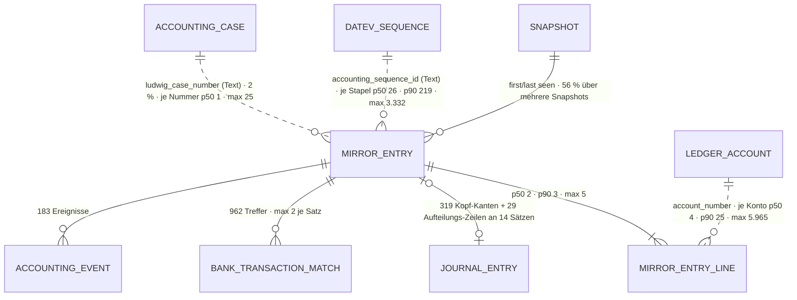

# DATEV-Spiegelbuchung · `DATEV mirror` entry — Entitätsprofil

| | |
|---|---|
| Status | **geprüft** — fremde Prüfung am 2026-09-11 (Prüfer-Session im Auftrag `ludwig-manager`, gegen e1326ef); vier Nacharbeiten und die Nachzählung der App eingearbeitet, siehe „Prüfung" |
| GLOSSARY | `### DATEV mirror (DATEV-Spiegel)`, `### Mirror entry line (Spiegel-Zeile)`, `### Mirror classification (Spiegel-Klassifikation)`, `### Snapshot (DATEV-Snapshot)`, `### Rand-Regel` — Ordner `entities/datev-mirror-entry/` |
| Tabelle | `ludwig.client_datev_mirror_entries` (Satz) + `ludwig.client_datev_mirror_entry_lines` (Spiegel-Zeilen, F208, per Trigger aus dem jsonb `lines`; noch nicht in `datenmodell.json`). Keine Subtypen; die Spiegel-Zeile hat kein eigenes Gesicht — **ein Profil** |
| Typen | **keine im Spiegel.** Die Formen der App leben in `modules/datev-truth/infrastructure/truth-queries.ts` (`TruthEntryRow`, `TruthEntryLine`, `TruthEntryDetail`, `TruthEntryFilter`) und werden deshalb nicht gespiegelt → L-302. Im Spiegel nur die Konto-Sicht: `accounts/domain/account-entry.ts` (`AccountEntry` mit `source: "datev"`, `datevMirrorEntryId`) |
| Status-Achsen | `mirror_match` (`match_state`) · `abgleich_lauf` am Lauf, nicht am Satz (L-221). **Ohne Achse:** die Paar-Arten des Stapelvergleichs (lokale `KIND_META`, L-303), die DATEV-Herkunft `mark_of_origin` (L-304), die Spiegel-Klassifikation (nur in `reporting-queries.ts`, L-305) |
| Wichtigkeit | **hoch** — Roadmap der App (9be34746) Rang 2; Grundlage des Abgleichs vor jedem Buchungslauf |
| Datenstand | Staging über den Pooler, **2026-09-11**, schreibgeschützte Sitzung: **46.056 Sätze, 112.354 Spiegel-Zeilen, 7 Mandanten**, 2025: 28.926 · 2026: 17.130. Nur `SELECT`, keine Kundendaten; Beispielwerte erfunden |
| Bestandswarnung | **98 % sind `new_unprocessed`** — der Bestand ist älter als Ludwig. „Nur in DATEV" ist der Normalfall, kein Alarm; der eigentliche Sichtungs-Vorrat ist nach der Klassifikation `fremd_offen`: 2026, sieben Mandanten, Replay-Stichtag **295** an 4 Mandanten gegenüber 15.983 `new_unprocessed` (daneben `opos_vortrag` 11.022 · `historisch` 2.332 · `zugeordnet` 2.044 · `technisch` 830 · `ludwig` 348; App-Nachzählung 2026-09-11 — die „638 von 25.806" im GLOSSARY sind der Stand von zwei Mandanten) |
| Rückfrage | gestellt und **beantwortet** am 2026-09-11 (`ludwig-manager`, aus dem App-Stand): die Defaults der drei Fragen gelten; die sechs Anwendungsfälle der App sind den Formen zugeordnet (§Heutige Darstellung); kein Schreibweg, kein Auswahl-Dialog |
| Analyse von / am | Claude, 2026-09-11 (Skill `entitaet-analysieren`) |

## Was sie ist

Eine Spiegelbuchung ist ein Satz, **so wie er in DATEV steht** — gelesen,
nie geschrieben. Die Sachbearbeiterin sieht darin, was DATEV enthält und
Ludwig nicht kennt (vor dem Lauf), was die Kanzlei an Ludwigs Export geändert
hat (Nachlese), und am Konto und am Sachverhalt, was in DATEV wirklich gilt.

**Anzeige-Regeln** (wörtlich):

- „Versionierter, **read-only** Abzug des DATEV-Stands … Nie direkt vom
  Agenten beschrieben; der Import füllt ihn deterministisch." (GLOSSARY,
  DATEV mirror)
- „Der Journal-Satz im Spiegel ist die **Nebenbuch-Sicht**
  (Sammelkonto-Legs gedroppt), balanciert je Erfassungssatz" (ebd.)
- „der [`match_state`] ist die **Achse des Abgleichs** und wird persistiert;
  die Klassifikation ist die **Lesart** darüber … nachgebucht wird nichts —
  was in DATEV steht, ist gebucht" (GLOSSARY, Mirror classification)
- „DATEV gilt." (Registry `mirror_match`, `matched_corrected`)
- „Festgeschriebene Buchung fehlt im neuen Snapshot — sollte nicht
  vorkommen." (Registry, `disappeared_committed`) — im Bestand 29-mal.
- „Achtung: SV = Stapelverarbeitung, NICHT Sachverhalt." (Spaltenkommentar
  `mark_of_origin`)
- Rand-Regel: die Tabellen sprechen DATEV-Feldnamen (`accounting_sequence_id`,
  `is_committed`); die Oberfläche sagt „Stapel", „festgeschrieben".

## Schaubild



## Datenpunkte

Dieselbe Rang-Reihenfolge wie `journal-entry` — die Nachlese stellt beide
nebeneinander, und zwei Formen für dieselbe Frage lesen sich nur gleich, wenn
ihre Punkte in derselben Reihenfolge stehen (Roadmap: „dieselbe Grid-Form").

| Datenpunkt | Quelle | Rolle | Füllgrad | heute in | änderbar | Rang | ab Form | Beleg |
|---|---|---|---|---|---|---|---|---|
| Buchungstext (`description`) | Spalte | Identität | 99 % · p50 14 · p90 38 · max 60 Zeichen | `BuchungenTab` (`r.description`), `DatevEntryDetail`, `StapelVergleich` (`m.text`) | nie | 1 | S | Füllgrad · heute in · Rang 1 wie `journal-entry` (dort vom Manager bestätigt) |
| Betrag (Σ Soll; `TruthEntryRow.amount`) | abgeleitet aus den Zeilen | Maß | 100 % | `BuchungenTab` (`r.amount`), `StapelVergleich` (`m.total`) | nie | 2 | XS | Füllgrad · heute in |
| Konto → Gegenkonto (Zeilen `account_number` · `contra_account_number` · `side`) | Zeilen | Identität | 100 % · 19.067 Sätze (41 %) mit mehr als einem Leg auf einer Seite | `BuchungenTab` (`debitAccounts`/`creditAccounts`), `DatevEntryDetail`, `CaseDatevTruthTab` | nie | 3 | XS | Füllgrad · heute in. Die Zeile passt strukturell auf `JournalLine` (`side` `debit`/`credit`, Konto, Betrag, BU) |
| Buchungsdatum (`posting_date`) | Spalte | Zeit | 100 % | `BuchungenTab`, `DatevEntryDetail`, `CaseDatevTruthTab` | nie | 4 | S | Füllgrad · heute in |
| Abgleich (`match_state`) | Spalte | Zustand (`mirror_match`) | 100 % — `new_unprocessed` 44.973 · `unclear` 703 · `matched_ludwig` 318 · `matched_split` 29 · `disappeared_committed` 29 · `disappeared` 3 · `matched_corrected` 1 | `BuchungenTab`, `DatevEntryDetail`, `CaseDatevTruthTab` | Server (Abgleich) | 5 | XS | Füllgrad · Registry |
| Belegfeld 1 (`external_document_number`) | Spalte | Identität | 97 % · p90 10 · max 36 Zeichen | `BuchungenTab`, `DatevEntryDetail`, `StapelVergleich` (`m.belegfeld`) | nie | 6 | S | Füllgrad · heute in |
| Stapel (`accounting_sequence_id`, festgeschrieben über `client_datev_sequences.is_committed`) | Spalte (Text-Schlüssel, ohne FK) | Kontext | 100 % · 92 % der Sätze mit Stapel-Zeile in festgeschriebenen Stapeln (über alle 85 %) | `BuchungenTab` (Spalte und Filter), `DatevEntryDetail`, `StapelTab` | nie | 7 | S | Filter in `BuchungenTab` → Spalte (§8) · J-20 |
| Sachverhalt (`ludwig_case_number`) | Spalte (Text-Schlüssel) | Kontext | 2 % — an `unclear` 690 von 703 | `BuchungenTab` (Spalte), `DatevEntryDetail` | nie | 8 | M | Füllgrad unter 20 % · Seitenprofil `datev-spiegel` Zweifel 8: in den Titel der Belegnummer |
| DATEV-Herkunft (`mark_of_origin`) | Spalte | Verantwortung | 52 % — `RE` 12.492 · `SV` 9.876 · `WK` 478 · `DC` 456 · `LO` 268 · `AN` 203 · `JA` 92 · `KS` 5 | `StapelListeScreen` (Z. 511, mit Wort über `MARK_LABEL`); Kontoseite über `TruthAccountEntryRow.markOfOrigin` → im Set `AccountEntries.tsx:291` als roher Code | nie | 9 | M | Füllgrad · Wortliste **unvollständig** und in der Infrastruktur (`MARK_LABEL`, `datev-only-batches.ts:37`: LO, WK, RE, JA, BU — SV, DC, AN, KS fehlen; L-304) — bis dahin ab M als Code → Frage 3 |
| Steuer (Zeilen `tax_key` · `tax_rate`) | Zeilen | Maß | 14 % · 94 % der Zeilen (12 % der Sätze mit BU) | `DatevEntryDetail`, `StapelVergleich` (`l.taxKey`) | nie | 10 | M | Füllgrad; BU unter 20 % → nicht vor M |
| Buchungssatz (`matched_journal_entry_id`) | Eltern | Zustand (Paar, B1) | 1 % — alle `matched_*` | `StapelVergleich` (`row.sent`); **nicht** in `TruthEntryDetail` (L-302) | Server | 11 | L | Füllgrad · heute in |
| Beleg in DATEV (`document_link_system` · `document_link_guid`) | Spalten | Kontext | 33 % — `ddms` 8.015 · `bedi` 6.983 | `DatevEntryDetail` | nie | 12 | L | Füllgrad · GLOSSARY „DATEV document reference" |
| Im Spiegel seit / bis (`first_seen_snapshot_id` · `last_seen_snapshot_id` → `as_of`) | Eltern | Zeit | 100 % · 56 % über mehrere Snapshots | `DatevEntryDetail` (`firstSeenAsOf`, `lastSeenAsOf`) | Server | 13 | L | Füllgrad · heute in · GLOSSARY Snapshot („Delta + verschwundene Sätze") |
| Export-Referenz (`ludwig_export_ref`) | Spalte | Kontext | 1 % — an `unclear` 356, `matched_ludwig` 112 | — | nie | 14 | L | Füllgrad |
| Belegfeld 2 · abgelehnte Sachverhaltsnummer (`external_document_number_2` · `ludwig_case_number_rejected`) | Spalten | Kontext | 0 % · 0 % | `DatevEntryDetail` (Belegfeld 2) | nie | — | L, nur wenn gesetzt | Füllgrad 0 % |

Ausgelassen (Technik): `id`, `tenant_id`, `client_id`, `content_hash`,
`group_key` (gehört in die Rohdaten, J-23), `lines`
(jsonb, Schreib-Vertrag; gelesen wird die Tabelle), `created_at`,
`updated_at`; an der Zeile `mirror_entry_id`, `line_no`, `tenant_id`,
`client_id`.

Freitext-Grenzen: Buchungstext max 60 (DATEV schneidet selbst) — nie gekürzt
außer in S, dort ab p90 38 mit `title`. Belegfeld 1 max 36 — nie gekürzt.

## Relationen

| Relation | Richtung | Kardinalität | Rolle | ab Form | Darstellung | Beleg |
|---|---|---|---|---|---|---|
| Spiegel-Zeilen (`client_datev_mirror_entry_lines`) | Kind | p50 2 · p90 3 · max 5 | Identität | XS | Zusammenfassung in XS/S · **dieselbe Grid-Form wie der Buchungssatz** in L (`JournalEntryGrid`, read-only) | Staging · Roadmap |
| Konten (über `account_number`, Text) | Eltern, ohne FK | je Konto und Mandant p50 4 · p90 25 · p99 289 · max 5.965 | Identität | XS | **Inline** `AccountCell` mit Weg zum Konto-Drawer; die Liste je Konto ist `AccountEntryList` (Profil `account`), nicht hier | Staging |
| DATEV-Stapel (`accounting_sequence_id` → `client_datev_sequences`, Text) | Eltern, ohne FK | 567 Stapel · je Stapel p50 26 · p90 219 · max 3.332 | Kontext | S | **Inline** (Stapelnummer, festgeschrieben ja/nein) · Liste „Inhalt eines Stapels" | Staging · J-20 |
| Snapshots (`first_seen` / `last_seen`) | Eltern | 100 % · Snapshots je Mandant p50 6 · min 2 · max 12 | Zeit | L | **Inline** (Stichtag) · Kontext `SnapshotCard` ✓ | Staging |
| Buchungssatz | Eltern und Kind | 348 Spiegelsätze zeigen hin: 319 über die Kopf-Kante des Buchungssatzes, 29 `matched_split`-Zeilen an 14 aufgeteilten Sätzen (dort bleibt die Kopf-Spalte gewollt leer) | Zustand | L | **Inline** `JournalEntryCell` · Paar in der Nachlese (`ReconciliationTable`, 0161) | Staging |
| Sachverhalt (`ludwig_case_number`, Text) | Eltern, ohne FK | 627 Nummern · je Nummer p50 1 · p90 2 · max 25 | Kontext | M | **Inline** `CaseCell` · Liste am Sachverhalt | Staging · `CaseDatevTruthTab` |
| Bankzeilen-Treffer (`client_bank_transaction_matches.mirror_entry_id`) | Kind | 962 Treffer an 961 Sätzen, max 2 | Kontext | L | **Inline** `BankTransactionCell` | Staging |
| Ereignisse (`client_accounting_event.datev_mirror_entry_id`) | Kind | 183 | Kontext | L | **Inline** → Profil `accounting-event` | Staging |
| Verlauf (`platform_audit_events`) | ohne FK | 0 — der Spiegel wird importiert, nicht bearbeitet; die Historie trägt der Snapshot | — | — | nicht gezeigt | Staging · GLOSSARY Snapshot |

## Heutige Darstellung

| Komponente | Form | zeigt | fehlt | zu viel |
|---|---|---|---|---|
| `BuchungenTab` (`datev/`, 224 Z.) | Liste | Datum, Soll-/Haben-Konten, Betrag, Belegfeld, Buchungstext, Stapel, Abgleich, Sachverhalt | DATEV-Herkunft, Steuer | Sachverhalt als eigene Spalte (2 %, Zweifel 8) |
| `DatevEntryDetail` (`modules/datev-truth/ui`, 101 Z.) → `DatevEntryDrawer` | Detail | Kopf (Datum, Belegfeld 1/2, Text, Stapel, Abgleich, Sachverhalt, Beleg-Verweis, seit/bis) + Zeilen (Konto, Gegenkonto, Seite, Betrag, BU, Satz) | der gepaarte Buchungssatz, DATEV-Herkunft, Export-Referenz — nicht im `TruthEntryDetail` (L-302) | — |
| `CaseDatevTruthTab` (273 Z.) | Liste am Sachverhalt | Sätze mit Zeilen, dazu ein Kontoblatt-Auszug mit laufendem Saldo | — | — |
| `StapelVergleich` (656 Z.) + `ReplayVergleich` | Paar-Liste (Nachlese) | Ludwig-Satz ↔ DATEV-Satz, Art des Paares, Abweichungen je Feld | — | eine **lokale Wortliste** für die Paar-Arten (`KIND_META`, Z. 46, dazu `KIND_META_REPLAY`) — L-303 |
| `StapelTab` (125 Z.) | Liste der Stapel | Stapel, festgeschrieben | — | — (die Prüfungs-Spalte ist seit 2026-09-08 weg, `StapelTab.tsx:17`) |
| Konto-Detail `DatevEntryDrawer` | Drawer | wie `DatevEntryDetail` | — | steht neben `LudwigEntryDrawer` für dieselbe Zeileneigenschaft (J-27) |

**Aus der Rückfrage** (Manager, 2026-09-11) — die Anwendungsfälle der App und
wo sie hier stehen: (a) Reiter DATEV-Wahrheit am Sachverhalt
(`CaseDatevTruthTab`, Spiegel-Sätze des Falls + OPOS-Stichtag) → Liste „am
Sachverhalt"; (b) Kontoseite und Konto-Drawer zeigen Spiegel-Sätze als
Bewegungen in der Vereinigung (`AccountEntries`, F209) — das ist
`AccountEntry`, nicht diese Entität, bleibt draußen; (c) Nachlese
(`StapelVergleich`/`ReplayVergleich`) → 0165; (d) Bank-Deckung: Bankzeile ↔
Spiegel-Treffer (962, `DatevCoveragePanel` an `banks/[accountId]`) → Nennung
über `MirrorEntryCell`; (e) Stapel-Detail „Inhalt in DATEV" (J-20) → Liste
„Inhalt eines DATEV-Stapels"; (f) Seitenprofil `datev-spiegel` → Liste
„Buchungen in DATEV".

**Im Set:** `SnapshotCard` (Kontext, Profil `datev-snapshot`),
`ReconciliationTable` (0161, B1 — die Stories zeigen Paare mit
`mirror_match`), `AccountEntryList` mit `source: "datev"` (Profil `account`) — deren Spalte
„Herkunft" zeigt `mark_of_origin` heute als rohen Code (`AccountEntries.tsx:291`,
„SV"); sie zieht nach, sobald L-304 eine vollständige Wortliste bringt.

## Listen

| Liste | Job | Grundgesamtheit | Sortierung | Spalten (Ränge) | Filter | Massenaktion | Leerfall | Umfang p50 · p90 | Beleg |
|---|---|---|---|---|---|---|---|---|---|
| `MirrorEntryList` „Buchungen in DATEV" | Wenn **gegen DATEV gebucht werden soll**, will **die Kanzlei** **sehen, was DATEV enthält, das Ludwig nicht kennt — und was verschwunden ist**, damit **sie auf einem Stand arbeitet, der gilt** (J-03, Rang 4, 5 und 7 des Seitenprofils) | alle Sätze des Mandantenjahres | Buchungsdatum (**Annahme** zur Richtung) | 1–7 | Abgleich (mit den Einstiegen „nur in DATEV", „unklar", „verschwunden" als `href` aus Kachel und Banner), Stapel, Konto, Volltext | keine (read-only) | „Für dieses Jahr steht nichts im Spiegel." ≠ „Keine Treffer." | 2.772 · 8.375, max 8.640 je Mandantenjahr (12) → **Pagination, Serverfilter, Lade- und Fehlerfall** | Staging · `BuchungenTab` |
| dieselbe Liste „Inhalt eines DATEV-Stapels" | Wenn **die Kanzlei eine Festschreibung prüft**, will sie **in einem Stapel nachsehen, was drin ist** (J-20) | Sätze eines Stapels | Buchungsdatum | 1–6, ohne Stapel | Abgleich | keine | „Der Stapel ist leer." | 26 · 219, max 3.332 → Pagination | Staging · heute `BuchungenTab` mit Filter `sequenceId` (kein Drawer) |
| dieselbe Liste „DATEV-Sicht am Sachverhalt" | Wenn **die Sachbearbeiterin einen Sachverhalt prüft**, will sie **sehen, was DATEV zu seiner Nummer gebucht hat**, damit **sie Ludwigs Buchung gegen DATEV halten kann** | Sätze mit der Sachverhaltsnummer | Buchungsdatum | 1–7, ohne Sachverhalt | keine | keine | „DATEV kennt diesen Sachverhalt nicht." (neutral) | 1 · 2, max 25 | Staging · `CaseDatevTruthTab` |

Die drei unterscheiden sich nur in der Grundgesamtheit und einer Spalte — ein
Prop, keine zweite Liste (§8). Die Einstiege „nur in DATEV" und „verschwunden"
sind **Filter**, keine eigenen Listen: sie kommen als `href` aus der Kachel
und dem Banner der Seite. **Die Nachlese** (Paare Ludwig ↔ DATEV eines
Exports) ist keine Liste dieser Entität, sondern ein Einsatz von
`ReconciliationTable` (0161) mit `JournalEntryCell` links und
`MirrorEntryCell` rechts — vertagt als 0165. Die DATEV-Sicht **des Kontos**
ist `AccountEntryList` (Zeilen, nicht Sätze).

## Formen

| Form | Größe | Empfehlung | Grund (§7 Nr.) | zeigt (Ränge) | Relationen | setzt auf | ersetzt |
|---|---|---|---|---|---|---|---|
| `MirrorEntryCell` | XS | ja | 3 — genannt in fremden Zeilen: Buchungssatz (319), Bankzeilen-Treffer (962), Ereignis (183), rechte Seite der Nachlese | 2–3 (Konten, Betrag), Belegfeld 1 im `title`, DATEV-Zeichen (`EntityIcon` `datev-mirror`) | Konten als `AccountCell` | die Zeilen-Zusammenfassung von `JournalEntryCell` (R8: zwei Inhalte, eine Form) | Nennungen in `StapelVergleich`, Bankzeile |
| `MirrorEntryRow` | S | ja | 1 — Zeile von `BuchungenTab` (auch mit Stapel-Filter) und `CaseDatevTruthTab` · 2 — Kind von Stapel und Sachverhalt | 1–7 | Konten über `MirrorEntryCell`, Stapel Inline | `Row`/`DataTable`-Spalten, `StatusBadge` (`mirror_match`), `AmountCell`, `MonoCell` | Zeilen von `BuchungenTab` |
| `MirrorEntryFacts` | L | ja | 1 — existiert als `DatevEntryDetail` | alle ab 20 %: 1–7, 12, 13; 8, 11, 14 nur wenn gesetzt | Zeilen als `JournalEntryGrid` (read-only), Buchungssatz als `JournalEntryCell`, Sachverhalt als `CaseCell`, Snapshot-Stichtage | `FieldList`, `JournalEntryGrid`, `StatusBadge` | `DatevEntryDetail` |
| `MirrorEntryDrawer` | L | ja | 5 — FK-Ziel (Buchungssatz, Bankzeile, Ereignis) **und** nachgeschlagen aus Konto-Detail (J-27, heute `DatevEntryDrawer`), Bankzeile, Sachverhalt | wie Facts | wie Facts; Rohdaten als Ausgang (J-23, `RawRowDrawer` bleibt App) | `Drawer`, `MirrorEntryFacts` | `DatevEntryDrawer` |
| `MirrorEntryList` | L | ja | 6 — drei Listen-Jobs | Zeile + Rahmen | — | `DataTable` (Pagination, Serverfilter), `MirrorEntryRow`, `EmptyState` | `BuchungenTab` |
| `MirrorEntryCard` | M | nein | die Karte „Satz mit seinen Zeilen" ist `JournalEntryCard` mit Spiegel-Zeilen (R8); der Kopf mit `mirror_match` steht an der Aufrufstelle | | | | |
| `MirrorEntryEditor` | XL | nein | read-only per Definition (GLOSSARY); auch ein `unclear`-Satz wird nicht von Hand zugeordnet (siehe Picker) | | | | |
| `MirrorEntryView` | L | nein | keine Route je Spiegelsatz — der Drawer ist die L-Form | | | | |
| `MirrorEntryPicker` | S | nein | **Zuordnung ist Agentensache:** unscharfe Treffer legt der Server dem Agenten vor, der bestätigt per MCP (Owner-Regel „Heuristik vorlegen, nicht stempeln", F158 `datevStage`) — kein Schreibweg in der Oberfläche, kein Auswahl-Dialog (Rückfrage, 2026-09-11) | | | | |

Bau-Reihenfolge: `MirrorEntryCell` → `MirrorEntryRow` → `MirrorEntryFacts` →
`MirrorEntryDrawer` → `MirrorEntryList`. Voraussetzung aus `journal-entry`:
keine — Cell und Grid des Buchungssatzes sind gebaut (0044, 0113).

## Zuschnitt

| Form / Liste | Marke | Grund | Backlog |
|---|---|---|---|
| `MirrorEntryCell` | jetzt | trägt Row, Nachlese und die Nennung in fremden Zeilen | — |
| `MirrorEntryRow` | jetzt | trägt die Liste; ersetzt die Zeile von `BuchungenTab` | — |
| `MirrorEntryFacts` | jetzt | existiert als `DatevEntryDetail` | — |
| `MirrorEntryDrawer` | jetzt | J-27: zwei Drawer für eine Zeileneigenschaft | — |
| `MirrorEntryList` (drei Ausprägungen) | jetzt | ersetzt `BuchungenTab` (Zweifel 7) | — |
| Nachlese (Stapelvergleich) | Backlog | hängt an der fehlenden Achse der Paar-Arten (L-303), am Profil `export-batch` (Roadmap #3) und an B3 `DiffView` für `matched_corrected` | `docs/backlog/0165-mirror-reconciliation.md` |
| `MirrorEntryCard` · `Editor` · `View` · `Picker` | verworfen | siehe Formen | — |

Fünf Formen „jetzt" — die Obergrenze.

## Befunde für `ludwig/app`

Alle zusätzlich als Zeile in `docs/befunde-app.md`. Dazu gehören hierher, schon
geführt: **L-298** (`deriveEntryDatevStage()` liest nur die Kopf-Kante — 14 aufgeteilte Sätze zeigen „exportiert"), **L-221** (Achse
`abgleich_lauf` ohne Wort für die Bridge-Störung), **L-30** (der DATEV-Auszug
kennt keinen Saldo) — L-221 und L-30 sind im Register schon erledigt.

- **L-302** Die Formen des Spiegelsatzes stehen in der Infrastruktur: `TruthEntryRow`, `TruthEntryLine` und `TruthEntryDetail` liegen in `modules/datev-truth/infrastructure/truth-queries.ts` (Z. 269–397), nicht in `domain/`, und werden deshalb nicht gespiegelt. `TruthEntryDetail` trägt außerdem weder `matchedJournalEntryId` (348 gepaart) noch `markOfOrigin` (23.870 gesetzt) noch `ludwigExportRef` (490). App P21.
- **L-303** Die Paar-Arten des Stapelvergleichs haben keine Achse: `unveraendert` · `geaendert` · `aufgeteilt` · `fehlt` („nicht in DATEV") · `unklar` · `fremd` stehen als lokale `KIND_META` in `StapelVergleich.tsx` Z. 46, dazu `KIND_META_REPLAY`. App P20.
- **L-304** Die Wortliste von `mark_of_origin` ist unvollständig und liegt in der Infrastruktur: `MARK_LABEL` und `markOfOriginLabel()` (`datev-truth/infrastructure/datev-only-batches.ts:37/45`) kennen LO, WK, RE, JA und BU; es fehlen SV (9.876), DC, AN und KS. GLOSSARY (RE = „manuell") und `MARK_LABEL` (RE = „Rechnungswesen (Kanzlei)") widersprechen sich. App P22, mit Owner-Frage.
- **L-305** Die Spiegel-Klassifikation (`ludwig` · `technisch` · `opos_vortrag` · `zugeordnet` · `historisch` · `fremd_offen`) wird nur in `datev-mirror/infrastructure/reporting-queries.ts` gerechnet und liest nur der Agent (`list_datev_foreign_bookings`), keine Oberfläche. Es gibt keine Domänen-Funktion und keine Achse; die Liste kann deshalb nicht nach dem wirklichen Sichtungs-Vorrat filtern. App P23, mit Owner-Frage.

## Offene Fragen

**Beantwortet am 2026-09-11** (`ludwig-manager`, aus dem App-Stand): alle drei
Defaults gelten.

1. **Der Einstieg „nur in DATEV" filtert nach `match_state = new_unprocessed` (44.973, 98 %) oder nach der Klassifikation `fremd_offen` (der Sichtungs-Vorrat)?** — ohne Antwort: `match_state` jetzt, die Klassifikation als Filter, sobald L-305 erledigt ist.
2. **`MirrorEntryCell` nennt Konten und Betrag wie `JournalEntryCell`, nicht Stapel und Belegnummer (Roadmap)** — in der Nachlese stehen beide nebeneinander und müssen dasselbe sagen. — ohne Antwort: Konten + Betrag, Belegfeld 1 im `title`.
3. **Die DATEV-Herkunft (`mark_of_origin`) erst ab M, als Code, bis L-304 erledigt ist** — ohne Antwort: so.

## Prüfung

Gehört dem zweiten Agenten. Er prüft zuerst alle Zeilen mit Beleg `Annahme`,
dann die Ränge gegen „Heutige Darstellung", dann die Formen gegen §7.

| Zeile / Form | Einwand | Ergebnis | Geprüft von / am |
|---|---|---|---|
| Kopf, Datenpunkte, Relationen | 23 + 10 Spalten verortet, Domänen- und Infrastruktur-Befunde bestätigt, Aufrufer und Ränge belegt, alle Aggregate reproduziert | bestätigt | Prüfer-Session, 2026-09-11 |
| Rang 9 · L-304 | die Wortliste existiert, ist aber unvollständig (`MARK_LABEL`, `datev-only-batches.ts:37`, genutzt an `StapelListeScreen.tsx:511`); auf der Kontoseite als roher Code | geändert: „heute in" ergänzt, L-304 neu gefasst | Prüfer-Session, 2026-09-11 |
| `EntryList` | existiert in `apps/web` nicht — Zweifel 4 des Seitenprofils ist überholt | gestrichen (Heutige Darstellung, Formen, Zuschnitt) | Prüfer-Session, 2026-09-11 |
| `StapelTab` · Liste „Inhalt eines DATEV-Stapels" | die Prüfungs-Spalte ist seit 2026-09-08 weg (`StapelTab.tsx:17`); die Liste hat heute keinen Drawer, Beleg ist `BuchungenTab` mit `sequenceId`-Filter | geändert | Prüfer-Session, 2026-09-11 |
| `DatevEntryDetail` | zeigt `groupKey` nicht | „zu viel" gestrichen | Prüfer-Session, 2026-09-11 |
| Rang 7 | „92 % festgeschrieben" gilt für Sätze mit Stapel-Zeile; über alle 85 % | geändert | Prüfer-Session, 2026-09-11 |
| L-221, L-30 | im Register schon erledigt | vermerkt | Prüfer-Session, 2026-09-11 |
| Belegfeld 2 | bei 0 % Füllung als Strich gezeigt | an die App (Manager) | Prüfer-Session, 2026-09-11 |
| Bestandswarnung, L-302–L-305 | App-Nachzählung: `fremd_offen` 295 (nicht 638); L-302 bestätigt; L-305 liest nur der Agent | geändert; App P20–P23 | ludwig-manager (ludwig-worker), 2026-09-11 |

## Weiter

Prüfprompt (neue Sitzung, anderer Agent):

```
Prüfe das Entitätsprofil docs/entitaeten/datev-mirror-entry.md nach Skill entitaet-analysieren §5–§9.
Zuerst jede Zeile mit Beleg „Annahme": belege oder widerlege sie mit Füllgrad, heutiger
Komponente oder GLOSSARY. Dann die Ränge: deck die Punkte ab Rang k ab — erkennt eine
Sachbearbeiterin den Vorgang noch? Dann die Formen: hat jede empfohlene einen Grund aus
§7, fehlt eine, die die App heute hat? Dann die Listen: hat jede einen Job-Satz, und ist
jede Ausprägung nach §8 eine eigene Komponente wert oder nur ein Prop? Zuletzt der Zuschnitt:
sind höchstens fünf Formen „jetzt", und trägt jede Backlog-Zeile ihren Grund? Trag jeden
Einwand in „Prüfung" ein, ändere die
Tabellen, wo du sicher bist, und setze den Status auf „geprüft". Kundendaten bleiben in
der Datenbank; nur SELECT.
```

Startprompt (neue Sitzung, nach Status `geprüft`):

```
Für die Entität DATEV-Spiegelbuchung (`DATEV mirror` entry) liegt das geprüfte Profil unter
docs/entitaeten/datev-mirror-entry.md. Schreibe mit Skill spec-schreiben je Form eine Spec, in dieser
Reihenfolge — nur die Formen mit Marke „jetzt" aus dem Abschnitt Zuschnitt:
MirrorEntryCell, MirrorEntryRow, MirrorEntryFacts, MirrorEntryDrawer, MirrorEntryList. Was dort „Backlog" trägt, bleibt liegen. Jede Spec verlinkt das Profil als
Quelle und nimmt Datenpunkte, Ränge, Relationen und „ersetzt" von dort, nicht aus dem
Chat; die Punkte einer Form sind die Ränge bis zu ihrer Größe, in derselben Reihenfolge.
Danach baut Skill v3-komponente jede Spec in derselben Reihenfolge, die größere Form
komponiert die kleinere. Abgenommen wird von einem anderen Agenten gegen die Spec. Nur
eigene Dateien stagen. Setze am Ende den Status des Profils auf „in Specs" und trage die
Backlog-Nummern ein.
```
