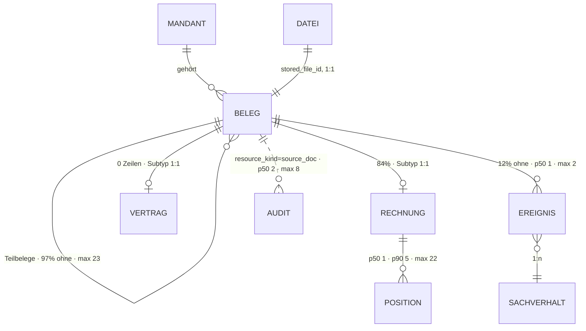

# Beleg · `source document` — Entitätsprofil

| | |
|---|---|
| Status | analysiert |
| GLOSSARY | `### Source document supertype & specializations (Beleg-Supertyp)` — englisch `source document`, Ordner `entities/document/` |
| Tabelle | `ludwig.client_source_docs` (Supertyp) + `…_invoices` · `…_contracts` (1:1-Subtypen, Class-Table-Inheritance) |
| Typen | `src/ludwig/modules/source-docs/domain/` — `source-doc-type.ts` (`SOURCE_DOC_TYPE_LABELS`, `sourceDocTypeLabel()`), `document-form-labels.ts`, `document-form-mapping.ts` (`SourceDocType`, `DocCategory`, `DocDirection`), `tabs.ts`; `modules/contracts/domain/contract.ts` — `ContractDetailData`, `CONTRACT_TYPE_LABELS` |
| Status-Achsen | `beleg_inbox` (Supertyp-`status`) · `beleg` (Pipeline, lebt am **Rechnungs-Subtyp**) · `beleg_stage` · `beleg_kategorie` · `beleg_richtung` · `dokumentgruppe` |
| Wichtigkeit | **hoch** — Kern-ER-Bild; der Rechnungs-Subtyp ebenfalls hoch, der Vertrags-Subtyp mittel (Datenmodell-Review §7) |
| Datenstand | Staging über den Pooler, 2026-09-04, **384 Belege** (318 mit Rechnungs-Zeile, 0 mit Vertrags-Zeile), 6 Mandanten |
| Rückfrage | gestellt und **beantwortet** am 2026-09-04 (Owner) — Ausprägungen füllen die Ränge, Vertrag lesend jetzt, keine fehlenden Anwendungsfälle |
| Analyse von / am | Claude, 2026-09-04 (Skill `entitaet-analysieren`) |

## Was sie ist

Ein Beleg ist **jedes** eingegangene Quell-Dokument eines Mandanten — die
Rechnung genauso wie der Vertrag, der Kontoauszug, die Reisekostenabrechnung
oder das Sammel-PDF. Er wird hochgeladen, automatisch eingeordnet und ist
fertig, wenn an ihm nichts mehr zu tun ist. Die Sachbearbeiterin fragt ihn
zwei Dinge: *was ist das, und ist es durch?*

Anzeige-Regeln aus dem GLOSSARY, wörtlich:

- „**`Beleg` ist der generische Oberbegriff für jedes eingehende
  Quell-Dokument; `Rechnung` ist nur EINE fachliche Ausprägung davon.**"
- „**Reads & UI zeigen IMMER alle Belege über die Supertyp-Ebene** (Listen,
  Timeline, Sachverhalt). Subtypen liefern nur zusätzliche Detail-Felder zur
  Anreicherung. Niemals auf `invoices` filtern, wo ‚Belege' gemeint sind —
  sonst verschwinden Verträge / Bankauszüge aus der Ansicht."
- „**Neue Belegart = neuer Subtyp + neuer Diskriminator-Wert + neuer
  Renderer-Registry-Eintrag**, NICHT Sonderpfade im bestehenden Code."
- Vier orthogonale Achsen, die **nicht** in ein Enum gemischt werden dürfen:
  `document_form` (Verarbeitungs-Form) · `document_kind` (buchhalterische
  Natur) · `doc_direction` (Richtung, nur am Rechnungs-Subtyp) ·
  `doc_category` (Folgeprozess).
- `completed_at IS NULL` = der Beleg steht noch in der Todo-Liste; das ist
  **orthogonal** zum Pipeline-Status („Pipeline durchgelaufen" ≠ „fertig").
- `doc_direction = NULL` heißt **nicht anwendbar**, nicht „unbekannt".
- `document_date` NULL bleibt NULL — es wird nicht ersatzweise mit dem
  Upload-Tag gefüllt. Die Perioden-Achse der Liste ist `received_date`.

## Die eine Regel dieses Profils: der Rang ist gemeinsam, der Füller ist Ausprägung

Der Owner hat den Punkt vor der Analyse gesetzt, die Daten stützen ihn: 84 %
der Belege sind Rechnungen, die restlichen 16 % haben **andere Felder** —
und heute keine eigene Darstellung (`ui-repraesentationen.md` B4: „Beleg 22
Komponenten · Rechnung 21 · alle anderen Belegarten zusammen 2").

Die Konsequenz für jede Form dieser Familie:

> Die **Reihenfolge** der Datenpunkte ist über alle Belegarten dieselbe.
> Welches Feld einen Rang füllt, entscheidet `source_doc_type` — über eine
> **Registry**, nicht über ein `if (isInvoice)`. Liefert eine Ausprägung für
> einen Rang keinen Füller, entfällt die Zeile; es gibt kein „—" für ein
> Feld, das es bei dieser Belegart gar nicht gibt.

Die Regel gilt **ab der Zeile**, nicht erst in der Karte (Owner 2026-09-04,
offene Frage 2): schon `DocumentRow` füllt Maß und Kennung je Ausprägung.

Die Registry ist im Code schon angelegt und ausdrücklich als leer vermerkt
(`source-doc-type.ts`: „Dies ist der Keim einer Renderer-Registry"). Sie zu
füllen ist die Arbeit dieser Familie.

| Ausprägung (`source_doc_type`) | Bestand | Subtyp-Tabelle | Rang 3 (Maß) | Rang 5 (Kennung) | eigene Punkte ab M |
|---|---:|---|---|---|---|
| Rechnung `invoice` | 322 (84 %) | `…_invoices`, 318 Zeilen | Brutto (`invoice_total_value`) | Rechnungsnummer | Netto/USt, Fälligkeit, Zahlungsziel, Leistungszeitraum, Zahlstatus, USt-IdNr., Original-Währung, Positionen |
| Sonstiger Beleg `other` | 37 (10 %) | keine | — | — | nur Supertyp-Punkte |
| Kontoauszug `bank_statement_pdf` | 10 (3 %) | **keine** → Befund B2 | — | — | Zeitraum, Konto, Saldo — existieren nirgends |
| Kreditkartenabrechnung `credit_card_statement` | 8 (2 %) | **keine** → Befund B2 | — | — | Zeitraum, Karte, Abrechnungspositionen |
| Reisekostenabrechnung `travel_expense_report` | 4 (1 %) | **keine** → Befund B2 | — | — | Abrechner, Zeitraum, Erstattungssumme |
| Vertrag `contract` | 2 (0,5 %) | `…_contracts`, **0 Zeilen** → Befund B1 | Primärbetrag (`primary_amount`) | — (Vertragsgegenstand tritt an die Stelle) | Vertragstyp, Laufzeit (Start/Ende/Monate/unbefristet), buchungsrelevante Fakten mit Provenienz |

## Schaubild



## Datenpunkte

Füllgrad ist der Anteil an **allen 384 Belegen**, nicht an den Rechnungen —
sonst sähe ein Rechnungsfeld voller aus, als es für die Familie ist.

| Datenpunkt | Quelle | Rolle | Füllgrad | heute in | änderbar | Rang | ab Form | Beleg |
|---|---|---|---|---|---|---|---|---|
| Gegenpart (`classCounterpartyName`) | Spalte, denormalisiert aus `class_companies` | Identität | 90 % | Belegliste (`PartnerCell`), `StuckDocumentsTable`, `BelegeTab`, `SourceDocFactsCard` | nie | 1 | XS | Füllgrad · heute in 4 Komponenten |
| Belegart (`sourceDocType` + `classDocumentForm`) | `abgeleitet: sourceDocTypeLabel()` | Identität | 100 % | `BelegeTab`, `SourceDocFactsCard`, Inbox | Nutzer (`ClassificationEditor`) | 2 | XS | GLOSSARY „Oberbegriff ↔ Ausprägung" · Füllgrad |
| Erledigt (`completedAt` + `completedReason` + `completedVia`) | Spalte | Zustand | 89 % | Belegliste (Spalte „Erledigt"), `DocCompletionControl` | Nutzer | — (Zustand) | XS | GLOSSARY „Document completion" |
| Maß der Ausprägung — Brutto bzw. Primärbetrag | Subtyp | Maß | 81 % (Rechnung) · 0 % (Vertrag) | Belegliste, `BelegeTab`, `BelegSummary`, `GlanceCard` | nie | 3 | S | Füllgrad · **Nutzer** (Owner 2026-09-04: je Ausprägung füllen) |
| Belegdatum (`documentDate`, bei Rechnungen `invoiceDate`) | Spalte | Zeit | 97 % | Belegliste, `BelegeTab`, `SourceDocDateEditor` | Nutzer | 4 | S | Füllgrad · GLOSSARY „NULL bleibt NULL" |
| Kennung der Ausprägung — Rechnungsnummer bzw. Dateiname | Subtyp / `ops_stored_files` | Identität | 79 % (Rechnung) | Belegliste (`InvoiceNumberCell`), `BelegeTab`, `StuckDocumentsTable` | nie | 5 | S | Füllgrad · **Nutzer** (Owner 2026-09-04: je Ausprägung füllen) |
| Sachverhalt (`caseNumber`) | Relation über `document_received`-Ereignis | Kontext | 88 % | Belegliste (`CaseCell`), `StuckDocumentsTable` | Server | 6 | S | Kardinalität aus §Relationen |
| Eingangsdatum (`receivedDate`) | Spalte, `NOT NULL` | Zeit | 100 % | Belegliste (Spalte „Eingang", **Sortierschlüssel**), `StuckDocumentsTable` | Server / DATEV-Import | 7 | S | GLOSSARY „Perioden-Achse der Belegliste" |
| Einordnung: Kategorie (`docCategory`) | Spalte, abgeleitet aus `document_form` | Zustand | **46 %** → Befund B3 | Belegliste (`ClassificationStack`) | nie (deterministisch) | — (Zustand) | S | Füllgrad · GLOSSARY „vierte orthogonale Achse" |
| Einordnung: Richtung (`docDirection`) | Subtyp Rechnung | Zustand | 64 % | Belegliste, `GlanceCard` | nie | — (Zustand) | S | Füllgrad · GLOSSARY „NULL = nicht anwendbar" |
| Einordnung: Belegform (`classDocumentForm`) | Spalte | Zustand | 100 % | Belegliste, `SourceDocFactsCard`, Inbox | Nutzer (Override) | — (Zustand) | S | Füllgrad |
| Einordnung: Beleg-Charakter (`classDocumentKind`) | Spalte | Zustand | 100 %, davon 83 % `original` | Belegliste, `SourceDocFactsCard` (nur wenn ≠ `original`) | nie | — (Zustand) | M | Füllgrad · heutige Regel „nur wenn ≠ original" |
| Verarbeitung (`processingStatus`) | Subtyp Rechnung | Zustand | 83 % → Befund B4 | Belegliste (`StatusCell`), `SourceDocPipelineTab` | nie | — (Zustand) | S | Füllgrad · Achse `beleg` |
| Zusammenfassung (`classSummary`) | Spalte | Erklärung | 100 % | `BelegSummary`, `SourceDocFactsCard`, `StuckDocumentsTable` (Tooltip) | nie | 8 | M | Füllgrad · p50 188 · p90 260 · max 400 Zeichen |
| Sachverhalts-Zusammenfassung (`classCaseSummary`) | Spalte | Erklärung | 93 % | `SourceDocFactsCard` (schlägt `classSummary`) | nie | 9 | M | Füllgrad · p90 240 Zeichen |
| Vorschau (`storedFileId` → signierte URL) | Relation 1:1, `NOT NULL` | Identität | 100 % | `BelegPreview`, `BelegDrawer`, `ContractDetail` | nie | 10 | M | „ein Beleg *hat* ein Original" (0052 Zone 2) |
| Seitenzahl (`pageCount`) | Spalte | Maß | 100 % | — | nie | 11 | M | p50 1 · p90 3 · max 27 — Frühwarnsignal Sammel-PDF |
| Seitenbereich im Original (`splitPageRange`) | Spalte | Kontext | 20 % | `ParentDocNotice` | nie | 12 | M | Füllgrad — jeder fünfte Beleg ist ein Teilbeleg |
| Einordnungs-Konfidenz (`classConfidence`) | Spalte | Erklärung | 100 % | `SourceDocFactsCard`, Inbox | nie | 13 | M | Füllgrad |
| Manuell korrigiert (`classOverriddenAt`) | Spalte | Verantwortung | 3 % | `SourceDocFactsCard` | Nutzer | 14 | L | Spaltenkommentar „UI: is not null → Hinweis" |
| Agenten-Notiz (`agentComment`) | Spalte | Erklärung | 2 % | `get_case` (nicht in der UI) | Agent | 15 | L | Füllgrad · Spaltenkommentar |
| DATEV-Ablage (`datevRefSystem`/`_folder`/`_id`) | Spalte | Kontext | 65 % | `SourceDocFactsCard`, `DatevMetaImportPanel` | Nutzer (Import) | 16 | L | Füllgrad |
| Ersetzt am (`supersededAt` + `supersededNote`) | Spalte | Zustand | 4 % | `ParentDocNotice` | Agent | 17 | L | Füllgrad · GLOSSARY „superseded ≠ deleted" |
| Dokumentgruppe (`collectionKind`) | Spalte, nur am Sammeldokument | Zustand | 3 % | — (Achse `dokumentgruppe` existiert, wird nicht gezeigt) | Nutzer | 18 | L | Füllgrad |
| Einordnungs-Fehler (`classificationError`) | Spalte | Erklärung | 0,3 % (1 Zeile) | Inbox | nie | 19 | L | Füllgrad |

Ausgelassen (Technik): `id`, `client_id`, `tenant_id`, `created_at`,
`updated_at`, `uploaded_at`, `uploaded_by` (0 % gefüllt),
`class_overridden_by` (0 %), `completed_batch_id` (0 %), `class_companies`
(die denormalisierten Felder tragen die Anzeige), `class_page_segments`
(Maschinen-Plan), sowie am Rechnungs-Subtyp `markdown`,
`extraction_payload_json`, `extraction_notes_json`,
`line_description_embedding`, `document_hash_sha256`.

**Freitext-Grenzen:** `classSummary` und `classCaseSummary` werden ab
**260 Zeichen** gekürzt (p90); `completedReason` ab **280** (p90 277, max
868 — der Grund ist ein Tooltip, kein Absatz); `classCounterpartyName` ab
**36 Zeichen** in der Zeile (p90 33).

## Relationen

| Relation | Richtung | Kardinalität | Rolle | ab Form | Darstellung | Beleg |
|---|---|---|---|---|---|---|
| Datei (`ops_stored_files`) | Eltern, 1:1 | 100 % | Identität | M | eigene Form: `DocumentPreview` (das Original selbst) | `UNIQUE (stored_file_id)` |
| Rechnungs-Detail (`…_invoices`) | Kind, 1:0..1 | 83 % | Identität | S (Maß + Kennung) · M (voll) | **eigene Form je Ausprägung** — Registry-Eintrag | 318 von 384 |
| Vertrags-Detail (`…_contracts`) | Kind, 1:0..1 | **0 %** | Identität | M | Registry-Eintrag, gegen Schema gebaut | Tabelle leer, Befund B1 |
| Rechnungspositionen (`…_invoice_lines`) | Enkel über die Rechnung | 1 % ohne · p50 1 · p90 5 · max 22 | Maß | L | Liste — eigener Auftrag, nicht in dieser Familie | Staging |
| Ereignis → Sachverhalt | Kind → Eltern | 12 % ohne · p50 1 · p90 1 · max 2 | Kontext | S | Inline des Sachverhalts (`CaseCell`), ein Klick | Staging |
| Teilbelege (`parentSourceDocId`) | Kind, selbstbezüglich | 97 % ohne · p50 0 · p90 0 · max 23 | Kontext | M | Zähler (M) · Liste (L), eingebettet als `DocumentRow` | Staging · `ChildDocsCard` |
| Sammel-Original (`parentSourceDocId`) | Eltern, selbstbezüglich | 20 % | Kontext | M | Inline mit Seitenbereich („Seiten 5–7 aus …") | Füllgrad `splitPageRange` |
| Historie (`platform_audit_events`) | ohne FK, `resource_kind = 'source_doc'` | 0 % ohne · p50 2 · p90 3 · max 8 | Verantwortung | L | Liste über `LogList` — 16 Aktionsarten, 1 065 Ereignisse | Staging |
| Extraktions-Logs (`ops_extraction_logs`) | Kind | — | Technik | L | eigener Tab, nicht diese Familie | `ui-repraesentationen.md` B5 |

## Heutige Darstellung

| Komponente | Form | zeigt | fehlt | zu viel |
|---|---|---|---|---|
| Belegliste `/[year]/documents` | Liste | Rang 1–7 + vier Einordnungs-Badges + Verarbeitung + Erledigt | nichts | — |
| `StuckDocumentsTable` | Liste | Datei, Einordnung, Gegenpart, Eingang, Sachverhalt, Beleg-Zustand | Belegdatum (genau das Feld, das der Nutzerin fehlt) | — |
| `BelegeTab` (am Sachverhalt) | Liste | Nr., Typ, Gegenpartei, Belegdatum, Brutto, Verarbeitung | Erledigt | — |
| `DocumentInbox` | Liste | Datei, Einordnung, Konfidenz, Zustand, je Zeile Aktionen | — | 983 Zeilen: Upload, Polling, Liste und Klassifikations-Editor in einer Datei |
| `InboxInvoiceSubmissionList` | Liste | Datei, Belegform, Größe, Zustand, Einreichen | — | — |
| `SourceDocFactsCard` (heißt im Code `SourceDocBelegTab.tsx`) | Karte | die **generischen** Punkte: Belegdatum, Eingang, Belegart, Belegform, Charakter, Gegenpartei, Konfidenz, DATEV-Ablage, Zusammenfassung | Erledigt-Zustand, Betrag | — |
| `GlanceCard` | Karte | die **Rechnungs-Punkte**: Belegnummer, Kreditor/Kunde, Netto/USt/Brutto, Fällig, USt-IdNr., DATEV-Konto, Original-Währung, Rolle, Charakter | — | dupliziert Belegdatum, Belegart, Charakter aus der generischen Karte |
| `ContractDetail` | Editor | die **Vertrags-Punkte**: Gegenstand, Typ, Start/Ende/Laufzeit/unbefristet, Primärbetrag, buchungsrelevante Fakten mit Provenienz | — | 647 Zeilen, Anzeige und Bearbeitung in einem |
| `BelegSummary` | Karte | Lieferant, Rechnungsnr., Rechnungsdatum, Brutto, Zusammenfassung | alles Nicht-Rechnungs-hafte | die vier Labels sind Rechnungs-Labels für **jede** Belegart |
| `BelegPreview` | Vorschau | das PDF; Titel als Prop („Vertrag" beim Vertrag) | Seitenbereich bei Teilbelegen | — |
| **v3** `DocumentFacts` (0052) | Karte | Lieferant, Rechnungsnr., Rechnungsdatum, Brutto, Zusammenfassung | **dasselbe Problem wie `BelegSummary`** — vier Rechnungs-Labels für alle Belegarten | — |
| **v3** `DocumentDrawer` (0052) | Drawer | Kopf, Original, Kernfakten, Grenze, ein Ausgang | — | `status` erwartet die Achse `beleg` (Pipeline des **Rechnungs**-Subtyps) — ein Vertrag hat dort nie einen Wert (Befund B4) |

Drei Karten für dieselbe Größe M, aufgeteilt nach Belegart, die sich in den
generischen Punkten überschneiden: das ist genau der Sonderpfad, den die
GLOSSARY-Regel verbietet. Die Ausprägung soll den **Rest** liefern, nicht die
Karte ersetzen.

## Listen

| Liste | Job (ein Satz) | Grundgesamtheit | Sortierung | Spalten (Ränge) | Filter | Massenaktion | Leerfall | Umfang p50 · p90 | Beleg |
|---|---|---|---|---|---|---|---|---|---|
| **Belegliste des Jahres** | Wenn ein Buchungsmonat abgeschlossen werden soll, will die Kanzlei alle Belege der Periode nach Eingangsdatum durchgehen, damit kein unerledigter Beleg im Jahr zurückbleibt. | alle Belege des Mandanten mit `received_date` im Jahr, `status <> 'deleted'` | Eingangsdatum ↓, dann Upload ↓ | 1–7 + Einordnung + Verarbeitung + Erledigt | Suche, Zeitraum, Kategorie, Partner, Sachverhalts-Status, „nur unerledigte", „offene Klärung" | keine | „keine Belege in dieser Periode" ≠ „keine Treffer" | 66 · 102 (Staging, 6 Mandanten-Jahre; echte Kanzlei um Größenordnungen mehr) | `/[year]/documents` |
| **Stockende Belege** | Wenn die Pipeline etwas liegen lässt, will die Kanzlei sehen, welche Belege nicht weiterkommen, damit keiner still verschwindet. | zwei Ausprägungen: „in Verarbeitung" (Pipeline läuft) und „problematisch" (ohne Belegdatum oder ohne Extraktion, **jahresunabhängig**) | älteste zuerst | Datei, Einordnung, Gegenpart, Eingang, Sachverhalt, Beleg-Zustand | keine | keine (Neustart je Zeile) | „keiner stockt" = Erfolg | 6 · 10 | `StuckDocumentsTable` |
| **Upload & Inbox** | Wenn ein Stapel PDFs hochgeladen wird, will die Kanzlei sofort sehen, was daraus wurde, damit sie eine Fehl-Einordnung korrigiert, bevor sie weiterläuft. | alle Belege des Mandanten, **jahresunabhängig** | Upload ↓ | Datei, Einordnung, Konfidenz, Zustand | keine | keine | „nichts hochgeladen" | 64 · 102 | `/document-inbox` |
| **Beleg einreichen** | Wenn der Buchungszyklus läuft, will die Kanzlei die eingeordneten Rechnungen an die Verarbeitung übergeben, damit sie im Zyklus gebucht werden. | `status='classified'` **und** qualifizierende Belegform | Upload ↑ | Datei, Belegform, Größe, Zustand | keine | **Einreichen** | „nichts einzureichen" = Erfolg | klein | `/[year]/review/upload` |
| **Belege am Sachverhalt** | Wenn jemand einen Sachverhalt prüft, will er die Belege sehen, auf denen er beruht, damit er die Buchung gegen das Papier halten kann. | Belege am Sachverhalt (über `document_received`) | Belegdatum ↑ | 1–5 + Verarbeitung | keine | keine | **zwei**: „kein Beleg zu erwarten" (mit Begründung, Erfolg) ≠ „keine verbundenen Belege" | 0 · 1 · max 20 | `BelegeTab` |
| **Teilbelege** | Wenn ein Sammel-PDF zerlegt wurde, will die Kanzlei sehen, was daraus entstanden ist, damit sie die Spur vom Original zum Einzelbeleg behält. | Kinder mit `parent_source_doc_id = <dieser Beleg>` | Seitenbereich ↑ | 1–5 + Seitenbereich | keine | keine | entfällt (die Liste erscheint nur, wenn es Kinder gibt) | 0 · 0 · max 23 | `ChildDocsCard` |

Schnitt nach §8 (eigene Komponente nur bei eigenem Job **und** Unterschied in
≥ 2 von {Grundgesamtheit, Sortierung, Filter, Massenaktion, Spaltensatz}):

- **Belegliste, Inbox und Beleg-einreichen** unterscheiden sich in
  Grundgesamtheit und Spaltensatz, teils in der Sortierung und der
  Massenaktion — aber alle drei sind lange, gefilterte, geblätterte
  Listen mit eigener Route. Das ist `DataTable` (0057) mit je einem
  Spaltensatz, nicht drei Komponenten; Vorbild `AccountEntries` (A11a).
  Je Route zusätzlich ein Seitenprofil unter `docs/seiten/`.
- **Stockende Belege**: zwei Ausprägungen, Unterschied nur in
  Grundgesamtheit und Leerfall → **ein** Spaltensatz mit `variant`-Prop,
  genau wie heute.
- **Belege am Sachverhalt** und **Teilbelege**: p90 = 1 bzw. 0, keine
  Sortierung, kein Filter, keine Pagination — das ist keine Tabelle,
  sondern `DocumentRow` × n mit Leerfall. Sie teilen sich eine kurze
  `DocumentList`; der Unterschied ist der Leerfall, also eine Prop.
- **Subtypen bekommen keine eigene Liste.** Es gibt keine
  „Rechnungsliste" und keine „Vertragsliste" — die Belegart ist Spalte
  und Filter. Das ist zugleich die GLOSSARY-Regel.

## Formen

| Form | Größe | Empfehlung | Grund (§7 Nr.) | zeigt (Ränge) | Relationen | setzt auf | ersetzt |
|---|---|---|---|---|---|---|---|
| `DocumentCell` | XS | **ja** | 3 — FK-Ziel von `client_accounting_event`; wird in fremden Zeilen genannt | 1–2 + Erledigt | — | `Badge`, `MonoCell`, `LongText` | `InvoiceNumberCell` (Belegliste), der Mono-Link in `BelegeTab` |
| `DocumentClass` | XS | **ja** | 1 — existiert als `ClassificationStack`; die vier Achsen gehören zusammen und in eine Hand | Einordnung (4 Achsen) | — | `StatusBadge` (`beleg_kategorie`, `beleg_richtung`, `dokumentgruppe`) | `ClassificationStack` |
| `DocumentRow` | S | **ja** | 1 — existiert in **sechs** Listen; 2 — Kind des Sachverhalts | 1–7 + Zustände; **Maß und Kennung je Ausprägung** | Sachverhalt als Inline, Teilbelege als Zähler | `Row`, `DocumentCell`, `DocumentClass`, `Amount`, `Time` | die Zeilen von Belegliste, `StuckDocumentsTable`, `BelegeTab`, `DocumentInbox`, `InboxInvoiceSubmissionList`, `ChildDocsCard` |
| `DocumentPreview` | M | **ja** | 1 — existiert als `BelegPreview` und ein zweites Mal inline im v3-`DocumentDrawer` | 10 + Seitenbereich (12) | Datei, Sammel-Original | `Section`, `EmptyState` | `BelegPreview`, das `<iframe>` in `DocumentDrawer` |
| `DocumentFacts` **umbauen** + Ausprägungs-Registry | M | **ja** | 1 — existiert dreifach (`SourceDocFactsCard`, `GlanceCard`, `ContractDetail`); der Owner-Punkt hängt hier | generisch 1–9, 11–13 · je Ausprägung ihre eigenen Punkte | Rechnungs-Detail, Vertrags-Detail als Registry-Einträge | `FieldList`, `Amount`, `Time`, `MonoCell` | `BelegSummary`, `SourceDocFactsCard`, den Fakten-Teil von `GlanceCard` und `ContractDetail` |
| `DocumentCard` | M | **ja** | 1 — die drei Karten oben; 2 — Beleg ist Kind des Sachverhalts und erscheint in dessen Detail | Kopf (1, 2, Erledigt) + Vorschau + Fakten | wie `DocumentFacts` | `Card`, `DocumentPreview`, `DocumentFacts`, `DocumentClass` | `BelegSummary` im Kontext, `SourceDocFactsCard` |
| `DocumentDrawer` | L | **gebaut (0052)** | 5 — aus Sachverhalt, Buchung und Klammer heraus nachgeschlagen | Kopf, Original, Kernfakten, Grenze, ein Ausgang | — | `Drawer`, `DocumentFacts` | `BelegDrawer` |
| `DocumentList` + `DocumentColumns` | L | Backlog | 6 — sechs Listen-Jobs; hängt an `DataTable` (0057) | wie `DocumentRow` | — | `DataTable`, `DocumentRow`, `EmptyState` | die sechs Listen |
| `DocumentView` | L | Backlog | 1 — die Detailseite mit sechs Tabs; braucht ein Seitenprofil | alles ab 20 % Füllgrad | Historie, Positionen, Teilbelege als Listen | `EntityHeader`, `Tabs`, `DocumentFacts`, `LogList` | `SourceDocFamily`, `InvoiceSidebar`, `DocTabsBar` |
| `DocumentEditor` | XL | **verworfen** | kein Grund aus §7 — ein Beleg entsteht durch **Upload**, nicht durch ein Formular. Die vier von Hand änderbaren Werte (Belegdatum, Einordnung, Erledigung, DATEV-Ablage) sind Einzelwerte und gehören als `InlineEdit` in den View. | | | | |
| `DocumentPicker` | S | **verworfen** | keine Stelle wählt einen bestehenden Beleg aus einer Liste; ein Beleg wird an den Sachverhalt **hochgeladen** (`CaseAttachDocumentButton` → `FileDrop`), nicht ausgesucht. | | | | |

**Bau-Reihenfolge:** `DocumentCell` + `DocumentClass` → `DocumentRow` →
`DocumentPreview` → `DocumentFacts` (Umbau) → `DocumentCard`. Der bereits
gebaute `DocumentDrawer` wird im selben Zug nachgezogen: er verliert sein
inline-`<iframe>` an `DocumentPreview` und bekommt die generischen Fakten
statt der vier Rechnungs-Labels.

## Zuschnitt

| Form / Liste | Marke | Grund | Backlog |
|---|---|---|---|
| `DocumentCell` + `DocumentClass` | jetzt | Bausteine von Zeile, Karte und Liste | — |
| `DocumentRow` | jetzt | trägt sechs Listen, ohne sie ist keine davon zu bauen | — |
| `DocumentPreview` | jetzt | trägt Karte, Drawer und View; heute zweimal dieselbe Datei | — |
| `DocumentFacts` (Umbau + Registry) | jetzt | der Owner-Punkt: Ausprägungen mit eigenen Feldern; heute dreimal getrennt gebaut. Registry-Einträge jetzt: Rechnung (Daten) und Vertrag (**lesend, gegen das Schema** — Owner 2026-09-04) | — |
| `DocumentCard` | jetzt | die eine M-Form, in der Ausprägung und Vorschau zusammenkommen | — |
| `DocumentDrawer` nachziehen | jetzt (Teil von `DocumentFacts` und `DocumentPreview`) | er benutzt beide; sonst driften v3 und v3 auseinander | — |
| Belegliste, Inbox, Einreichen (`DocumentColumns`) | Backlog | hängt an `DataTable` (0057) und an drei Seitenprofilen, die es noch nicht gibt | `0070` |
| `DocumentView` + Seitenprofil `beleg-detail.md` | Backlog | sechs Tabs, drei davon rechnungsspezifisch; braucht erst die Karte und ein Seitenprofil | `0071` |
| Positionen (`InvoiceLines`) | Backlog | Enkel-Entität mit eigenem Profil-Bedarf (Rechnungsposition, §7 „mittel") | `0072` |
| `ContractFacts` bearbeitbar (`ContractDetail`-Nachfolger) | Backlog | 0 Zeilen im Bestand; die **lesende** Vertrags-Ausprägung entsteht jetzt, der Editor wartet auf Daten | `0073` |
| `DocumentEditor` | verworfen | Belege entstehen durch Upload; Einzelwerte über `InlineEdit` | — |
| `DocumentPicker` | verworfen | kein Screen wählt einen bestehenden Beleg aus | — |

## Befunde für `ludwig/app`

- **B1 — `client_source_docs_contracts` ist leer (0 Zeilen)**, obwohl 7
  Audit-Ereignisse (`contract.fields_updated`, `contract.fields_confirmed`)
  und eine 647-Zeilen-UI existieren. Die Vertrags-Ausprägung wird gegen das
  Schema und `ContractDetailData` gebaut, nicht gegen Daten — jede Zeile ihres
  Registry-Eintrags trägt deshalb den Beleg `Schema`, nicht `Staging`.
- **B2 — Drei Belegarten haben keinen Subtyp.** Kontoauszug (10),
  Kreditkartenabrechnung (8) und Reisekostenabrechnung (4) tragen einen
  eigenen Diskriminator-Wert und einen eigenen Folgeprozess, aber keine
  Tabelle für ihre Felder (Zeitraum, Konto, Saldo; Karte; Abrechner,
  Erstattungssumme). Ihr Registry-Eintrag bleibt bis dahin leer — die
  Ausprägung zeigt nur Supertyp-Punkte. Das ist kein UI-Mangel, sondern ein
  fehlendes Stück Datenmodell.
- **B3 — `doc_category` ist nur zu 46 % gefüllt.** Die Achse kam mit F87,
  ein Backfill für den Altbestand fehlt. Ein Filter über die Kategorie
  („fachlich stabil", laut GLOSSARY der empfohlene Listenfilter) sieht heute
  die Hälfte der Belege nicht.
- **B4 — Die Achse `beleg` (Verarbeitung) lebt am Rechnungs-Subtyp.** Für
  einen Vertrag oder Kontoauszug gibt es dort nie einen Wert; die Achse des
  **Supertyps** ist `beleg_inbox`. Der v3-`DocumentDrawer` erwartet in
  `status` heute die Achse `beleg` — für 16 % der Belege ist das kein
  gültiger Zustand.
- **B5 — Der Beleg-Charakter (`document_kind`) hat keine Registry-Achse**,
  obwohl die Belegliste ihn als Badge zeigt (`ClassificationStack`) und
  `DOCUMENT_KIND_LABEL` existiert. Vier Einordnungs-Achsen, drei in der
  Registry.
- **B6 — Für „Gegenpart des Belegs" fehlt eine Ableitung.** Die Belegliste
  rechnet sie in `PartnerCell` aus `docDirection` + `vendorName` /
  `customerName`, `BelegeTab` nimmt `class_counterparty_name`, der Drawer
  „Lieferant". Drei Wege zu einem Namen; eine Funktion
  `documentCounterparty()` in `src/ludwig/modules/source-docs/domain/` fehlt.
- **B7 — `listInvoicesForClient` liest vom Supertyp und liefert alle
  Belegarten.** Der Name behauptet das Gegenteil und ist die vermutlich
  häufigste Quelle des Missverständnisses „Beleg = Rechnung". Kosmetisch,
  aber billig zu beheben.
- **B8 — Kein Befund, eine Entscheidung für dieses Repo:** Die Erledigung
  ist in der App bewusst **keine** Registry-Achse (binär, kein eigener
  Werteraum) und wird als Häkchen mit Tooltip gezeigt. V7 und V11 verlangen
  Wort statt Icon — v3 bekommt dafür die zweiwertige Achse
  `beleg_erledigung` („Erledigt" / „Offen") in der Registry dieses Repos.

## Offene Fragen

Alle drei am 2026-09-04 vom Owner beantwortet — die Antworten stehen als
Beleg `Nutzer` in den Tabellen, nicht als Annahme.

1. **Fehlen Anwendungsfälle?** — *beantwortet:* nein, „reicht erstmal". Es
   bleibt bei den sechs Listen und den Formen oben; die drei Belegarten ohne
   eigene Darstellung bekommen keine zusätzliche Ansicht, sondern die
   Supertyp-Punkte.
2. **Wie weit geht die Ausprägung in die Zeile?** — *beantwortet:* **je
   Ausprägung füllen.** Der Rang „Maß" trägt bei der Rechnung das Brutto, beim
   Vertrag den Primärbetrag, beim Kontoauszug nichts; der Rang „Kennung"
   trägt die Rechnungsnummer bzw. den Vertragsgegenstand. Leer bleibt leer —
   kein „—" für ein Feld, das es bei dieser Belegart nicht gibt. Damit gilt
   die Regel dieses Profils auch in der Zeile, nicht erst in der Karte.
3. **Vertrag ohne Daten?** — *beantwortet:* **ja**, die lesende
   Vertrags-Ausprägung entsteht jetzt gegen Schema und `ContractDetailData`.
   Der Vertrags-Editor bleibt 0073, bis die Extraktion Zeilen schreibt: ohne
   einen einzigen Vertrag im Bestand hätte die Abnahme keinen Nachweis.

## Prüfung

Gehört dem zweiten Agenten.

| Zeile / Form | Einwand | Ergebnis | Geprüft von / am |
|---|---|---|---|
| | | | |

## Weiter

Prüfprompt (neue Sitzung, anderer Agent):

```
Prüfe das Entitätsprofil docs/entitaeten/document.md nach Skill entitaet-analysieren §5–§9.
Zuerst jede Zeile mit Beleg „Annahme" oder „Schema": belege oder widerlege sie mit Füllgrad,
heutiger Komponente oder GLOSSARY. Dann die Ränge: deck die Punkte ab Rang k ab — erkennt
eine Sachbearbeiterin den Beleg noch, auch wenn er kein Rechnung ist? Prüf dabei besonders
die Regel „der Rang ist gemeinsam, der Füller ist Ausprägung": trägt sie für alle sechs
Werte von source_doc_type? Dann die Formen: hat jede empfohlene einen Grund aus §7, fehlt
eine, die die App heute hat? Dann die Listen: hat jede einen Job-Satz, und ist jede
Ausprägung nach §8 eine eigene Komponente wert oder nur ein Prop? Zuletzt der Zuschnitt:
sind höchstens fünf Formen „jetzt", und trägt jede Backlog-Zeile ihren Grund? Trag jeden
Einwand in „Prüfung" ein, ändere die Tabellen, wo du sicher bist, und setze den Status auf
„geprüft". Kundendaten bleiben in der Datenbank; nur SELECT.
```

Startprompt (neue Sitzung, nach Status `geprüft`):

```
Für die Entität Beleg (`source document`) liegt das geprüfte Profil unter
docs/entitaeten/document.md. Schreibe mit Skill spec-schreiben je Form eine Spec, in dieser
Reihenfolge — nur die Formen mit Marke „jetzt" aus dem Abschnitt Zuschnitt:
DocumentCell + DocumentClass, DocumentRow, DocumentPreview, DocumentFacts (Umbau der
bestehenden Komponente aus 0052 plus Ausprägungs-Registry), DocumentCard. Was dort
„Backlog" trägt (0070–0073), bleibt liegen. Tragende Regel für jede Spec: die Reihenfolge
der Datenpunkte ist über alle Belegarten dieselbe, welches Feld einen Rang füllt entscheidet
source_doc_type über eine Registry — kein `if (isInvoice)` in einer Komponente. Jede Spec
verlinkt das Profil als Quelle und nimmt Datenpunkte, Ränge, Relationen und „ersetzt" von
dort, nicht aus dem Chat; die Punkte einer Form sind die Ränge bis zu ihrer Größe, in
derselben Reihenfolge. Danach baut Skill v3-komponente jede Spec in derselben Reihenfolge,
die größere Form komponiert die kleinere; im selben Zug wird DocumentDrawer (0052)
nachgezogen — inline-<iframe> raus, DocumentPreview rein, generische Fakten statt der vier
Rechnungs-Labels. Abgenommen wird von einem anderen Agenten gegen die Spec. Nur eigene
Dateien stagen. Setze am Ende den Status des Profils auf „in Specs" und trage die
Backlog-Nummern ein.
```
