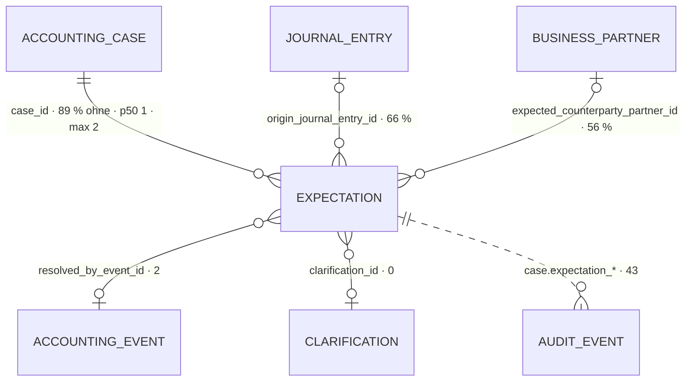

# Erwartung · `expectation` — Entitätsprofil

| | |
|---|---|
| Status | **analysiert** |
| GLOSSARY | `### Expectation`, `### Beleg-Nachforderung (document request)` — englisch `expectation`, Ordner `entities/expectation/` (besteht seit 0025) |
| Tabelle | `ludwig.client_accounting_case_expectation` — „Erwartung am Sachverhalt: hier fehlt noch ein Beleg (kind=document) oder eine Zahlung (kind=payment), fällig ab due_date. Aufgelöst wird sie durch ein EREIGNIS, nicht durch eine Antwort" (Tabellenkommentar). Keine Subtypen; Beleg und Zahlung sind eine Tabelle „aus zwei Enden gelesen" (GLOSSARY) |
| Typen | `accounting-cases/domain/expectation.ts` — `ExpectationRow` (samt `resolvedAt`, L-205 erledigt), `ExpectationDirection`, `DueSource`, `ExpectationAudience`, `ExpectationResolution`; `domain/case.ts` — `EXPECTATION_KINDS`, `EXPECTATION_MATURITY`, `expectationMaturity()`; `domain/expectation-labels.ts` — `EXPECTED_DOC_KIND_LABEL`, `expectedDocKindLabel()` (seit 2026-09-11 eine Map statt zwei) |
| Status-Achsen | `expectation_maturity` (Läuft · Fällig · Eskaliert · Erledigt — abgeleitet, nie gespeichert) · `expectation_kind` (Beleg fehlt · Zahlung offen). **Ohne Achse und ohne Wortliste:** `due_source`, `resolution`, `audience`, `direction` (L-332) |
| Wichtigkeit | App-Roadmap (9be34746) Rang 10 |
| Datenstand | Staging, **2026-09-11**: Erhebung `docs/entitaeten/expectation-staging-erhebung-2026-09-11.md` (Code-Stand `46d976cb`), am selben Tag nachgezählt — unverändert: **135 Erwartungen** an 132 Sachverhalten, 6 Mandanten; 119 offen, 94 davon überfällig; 16 erledigt. Nur `SELECT`, keine Kundendaten; Beispielwerte erfunden |
| Bestandswarnung | **Keine Nutzerin hat je eine Erwartung erledigt** — die 2 von Hand erledigten sind Klicks des Agenten; 14 erledigte der Abgleich. **Eskaliert ist eine** von 94 überfälligen (L-331). Zahlungserwartungen gibt es praktisch erst seit KW 2026-09-07 |
| Rückfrage | gestellt am 2026-09-11 an `ludwig-manager` — Defaults gelten, bis sie beantwortet ist |
| Analyse von / am | Claude, 2026-09-11 (Skill `entitaet-analysieren`) |

## Was sie ist

Eine Erwartung sagt, was an einem Sachverhalt noch kommen muss — ein Beleg
oder eine Zahlung —, bis wann, und wer es besorgt. Die Sachbearbeiterin sieht
sie am Sachverhalt und in der Stapelabnahme; sie erledigt sie nicht durch eine
Antwort, sondern das Ereignis erledigt sie: der Beleg geht ein, die Zahlung
kommt.

**Anzeige-Regeln**, wörtlich:

- „Unlike a `Clarification question` it is not *answered* but **resolved by
  an event**." (GLOSSARY)
- „The document expectation is the ONLY representation of a missing document
  (F125)." (GLOSSARY)
- „`note` is one sentence of context (amount, reference and date have columns
  and never belong in that text)." (GLOSSARY)
- „**Created by the booking, never by a due date** […] the DATEV open-item
  mirror stays a mirror and creates none." (GLOSSARY) — der offene Posten ist
  Profil `open-item`, nicht diese Entität.
- „Carries **no open balance** — that is computed from the events."
  (GLOSSARY, Tabellenkommentar)
- `escalation_level`: „Ludwigs eigene Reife-Achse — NICHT die
  DATEV-Mahnstufe." (Spaltenkommentar)
- „Nachforderung" ist das Wort für die Beleg-Erwartung, die der Mandant
  besorgt; im Code heißt sie `expectation` (GLOSSARY „Beleg-Nachforderung").

## Schaubild



## Datenpunkte

| Datenpunkt | Quelle | Rolle | Füllgrad | heute in | änderbar | Rang | ab Form | Beleg |
|---|---|---|---|---|---|---|---|---|
| Was fehlt (`kind`, bei Belegen `expected_document_kind`) | Spalten | Identität (Achse `expectation_kind`) | 100 % · Belegart 43 von 43 Belegen | `ExpectationChip`, `ExpectationRow`, `FehltPanel` („Rechnung fehlt"), Schritt 5 | nie | 1 | XS | Registry · `expectedDocKindLabel()` |
| Gegenpartei (`expected_counterparty_name`) | Spalte | Identität | 85 % — Belege 39/43, Zahlungen 76/92 | `ExpectationRow`, `FehltPanel`, Schritt 5 (gruppiert) | nie | 2 | XS | Füllgrad · Länge p50 16 · max 49 |
| Frist (`due_date`) und Reife (`expectationMaturity()`) | Spalte + `abgeleitet: expectationMaturity` | Zeit / Zustand (`expectation_maturity`) | 100 % | `ExpectationChip`, `ExpectationRow`, `FehltPanel` („erbeten bis … · Fällig"), Schritt 5 | nie | 3 | XS | Registry · 0025 |
| Betrag (`expected_amount`) | Spalte | Maß | 99 % | `ExpectationRow`, `FehltPanel`, Schritt 5 | nie | 4 | S | Füllgrad · ohne Währung (L-23) |
| Referenz (`expected_reference`) | Spalte | Identität | 81 % | `FehltPanel` („Nr."), Matcher | nie | 5 | S | Füllgrad · Länge p50 9 · max 41 |
| Wer besorgt (`audience`) | Spalte | Verantwortung | 100 % — Kanzlei 121 · Mandant 14 | `ExpectationRow` („Nachforderung"/„Erwartung"), `FehltPanel` („besorgt der Mandant / die Kanzlei") | nie | 6 | S | GLOSSARY F125 · zwei Wortlaute (L-332) |
| Erwartetes Datum (`expected_date`) | Spalte | Zeit | 90 % | `FehltPanel` („Datum") | nie | 7 | M | Füllgrad; Merkmal zum Wiedererkennen, nicht die Frist |
| Richtung (`direction`) | Spalte | Kontext | 100 % | Schritt 5 („Uns wird geschuldet" / „Wir schulden") | nie | 8 | M, nur bei Zahlungen | heute in |
| Fristquelle (`due_source`) | Spalte | Erklärung | 100 % — Mandanten-Standard 66 · Rechnungsfrist 50 · Zahlungsziel 19 | Schritt 5 („Frist kommt aus", lokale Map) | nie | 9 | M | L-332 |
| Notiz (`note`) | Spalte | Erklärung | 17 % — nur Belege (23 von 43) | `ExpectationRow`, `FehltPanel` | nie (Agent schreibt) | 10 | M | Länge p50 80 · max 307 |
| Eskalationsstufe (`escalation_level`, `escalated_at`) | Spalten | Zustand | 100 % · über 0: **1** | Schritt 5 (als „Mahnstufe", L-332) | Server | 11 | L; in S steckt sie in der Reife „Eskaliert" | Füllgrad · L-331 |
| Auflösung (`resolution`, `resolved_at`) | Spalten | Zustand | 12 % — Abgleich 14 · von Hand 2 · aufgehoben 0 | nirgends als Wort (Knopf-Titel) | Nutzer (Erledigt, Aufheben) · Server | 12 | L | Füllgrad · L-332 |
| Erledigt durch (`resolved_by_event_id`) | Spalte | Kontext | 1 % — 2 von 16 erledigten | nirgends | Server | 13 | L | L-330 |
| Entstanden aus (`origin_journal_entry_id`) | Spalte | Kontext | 66 % — Zahlungen 89/92, Belege 0 | nirgends | nie | 14 | L | Füllgrad · Profil `journal-entry` |
| Angelegt (`created_at`) | Spalte | Zeit | 100 % | nirgends | nie | 15 | L | — |

Ausgelassen (Technik): `id`, `tenant_id`, `client_id`, `case_id` (Kontext),
`agent_run_id` (20 %; zählt „in diesem Lauf gestellte Nachforderungen" — ein
Bericht, keine Anzeige), `clarification_id` (0 %, L-24), `updated_at`.

Freitext-Grenzen: `note` max 307 — ganz, zwei Zeilen, dann gekürzt mit dem
Rest im `title` (0025 M8). Gegenpartei max 49, Referenz max 41: ungekürzt.

## Relationen

| Relation | Richtung | Kardinalität | Rolle | ab Form | Darstellung | Beleg |
|---|---|---|---|---|---|---|
| Sachverhalt (`case_id`) | Eltern | 132 von 1.222 Sachverhalten tragen eine · je Sachverhalt p50 1 · max 2 · offen je Mandant p50 7 · p90 78 · max 78 | Kontext | S, außerhalb des Sachverhalts | `CaseCell` in fremden Listen (Schritt 1, Schritt 5); am Sachverhalt selbst nie | Erhebung (b) |
| Geschäftspartner (`expected_counterparty_partner_id`) | Eltern | 56 % — Zahlungen 76/92, Belege **0**/43 | Identität | S | `BusinessPartnerCell`, wenn gesetzt; sonst der Name (L-333) | Erhebung (a) |
| Buchungssatz, aus dem sie entstand (`origin_journal_entry_id`) | Eltern | 66 % | Kontext | L | `JournalEntryCell` (0044) | Profil `journal-entry` (89 Erwartungen) |
| Ereignis, das sie erledigte (`resolved_by_event_id`) | Eltern | 2 von 16 erledigten | Kontext | L | `EventCell` — Profil `accounting-event` | L-330 |
| Rückfrage (`clarification_id`) | Eltern | 0 von 135 | — | — | nicht zeigen | L-24 |
| Historie (`platform_audit_events`) | ohne FK | `case.expectation_opened` 41 · `case.expectation_resolved` 2 — alle vom Agenten; Zahlungserwartungen und Abgleich schreiben keins | Verantwortung | — | kein Strang; die Erwartung steht im Strang ihres Sachverhalts (`CaseTimeline`, 0040) | Erhebung (c) · L-330 |

## Heutige Darstellung

| Komponente | Form | zeigt | fehlt | zu viel |
|---|---|---|---|---|
| `ExpectationChip`, `ExpectationRow` (Set, 0025 fertig) | Chip, Zeile | Art, Titel (Belegart oder „Nachforderung"/„Erwartung" · Gegenpartei), Notiz, Betrag, Frist, Reife; „Erledigt" (`onResolve`), Sprung in den Sachverhalt | „Aufheben" (`obsolete`); die Belegart-Wörter holt die Zeile nicht aus dem Spiegel (`documentKindLabel` als Prop, seit 2026-09-11 gibt es `expectedDocKindLabel()`); `resolvedAt` hält sie lokal, obwohl der Spiegel es trägt (L-205 erledigt) | — |
| `FehltPanel` (App, `accounting-cases/ui/sachverhalt`, 171 Z.) | Karte „Fehlt" am Sachverhalt | je Beleg-Erwartung: Belegart, Gegenpartei · Betrag · Datum · Nr., Notiz, Frist, `StatusBadge expectation_maturity`, wer besorgt; „hochladen", „Erledigt", „Aufheben" | **Zahlungserwartungen** — die Seite filtert sie weg (L-329); ein Grund beim Aufheben | eine Handzeile statt `ExpectationRow` |
| Stapelabnahme Schritt 1, fünfte Zeile (App) | aufklappbare Liste | Sachverhalte, die auf einen Beleg warten; Knopf „Mail-Entwurf" (`DocumentRequestMailPanel`) | — | — |
| Stapelabnahme Schritt 5 (App, `Step5List`, 364 Z.) | Liste mit Detail | Zahlungserwartungen gruppiert nach überfällig · in Frist · zurückgestellt und je Gegenpartei mit Summe; Detail „Der Posten": Betrag, Fällig, Fristquelle, Richtung, „Mahnstufe", Grund der Wiedervorlage; „DATEV-Stand" | der DATEV-Stand (immer leer, L-328) | die Eskalation heißt „Mahnstufe" (L-332); `FRIST_QUELLE` als lokale Map |
| Showcase `case` (Set): Randspalte „Erwartungen", `CaseTimeline`, `ExpectationPane` | Zeile, Strang-Eintrag, Detail | beide Arten, auch an abgeschlossenen Sachverhalten; im Detail `ExpectationRow`, der Satz, was sie erledigt, „Erledigt" und „Aufheben" von Hand | — | die Knöpfe von Hand neben der Zeile |

## Listen

| Liste | Job | Grundgesamtheit | Sortierung | Spalten (Ränge) | Filter | Massenaktion | Leerfall | Umfang p50 · p90 | Beleg |
|---|---|---|---|---|---|---|---|---|---|
| „Was fehlt noch" — Stapelabnahme Schritt 1 | Wenn **ein Stapel abgenommen wird**, will **die Sachbearbeiterin** **sehen, welche Belege noch fehlen und wer sie besorgt**, damit **sie dem Mandanten eine Nachforderung schickt, bevor sie freigibt** | offene Beleg-Erwartungen der Sachverhalte im Stapelzeitraum | Frist, älteste zuerst | 1–6 + Sachverhalt | wer besorgt | **Nachforderung als Mail** (`DocumentRequestMailPanel`) | „alle Belege da" (Erfolg) | 5 · 12 (offene Belege je Mandant) | Erhebung · `Step1.tsx` |
| „Wer schuldet wem?" — Stapelabnahme Schritt 5 | Wenn **ein Stapel abgenommen wird**, will **die Sachbearbeiterin** **sehen, welche Zahlungen ausstehen, wie lange schon und bei wem**, damit **sie nachfragt oder eine Wiedervorlage setzt** | offene Zahlungserwartungen | gruppiert: überfällig · in Frist · zurückgestellt; darin je Gegenpartei mit Summe | 1–4, 6, 8, 9, 11 | — | keine | „nichts offen" | 79 offene auf 6 Mandanten | Erhebung · `Step5.tsx`, `open-items.ts` |
| „am Sachverhalt" — Randspalte und Strang | Wenn **die Sachbearbeiterin einen Sachverhalt öffnet**, will **sie sehen, was noch kommen muss und bis wann**, damit **sie weiß, ob sie warten kann oder handeln muss** | die Erwartungen eines Sachverhalts | Frist | 1–6 | — | — | ein Satz „nichts erwartet" | 1 · 1 (max 2) | 0152 Nachtrag, D20 · `CaseTimeline` (0040) |

Die dritte ist **keine Liste**: bei höchstens zwei Einträgen stehen
`ExpectationRow`-Zeilen untereinander (§8, p90 unter 20). Die ersten beiden
sind nach §8 zwei Ausprägungen — sie unterscheiden sich in Grundgesamtheit,
Gruppierung, Massenaktion und Spaltensatz — und beide gehören der
Stapelabnahme, die noch kein Seitenprofil hat (0167). Backlog 0172 und 0173,
wie 0168 und 0170.

## Formen

| Form | Größe | Empfehlung | Grund (§7 Nr.) | zeigt (Ränge) | Relationen | setzt auf | ersetzt |
|---|---|---|---|---|---|---|---|
| `ExpectationChip` | XS | **besteht** (0025 fertig) | 1 | 1–3 | — | — | — |
| `ExpectationRow` | S | **besteht** (0025 fertig) — mit Nachtrag | 1 | 1–6 | Sachverhalt, Partner inline | — | — |
| `ExpectationCard` | M | nein | kein Screen zeigt eine Erwartung als Karte im Kontext einer anderen Entität; am Sachverhalt steht die Zeile | | | | |
| `ExpectationFacts` | L | ja | 1 — existiert als Detail „Der Posten" in Schritt 5 und als `ExpectationPane` im Showcase; `FehltPanel` zeigt denselben Satz Fakten je Zeile | 1–15; die Wege „Erledigt" und „Aufheben" mit Grund; „erledigt durch …" nur, wenn es ein Ereignis gibt | Buchungssatz, Ereignis, Partner inline | `FieldList`, `StatusBadge`, `JournalEntryCell`, `EventCell` (noch nicht gebaut — Profil `accounting-event`), `BusinessPartnerCell`, `ActionButton` (0121/0159), `ReasonDialog` | „Der Posten" in `Step5List`, die Fakten-Zeile in `FehltPanel`, `ExpectationPane` |
| `ExpectationList` | L | Backlog | 6 — zwei Listen-Jobs, zwei Ausprägungen, beide in der Stapelabnahme | | | | |
| `ExpectationView`, `ExpectationDrawer` | L | nein | keine Route; kein FK-Ziel — die Erwartung lebt am Sachverhalt und wird dort gezeigt, nicht nachgeschlagen | | | | |
| `ExpectationEditor` | XL | nein | 4 greift nicht: von Hand änderbar ist nur die Auflösung — eine Aktion, kein Formular; angelegt wird sie von Agent und Server (offene Frage 1) | | | | |

Bau-Reihenfolge: Nachtrag 0025 (Zeile) → `ExpectationFacts`.

## Zuschnitt

| Form / Liste | Marke | Grund | Backlog |
|---|---|---|---|
| Nachtrag `ExpectationRow` (0025) | jetzt | „Aufheben" fehlt; `resolvedAt` und die Belegart-Wörter kommen jetzt aus dem Spiegel | `docs/backlog/0025-expectation.md`, Nachtrag 2026-09-11 |
| `ExpectationFacts` | jetzt | existiert in Schritt 5 und im Showcase; trägt die Auflösung, die heute niemand sieht | — |
| „Was fehlt noch" (Schritt 1) | Backlog | eigene Ausprägung; Stapelabnahme ohne Seitenprofil (0167) | `docs/backlog/0172-expectation-document-request-list.md` |
| „Wer schuldet wem?" (Schritt 5) | Backlog | eigene Ausprägung; Stapelabnahme ohne Seitenprofil (0167); die Wörter fehlen in der Domäne (L-332) | `docs/backlog/0173-expectation-payment-review-list.md` |
| `ExpectationCard`, `ExpectationView`, `ExpectationDrawer`, `ExpectationEditor` | verworfen | kein Grund aus §7 Nr. 1–6 (Tabelle „Formen") | — |

## Befunde für `ludwig/app`

- **L-329** — Zahlungserwartungen fehlen auf der Seite des Sachverhalts
  (`page.tsx:196` filtert auf Belege); 72 der 79 offenen hängen an
  abgeschlossenen Sachverhalten.
- **L-330** — Die Auflösung hinterlässt keine Spur: 12 von 14 Abgleichen ohne
  Ereignis, keiner im Audit; Zahlungserwartungen entstehen ohne Audit.
- **L-331** — Die Eskalation greift nicht: 94 überfällig, 1 eskaliert.
- **L-332** — Fristquelle, Auflösung und Adressat haben keine Wortliste;
  Schritt 5 nennt die Eskalation „Mahnstufe".
- **L-333** — Beleg-Erwartungen kennen ihren Geschäftspartner nicht (0 von 43).
- Weiter offen: **L-23** (keine Währung), **L-24** (`clarification_id` tot).
  **L-210** ist mit dem Spiegel c48d8042 erledigt (`ExpectationKind` einmal).

## Offene Fragen

1. Soll die Sachbearbeiterin eine Erwartung selbst anlegen können? Heute tun
   das nur Agent und Server. — ohne Antwort: **nein**; kein Formular, der Weg
   ist der Beleg selbst oder eine Rückfrage an den Agenten.
2. Braucht „Aufheben" einen Grund? Das Schema nimmt `reason`, das Panel sendet
   keinen. — ohne Antwort: **ja**, Pflicht bei „Aufheben" (`ReasonDialog`),
   freiwillig bei „Erledigt".
3. Stehen Zahlungserwartungen abgeschlossener Sachverhalte in der Randspalte? —
   ohne Antwort: **ja**, mit ihrer Reife; der Sachverhalt ist gebucht, die
   Zahlung steht aus (S18) — das zeigt das Set schon (0152).

## Prüfung

Gehört dem zweiten Agenten.

| Zeile / Form | Einwand | Ergebnis | Geprüft von / am |
|---|---|---|---|

## Weiter

Prüfprompt (neue Sitzung, anderer Agent):

```
Prüfe das Entitätsprofil docs/entitaeten/expectation.md nach Skill entitaet-analysieren §5–§9.
Zuerst jede Zeile mit Beleg „Annahme": belege oder widerlege sie mit Füllgrad, heutiger
Komponente oder GLOSSARY. Dann die Ränge: deck die Punkte ab Rang k ab — erkennt eine
Sachbearbeiterin den Vorgang noch? Dann die Formen: hat jede empfohlene einen Grund aus
§7, fehlt eine, die die App heute hat? Dann die Listen: hat jede einen Job-Satz, und ist
jede Ausprägung nach §8 eine eigene Komponente wert oder nur ein Prop? Zuletzt der Zuschnitt:
sind höchstens fünf Formen „jetzt", und trägt jede Backlog-Zeile ihren Grund? Trag jeden
Einwand in „Prüfung" ein, ändere die
Tabellen, wo du sicher bist, und setze den Status auf „geprüft". Kundendaten bleiben in
der Datenbank; nur SELECT.
```

Startprompt (neue Sitzung, nach Status `geprüft`):

```
Für die Entität Erwartung (`expectation`) liegt das geprüfte Profil unter
docs/entitaeten/expectation.md. Arbeite zuerst den Nachtrag 2026-09-11 in
docs/backlog/0025-expectation.md ab (Skill v3-komponente, fremde Abnahme). Schreibe dann mit
Skill spec-schreiben die Spec für ExpectationFacts — die einzige neue Form mit Marke „jetzt"
aus dem Abschnitt Zuschnitt. Was dort „Backlog" trägt, bleibt liegen. Die Spec verlinkt das
Profil als Quelle und nimmt Datenpunkte, Ränge, Relationen und „ersetzt" von dort, nicht aus
dem Chat; die Punkte der Form sind die Ränge bis zu ihrer Größe, in derselben Reihenfolge.
Danach baut Skill v3-komponente die Spec, sie komponiert ExpectationRow. Abgenommen wird von
einem anderen Agenten gegen die Spec. Nur eigene Dateien stagen. Setze am Ende den Status
des Profils auf „in Specs" und trage die Backlog-Nummern ein.
```
