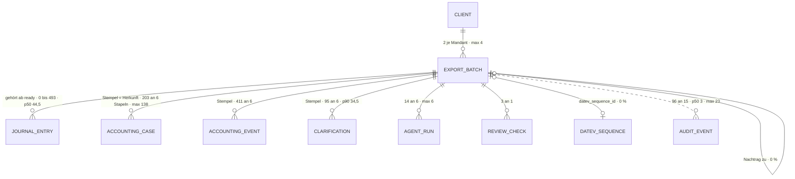

# Stapel / Buchungszyklus · `booking cycle` (`export batch`) — Entitätsprofil

| | |
|---|---|
| Status | **analysiert** |
| GLOSSARY | `### Buchungszyklus / Stapel` (englisch `booking cycle`, `export batch`), `### Export marking / export batch`, `### Buchungsstapel (EXTF)`, `### Stapelabnahme` — Ordner `entities/export-batch/` |
| Tabelle | `ludwig.client_datev_export_batches` — „Zyklus, Stapel und Exportvorgang sind dieselbe Zeile" (GLOSSARY). Keine Subtypen; die Art (`kind`) trennt `regular` und `client_batch` (Mandantenstapel) |
| Typen | `datev-export/domain/booking-cycle.ts` — `BOOKING_CYCLE_KINDS` · `batch-process.ts` — `BATCH_PHASES`, `batchPhaseProgress()`, `batchOwner()`, `BatchListFilter`, `matchesBatchFilter()`, `batchOpenLabel()`, `batchActions()` · `staffel.ts` — `staffelSegmente()`, `humanDuration()` · `batch-log.ts` · `stapelabnahme/domain/` — `ABNAHME_STEPS`, `ABNAHME_STEP_SCOPE`, `abnahmeGating()`, `railZaehler()`. **Nicht im Spiegel:** die Formen, die Liste und Detail lesen (`AgentBatchQueueItem`, `BookingCyclePeriod` und die Zähler in `datev-export/application/booking-cycle-core.ts`, server-only) → L-306 |
| Status-Achsen | `zyklus_stapel` (`state`, 11 Werte) · `datev_pruefung` (`inspection_status`) · `stapel_commit` (am DATEV-Stapel) · `lauf` / `lauf_gate` an den Buchungsläufen. **Wer dran ist** ist abgeleitet (`batchOwner()`), keine Achse. **Ohne Wortliste:** die Art (`kind`) → L-308 |
| Wichtigkeit | **hoch** — Roadmap der App (9be34746) Rang 3: „Jeder Wochenlauf beginnt und endet hier" |
| Datenstand | Staging über den Pooler, **2026-09-11**, schreibgeschützte Sitzung: **14 Stapel, 6 Mandanten** (2 je Mandant, max 4); Verlauf 96 Audit-Ereignisse an 15 Stapeln. Nur `SELECT`, keine Kundendaten; Beispielwerte erfunden |
| Bestandswarnung | **Kein Stapel ist über die Bridge gelaufen:** `datev_operation_id`, `datev_sequence_id`, `inspection_status`, `datev_error` 0 %; die 8 `confirmed` sind CSV-Exporte (`file_name`, `metrics`, `datev_protocol` je 57 % = 8 von 14). Nur drei der elf Zustände kommen vor (`confirmed` 8 · `prepared` 5 · `review` 1) — die Stories müssen alle elf aus dem CHECK zeigen (Roadmap). `entry_count` zählt die exportierten Sätze, nicht den Inhalt (L-307) |
| Rückfrage | gestellt und **beantwortet** am 2026-09-11 (`ludwig-manager`, aus dem App-Stand): die Defaults der drei Fragen gelten; sieben Anwendungsfälle zugeordnet (§Heutige Darstellung); keine Auswahl-Dialoge — die Zuordnung Beleg → Stapel macht der Server (`period_to`, F203) |
| Analyse von / am | Claude, 2026-09-11 (Skill `entitaet-analysieren`) |

## Was sie ist

Der Stapel ist die Klammer um die **Bearbeitung eines Zeitraums**: er entsteht,
bevor jemand darin arbeitet, trägt die Durchgänge des Agenten und die Arbeit
der Kanzlei, wird freigegeben und endet, wenn DATEV ihn quittiert und der
Spiegel ihn wiedergefunden hat. Die Sachbearbeiterin sieht an ihm, welcher
Zeitraum offen ist und wer ihn hält, übernimmt die Prüfung, geht die elf
Schritte der Stapelabnahme und gibt frei.

**Anzeige-Regeln** (wörtlich):

- „**Wer dran ist, IST der Zustand**" (GLOSSARY, Buchungszyklus) — die Zeile
  zeigt Zustand und Besitzer als eins.
- „Der **Stempel** `export_batch_id` auf Buchung, Sachverhalt, Ereignis,
  Klärung, Notiz und Regel ist **Herkunft, keine Zugehörigkeit** — nur
  `client_journal_entry` gehört ab `ready` genau einem Zyklus." (ebd.) —
  Zähler der anderen Kinder heißen „entstanden in", nicht „enthält".
- „Die Sperre hängt am Zustand, nicht am Stempel" (ebd.)
- „**Je Mandant genau ein offener regulärer Zyklus**, je Zeitraum genau ein
  offener" (ebd.) — ein zweiter für denselben Zeitraum ist ein Nachtrag.
- „Geschrieben wird nur in `review`." · „Der Rail ist ein Vorschlag, kein
  Zwang" (GLOSSARY, Stapelabnahme)
- „ein `prepared`-Stapel mit offenen Nachforderungen wartet nicht auf die
  Kanzlei, sondern auf den Mandanten" · „`failed` liegt bei der Kanzlei"
  (`batch-process.ts`, `batchOwner()`)

## Schaubild



## Datenpunkte

| Datenpunkt | Quelle | Rolle | Füllgrad | heute in | änderbar | Rang | ab Form | Beleg |
|---|---|---|---|---|---|---|---|---|
| Stapelnummer (`stapelnummer`, `YYYY-NNNN` je Mandant) | Spalte, bei der Eröffnung vergeben | Identität | 100 % | `StapelListeScreen` (`cycle.stapelnummer`), Abnahme-Kopf | Server | 1 | XS | Füllgrad · GLOSSARY spricht so: „Stapel 2026-0009 wartet auf deine Abnahme" → Frage 1 |
| Zeitraum (`period_from` · `period_to`) | Spalten | Zeit | 100 % · p50 30 Tage, max 56 (Nachzügler ziehen den Beginn vor) | `StapelListeScreen` | Nutzer (beim Anlegen) | 2 | S | Füllgrad · GLOSSARY „Nachzügler" |
| Zustand und wer dran ist (`state` · `batchOwner()`) | Spalte · abgeleitet (mit offenen Nachforderungen) | Zustand (`zyklus_stapel`) | 100 % — `confirmed` 8 · `prepared` 5 · `review` 1 | `StapelListeScreen` (`cycle.state`, zehn Stellen); im Set `ProcessMini`, `Baton` | Server (Übergänge) | 3 | XS | Füllgrad · GLOSSARY „Wer dran ist, IST der Zustand" |
| Art (`kind`; Nachtrag über `supplements_batch_id`) | Spalte · Eltern | Identität (Art) | 100 % — `regular` 12 · `client_batch` 2 · Nachtrag 0 % | `StapelListeScreen` (`cycle.supplementsBatchId`) | Server | 4 | S | Füllgrad · heute in · Wortliste fehlt (L-308) |
| Bezeichnung (`description`, z. B. „08-2026-Ludwig") | Spalte | Identität | 100 % · p50 14 · max 21 Zeichen | `StapelListeScreen` (`cycle.description`) | Server | 5 | S | Füllgrad · heute in |
| Umfang (gestempelte Sätze nach Status) | abgeleitet: Buchungssätze mit `export_batch_id`, geteilt nach `status` | Maß | 100 % — je Stapel 0 · 0 · 0 · 1 · 2 · 10 · 43 · 46 · 79 · 81 · 232 · 260 · 343 · 493 | `StapelListeScreen` (`entriesProposed`, `entriesAccepted`, `entriesReversed`, `entryCount`) | Server | 6 | S | Staging · heute in. **Nicht** `entry_count` — der zählt die exportierten (L-307) → Frage 2 |
| Nachforderungen (`openDocumentRequests` · `documentRequestDueDate`) | abgeleitet in der App | Zustand | nicht gemessen | `StapelListeScreen` | Server | 7 | S | heute in; schaltet `batchOwner()` auf „Mandant (wartet)" |
| Rückfragen offen / gesamt (Mandant · Kanzlei) | abgeleitet (Stempel an der Klärung) | Zustand | 95 an 6 Stapeln · p50 9,5 · p90 34,5 · max 35 | `StapelDetailScreen` (`clarificationsOpen*`) | Server | 8 | M | Staging · heute in |
| Neue Belege seit Prüfung (`newDocsSinceReview`) | abgeleitet in der App | Zustand | nicht gemessen | `StapelListeScreen` | Server | 9 | M | heute in |
| Durchgänge (Buchungsläufe) | Kind | Verantwortung | 14 an 6 Stapeln · p50 1,5 · p90 4,5 · max 6 | `StapelListeScreen` (`runCount`), `StapelDetailScreen` (Reiter Durchgänge) | Agent | 10 | M | Staging · heute in |
| DATEV-Quittung (`datev_protocol` · `file_name` · `datev_operation_id` · `inspection_status` · `datev_error`) | Spalten | Zustand / Kontext | 57 % · 57 % · 0 % · 0 % · 0 % | `StapelDetailScreen` (Reiter DATEV, Artefakte) | Server / Bridge | 11 | L | Füllgrad; Prüfung und Fehler nur, wenn gesetzt |
| In DATEV (`datev_sequence_id` → festgeschrieben; Nachlese-Summe) | Eltern · abgeleitet | Zustand (`stapel_commit`) | 0 % | `StapelListeScreen` (`accountingSequenceId`, `s.geaendert`/`s.aufgeteilt`/`s.fremd`) | Server | 12 | L | Füllgrad 0 % — Bestandswarnung |
| Kennzahlen (`metrics`: `lines`, `accountsCreated`, `docsUploaded`) | Spalte (jsonb) | Maß | 57 % | `StapelDetailScreen` | Server | 13 | L | Füllgrad |
| Protokoll und Verlauf (`log` · Audit `datev_export_batch`) | Spalte · ohne FK | Verantwortung | 57 % (p50 1, max 4 Einträge) · 96 Ereignisse an 15 Stapeln | `StapelDetailScreen` (Reiter Log); im Set `LogBrowser` (0054), `BatonBar` über `staffelSegmente()` | Server | 14 | L | Füllgrad · Staging |
| Angelegt von (`created_by`) | Eltern | Verantwortung | 57 % | — | Server | 15 | L | Füllgrad |
| DATEV-Wirtschaftsjahr · Stapel-Inhalt (`datev_fiscal_year_id` · `sequence_body`) | Spalten | Kontext / Technik mit Weg (Download) | 57 % · 29 % | `ExportBatchDownloadButton` | Server | 16 | L | Füllgrad |

Ausgelassen (Technik): `id`, `tenant_id`, `client_id` (setzt die Route),
`created_at`, `updated_at`.

Freitext-Grenzen: Bezeichnung max 21 Zeichen — nie gekürzt.

## Relationen

| Relation | Richtung | Kardinalität | Rolle | ab Form | Darstellung | Beleg |
|---|---|---|---|---|---|---|
| Buchungssätze (`client_journal_entry.export_batch_id`) | Kind — **gehört** ab `ready` | 92 % aller Sätze · je Stapel p50 44,5 · max 493 | Maß | S | **Zähler** nach Status in S · **eigene Form** in L: `JournalEntryList` „Inhalt des Stapels" → Profil `journal-entry` | Staging |
| Rückfragen (Stempel) | Kind — Herkunft | 95 an 6 · p50 9,5 · p90 34,5 · max 35 | Zustand | M | **Zähler** (offen / gesamt) · Liste in der Abnahme Schritt 2 (J-50) → Profil `clarification` | Staging |
| Sachverhalte (Stempel) | Kind — Herkunft | 203 an 6 · p50 14,5 · p90 86 · max 138 | Kontext | L | **Zähler** „entstanden in" | Staging |
| Ereignisse (Stempel) | Kind — Herkunft | 411 an 6 | Kontext | L | **Zähler** | Staging |
| Buchungsläufe (`client_agent_runs`) | Kind | 14 an 6 · p50 1,5 · max 6 | Verantwortung | M | **Zähler** in M · **Liste** in L (`Process` ✓, `LogBrowser` ✓) — kein eigenes Profil | Staging · Roadmap |
| Regeln · Notizen · Prüf-Quittungen (Stempel) | Kind | 2 · 15 an 4 · 3 an 1 | Kontext | L | **Zähler** | Staging |
| Belege (`completed_batch_id`) | Kind | 0 — Belege tragen keinen Stempel (GLOSSARY) | — | — | nicht gezeigt | Staging · GLOSSARY |
| Nachtrag (`supplements_batch_id`) | Selbstbezug | 0 % (F200 neu) | Kontext | S | **Inline** „Nachtrag zu 2026-0007" über `BatchCell` | Schema |
| DATEV-Stapel (`datev_sequence_id`) | Eltern | 0 % | Zustand | L | **Inline** mit `stapel_commit` · Nachlese → 0165 | Schema |
| Mandant | Eltern | 2 je Mandant · max 4 | Kontext | — | setzt die Route; Dashboard → 0166 | Staging |
| Verlauf (`platform_audit_events`, `resource_kind = datev_export_batch`) | ohne FK | 96 an 15 · p50 3 · max 23 | Verantwortung | L | **Liste** über `LogBrowser` · Zeitachse über `BatonBar` (`staffelSegmente()` liest die Wechsel aus dem Audit) | Staging · `staffel.ts` |

## Heutige Darstellung

| Komponente | Form | zeigt | fehlt | zu viel |
|---|---|---|---|---|
| `StapelListeScreen` (`datev-export/ui`, 523 Z.) | Liste | Nummer, Zeitraum, Zustand, wer dran ist, Bezeichnung, Umfang nach Status, Nachforderungen mit Frist, neue Belege seit Prüfung, Nachtrag, Durchgänge, DATEV-Stapel, Nachlese-Summe | — | — |
| `StapelDetailScreen` (1.090 Z.) | Detail, sechs Reiter (Übersicht · Durchgänge · Buchungen · Artefakte · DATEV · Log) | Zähler: Sätze nach Status, Rückfragen (offen / gesamt, Mandant / Kanzlei), Belege im Zeitraum / erledigt, Sachverhalte, Ereignisse, Läufe mit Beginn / Ende | — | alles in einer Datei |
| `BatchActions` (457 Z.), `StapelZeilenmenue` (245 Z.), `ExportBatchRowActions` (173 Z.), `ResetBatchButton`, `ExportBatchDownloadButton` | Aktionen | die Übergänge je Zustand (`batchActions()`) | — | dieselben Übergänge an drei Orten (Kopf, Zeilenmenü, Zeilenaktionen) |
| `AbnahmeRahmen` (`stapelabnahme/ui`, 229 Z.) | Rahmen der Abnahme | Rail mit Zählern (`railZaehler()`) | — | — |
| `DatevExportSection`, `ExportBatchDetailSection`, `OpenExportOverview` | — | nicht gemountet (Roadmap: löschen oder heben) | | |

**Aus der Rückfrage** (Manager, 2026-09-11) — die Anwendungsfälle der App und
wo sie hier stehen: (a) Stapelliste des Jahres → `BatchList`; (b) Stapel-Detail
mit Reitern (u. a. Buchungen, Vergleich/Nachlese) → 0167; (c) **die
Stapelabnahme** (Route `stapel/[id]/abnahme/[schritt]`, Modul
`stapelabnahme` → `batch-review` mit F210; Schritte Mengengerüst … Buchungssätze
… OPOS … Konventionen … Verprobung … Nachlese) — die größte Ansicht auf einen
Stapel, ohne Seitenprofil; sie ist der Grund, warum 0167 ein Seitenprofil
`stapel-detail` braucht, das die Abnahme als Prozess (`ProcessStepper`)
einschließt; (d) die Beleg-Seite „Gebucht" nennt den Stapel (L-280), der
Sachverhalt trägt einen Chip `export_case` → `BatchCell`; (e) der Nachtrag, den
F200 bei der Freigabe für offene Vorschläge anlegt → L-308; (f) Startseite
„offene Stapel" als Weiche (Owner-Entscheid 2026-09-08) → 0166; (g)
`DatevExportSection`, `ExportBatchDetailSection`, `OpenExportOverview` sind
nirgends gemountet — tot, kein Job.

**Im Set:** `Process` — `ProcessMini` (Zustand in der Zeile), `Baton` (wer
dran ist), `ProcessStepper` (Kopf), `BatonBar` (Zeitachse über dem Log);
`StepRail`/`StepHeader`/`ProgressBar`, `StateMachine`, `StatusCallout` (@when
„The header of an item whose state defines the page (batch, period)"),
`PeriodGrid` (0162, Story `Batches`), `LogBrowser` (0054), Showcase
`AcceptanceFlow`.

## Listen

| Liste | Job | Grundgesamtheit | Sortierung | Spalten (Ränge) | Filter | Massenaktion | Leerfall | Umfang p50 · p90 | Beleg |
|---|---|---|---|---|---|---|---|---|---|
| `BatchList` „Stapel des Jahres" | Wenn **die Kanzlei ein Mandantenjahr bearbeitet**, will sie **sehen, welcher Zeitraum offen ist, wer ihn gerade hält und was als Nächstes zu tun ist**, damit **kein Zeitraum liegen bleibt und keiner doppelt bearbeitet wird** | alle Stapel des Mandantenjahres | Zeitraum absteigend | 1–7 | `BatchListFilter`: alle · offen · unterwegs · in DATEV (`matchesBatchFilter()`) | keine; Übergänge je Zeile (`batchActions()`) | „Noch kein Stapel — der erste entsteht nach der Einrichtung." ≠ „Keine Stapel für diesen Filter." | 2 je Mandant (max 4) im Bestand; ein Jahr hat höchstens 12 reguläre plus Nachträge und Mandantenstapel → unter 20: Client-Filter, keine Pagination | Staging · `StapelListeScreen` · `batch-process.ts` |
| „Offene Stapel aller Mandanten" | Wenn **die Kanzlei morgens anfängt**, will sie **sehen, bei welchem Mandanten ein Stapel offen ist und wer ihn hält**, damit **sie weiß, wo sie gebraucht wird** | offene Stapel über alle Mandanten | wer dran ist (Kanzlei zuerst), dann Alter | 1–4 + Mandant | wer dran ist | keine | „Nichts offen." (Erfolg) | etwa ein offener je Mandant (6 im Bestand) | Roadmap; **kein gemounteter Screen** (`OpenExportOverview` liegt tot) → Backlog 0166 |

Die Warteschlange des Agenten (`AgentBatchQueueItem`) ist eine Schnittstelle,
keine Liste der Oberfläche. Welche Zeiträume einen Stapel haben und wo eine
Lücke ist, zeigt `PeriodGrid` (0162) im Kopf der Listenseite — Komposition,
keine Form dieser Entität.

## Formen

| Form | Größe | Empfehlung | Grund (§7 Nr.) | zeigt (Ränge) | Relationen | setzt auf | ersetzt |
|---|---|---|---|---|---|---|---|
| `BatchCell` | XS | ja | 3 — FK-Ziel von elf Tabellen; genannt am Buchungssatz, an der Klärung, am Lauf, als „Nachtrag zu", auf der Beleg-Seite „Gebucht" (L-280) und im Sachverhalt-Chip `export_case` | 1, 3 (Nummer, Zustand als `Baton`); Zeitraum im `title` | — | `Baton` ✓, `Link` auf die Route | die Nennungen „Stapel 2026-0007" in Abnahme-Kopf, Buchungssatz, Klärung |
| `BatchRow` | S | ja | 1 — Zeile von `StapelListeScreen` | 1–7 | Buchungssätze als Zähler nach Status, Nachtrag als `BatchCell` | `Row`/`DataTable`-Spalten, `ProcessMini` ✓, `Baton` ✓, `StatusBadge` (`zyklus_stapel`) | Zeilen von `StapelListeScreen`, `StapelZeilenmenue` (die Übergänge über `batchActions()`) |
| `BatchCard` | M | ja, **Backlog** | Job genannt (Roadmap: „der offene Stapel auf Jahresstart/Dashboard mit nächstem Schritt", I10), kein gemounteter Screen | 1–7 + nächster Schritt | — | `BatchRow`, `ProcessStepper` | `OpenExportOverview` (tot) |
| `BatchFacts` | L | ja | 1 — der Reiter „Übersicht" von `StapelDetailScreen` | alle ab 20 %: 1–7, Zähler 8–10, 11, 13, 15 | Rückfragen, Läufe, Sachverhalte, Ereignisse als Zähler | `FieldList`, `ProcessStepper` ✓, `StatusCallout` ✓, `BatonBar` ✓ | Übersicht von `StapelDetailScreen` |
| `BatchView` | L | ja, **Backlog** | 1 — eigene Route `stapel/[batchId]` mit sechs Reitern und der Stapelabnahme als Prozess — braucht zuerst ein Seitenprofil (§8) | Kopf + Reiter | alle Listen der Kinder | `BatchFacts`, `JournalEntryList`, `LogBrowser`, Detailseiten-Standard | `StapelDetailScreen` |
| `BatchList` | L | ja | 6 — Job „Stapel des Jahres" | Zeile + Rahmen | — | `DataTable` (Client-Filter), `BatchRow`, `Segmented` für `BatchListFilter`, `EmptyState` | `StapelListeScreen` |
| `BatchDrawer` | L | nein | wer einen Stapel nennt, will dorthin (Route), nicht nachschlagen — keine fremde Ansicht fragt ihn ab (Roadmap: „nur über eigene Liste erreichbar") | | | | |
| `BatchEditor` | XL | nein | die Übergänge sind Aktionen (`batchActions()`, `ActionButton confirm`); Anlegen ist ein Dialog mit Server-Vorschau (`planManualBatch`) → Frage 3 | | | | |
| `BatchPicker` | S | nein | niemand wählt einen Stapel aus: die Freigabe claimt die Sätze, Nachträge legt der Server an | | | | |

Bau-Reihenfolge: `BatchCell` → `BatchRow` → `BatchFacts` → `BatchList`.

## Zuschnitt

| Form / Liste | Marke | Grund | Backlog |
|---|---|---|---|
| `BatchCell` | jetzt | trägt Row und die Nennung in elf fremden Tabellen | — |
| `BatchRow` | jetzt | trägt die Liste; ersetzt die Zeile von `StapelListeScreen` | — |
| `BatchFacts` | jetzt | existiert als Übersicht von `StapelDetailScreen` | — |
| `BatchList` „Stapel des Jahres" | jetzt | ersetzt `StapelListeScreen` | — |
| `BatchCard` + Liste „Offene Stapel aller Mandanten" | Backlog | Job nur genannt, kein gemounteter Screen; hängt am Profil `client` (Roadmap #6) | `docs/backlog/0166-open-batches-overview.md` |
| `BatchView` (Stapel-Detailseite) | Backlog | eigene Route mit sechs Reitern — zuerst ein Seitenprofil `docs/seiten/stapel-detail.md` (Reiter nach Zielgruppe, Detailseiten-Standard) | `docs/backlog/0167-batch-detail-page.md` |
| `BatchDrawer` · `BatchEditor` · `BatchPicker` | verworfen | siehe Formen | — |

Vier Formen „jetzt".

## Befunde für `ludwig/app`

Alle zusätzlich als Zeile in `docs/befunde-app.md`.

- **L-306** Die Formen des Stapels stehen in server-only-Code: `AgentBatchQueueItem`, `BookingCyclePeriod` und die Zähler, die `StapelListeScreen` liest (`entriesAccepted`, `entriesProposed`, `entriesReversed`, `openDocumentRequests`, `newDocsSinceReview`, Nachlese-Summe), liegen in `datev-export/application/booking-cycle-core.ts` und werden nicht gespiegelt. Dasselbe Muster wie L-274, das für die Art gelöst wurde.
- **L-307** `entry_count` zählt die exportierten Sätze, nicht den Inhalt: offene Stapel tragen 0 bei 46, 343 und 493 gestempelten Sätzen, ein bestätigter 216 bei 260. Die Spalte hat keinen Kommentar, und der Name verspricht den Inhalt.
- **L-308** Die Art des Stapels hat keine Wortliste: `BOOKING_CYCLE_KINDS` (`regular`, `client_batch`) steht ohne Wörter da; „Mandantenstapel" und „Nachtrag" (aus `supplements_batch_id`) stehen nur im GLOSSARY.

## Offene Fragen

**Beantwortet am 2026-09-11** (`ludwig-manager`, aus dem App-Stand): alle drei
Defaults gelten.

1. **Rang 1 ist die Stapelnummer, nicht der Zeitraum** — die App spricht so („Stapel 2026-0009 wartet auf deine Abnahme"), und der Zeitraum steht gleich daneben. — ohne Antwort: Stapelnummer Rang 1, Zeitraum Rang 2.
2. **Der Umfang in der Zeile sind die gestempelten Sätze nach Status, nicht `entry_count`** — ohne Antwort: abgeleitet; `entry_count` nur in den Facts als „exportiert".
3. **„Stapel anlegen" (Zeitraum + Server-Vorschau) bleibt Komposition an der Aufrufstelle** (`Dialog`, Zeitraum-Feld, `JournalEntryList` als Vorschau), keine eigene Form. — ohne Antwort: so.

## Prüfung

Gehört dem zweiten Agenten. Er prüft zuerst alle Zeilen mit Beleg `Annahme`,
dann die Ränge gegen „Heutige Darstellung", dann die Formen gegen §7.

| Zeile / Form | Einwand | Ergebnis | Geprüft von / am |
|---|---|---|---|
| | | | |

## Weiter

Prüfprompt (neue Sitzung, anderer Agent):

```
Prüfe das Entitätsprofil docs/entitaeten/export-batch.md nach Skill entitaet-analysieren §5–§9.
Zuerst jede Zeile mit Beleg „Annahme": belege oder widerlege sie mit Füllgrad, heutiger
Komponente oder GLOSSARY. Dann die Ränge: deck die Punkte ab Rang k ab — erkennt eine
Sachbearbeiterin den Vorgang noch? Dann die Formen: hat jede empfohlene einen Grund aus
§7, fehlt eine, die die App heute hat? Dann die Listen: hat jede einen Job-Satz, und ist
jede Ausprägung nach §8 eine eigene Komponente wert oder nur ein Prop? Zuletzt der Zuschnitt:
sind höchstens fünf Formen „jetzt", und trägt jede Backlog-Zeile ihren Grund? Trag jeden
Einwand in „Prüfung" ein, ändere die
Tabellen, wo du sicher bist, und setze den Status auf „geprüft". Kundendaten bleiben in
der Datenbank; nur SELECT.
```

Startprompt (neue Sitzung, nach Status `geprüft`):

```
Für die Entität Stapel / Buchungszyklus (`booking cycle`, `export batch`) liegt das geprüfte Profil unter
docs/entitaeten/export-batch.md. Schreibe mit Skill spec-schreiben je Form eine Spec, in dieser
Reihenfolge — nur die Formen mit Marke „jetzt" aus dem Abschnitt Zuschnitt:
BatchCell, BatchRow, BatchFacts, BatchList. Was dort „Backlog" trägt, bleibt liegen. Jede Spec verlinkt das Profil als
Quelle und nimmt Datenpunkte, Ränge, Relationen und „ersetzt" von dort, nicht aus dem
Chat; die Punkte einer Form sind die Ränge bis zu ihrer Größe, in derselben Reihenfolge.
Alle elf Zustände aus dem CHECK brauchen eine Story, auch die, die im Bestand nicht vorkommen.
Danach baut Skill v3-komponente jede Spec in derselben Reihenfolge, die größere Form
komponiert die kleinere. Abgenommen wird von einem anderen Agenten gegen die Spec. Nur
eigene Dateien stagen. Setze am Ende den Status des Profils auf „in Specs" und trage die
Backlog-Nummern ein.
```
