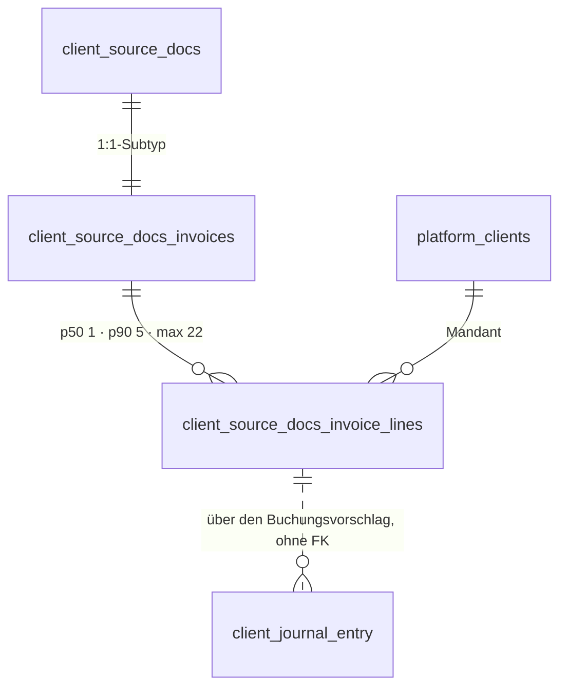

# Rechnungsposition · `invoice line` — Entitätsprofil

| | |
|---|---|
| Status | analysiert |
| GLOSSARY | **kein eigener Eintrag** — nur drei Einträge *über* sie (`Invoice line item source`, `Fund usage nature`, `Accounting subject`). Befund B1; bis dahin gilt der englische Name `invoice line`, Ordner `entities/invoice-line/` |
| Tabelle | `ludwig.client_source_docs_invoice_lines` (1:n zum Rechnungs-Subtyp `client_source_docs_invoices`) |
| Typen | `src/ludwig/modules/invoices/domain/invoice.ts` — `InvoiceLineItem` (39 Felder), eingebettet in `InvoiceDetail.lineItems` |
| Status-Achsen | **keine.** Die vier Wertebereiche der Position (`source`, `fund_usage_nature`, `line_special_type`, `vat_special_case`) stehen in keiner Registry-Achse — Befund B2 |
| Wichtigkeit | mittel (Enkel-Entität; das Beleg-Profil führt sie als eigenen Profil-Bedarf) |
| Datenstand | **Staging, 2026-09-07 — 726 Zeilen auf 314 Rechnungen** (nur `SELECT`, Aggregate) |
| Rückfrage | gestellt am 2026-09-07 mit dieser Analyse, unbeantwortet — Defaults gelten |
| Analyse von / am | Claude, 2026-09-07 (Skill `entitaet-analysieren`) |

## Was sie ist

Eine Zeile einer Rechnung: was geliefert wurde, wie viel davon, zu welchem
Preis und mit welcher Umsatzsteuer. Für die Sachbearbeiterin ist sie **die
Stelle, an der eine Buchung entsteht** — der Interpreter schlägt je Position
ein Konto vor, und wo er unsicher ist, entscheidet sie.

Anzeige-Regeln aus dem GLOSSARY, wörtlich:

- **Herkunft** (`Invoice line item source`): „Woher eine Position einer
  Rechnung stammt. Trennt extrahierte Daten von Workflow-generierten
  Ersatzpositionen." — und die Notes: „Geschäftslogik im Booking-Modul soll
  für `virtual_*`-Positionen weniger streng auf Plausibilitätsprüfungen
  pochen." Eine erfundene Position ist also **nicht** dasselbe wie eine
  gelesene, und die Anzeige darf das nicht einebnen.
- **Buchungsgegenstand** (`Accounting subject`): „Einzige primäre Quelle für
  den Embedding-Query gegen den Kontenrahmen; Fallback ist die rohe
  Zeilen-`description`." Er ist kein Anzeigetext, sondern der Text, mit dem
  Ludwig das Konto sucht — wer ihn liest, liest die **Begründung** des
  Kontovorschlags.
- **Verwendungsart** (`Fund usage nature`): „`investment` bleibt **separat**
  von `goods`, weil Anlagengüter aktivierungspflichtig sind und auf eigene
  Konten (0xxx) gehen."

## Schaubild



Die Position hat **keine Kinder** und keine FK-losen `*_id`-Spalten. Der Weg
zur Buchung führt über den Vorschlag der Rechnung
(`booking_proposal_payload_json`), nicht über eine Kante.

## Datenpunkte

Füllgrade aus 726 Zeilen (Staging, 2026-09-07).

| Datenpunkt | Quelle | Rolle | Füllgrad | heute in | änderbar | Rang | ab Form | Beleg |
|---|---|---|---|---|---|---|---|---|
| Bezeichnung (`itemName`) | Spalte | Identität | 100 % | `PositionenTab` (fett, erste Zeile) | Server | 1 | XS | Füllgrad · heute in `PositionenTab` |
| Nettobetrag der Zeile (`lineTotalNetValue`) | Spalte | Maß | 100 % | `PositionenTab` | Server | 2 | XS | Füllgrad 100 % |
| Positionsnummer (`position`) | Spalte | Identität | 100 % | `PositionenTab` (`#1`) | nie | 3 | XS | UNIQUE `(bookkeeping_invoice_id, position)` |
| Beschreibung (`productDescription`) | Spalte | Erklärung | 98 % | `PositionenTab` (Zweitzeile, klein) | Server | 4 | S, gekürzt ab **81 Zeichen** (p90) | Füllgrad · p90 |
| USt-Satz (`taxRatePercent`) | Spalte | Maß | 81 % | `PositionenTab` | Server | 5 | S | Füllgrad |
| Menge und Einheit (`quantity`, `unit`) | Spalten | Maß | 84 % / 19 % | `PositionenTab` („Menge × Einheit") | Server | 6 | S | Füllgrad — die Einheit fehlt bei vier von fünf, also **ein** Punkt aus beiden |
| Einzelpreis (`unitPriceValue`) | Spalte | Maß | 84 % | `PositionenTab` | Server | 7 | S | Füllgrad |
| Herkunft (`source`) | Spalte, GLOSSARY | **Zustand ohne Achse** | 100 % — `extracted` 712, `virtual_aggregate` 9, `virtual_fallback` 5 | `PositionenTab` | nie | 8 | S — **nur wenn ≠ `extracted`** | Verteilung: 98 % ist der Normalfall, und der Normalfall braucht kein Wort |
| Deaktiviert (`disabled`) | Spalte | Zustand ohne Achse | 100 %, davon 16 `true` | `PositionenTab` (ausgegraut + Hinweis) | Server | 9 | S — nur wenn `true` | Verteilung · Spaltenkommentar „die UI zeigt sie ausgegraut" |
| Verwendungsart (`fundUsageNature`) | Spalte, GLOSSARY | Zustand ohne Achse | 99 % — expense 438, goods 185, unknown 56, investment 22, mixed 20 | `PositionenTab` | Server | 10 | M | Verteilung · GLOSSARY „`investment` bleibt separat" |
| Buchungsgegenstand (`accountingSubject`) | Spalte, GLOSSARY | Erklärung | 99 % | `PositionenTab` | Server | 11 | M, gekürzt ab **161 Zeichen** (p90) | Füllgrad · p90 · GLOSSARY „einzige primäre Quelle für den Embedding-Query" |
| USt-Sonderfall (`vatSpecialCase`) | Spalte | Zustand ohne Achse | 92 %, davon **`none` 552** | `PositionenTab` | Server | 12 | M — nur wenn ≠ `none` | Verteilung: 76 % sind `none`; die übrigen 118 sind der Grund, warum die Spalte existiert |
| Sonderart der Zeile (`lineSpecialType`) | Spalte | Zustand ohne Achse | 98 %, davon **`none` 464** | `PositionenTab` | Server | 13 | M — nur wenn ≠ `none` | Verteilung: 12 Werte, der häufigste ist „nichts Besonderes" |
| USt-Betrag (`taxValue`) | Spalte | Maß | 41 % | `PositionenTab` | Server | 14 | M | Füllgrad unter 50 % → nicht vor M |
| Konfidenz der Verwendungsart (`fundUsageConfidence`) | Spalte | Maß | 99 %, p50 **0,95**, unter 0,8 nur **9 Zeilen** | `PositionenTab` | Server | 15 | M — **nur wenn niedrig** | Verteilung: eine Zahl, die fast immer 0,95 ist, sagt nur etwas, wenn sie es nicht ist |
| Steuerschlüssel-Kandidaten (`taxCandidateKeys`) | Spalte | Erklärung | 92 % gesetzt, 440 nicht leer | `PositionenTab` | Server | 16 | L | Füllgrad |
| Begründung der Verwendungsart (`fundUsageReasoning`) | Spalte | Erklärung | 99 % | `PositionenTab` (aufklappbar) | Server | 17 | L, gekürzt ab **169 Zeichen** (p90) | p90 |
| Gesetzliche Grundlage (`vatLegalReference`) | Spalte | Erklärung | 16 % | `PositionenTab` | Server | 18 | L | Füllgrad unter 20 % → nicht vor L |
| Artikelnummer (`productCode`) | Spalte | Identität | 37 % | `PositionenTab` | Server | 19 | L | Füllgrad |
| Leistungsdatum (`serviceDate`) | Spalte | Zeit | 34 % | `PositionenTab` | Server | 20 | L | Füllgrad |
| Rabatt (`lineDiscountValue`) | Spalte | Maß | **0 %** | `PositionenTab` | Server | 21 | L | Füllgrad 0 — die Spalte steht heute in der Kopfzeile und ist in **jeder** Zeile leer |
| Fremdwährungs-Spiegel (`fx*`) | vier Spalten | Maß | 0–3 %, **20 Zeilen** | `PositionenTab` (zweite Zeile unter dem Betrag) | Server | 22 | L — nur wenn gesetzt | Füllgrad · GLOSSARY „NULL means the document was already in EUR" |
| Belegstellen und Notizen (`vatEvidence`, `vatNotes`, `historyCandidates`, `lineNotes`) | vier JSONB-Spalten | Erklärung | 100 % gesetzt (meist leeres Objekt) | `PositionenTab` (Tabelle „Kategorie · Score · Begründung") | Server | 23 | L | heute in `PositionenTab` |
| Kollaps-Entscheidung (`collapseDecisionJson`) | Spalte | Erklärung | **1 %** — nur auf der Aggregat-Zeile | `PositionenTab` | Server | 24 | L — nur auf `virtual_aggregate` | Füllgrad · Spaltenkommentar |

Ausgelassen (Technik): `id`, `client_id`, `tenant_id`, `bookkeeping_invoice_id`,
`created_at`, `updated_at`, `metadata_json`, `accounting_type` (98 % gefüllt,
aber ohne Konsument im UI und ohne GLOSSARY-Eintrag — Befund B3),
`line_description_embedding` (0 %, Vektor).

**Freitext-Grenzen aus den Daten:** Bezeichnung p90 93 / max 251 ·
Beschreibung p90 81 / max 185 · Buchungsgegenstand p90 161 / max 392 ·
Begründung p90 169 / max 295.

## Relationen

| Relation | Richtung | Kardinalität | Rolle | ab Form | Darstellung | Beleg |
|---|---|---|---|---|---|---|
| Rechnung (`bookkeepingInvoiceId`) | Eltern | 1:n — 1 % der Rechnungen ohne Position · p50 **1** · p90 **5** · p99 17 · max **22** | Kontext | nur außerhalb ihres Kontexts | Inline des Belegs (`SourceDocumentCell`) | Staging, 314 Rechnungen |
| Mandant, Kanzlei | Eltern | 1:n | Kontext | nie | — | Schema |
| Buchungsvorschlag | ohne FK, über `booking_proposal_payload_json` der Rechnung | 1 Vorschlag je Rechnung, nicht je Position | Erklärung | L | Verweis, keine eigene Form — die Buchung hat ihr eigenes Profil (`journal-entry`) | `InvoiceDetail.bookingProposal` |
| Historie | keine | — | — | — | **Die Position hat keine Audit-Spur**: `platform_audit_events` kennt keine `resource_kind` für sie | `grep resource_kind` |

## Heutige Darstellung

| Komponente | Form | zeigt | fehlt | zu viel |
|---|---|---|---|---|
| `PositionenTab` (770 Z., `modules/invoices/ui/tabs`) | Liste | **alle 24 Punkte** — Kopfzeile mit sieben Spalten (`#`, Bezeichnung + Beschreibung, Menge, Einzelpreis, Rabatt, USt, Betrag), darunter je Position aufklappbar: Verwendungsart mit Konfidenz und Begründung, USt-Sonderfall mit Grundlage, Steuerschlüssel-Kandidaten, Historie-Kandidaten als eigene Tabelle, Kollaps-Audit | nichts | **die Rabatt-Spalte** (0 % gefüllt, in jeder Zeile „—") · die Trennung von „was steht auf dem Beleg" und „was hat Ludwig daraus gemacht": beides steht in derselben Zeile |

Die Liste ist **eine Komponente für alles** — Zeile, Aufklapper und drei
Untertabellen in einer Datei. Das ist der nachgewiesene Bedarf für eine Zeile
und eine Liste, nicht für vier Formen.

## Listen

| Liste | Job | Grundgesamtheit | Sortierung | Spalten (Ränge) | Filter | Massenaktion | Leerfall | Umfang p50 · p90 | Beleg |
|---|---|---|---|---|---|---|---|---|---|
| `InvoiceLineList` „Positionen des Belegs" | Wenn **die Sachbearbeiterin einen Kontovorschlag prüft**, will sie **sehen, welche Positionen der Beleg hat und wie Ludwig jede eingeordnet hat**, damit **sie die eine Zeile findet, die falsch liegt** | alle Positionen **einer** Rechnung, `disabled` eingeschlossen (ausgegraut) | `position` aufsteigend — die Reihenfolge des Belegs, nie eine andere | 1–7, dazu 8/9/12/13 nur wenn sie vom Normalfall abweichen | keiner | keine | „Für diesen Beleg wurden keine Positionen erkannt." — **kein Erfolg**, ein Befund: eine Rechnung ohne Positionen ist 1 % der Fälle und meist ein Extraktionsproblem | 1 · 5 (p99 17, max 22) | Staging · `PositionenTab` |

**Mechanik nach §8:** p90 = 5, max 22 → **keine Pagination, kein Serverfilter,
kein Ladefall**. Die Liste steht in einem Reiter, der ohnehin erst geladen
wird, wenn man ihn öffnet.

**Keine eigene Route** → kein Seitenprofil. Sie ist der Reiter „Positionen"
der Belegansicht (0071) und lebt in deren Seitenprofil `beleg-detail.md`.

## Formen

| Form | Größe | Empfehlung | Grund (§7 Nr.) | zeigt (Ränge) | Relationen | setzt auf | ersetzt |
|---|---|---|---|---|---|---|---|
| `InvoiceLineRow` | S | **ja** | 1 — existiert als Kopfzeile in `PositionenTab`; 2 — Kind der Rechnung, die einen View hat | 1–7, plus 8/9/12/13 als Abweichung vom Normalfall | — | `Row`, `Amount`, `Badge`, `LongText` | die Kopfzeile je Position in `PositionenTab` |
| `InvoiceLineList` | L | **ja** | 6 — ein Listen-Job, von einem Screen belegt | die Zeile + Summenzeile + Leerfall | — | `Table`, `InvoiceLineRow`, `EmptyState` | den Listenrahmen von `PositionenTab` |
| `InvoiceLineFacts` | M | **ja** | 1 — existiert als Aufklapper in `PositionenTab` (Verwendungsart, Konfidenz, Begründung, USt-Sonderfall, Grundlage, Kandidaten) | 10–24 | Historie-Kandidaten als kleine Tabelle | `FieldList`, `StatusBadge`, `LongText` | den Aufklapper und die drei Untertabellen |
| `InvoiceLineCell` | XS | **nein** | §7 Nr. 3 trifft nicht: die Position ist **kein FK-Ziel**. Kein fremdes Markup nennt eine einzelne Position — der Buchungsvorschlag hängt an der Rechnung, nicht an der Zeile | | | | |
| `InvoiceLineView` | L | **nein** | Kein Screen zeigt eine Position allein; ihr Detail **ist** der Aufklapper in der Liste. Alles, was ein View zeigte, zeigen Zeile und Fakten | | | | |
| `InvoiceLineDrawer` | L | **nein** | §7 Nr. 5 verlangt eine verweisende Ansicht — es gibt keine (Nr. 3 trifft schon nicht) | | | | |
| `InvoiceLineEditor` | XL | **nein** | **Kein Punkt hat `änderbar = Nutzer`.** Alle 24 kommen aus Extraktion oder Interpreter; die Korrektur einer falschen Einordnung passiert am **Buchungssatz** (`JournalEntryEditor`, 0015), nicht an der Position | | | | |

**Bau-Reihenfolge:** `InvoiceLineRow` → `InvoiceLineFacts` → `InvoiceLineList`.
Die Liste zeigt die Zeile, also nach ihr; die Fakten hängen unter der Zeile
und werden von der Liste aufgeklappt.

## Zuschnitt

| Form / Liste | Marke | Grund | Backlog |
|---|---|---|---|
| `InvoiceLineRow` | **jetzt** | trägt die Liste; existiert heute als Kopfzeile | — |
| `InvoiceLineFacts` | **jetzt** | trägt den Aufklapper; ohne sie ist die Zeile die halbe Antwort | — |
| `InvoiceLineList` | **jetzt** | der Reiter „Positionen" von 0071 braucht sie | — |
| `InvoiceLineCell` · `View` · `Drawer` · `Editor` | verworfen | je ein Satz in der Formen-Tabelle | — |

Drei Formen „jetzt" — unter dem Deckel von fünf, und alle drei hängen an
derselben Aufgabe **0072**.

## Befunde für `ludwig/app`

- **B1 — kein GLOSSARY-Eintrag für die Entität selbst.** Es gibt drei
  Einträge *über* Felder der Position (`Invoice line item source`, `Fund usage
  nature`, `Accounting subject`), aber keinen für „Rechnungsposition /
  `invoice line`". Der englische Name ist damit nicht festgelegt — dieses
  Profil setzt `invoice line` nach der Tabelle.
- **B1b — der GLOSSARY nennt zwei Tabellennamen.** `client_invoice_line_items`
  (in `Invoice line item source`, `Fund usage nature`, `Accounting subject`
  und zwei weiteren Einträgen) existiert im Datenmodell **nicht**; die Tabelle
  heißt `client_source_docs_invoice_lines`. Wer nach dem GLOSSARY sucht,
  findet nichts.
- **B2 — vier Wertebereiche ohne Registry-Achse.** `source` (3 Werte),
  `fund_usage_nature` (6), `line_special_type` (12), `vat_special_case` (11)
  haben deutsche Wörter nur im GLOSSARY-Fließtext oder gar nicht. Die Zeile
  kann sie nach der Hausregel nicht als Zustand zeigen, ohne eine lokale
  Label-Map zu bauen — und die ist verboten (R1).
- **B3 — `accounting_type` ist zu 98 % gefüllt und hat keinen Konsumenten.**
  Kein GLOSSARY-Eintrag, kein Feld im Anzeige-Typ, keine Verwendung im UI.
  Entweder ein Datenpunkt, der jemandem fehlt, oder eine tote Spalte.
- **B4 — `line_discount_value` ist zu 0 % gefüllt** und hat trotzdem eine
  eigene Spalte in der heutigen Kopfzeile. In 726 Zeilen steht dort „—".

Im Register stehen B1/B1b als **L-98** und B2 als **L-99**. B3 und B4 hängen
dort an L-99 mit dem Vermerk, dass sie eine eigene Nummer brauchen: die
Nummern ab **L-100** sind für den Entwicklungsagenten der App reserviert, und
zwei Befunde stillschweigend in seinen Bereich zu schreiben, wäre der
schnellste Weg zu zwei L-100.

## Offene Fragen

1. **Trägt die Zeile die Einordnung (Verwendungsart) oder erst die Fakten?**
   *Ohne Antwort: erst die Fakten* — die Verwendungsart ist zu 92 % einer von
   zwei Werten, und eine Spalte, die fast immer dasselbe sagt, kostet Breite
   ohne Ertrag. Die **Abweichung** (`investment`, `mixed`, `unknown` = 98 von
   726) gehört dagegen in die Zeile.
2. **Wird die Rabatt-Spalte weggelassen?** *Ohne Antwort: ja* — 0 % Füllgrad
   (B4). Kommt sie in den Daten an, ist sie eine Prop, keine neue Form.
3. **Zeigt die Liste eine Summenzeile?** *Ohne Antwort: ja*, Σ der
   Nettobeträge — sie ist die Probe gegen den Rechnungsbetrag, und genau
   dafür sieht sich jemand die Positionen an.

## Prüfung

Gehört dem zweiten Agenten.

| Zeile / Form | Einwand | Ergebnis | Geprüft von / am |
|---|---|---|---|
| | | | |

## Weiter

Prüfprompt (neue Sitzung, anderer Agent):

```
Prüfe das Entitätsprofil docs/entitaeten/invoice-line.md nach Skill entitaet-analysieren §5–§9.
Zuerst jede Zeile mit Beleg „Annahme": belege oder widerlege sie mit Füllgrad, heutiger
Komponente oder GLOSSARY. Dann die Ränge: deck die Punkte ab Rang k ab — erkennt eine
Sachbearbeiterin die Position noch? Dann die Formen: hat jede empfohlene einen Grund aus
§7, fehlt eine, die die App heute hat? Dann die Liste: hat sie einen Job-Satz, und ist sie
nach §8 eine eigene Komponente wert oder nur ein Prop? Zuletzt der Zuschnitt: sind höchstens
fünf Formen „jetzt", und trägt jede verworfene Zeile ihren Grund? Prüf besonders die vier
Befunde B1–B4 nach — sie tragen die Einordnung. Trag jeden Einwand in „Prüfung" ein, ändere
die Tabellen, wo du sicher bist, und setze den Status auf „geprüft". Kundendaten bleiben in
der Datenbank; nur SELECT.
```

Startprompt (neue Sitzung, nach Status `geprüft`):

```
Für die Entität Rechnungsposition (`invoice line`) liegt das geprüfte Profil unter
docs/entitaeten/invoice-line.md. Schreibe mit Skill spec-schreiben je Form eine Spec, in
dieser Reihenfolge — nur die Formen mit Marke „jetzt" aus dem Abschnitt Zuschnitt:
InvoiceLineRow, InvoiceLineFacts, InvoiceLineList. Was dort „verworfen" trägt, bleibt liegen.
Jede Spec verlinkt das Profil als Quelle und nimmt Datenpunkte, Ränge, Relationen und
„ersetzt" von dort, nicht aus dem Chat; die Punkte einer Form sind die Ränge bis zu ihrer
Größe, in derselben Reihenfolge. Danach baut Skill v3-komponente jede Spec in derselben
Reihenfolge, die größere Form komponiert die kleinere. Abgenommen wird von einem anderen
Agenten gegen die Spec. Nur eigene Dateien stagen. Setze am Ende den Status des Profils auf
„in Specs" und trage die Backlog-Nummer 0072 ein.
```
