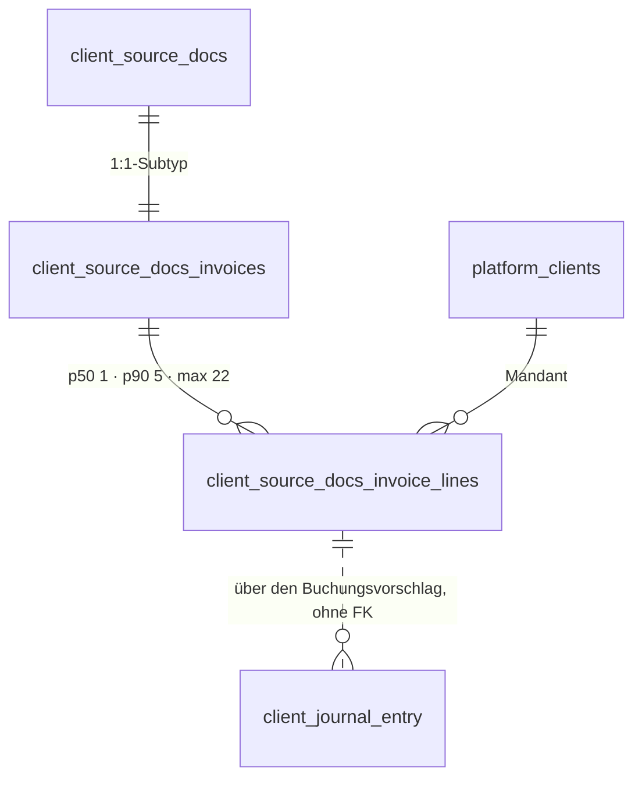

# Rechnungsposition · `invoice line` — Entitätsprofil

| | |
|---|---|
| Status | **in Specs** — 0072 (`InvoiceLineRow`), 0114 (`InvoiceLineFacts`), 0115 (`InvoiceLineList`), geschrieben am 2026-09-07 |
| GLOSSARY | **kein eigener Eintrag** — nur drei Einträge *über* sie (`Invoice line item source`, `Fund usage nature`, `Accounting subject`). Befund B1; bis dahin gilt der englische Name `invoice line`, Ordner `entities/invoice-line/` |
| Tabelle | `ludwig.client_source_docs_invoice_lines` (1:n zum Rechnungs-Subtyp `client_source_docs_invoices`) |
| Typen | `src/ludwig/modules/invoices/domain/invoice.ts` — `InvoiceLineItem` (**32 Felder**; die Tabelle hat 41 Spalten), eingebettet in `InvoiceDetail.lineItems` |
| Status-Achsen | **eine, geliehen:** die Konfidenz der Position liest die Achse `konfidenz` über das Pattern `Confidence` (0078, fertig) — die Ableitung Wert → Stufe steht in `src/ludwig/shared/confidence.ts`. Die vier **Wertebereiche** (`source`, `fund_usage_nature`, `line_special_type`, `vat_special_case`) stehen in keiner Achse — Befund B2 |
| Wichtigkeit | mittel (Enkel-Entität; das Beleg-Profil führt sie als eigenen Profil-Bedarf) |
| Datenstand | **Staging, 2026-09-07 — 726 Zeilen auf 314 Rechnungen** (318 Rechnungen im Bestand, 4 ohne Position; nur `SELECT`, Aggregate) |
| Rückfrage | gestellt am 2026-09-07 mit dieser Analyse, unbeantwortet — Defaults gelten |
| Analyse von / am | Claude, 2026-09-07 (Skill `entitaet-analysieren`) |
| Prüfung von / am | Claude (zweiter Agent), 2026-09-07 — jede Zahl gegen Staging nachgemessen, jeder Befund einzeln nachgeprüft; Einwände im Abschnitt **Prüfung** |

## Was sie ist

Eine Zeile einer Rechnung: was geliefert wurde, wie viel davon, zu welchem
Preis und mit welcher Umsatzsteuer. Für die Sachbearbeiterin ist sie **die
Stelle, an der eine Buchung entsteht** — der Interpreter schlägt je Position
ein Konto vor, und wo er unsicher ist, entscheidet sie.

Anzeige-Regeln aus dem GLOSSARY, wörtlich:

- **Herkunft** (`Invoice line item source`): „Woher eine Position einer
  Rechnung stammt. Trennt extrahierte Daten von Workflow-generierten
  Ersatzpositionen." — und die Notes: „Geschäftslogik im Booking-Modul soll
  für `virtual_*`-Positionen weniger streng auf Plausibilitätsprüfungen
  pochen." Eine erfundene Position ist also **nicht** dasselbe wie eine
  gelesene, und die Anzeige darf das nicht einebnen.
- **Buchungsgegenstand** (`Accounting subject`): „Einzige primäre Quelle für
  den Embedding-Query gegen den Kontenrahmen; Fallback ist die rohe
  Zeilen-`description`." Er ist kein Anzeigetext, sondern der Text, mit dem
  Ludwig das Konto sucht — wer ihn liest, liest die **Begründung** des
  Kontovorschlags.
- **Verwendungsart** (`Fund usage nature`): „`investment` bleibt **separat**
  von `goods`, weil Anlagengüter aktivierungspflichtig sind und auf eigene
  Konten (0xxx) gehen."

## Schaubild



Die Position hat **keine Kinder** und keine FK-losen `*_id`-Spalten. Der Weg
zur Buchung führt über den Vorschlag der Rechnung
(`booking_proposal_payload_json`), nicht über eine Kante.

## Datenpunkte

Füllgrade aus 726 Zeilen (Staging, 2026-09-07).

| Datenpunkt | Quelle | Rolle | Füllgrad | heute in | änderbar | Rang | ab Form | Beleg |
|---|---|---|---|---|---|---|---|---|
| Bezeichnung (`itemName`) | Spalte | Identität | 100 % | `PositionenTab` (fett, erste Zeile der Karte) | Server | 1 | S | Füllgrad · heute in `PositionenTab` · p50 34 Zeichen |
| Nettobetrag der Zeile (`lineTotalNetValue`) | Spalte | Maß | 100 % | `PositionenTab` (Spalte „Netto-Summe", fett, ganz rechts) | Server | 2 | S | Füllgrad · heute in `PositionenTab` — die einzige Zahl mit eigener Betonung |
| Positionsnummer (`position`) | Spalte | Identität | 100 % | `PositionenTab` (Spalte „Pos.", `#1`, ganz links) | nie | 3 | S | heute in `PositionenTab` · der Kollaps-Audit benennt Positionen über ihre Nummer („Kollabierte Positionen: 1, 2, 4") — sie ist der Rückverweis, nicht bloß eindeutig |
| Beschreibung (`productDescription`) | Spalte | Erklärung | 98 % | `PositionenTab` (Zweitzeile, klein) | Server | 4 | S, gekürzt ab **81 Zeichen** (p90) | Füllgrad · p90 |
| USt-Satz (`taxRatePercent`) | Spalte | Maß | 81 % | `PositionenTab` (Spalte „USt-Satz") | Server | 5 | S | Füllgrad · heute in `PositionenTab` |
| Menge und Einheit (`quantity`, `unit`) | Spalten | Maß | 84 % / 19 % | `PositionenTab` (**eine** Zelle, Titel „Menge × Einheit") | Server | 6 | S | gemessen: die Einheit steht in 138 Zeilen und in **keiner** ohne Menge — sie ist der Nachsatz der Menge, deshalb **ein** Punkt. Achtung: 138 Werte in 23 Schreibweisen (`Stck`, `Stück`, `ST`, `st`, `STK` …), die Zeile druckt Rohtext |
| Einzelpreis (`unitPriceValue`) | Spalte | Maß | 84 % | `PositionenTab` (Spalte „Einzelpreis") | Server | 7 | S | Füllgrad · heute in `PositionenTab` |
| Herkunft (`source`) | Spalte, GLOSSARY | **Zustand ohne Achse** | 100 % — `extracted` 712, `virtual_aggregate` 9, `virtual_fallback` 5 | `PositionenTab` (Badge im Sub-Streifen) | nie | 8 | S — **nur wenn ≠ `extracted`** | Verteilung: 98 % ist der Normalfall · `SOURCE_LABEL` in `PositionenTab` kennt nur die zwei virtuellen Werte, für `extracted` zeigt die App schon heute nichts |
| Deaktiviert (`disabled`) | Spalte | Zustand ohne Achse | 100 %, davon 16 `true` | `PositionenTab` (ausgegraut + Hinweis) | Server | 9 | S — nur wenn `true` | Verteilung · Spaltenkommentar „die UI zeigt sie ausgegraut" |
| Verwendungsart (`fundUsageNature`) | Spalte, GLOSSARY | Zustand ohne Achse | 99 % — expense 438, goods 185, unknown 56, investment 22, mixed 20 | `PositionenTab` (Badge im Sub-Streifen der **kompakten** Zeile) | Server | 10 | **S** | heute in `PositionenTab`, und zwar in der Zeile — der stärkste Rang-Beleg (§5) · Verteilung: expense + goods = 623 von 726 (**86 %**, nicht 92), die Abweichung investment/mixed/unknown = 98 · GLOSSARY „`investment` bleibt separat" |
| Buchungsgegenstand (`accountingSubject`) | Spalte, GLOSSARY | Erklärung | 99 % | `PositionenTab` | Server | 11 | M, gekürzt ab **161 Zeichen** (p90) | Füllgrad · p90 · GLOSSARY „einzige primäre Quelle für den Embedding-Query" |
| USt-Sonderfall (`vatSpecialCase`) | Spalte | Zustand ohne Achse | 92 %, davon **`none` 552** | `PositionenTab` (Badge „USt-Sonderfall" im Sub-Streifen; der Wert erst im Aufklapper) | Server | 12 | **S** — nur wenn ≠ `none` | Verteilung: 552 von 726 (76 %) `none`, 58 ohne Wert, die übrigen **116** (nicht 118) sind der Grund, warum die Spalte existiert · heute in der Zeile |
| Sonderart der Zeile (`lineSpecialType`) | Spalte | Zustand ohne Achse | 98 %, davon **`none` 464** | `PositionenTab` (Badge im Sub-Streifen) | Server | 13 | **S** — nur wenn ≠ `none` | Verteilung: 12 Werte, der häufigste ist „nichts Besonderes"; die vier größten Ausnahmen sind service_fee 73, transport_cost 57, summary_total 40, deposit 17 · heute in der Zeile |
| USt-Betrag (`taxValue`) | Spalte | Maß | 41 % | `PositionenTab` | Server | 14 | M | Füllgrad unter 50 % → nicht vor M |
| Konfidenz der Verwendungsart (`fundUsageConfidence`) | Spalte, **abgeleitet: `confidenceBand`** (`src/ludwig/shared/confidence.ts`) | Maß | 99 %, p50 **0,95**, min **0,700** | `PositionenTab` (Sub-Streifen, **jede** Zeile: „Konfidenz: <Band>") | Server | 15 | **S**, als `Confidence` (0078, Achse `konfidenz`) | gemessen über 726 Zeilen: **sehr_hoch 696 · hoch 25 · ohne Wert 5** — die Bänder `mittel`/`niedrig`/`sehr_niedrig` kommen **nicht vor**. „Nur wenn niedrig" hieße auf diesen Daten: nie. Die App zeigt das Band deshalb immer und das Warn-Badge „Konfidenz schwach" nie |
| Steuerschlüssel-Kandidaten (`taxCandidateKeys`) | Spalte | Erklärung | 668 gesetzt (92 %), **440 nicht leer** | `PositionenTab` (im Block „USt-Sonderbehandlung") | Server | 16 | L, **eigener Block** | Füllgrad · gemessen: 423 der 440 gefüllten Zeilen haben **keinen** USt-Sonderfall — heute hängt der Block daran und bleibt für 96 % der Kandidaten unsichtbar (B5) |
| Begründung der Verwendungsart (`fundUsageReasoning`) | Spalte | Erklärung | 99 % | `PositionenTab` (aufklappbar) | Server | 17 | L, gekürzt ab **169 Zeichen** (p90) | p90 |
| Gesetzliche Grundlage (`vatLegalReference`) | Spalte | Erklärung | 16 % | `PositionenTab` | Server | 18 | L | Füllgrad unter 20 % → nicht vor L |
| Artikelnummer (`productCode`) | Spalte | Identität | 37 % | `PositionenTab` | Server | 19 | L | Füllgrad |
| Leistungsdatum (`serviceDate`) | Spalte | Zeit | 34 % | `PositionenTab` | Server | 20 | L | Füllgrad |
| Rabatt (`lineDiscountValue`) | Spalte | Maß | **0 %** | `PositionenTab` | Server | 21 | L | Füllgrad 0 — die Spalte steht heute in der Kopfzeile und ist in **jeder** Zeile leer |
| Fremdwährungs-Spiegel (`fx*`) | vier Spalten | Maß | 0–3 %, **20 Zeilen** | `PositionenTab` (zweite Zeile unter dem Betrag) | Server | 22 | L — nur wenn gesetzt | Füllgrad · GLOSSARY „NULL means the document was already in EUR" |
| Belegstellen und Notizen (`vatEvidence`, `vatNotes`, `lineNotes`) | drei JSONB-Spalten | Erklärung | gesetzt 100 %, **nicht leer**: Belegstellen 289 (40 %), USt-Notizen 492 (68 %), Zeilen-Notizen 9 (1 %) | `PositionenTab` (Liste „Hinweise") | Server | 23 | L | gemessen je Spalte über `jsonb_array_length` — nicht ein Punkt mit einem Füllgrad, sondern drei mit sehr verschiedenen |
| Historie-Kandidaten (`historyCandidates`) | Spalte | Erklärung | gesetzt 100 %, **nicht leer: 0 %** — 726 von 726 sind ein leeres Array | `PositionenTab` (Tabelle „Alternative Kategorien", die nie rendert) | Server | — | **nicht bauen** | gemessen: kein einziger Kandidat im Bestand. Eine Untertabelle für Daten, die es nicht gibt, ist derselbe Fehler wie die Rabatt-Spalte (B4/B5) |
| Kollaps-Entscheidung (`collapseDecisionJson`) | Spalte | Erklärung | **1 %** — 9 Zeilen, genau die 9 `virtual_aggregate` | `PositionenTab` (eigener Kasten, ohne Aufklappen) | Server | 24 | L — nur auf `virtual_aggregate` | Füllgrad · Spaltenkommentar · gemessen: 9 Objekte, 9 Aggregat-Zeilen |
| Extrahierter USt-Satz (`vatExtractedRatePercent`) | Spalte | Maß | **77 %** | `PositionenTab` (Klammer hinter dem USt-Satz: „19 % (extrahiert: 7 %)") | Server | 25 | L — nur wenn ≠ `taxRatePercent` | **vom Profil zunächst übersehen** (Prüfung P1). Gemessen: 559 gesetzt, in **0** Zeilen weicht er von `taxRatePercent` ab — der Anzeige-Zweig feuert im Bestand nie (B5) |

Ausgelassen (Technik): `id`, `client_id`, `tenant_id`, `bookkeeping_invoice_id`,
`created_at`, `updated_at`, `metadata_json`, `accounting_type` (98 % gefüllt,
aber ohne Konsument im UI und ohne GLOSSARY-Eintrag — Befund B3),
`line_description_embedding` (0 %, Vektor).

Damit sind alle **41** Spalten der Tabelle verbucht: 25 Datenpunkte (einer
fasst Menge und Einheit zusammen, einer die vier `fx*`, einer die drei
Notiz-Spalten), ein Punkt, der **nicht** gebaut wird (Historie-Kandidaten),
und neun Technik-Spalten.

**Freitext-Grenzen aus den Daten** (nachgemessen, 726 Zeilen): Bezeichnung
p50 34 / p90 93 / max 251 · Beschreibung p50 43 / p90 81 / max 185 ·
Buchungsgegenstand p50 117 / p90 161 / max 392 · Begründung p50 113 /
p90 169 / max 295 · Gesetzliche Grundlage p90 23 / max 58.

## Relationen

| Relation | Richtung | Kardinalität | Rolle | ab Form | Darstellung | Beleg |
|---|---|---|---|---|---|---|
| Rechnung (`bookkeepingInvoiceId`) | Eltern | 1:n — 1 % der Rechnungen ohne Position · p50 **1** · p90 **5** · p99 17 · max **22** | Kontext | nur außerhalb ihres Kontexts | Inline des Belegs (`SourceDocumentCell`) | Staging, 314 Rechnungen |
| Mandant, Kanzlei | Eltern | 1:n | Kontext | nie | — | Schema |
| Buchungsvorschlag | ohne FK, über `booking_proposal_payload_json` der Rechnung | 1 Vorschlag je Rechnung, nicht je Position | Erklärung | L | Verweis, keine eigene Form — die Buchung hat ihr eigenes Profil (`journal-entry`) | `InvoiceDetail.bookingProposal` |
| Historie | keine | — | — | — | **Die Position hat keine Audit-Spur**: `platform_audit_events` kennt keine `resource_kind` für sie | `grep resource_kind` |

## Heutige Darstellung

| Komponente | Form | zeigt | fehlt | zu viel |
|---|---|---|---|---|
| `PositionenTab` (770 Z., `modules/invoices/ui/tabs`) | Liste aus Karten | **alle Punkte.** Über der Liste ein Umschalter **Kompakt \| Erweitert** (global, in `localStorage` gemerkt) und der Vorratszähler. Darunter eine Spalten-Kopfzeile mit sieben Spalten (`Pos.`, Bezeichnung + Beschreibung, Menge, Einzelpreis, **Rabatt**, USt-Satz, Netto-Summe) und je Position eine Karte mit demselben Raster. Unter dem Raster ein **Sub-Streifen** mit Badges: Herkunft (nur virtuell), Verwendungsart, „Konfidenz: <Band>", „USt-Sonderfall", Sonderart, „Konfidenz schwach" — und rechts der Knopf „▸ Details". Aufgeklappt fünf Blöcke: Buchungsklassifikation (Buchungsgegenstand, Begründung), USt-Sonderbehandlung (Sonderfall, Rechtsgrundlage, **DATEV-Kandidaten**), Spezial-Typ, Fremdwährung, „Alternative Kategorien (Historie)" als Tabelle, Hinweise als Liste. Der Kollaps-Kasten steht auf der Aggregat-Zeile ohne Aufklappen | die **Summe** der Nettobeträge — die Probe gegen den Rechnungsbetrag steht nirgends | **die Rabatt-Spalte** (0 % gefüllt, in jeder Zeile „—", B4) · **die Historie-Tabelle** (0 Kandidaten im Bestand, rendert nie) · **die Klammer „(extrahiert: x %)"** (0 abweichende Zeilen, rendert nie) · die Trennung von „was steht auf dem Beleg" und „was hat Ludwig daraus gemacht": beides steht in derselben Karte |

Die Liste ist **eine Komponente für alles** — Zeile, Sub-Streifen, Aufklapper
und drei Untertabellen in einer Datei. Das ist der nachgewiesene Bedarf für
eine Zeile, ihre Fakten und eine Liste, nicht für mehr Formen.

Zwei Dinge, die die Zeile **heute schon** trägt und die eine Spec sonst nach
M verschöbe: die **Verwendungsart** und die **Konfidenz** stehen im
Sub-Streifen der kompakten Karte, nicht erst im Aufklapper. Nach §5 ist das
der stärkste Rang-Beleg, den es gibt — ein Mensch hat sie für die Zeile
ausgewählt.

## Listen

| Liste | Job | Grundgesamtheit | Sortierung | Spalten (Ränge) | Filter | Massenaktion | Leerfall | Umfang p50 · p90 | Beleg |
|---|---|---|---|---|---|---|---|---|---|
| J-13 · `InvoiceLineList` „Positionen des Belegs" | Wenn **die Sachbearbeiterin einen Kontovorschlag prüft**, will sie **sehen, welche Positionen der Beleg hat und wie Ludwig jede eingeordnet hat**, damit **sie die eine Zeile findet, die falsch liegt** | alle Positionen **einer** Rechnung, `disabled` eingeschlossen (ausgegraut) | `position` aufsteigend — die Reihenfolge des Belegs, nie eine andere | 1–10, 12/13/15, dazu 8/9 nur wenn sie vom Normalfall abweichen | keiner | keine | „Für diesen Beleg wurden keine Positionen erkannt." — **kein Erfolg**, ein Befund: eine Rechnung ohne Positionen ist 1 % der Fälle (4 von 318) und meist ein Extraktionsproblem | 1 · 5 (p99 17, max 22) | Staging · `PositionenTab` |

**Mechanik nach §8** (nachgemessen): 318 Rechnungen, p50 **1** · p90 **5** ·
p99 17 · max 22, 1 % ohne Position → **keine Pagination, kein Serverfilter,
kein Ladefall**. Die Liste steht in einem Reiter, der ohnehin erst geladen
wird, wenn man ihn öffnet. Der Normalfall ist bemerkenswert kurz: **die
Hälfte aller Rechnungen hat genau eine Position**. Der einzeilige Fall und
der Leerfall verdienen mehr Sorgfalt als der lange.

**Was um die Zeile herum steht** (§8): die Liste besitzt einen Umschalter
**Kompakt \| Erweitert**, der alle Zeilen zugleich auf- und zuklappt und in
`localStorage` überdauert; die einzelne Zeile behält daneben ihren eigenen
Knopf „Details". Das ist heute in `PositionenTab` gebaut und gehört der
Liste, nicht der Zeile — die Zeile nimmt `expanded` als Prop entgegen.

**Keine eigene Route** → kein Seitenprofil. Sie ist der Reiter „Positionen"
der Belegansicht (0071) und lebt in deren Seitenprofil `beleg-detail.md`.

## Formen

| Form | Größe | Empfehlung | Grund (§7 Nr.) | zeigt (Ränge) | Relationen | setzt auf | ersetzt |
|---|---|---|---|---|---|---|---|
| `InvoiceLineRow` | S | **ja** | 1 — existiert als Karte mit Spalten-Kopfzeile in `PositionenTab`; 2 — Kind der Rechnung, die einen View hat (`SourceDocumentView`, Reiter „Positionen") | 1–7 im Raster, darunter 10/15 immer und 8/9/12/13 als Abweichung vom Normalfall | — | `Row` / `ExpandableRow` (`primitives/Table.tsx`, `primitives/ExpandableRow.tsx`), `Amount`, `Badge`, `LongText`, `Confidence` (0078) | die Karte je Position in `PositionenTab` |
| `InvoiceLineList` | L | **ja** | 6 — ein Listen-Job, von einem Screen belegt | die Zeile + Kopfzeile + Umschalter Kompakt/Erweitert + Summenzeile + Leerfall | — | `Table`, `HeadRow`, `EmptyRow`, `InvoiceLineRow`, `EmptyState` | den Listenrahmen, den Umschalter und die Kopfzeile von `PositionenTab` |
| `InvoiceLineFacts` | M | **ja** | 1 — existiert als Aufklapper in `PositionenTab` (Buchungsgegenstand, Begründung, USt-Sonderfall mit Grundlage, DATEV-Kandidaten, Spezial-Typ, Fremdwährung, Hinweise) | 11, 14, 16–25 | keine — die Historie-Kandidaten fallen weg (0 % im Bestand, B5) | `FieldList`, `LongText`, `Amount` | den Aufklapper und die Untertabellen |
| `InvoiceLineCell` | XS | **nein** | §7 Nr. 3 trifft nicht: die Position ist **kein FK-Ziel** — nachgeprüft, keine Tabelle im Datenmodell verweist auf `client_source_docs_invoice_lines`, und sie hat selbst keine `*_id`-Spalte ohne Kante. Kein fremdes Markup nennt eine einzelne Position; der Buchungsvorschlag hängt an der Rechnung, nicht an der Zeile | | | | |
| `InvoiceLineView` | L | **nein** | Kein Screen zeigt eine Position allein; ihr Detail **ist** der Aufklapper in der Liste. Alles, was ein View zeigte, zeigen Zeile und Fakten | | | | |
| `InvoiceLineDrawer` | L | **nein** | §7 Nr. 5 verlangt eine verweisende Ansicht — es gibt keine (Nr. 3 trifft schon nicht) | | | | |
| `InvoiceLineEditor` | XL | **nein** | **Kein Punkt hat `änderbar = Nutzer`** — nachgeprüft: in `apps/web/src` gibt es auf `clientInvoiceLineItems` kein `insert`, `update` oder `delete`, nur Lesen. Alle Punkte kommen aus Extraktion oder Interpreter; die Korrektur einer falschen Einordnung passiert am **Buchungssatz** (`JournalEntryEditor`, 0015), nicht an der Position | | | | |

**Bau-Reihenfolge:** `InvoiceLineRow` → `InvoiceLineFacts` → `InvoiceLineList`.
Die Liste zeigt die Zeile, also nach ihr; die Fakten hängen unter der Zeile
und werden von der Liste aufgeklappt.

## Zuschnitt

| Form / Liste | Marke | Grund | Backlog |
|---|---|---|---|
| `InvoiceLineRow` | **jetzt** | trägt die Liste; existiert heute als Karte mit Kopfzeile und Sub-Streifen | **0072** |
| `InvoiceLineFacts` | **jetzt** | trägt den Aufklapper; ohne sie ist die Zeile die halbe Antwort | **0114** |
| `InvoiceLineList` | **jetzt** | der Reiter „Positionen" von 0071 braucht sie | **0115** |
| `InvoiceLineCell` · `View` · `Drawer` · `Editor` | verworfen | je ein Satz in der Formen-Tabelle | — |

Drei Formen „jetzt" — unter dem Deckel von fünf, und alle drei hängen an
derselben Aufgabe **0072**. Der Zuschnitt hat die Prüfung unverändert
überstanden: die vier verworfenen tragen jede einen nachgeprüften Grund
(kein FK-Ziel, kein eigener Screen, keine verweisende Ansicht, kein
Schreibzugriff), und keine Form fehlt, die die App heute hätte —
`ui-repraesentationen.md` §1 führt für die Rechnungsposition genau eine
Komponente, `PositionenTab`.

## Befunde für `ludwig/app`

- **B1 — kein GLOSSARY-Eintrag für die Entität selbst.** Es gibt drei
  Einträge *über* Felder der Position (`Invoice line item source`, `Fund usage
  nature`, `Accounting subject`), aber keinen für „Rechnungsposition /
  `invoice line`". Der englische Name ist damit nicht festgelegt — dieses
  Profil setzt `invoice line` nach der Tabelle.
- **B1b — der GLOSSARY nennt zwei Tabellennamen.** `client_invoice_line_items`
  (in `Invoice line item source`, `Fund usage nature`, `Accounting subject`
  und zwei weiteren Einträgen) existiert im Datenmodell **nicht**; die Tabelle
  heißt `client_source_docs_invoice_lines`. Wer nach dem GLOSSARY sucht,
  findet nichts. **Nachgeprüft:** 18 Stellen im GLOSSARY nennen
  `client_invoice_line_items` oder `client_invoices`, beide gibt es nicht
  mehr. Dazu ein dritter falscher Name: der Eintrag *Document currency*
  nennt `client_source_docs_invoice_lines.transaction_*_value` — die
  Spalten heißen `fx_*`.
- **B2 — vier Wertebereiche ohne Registry-Achse.** `source` (3 Werte),
  `fund_usage_nature` (6), `line_special_type` (12), `vat_special_case` (11)
  haben deutsche Wörter nur im GLOSSARY-Fließtext oder gar nicht. Die Zeile
  kann sie nach der Hausregel nicht als Zustand zeigen, ohne eine lokale
  Label-Map zu bauen — und die ist verboten (R1).
- **B3 — `accounting_type` ist zu 98 % gefüllt und hat keinen Konsumenten.**
  Kein GLOSSARY-Eintrag, kein Feld im Anzeige-Typ, keine Verwendung im UI —
  `accountingType` kommt in `apps/web/src` **nur** im erzeugten
  Drizzle-Schema vor, keine Abfrage wählt es aus. Nachgemessen ist die
  Spalte außerdem in sich widersprüchlich: sie doppelt `fund_usage_nature`
  auf Deutsch (Aufwand/expense 401, Ware/goods 169) und widerspricht ihr in
  rund 57 Zeilen (Ware/expense 25, Aufwand/mixed 17, Ware/investment 7,
  Aufwand/goods 6); dazu trägt sie in **50** Zeilen den Wert
  `virtual_aggregate` — eine Herkunft, keine Art —, und ausgerechnet die
  9 echten `virtual_aggregate`-Zeilen haben dort `NULL`. Entweder ein
  Datenpunkt, der jemandem fehlt, oder eine tote Spalte.
- **B4 — `line_discount_value` ist zu 0 % gefüllt** und hat trotzdem eine
  eigene Spalte in der heutigen Kopfzeile („Rabatt", fünfte von sieben). In
  726 von 726 Zeilen steht dort „—". Nachgemessen und bestätigt.

- **B5 — drei weitere Anzeige-Zweige in `PositionenTab` ohne Daten, einer
  davon hinter der falschen Bedingung.** (a) Die Tabelle „Alternative
  Kategorien (Historie)" rendert nie: `history_candidates_json` ist in
  **726 von 726** Zeilen ein leeres Array. (b) Die Klammer
  „19 % (extrahiert: 7 %)" rendert nie: `vat_extracted_rate_percent` ist in
  559 Zeilen gesetzt und weicht in **null** davon von `tax_rate_percent` ab.
  (c) Die DATEV-Steuerschlüssel-Kandidaten hängen im Block
  „USt-Sonderbehandlung" und werden nur gezeigt, wenn es einen
  USt-Sonderfall gibt — **423 der 440** gefüllten Kandidaten-Listen haben
  keinen und bleiben unsichtbar. (a) und (b) sind entweder tote Spalten wie
  B4 oder ein Zeichen, dass der Interpreter sie im Staging nicht befüllt;
  (c) ist ein Fehler in der Bedingung.

- **B6 — die Label-Maps in `PositionenTab` treffen die echten Werte nicht.**
  `VAT_SPECIAL_CASE_LABEL` kennt acht Schlüssel, von denen im Bestand genau
  **einer** vorkommt (`reverse_charge_non_eu`, 24 Zeilen); die anderen
  **92** Zeilen mit Sonderfall zeigen den englischen Rohschlüssel
  (`exempt_other`, `small_business_exemption`, `reverse_charge_eu_service`
  …). `LINE_SPECIAL_TYPE_LABEL` fehlen `summary_total` (40) und
  `summary_tax` (2). B2 ist damit kein Zukunftsproblem: die verbotene lokale
  Label-Map existiert und ist bereits falsch — wer sie in die neue Zeile
  kopiert, kopiert den Fehler mit.

- **B7 — drei JSONB-Spalten sind im Anzeige-Typ `unknown`.** `vatEvidence`
  (40 % nicht leer), `vatNotes` (68 %) und `collapseDecisionJson` (die 9
  Aggregat-Zeilen) stehen in `InvoiceLineItem` als `unknown`. Eine Komponente
  kann `unknown` nicht darstellen, und eine eigene Struktur dafür wäre die
  lokale Erfindung, die `spec-schreiben` §5 verbietet. 0114 nimmt sie deshalb
  als aufbereitete Props entgegen (`notes`, `collapse`) — die Darstellung ist
  frei, die Struktur nicht. Solange der Typ fehlt, sind Belegstellen und
  USt-Notizen nur über den Aufrufer erreichbar. Beim Schreiben der Specs
  gefunden (2026-09-07).

Im Register stehen B1/B1b als **L-98** und B2 als **L-99**. Die übrigen haben
am 2026-09-07 eigene Nummern bekommen, nachdem der Owner den Bereich getrennt
hat — das Set vergibt ab **L-200**, die App zählt bei L-100 weiter: B3 ist
**L-200**, B4 ist **L-201**, B5 ist **L-202**, B6 ist **L-203**, B7 ist
**L-204**. B5 (c) und B6 stehen dort ausdrücklich als **Fehler im laufenden
UI**, nicht als Datenlücke: das eine ist eine falsche Bedingung, das andere
falscher Text auf dem Bildschirm.

## Offene Fragen

1. ~~**Trägt die Zeile die Einordnung (Verwendungsart) oder erst die
   Fakten?**~~ **In der Prüfung entschieden: die Zeile.** Die Frage war
   nicht offen — `PositionenTab` zeigt Verwendungsart und Konfidenz-Band
   heute im Sub-Streifen der *kompakten* Karte, also in der Zeile. Nach §5
   ist ein Feld, das ein Mensch für die Zeile ausgewählt hat, der stärkste
   Rang-Beleg; ein Default darf ihn nicht überstimmen. Nebenbei war die
   Begründung falsch gerechnet: expense + goods sind 623 von 726 (**86 %**,
   nicht 92 %). Beide Punkte stehen jetzt auf **S**, die Verwendungsart als
   Badge, die Konfidenz als `Confidence` (0078).
2. **Wird die Rabatt-Spalte weggelassen?** *Ohne Antwort: ja* — 0 % Füllgrad
   (B4). Kommt sie in den Daten an, ist sie eine Prop, keine neue Form.
3. **Zeigt die Liste eine Summenzeile?** *Ohne Antwort: ja*, Σ der
   Nettobeträge — sie ist die Probe gegen den Rechnungsbetrag, und genau
   dafür sieht sich jemand die Positionen an.

## Prüfung

Zweiter Agent, 2026-09-07. Grundlage: 726 Zeilen auf Staging (nur `SELECT`,
Aggregate), `datenmodell.json` (41 Spalten), `PositionenTab.tsx` (770 Z.),
`invoice.ts` (32 Felder), GLOSSARY (206 Einträge), `status-registry.ts`,
`docs/befunde-app.md`.

**Zuerst die Annahmen.** Das Profil führt keine Zeile mit dem Beleg
„Annahme" — das stimmt formal. Sechs Zeilen trugen aber nur einen Füllgrad
oder eine technische Eigenschaft als Beleg, und ein Füllgrad allein sagt
nichts über den **Rang**: er sagt, dass ein Feld da ist, nicht, dass ein
Mensch es zum Wiedererkennen benutzt. Diese sechs sind unten (P2, P8, P10)
mit hartem Beleg aus §4 nachgezogen; keine ist gekippt.

| Zeile / Form | Einwand | Ergebnis | Geprüft von / am |
|---|---|---|---|
| Datenpunkte gesamt | **Ein Datenpunkt fehlte:** `vatExtractedRatePercent` — 77 % gefüllt, im Anzeige-Typ, heute in der Zeile gerendert (Klammer hinter dem USt-Satz), stand weder in der Tabelle noch unter „ausgelassen" | **P1 · geändert.** Als Rang 25 aufgenommen (L, nur wenn ≠ `taxRatePercent`). Gemessen: 559 gesetzt, **0** abweichend — der Zweig feuert nie → neuer Befund B5 | Claude, 2026-09-07 |
| Kopf „Typen" | „`InvoiceLineItem` (39 Felder)" — nachgezählt sind es **32**; die Tabelle hat 41 Spalten | **P2 · geändert.** Beide Zahlen stehen jetzt da, und ein Satz weist nach, dass alle 41 Spalten verbucht sind | Claude, 2026-09-07 |
| Rang 23 | Vier JSONB-Spalten in **einem** Punkt mit einem gemeinsamen „100 % gesetzt (meist leeres Objekt)". Gemessen sind sie völlig verschieden: Belegstellen 289 nicht leer (40 %), USt-Notizen 492 (68 %), Zeilen-Notizen 9 (1 %), **Historie-Kandidaten 0 (0 %)** | **P3 · geändert.** In zwei Zeilen geteilt; die Historie-Kandidaten sind kein Punkt mehr, sondern „nicht bauen". Damit fällt die Untertabelle aus `InvoiceLineFacts` → B5 | Claude, 2026-09-07 |
| Ränge 12/13 | **Das Profil widersprach sich:** die Datenpunkt-Tabelle sagte „ab M", die Formen-Tabelle ließ die Zeile (S) „8/9/12/13 als Abweichung" zeigen | **P4 · geändert** auf **S — nur wenn ≠ `none`**. §4 entscheidet: beide sind heute Badges im Sub-Streifen der kompakten Karte | Claude, 2026-09-07 |
| Rang 10 Verwendungsart | Stand auf **M** mit der Begründung „zu 92 % einer von zwei Werten". Nachgerechnet sind es **86 %** (623 von 726) — und die App zeigt den Wert heute als Badge **in der Zeile** | **P5 · geändert** auf **S**. Offene Frage 1 ist damit beantwortet, nicht per Default, sondern per §4 | Claude, 2026-09-07 |
| Rang 15 Konfidenz | „ab M — nur wenn niedrig" heißt auf diesen Daten: **nie**. Bänder über 726 Zeilen: sehr_hoch 696, hoch 25, ohne Wert 5; min 0,700, also kommt `niedrig` nicht vor und das Warn-Badge der App feuert nie. Übersehen war außerdem, dass die Ableitung schon existiert (`confidenceBand`) und das Pattern `Confidence` (0078, **fertig**) 0072 ausdrücklich als seinen Abnehmer nennt | **P6 · geändert** auf **S** mit Quelle `abgeleitet: confidenceBand` und Darstellung `Confidence` | Claude, 2026-09-07 |
| Kopf „Status-Achsen" | „**keine**" war zu absolut — die Achse `konfidenz` existiert in der Registry und deckt genau diesen Punkt | **P7 · geändert** zu „eine, geliehen". B2 bleibt für die vier Wertebereiche richtig | Claude, 2026-09-07 |
| Rang 3 Positionsnummer | Beleg war „UNIQUE `(bookkeeping_invoice_id, position)`" — technische Eindeutigkeit, die §5 als Rang-Argument ausdrücklich **ausschließt** | **P8 · Rang bestätigt, Beleg ersetzt:** Spalte „Pos." ganz links, und der Kollaps-Audit benennt Positionen über ihre Nummer. Rang 3 trägt | Claude, 2026-09-07 |
| Ränge 1–3 | Standen auf **ab Form XS**, obwohl `InvoiceLineCell` verworfen ist — es gibt keine XS-Form, in der sie erscheinen könnten (§7-Budget XS ist ohnehin 1–2 Punkte, hier standen drei) | **P9 · geändert** auf **S** | Claude, 2026-09-07 |
| Rang 6 Menge/Einheit | Ein Punkt aus beiden ist **richtig**, die Begründung war es nicht („die Einheit fehlt bei vier von fünf") — niedriger Füllgrad koppelt keine Felder | **P10 · Punkt bestätigt, Beleg ersetzt:** die Einheit steht in 138 Zeilen und in **keiner** ohne Menge, und die App rendert beide in einer Zelle. Neu vermerkt: 138 Werte in 23 Schreibweisen, die Zeile druckt Rohtext | Claude, 2026-09-07 |
| Liste | Job-Satz vorhanden, §8-Mechanik bestätigt (p50 1 · p90 5 · p99 17 · max 22 auf 318 Rechnungen → **kein Pager**, richtig). **Gefehlt hat, was um die Zeile herum steht:** der globale Umschalter Kompakt \| Erweitert samt `localStorage`, den `PositionenTab` heute besitzt | **P11 · ergänzt** in Listen-Abschnitt und Formen-Tabelle. Dazu vermerkt: p50 = 1, die Hälfte aller Rechnungen hat **eine** Position — der Ein-Zeilen-Fall verdient mehr Sorgfalt als der lange | Claude, 2026-09-07 |
| Rang 16 Kandidaten | Heute nur innerhalb des USt-Sonderfall-Blocks gerendert; **423 von 440** gefüllten Kandidaten-Listen haben keinen Sonderfall und bleiben unsichtbar | **P12 · geändert:** eigener Block in `InvoiceLineFacts`, dazu Befund B5 (c) | Claude, 2026-09-07 |
| B1 | **Bestätigt.** 206 GLOSSARY-Überschriften, keine heißt „Invoice line" oder „Rechnungsposition"; der nächstliegende Eintrag *Bookkeeping invoice* beschreibt die Rechnung und erwähnt die Positionen nur im Nebensatz | unverändert | Claude, 2026-09-07 |
| B1b | **Bestätigt und erweitert.** `client_invoice_line_items` kommt in `datenmodell.json` nicht vor; 18 GLOSSARY-Stellen nennen sie oder `client_invoices`. Dazu ein dritter falscher Name: *Document currency* nennt `…invoice_lines.transaction_*_value`, die Spalten heißen `fx_*` | **P13 · B1b ergänzt** | Claude, 2026-09-07 |
| B2 | **Bestätigt.** Keine der Registry-Achsen führt `virtual_fallback`, `fund_usage_*`, `line_special_type`- oder `vat_special_case`-Werte. **Verschärft:** die lokale Label-Map in `PositionenTab` deckt von den vorkommenden USt-Sonderfällen genau einen ab — 92 Zeilen zeigen den englischen Rohschlüssel; bei der Sonderart fehlen 42 | **P14 · neuer Befund B6** | Claude, 2026-09-07 |
| B3 | **Bestätigt und verschärft.** `accountingType` steht in `apps/web/src` nur im erzeugten Drizzle-Schema; keine Abfrage liest es. Die Spalte doppelt `fund_usage_nature` auf Deutsch, widerspricht ihr in ~57 Zeilen und trägt in **50** Zeilen den Wert `virtual_aggregate`, während die 9 echten Aggregat-Zeilen dort `NULL` haben | **B3 ergänzt** | Claude, 2026-09-07 |
| B4 | **Bestätigt.** `line_discount_value` in 726 von 726 Zeilen leer, die Spalte „Rabatt" ist die fünfte von sieben in der Kopfzeile | unverändert | Claude, 2026-09-07 |
| Verworfene Formen | **Alle vier tragen.** Kein FK zeigt auf die Tabelle und sie hat keine `*_id`-Spalte ohne Kante → Cell und Drawer fallen (§7 Nr. 3/5). Kein Screen zeigt eine Position allein → kein View. Auf `clientInvoiceLineItems` gibt es in `apps/web/src` **kein** `insert`/`update`/`delete` → kein Editor. Die Belege stehen jetzt in der Tabelle statt nur in der Behauptung | **bestätigt, Begründungen gehärtet** | Claude, 2026-09-07 |
| Zuschnitt | Drei Formen „jetzt" — unter dem Deckel von fünf; jede verworfene trägt ihren Grund. `SourceDocumentView` hat den Reiter-Platz, das Beleg-Profil führt „Positionen (`InvoiceLines`)" als 0072 | **trägt, unverändert** | Claude, 2026-09-07 |
| Zahlen gesamt | Füllgrade, Verteilungen, Textlängen, Kardinalitäten und Fremdwährungszeilen **einzeln nachgemessen** — bis auf die drei oben genannten Rechenfehler (92 % statt 86 %, „118" statt 116, „39 Felder" statt 32) stimmt jede Zahl im Profil | unverändert | Claude, 2026-09-07 |

## Weiter

Prüfprompt (neue Sitzung, anderer Agent) — **ausgeführt am 2026-09-07,
Ergebnis im Abschnitt Prüfung; Status steht auf `geprüft`**:

```
Prüfe das Entitätsprofil docs/entitaeten/invoice-line.md nach Skill entitaet-analysieren §5–§9.
Zuerst jede Zeile mit Beleg „Annahme": belege oder widerlege sie mit Füllgrad, heutiger
Komponente oder GLOSSARY. Dann die Ränge: deck die Punkte ab Rang k ab — erkennt eine
Sachbearbeiterin die Position noch? Dann die Formen: hat jede empfohlene einen Grund aus
§7, fehlt eine, die die App heute hat? Dann die Liste: hat sie einen Job-Satz, und ist sie
nach §8 eine eigene Komponente wert oder nur ein Prop? Zuletzt der Zuschnitt: sind höchstens
fünf Formen „jetzt", und trägt jede verworfene Zeile ihren Grund? Prüf besonders die vier
Befunde B1–B4 nach — sie tragen die Einordnung. Trag jeden Einwand in „Prüfung" ein, ändere
die Tabellen, wo du sicher bist, und setze den Status auf „geprüft". Kundendaten bleiben in
der Datenbank; nur SELECT.
```

Startprompt (neue Sitzung, nach Status `geprüft`):

```
Für die Entität Rechnungsposition (`invoice line`) liegt das geprüfte Profil unter
docs/entitaeten/invoice-line.md. Schreibe mit Skill spec-schreiben je Form eine Spec, in
dieser Reihenfolge — nur die Formen mit Marke „jetzt" aus dem Abschnitt Zuschnitt:
InvoiceLineRow, InvoiceLineFacts, InvoiceLineList. Was dort „verworfen" trägt, bleibt liegen.
Jede Spec verlinkt das Profil als Quelle und nimmt Datenpunkte, Ränge, Relationen und
„ersetzt" von dort, nicht aus dem Chat; die Punkte einer Form sind die Ränge bis zu ihrer
Größe, in derselben Reihenfolge. Danach baut Skill v3-komponente jede Spec in derselben
Reihenfolge, die größere Form komponiert die kleinere. Abgenommen wird von einem anderen
Agenten gegen die Spec. Nur eigene Dateien stagen. Setze am Ende den Status des Profils auf
„in Specs" und trage die Backlog-Nummer 0072 ein.
```
