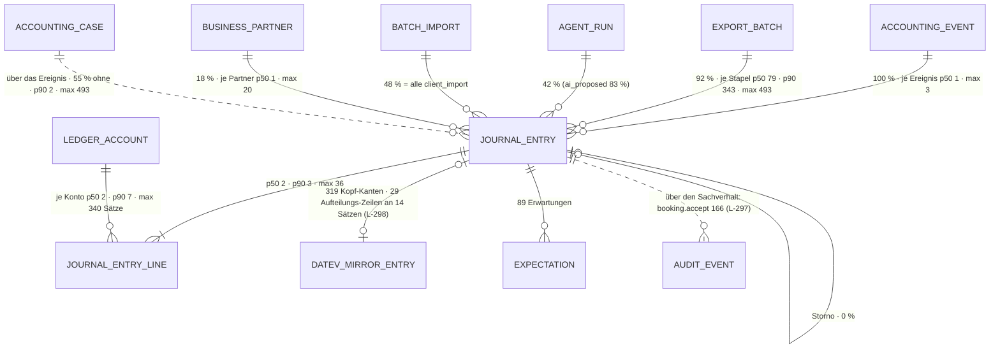

# Buchungssatz · `journal entry` — Entitätsprofil

| | |
|---|---|
| Status | **geprüft** — fremde Prüfung am 2026-09-11 (Prüfer-Session im Auftrag `ludwig-manager`, gegen 04ecb0f); drei Nacharbeiten und ein dokumentierter Einwand, siehe „Prüfung" |
| GLOSSARY | `### Journal entry` (englisch `journal entry`, deutsch „Buchung"), `### Bookkeeping entry (Buchung)` (Herkunft, Lebenslauf), `### Journal entry line (Teilbuchung)`, `### Satzart (was ein Buchungssatz tut)` (`entry kind`), `### Proposed posting` — Ordner `entities/journal-entry/` |
| Tabelle | `ludwig.client_journal_entry` (Kopf) + `ludwig.client_journal_entry_line` (Teilbuchungen, Side-Pattern). Keine Subtypen. Die Teilbuchung ist Kind **ohne eigenes Gesicht** — sie ist die Zeile des Grids —, deshalb ein Profil für beide |
| Typen | `src/ludwig/modules/entries/domain/entry.ts` — `ENTRY_ORIGIN`, `ENTRY_STATUS`, `ENTRY_DATEV_STAGE`, `deriveEntryDatevStage()`, `JournalEntryListItem`, `EntryFilter` · `entries/domain/journal-entry-vm.ts` — `JournalEntryVM`, `BookingLineVM`, `RationaleSourceLike`, `CompactBookingVM` · `accounting-cases/domain/rationale-source.ts` — `RationaleSourceSchema` (nur die Quellen der Herleitung) · `datev-export/domain/document-group.ts` — `DOCUMENT_GROUP_LABEL`. **Fehlt im Spiegel:** die Wortliste der Satzart (`ENTRY_KIND_LABEL`, App `core/accounting/entry-kind.ts`) → L-294 |
| Status-Achsen | `buchung` (`status`) · `buchung_datev` (abgeleitet über `deriveEntryDatevStage()`: `status` + `exported_at` + `datev_mirror_entry_id`) · `buchung_origin` (`origin`) · `konfidenz` (Satz-Konfidenz über `Confidence`). **Ohne Achse, weil Arten:** Satzart (`entry_kind`), Beleggruppe (`document_group`). **Ohne Achse, obwohl Zustand:** `acceptance_quality` (nur ein Kommentar in der Registry) → L-294 |
| Wichtigkeit | **hoch** — Kern-Entität (Datenmodell-Review §7); Roadmap der App `uikit-entity-roadmap-2026-09.md` (9be34746) Rang 1, Gewicht 19 |
| Datenstand | Staging über den Pooler, **2026-09-11**, schreibgeschützte Sitzung: **1.720 Sätze, 3.752 Teilbuchungen, 6 Mandanten**. Nur `SELECT`, keine Kundendaten im Dokument; Beispielwerte sind erfunden (Musterfirma GmbH, 1.800,00 €). Die Roadmap hat dieselben Tabellen kurz vorher erhoben; wo sie abweicht, gilt diese Messung (`revenue` 576 statt 563) |
| Bestandswarnung | `posted` kommt **nicht vor** (0 von 1.720) — die GoBD-Stufe liegt im Stapel. `client_import` (833 Sätze, 48 %) trägt **weder** Konfidenz noch Herleitung. `reversed` (86) heißt fast immer „vom Agenten zurückgezogen", nicht „storniert" — Befund L-284, in der App behoben (cccccac1: die Stufe heißt jetzt „Zurückgezogen"; im Spiegel erst nach dem Sync im F210-Fenster). Ein Stapel mit 493 Sätzen ist zugleich ein Sammelsachverhalt — die Maxima der Listen „Stapel" und „Sachverhalt" sind derselbe Fall |
| Rückfrage | gestellt und **beantwortet** am 2026-09-11 (`ludwig-manager`, aus dem App-Stand): die Defaults der drei Fragen gelten; ein dritter Job für `JournalEntryList` (Export-Bucket); keine Auswahl-Dialoge mit Buchungssätzen |
| Analyse von / am | Claude, 2026-09-11 (Skill `entitaet-analysieren`) |

## Was sie ist

Ein Buchungssatz ist das, was am Ende eines Vorgangs nach DATEV geht: Konto
gegen Gegenkonto, Betrag, Datum, Buchungstext, Belegfeld. Die
Sachbearbeiterin prüft ihn als **Vorschlag** (Schritt 3 der Stapelabnahme),
nimmt ihn an oder gibt ihn zurück, und schlägt ihn später **nach** — am Konto,
im Stapel, am Sachverhalt, an der Bankzeile. Je Ereignis ein Satz (p50 1 ·
p90 1 · max 3 — zurückgezogene Vorschläge bleiben stehen, **Annahme**, siehe
L-284).

**Anzeige-Regeln** (wörtlich):

- „Alle DATEV-Felder hängen an der Teilbuchung … Es gibt daher weder Kopfwerte
  noch einen Fallback — was nicht an der Zeile steht, bleibt in der
  DATEV-Datei leer." (GLOSSARY, Teilbuchung) — Buchungstext und Belegfeld des
  **Satzes** sind die der führenden Zeile; eine Zeile, die sie nicht trägt,
  zeigt sie auch nicht.
- „This is not accepted bookkeeping truth until it is explicitly reviewed and
  marked as accepted." (GLOSSARY, Proposed posting)
- „Export ist eine Behauptung — bestätigt ist die Buchung erst mit dem
  Abgleich." (Registry `buchung_datev`, Stufe `exported`)
- „Gesetzt ⇒ Buchung ist nur noch stornierbar (kein Edit/Reject/Delete)."
  (Spaltenkommentar `exported_at`)
- Satzart: „ohne Wert kein Badge statt eines geratenen" und „Der
  Geschäftsvorfall schlägt die Zahlung" (GLOSSARY, Satzart)
- Buchungstext: „kurz, deutsch, Nominalstil, **max. 60 Zeichen**
  (EXTF-Feldgrenze), Muster `<Kreditor-Kurzname> <Leistung> <Zeitraum>`"
  (GLOSSARY, Posting text)
- Mandantenstapel: „Kein Agent-Vorschlag, kein Judge-Verdikt." (Registry
  `buchung_origin`, `client_import`) — eine leere Herleitung ist dort die
  Regel, kein Mangel.

## Schaubild



## Datenpunkte

| Datenpunkt | Quelle | Rolle | Füllgrad | heute in | änderbar | Rang | ab Form | Beleg |
|---|---|---|---|---|---|---|---|---|
| Buchungstext (`line_description` der führenden Zeile; `JournalEntryListItem.buchungstext`) | Zeile · in der App-Abfrage abgeleitet | Identität | 100 % · 173 Sätze (10 %) tragen mehr als einen Text | `BuchungenTabelle` (`e.bookingText`), `JournalEntryView` (`l.lineText`), `JournalEntryCard` (`caption`) | Nutzer · Judge (B8) | 1 | S | Füllgrad · GLOSSARY-Muster „Kreditor Leistung Zeitraum" · §5 „Rang 1 ist menschenlesbar". **Abweichung von der Roadmap** (dort Konten auf Rang 1) → Frage 1, bestätigt (Manager 2026-09-11) |
| Betrag (Σ Soll; `JournalEntryListItem.amount`) | abgeleitet: Summe der Soll-Zeilen | Maß | 100 % | `JournalEntryCell` (0044), `BuchungenTabelle` (`e.amount`), `Schritt3` (`l.amount`) | Nutzer | 2 | XS | Füllgrad · heute in |
| Konto → Gegenkonto (Zeilen `account_number_snapshot`/`account_name_snapshot` · `side`) | Zeilen | Identität | 100 % · 177 Sätze (10 %) mit mehr als zwei Zeilen | `JournalEntryCell` (0044), `BuchungenTabelle` (`debitAccounts`/`creditAccounts`), `Schritt3` (`l.accountNumber`) | Nutzer | 3 | XS | Füllgrad · heute in |
| Buchungsdatum (`booking_date`) | Spalte | Zeit | 100 % | `BuchungenTabelle`, `JournalEntryView` | Nutzer | 4 | S | Füllgrad · heute in |
| Weg nach DATEV (`deriveEntryDatevStage()`) | abgeleitet: `status` + `exported_at` + `datev_mirror_entry_id` | Zustand (`buchung_datev`) | 100 % | `JournalEntryView` (`exportBatchState`, `exportedAt`) · `BuchungenTabelle` zeigt nur `status` | Server | 5 | S | Registry · `entry.ts`. Die Zeile zeigt die Stufe, nicht `status` allein → Frage 2, bestätigt (Manager 2026-09-11) |
| Belegfeld 1 (Zeilen `external_document_number`) | Zeile (führende) | Identität | 92 % · 16 Sätze mit mehr als einem | `BuchungenTabelle` (`e.belegfeld`), `ManualBookingDrawer` | Nutzer · Judge (B8) | 6 | S | Füllgrad · heute in |
| Herkunft (`origin`) mit Konfidenz (`proposal_confidence`) | Spalte · Spalte (0–1) | Zustand (`buchung_origin`) · Maß | 100 % · 52 % — `ai_proposed`, `recurring_rule`, `manual` 100 %, `client_import` 0 % | `BuchungenTabelle` (`e.origin`), `JournalEntryView` (`entry.origin`), `BookingProposalView` (`entry.confidence`) | nie · Agent | 7 | S | Füllgrad je Herkunft · `ProvenanceMark` (0163) trägt beides in einer Marke. Konfidenz: 774 von 887 bei ≥ 0,8 (Prüfer) |
| Satzart (`entry_kind`) | Spalte, Server-Stempel | Identität (Art) | 100 % — `payment` 643 · `revenue` 576 · `expense` 330 · `money_transfer` 161 · `reclassification` 10 | Badge am Kopf der Buchungskarte in `Schritt3Einzel` (GLOSSARY) | Server | 8 | M | GLOSSARY Satzart · Wortliste fehlt im Spiegel (L-294) |
| Steuerschlüssel (Zeilen `tax_key` · `tax_rate_percent`) | Zeilen | Maß | 11 % · 10 % der Zeilen (12 % der Sätze) | `JournalEntryCard` (Spalte BU), `TaxKeyField` (0125), `Schritt3` (`l.taxKey`) | Nutzer | 9 | M | Füllgrad unter 20 % → nicht vor M (§5) |
| Geschäftspartner (`business_partner_id`) | Eltern | Kontext | 18 % (`ai_proposed` 37 %) | — | Server (aus den Zeilen) | 10 | M | Füllgrad unter 20 % · GLOSSARY (Denormalisierung für OPOS) |
| Stapel und Export (`export_batch_id` · `exported_at` · `export_ref`) | Eltern · Spalten | Kontext | 92 % · 39 % · 99 % | `JournalEntryView` (`exportFileName`, `exportRef`, `exportBatchId`, `exportBatchState`) | Server | 11 | L | Füllgrad · heute in |
| Herleitung (`proposal_rationale`: `agent_rationale`, `judge`, `sources`, `step`, `belegfeld_source`, `guard_warnings`) | Spalte, jsonb **ohne Typ** (L-295) | Erklärung | 52 % — Schlüssel: `step` 857 · `agent_rationale` 857 · `judge` 797 (Liste) · `sources` 722 · `belegfeld_source` 538 · `guard_warnings` 88 · `withdrawn_by_agent` 87 | `BookingProposalView`/`KIBox`, `BookingRationale`, `RationaleSources`; im Set `AiBookingNotes` | Agent | 12 | L | Füllgrad · Begründung p50 281 · p90 652 · max 2.459 Zeichen · Quellen je Satz p50 1 · p90 2 · max 4 (Beleg 363, Bankzeile 378, Lieferanten-Historie 119, Regel 47, Klärung 12, Gesetz 6) |
| Annahme (`acceptance_quality` · `reviewed_at`) | Spalten | Verantwortung | 38 % · 36 % (nur `accepted`: unverändert 627 · bearbeitet 15 · von Hand 3 · leer 27) | Kennzahl „Annahmequalität" (`acceptance-quality.ts`), `JournalEntryView` (`originLabel()`, lokale Wortliste Z. 18–30) | Server | 13 | L | Füllgrad · **wer**: `reviewed_by_user_id` hat keinen Schreiber; Einzel-Annahmen stehen im Verlauf des Sachverhalts (L-297) |
| Beleggruppe (`document_group`) | Spalte, Server-Stempel | Kontext | 100 % — `bank` 593 · `outgoing_invoices` 567 · `cash` 340 · `incoming_invoices` 198 · `general_ledger` 22 | `BuchungenTabelle` (Abschnitte) | Server | 14 | L | GLOSSARY Satzart („sortiert den Stapel für die Ablage") · `DOCUMENT_GROUP_LABEL` |
| Mandantenstapel (`import_reference` · `batch_import_id`) | Spalte · Eltern | Kontext | 48 % = alle `client_import` | — | nie | 15 | L | Füllgrad |
| Beleglink (`source_document_link`) | Spalte | Kontext | 29 % | — | nie | 16 | L | Füllgrad · Spaltenkommentar F72 |
| Agent-Lauf und Teilschritt (`agent_run_id` · `step_code`) | Eltern · Spalte | Verantwortung | 42 % · 26 % (`3d` 218 · `3e` 140 · `3b` 50 · `4a` 22 · `2a` 20) | `BuchungenTabelle` (`e.agentRunId` als Spalte) | Server | 17 | L | trägt in `ProvenanceNote` „wer" und „Regel" |
| Ersetzt einen geflaggten Satz (`JournalEntryVM.repairedFrom`) | abgeleitet in der App | Erklärung | nicht gemessen | `JournalEntryView` (`entry.repairedFrom`) | Agent | 18 | L | heute in · **Annahme** zum Füllgrad |
| Teilbuchung: Belegfeld 2, KOST1/KOST2, Steuer-Basiszeile (`external_document_number_2`, `kost1`/`kost2`, `tax_for_line_no`) | Zeilen | Maß | 0 % · 0 % · 5 % | `ManualBookingDrawer` (`l.kost`), `JournalEntryEditor` (0015) | Nutzer | — | XL | Füllgrad · §5: änderbar = Nutzer → Editor |
| Festgeschrieben, Storno-Bezug, Fremdwährung (`posted_at`, `reverses_entry_id`, `fx_*`) | Spalten | Zustand | 0 % | `JournalEntryView` | Server | — | L, nur wenn gesetzt | Füllgrad 0 % |

Ausgelassen (Technik): `id`, `tenant_id`, `client_id` und `fiscal_year_id`
(setzt die Route), `accounting_event_id` (steht unter Relationen), `currency`
(trägt der Betrag), `is_locked`/`locked_at`, `created_at`, `updated_at`,
`created_by_user_id` (1 %), `source_doc_id` (1 %), an der Zeile `line_no`,
`account_id`, `created_at`, `datev_reverse_charge_case` (1 %, erscheint laut
`BookingLineVM` neben dem BU-Schlüssel, nicht als eigener Punkt).
**Verworfen:** die Zeilen-Ampel (`confidence` an der Teilbuchung, 24 %) —
„Keine Zeilen-Ampel mehr (2026-08-29): die Ampel gilt dem Satz"
(`journal-entry-vm.ts`).

Freitext-Grenzen: Buchungstext p50 15 · p90 31 · max 124 Zeichen — gekürzt
bei **60** (EXTF-Grenze), der ganze Text im `title`; drei Zeilen liegen
darüber (L-301). Belegfeld 1 p90 11 · max 23 — nie gekürzt. Die Begründung
der Herleitung steht in der Marke als ein Satz bis 160 Zeichen
(`ProvenanceMark`), ganz in der Notiz (`LongText`, p90 652).

## Relationen

| Relation | Richtung | Kardinalität | Rolle | ab Form | Darstellung | Beleg |
|---|---|---|---|---|---|---|
| Teilbuchungen (`client_journal_entry_line`) | Kind | 0 % ohne · p50 2 · p90 3 · max 36; 10 % mit mehr als zwei | Identität | XS | Zusammenfassung in XS/S (Soll → Haben, bei Splits „+n") · **eigene Form** in M/L: `JournalEntryCard` (0044), `JournalEntryGrid` (0113) | Staging |
| Konten (über die Teilbuchungen) | Eltern | 100 % · Sätze je Konto p50 2 · p90 7 · max 340 | Identität | XS | **Inline** `AccountCell` mit Weg zum Konto-Drawer (0155) → Profil `account` | Staging · `JournalEntryCell` |
| Ereignis (`accounting_event_id`) | Eltern | 100 % · Sätze je Ereignis p50 1 · p90 1 · max 3 | Kontext | L | **Inline** (Ereignis-Titel) → Profil `accounting-event` (Roadmap #4) | Staging |
| Sachverhalt (über das Ereignis) | Eltern, zweistufig | Sachverhalte: 55 % ohne Satz · p50 0 · p90 2 · max 493 (Sammelsachverhalt) | Kontext | M | **Inline** `CaseCell` in fremder Liste · am Sachverhalt die Liste (§Listen) | Staging · `JournalEntryListItem.caseId` |
| Stapel (`export_batch_id`) | Eltern | 92 % · Sätze je Stapel p50 79 · p90 343 · max 493 (11 Stapel) | Kontext | L | **Inline** (Stapelnummer) · Liste „Inhalt des Stapels" → Profil `export-batch` (Roadmap #3) | Staging · `BuchungenTabelle` |
| Geschäftspartner (`business_partner_id`) | Eltern | 18 % · Sätze je Partner p50 1 · p90 6 · max 20 | Kontext | M | **Inline** `BusinessPartnerCell` | Staging |
| Agent-Lauf (`agent_run_id`) | Eltern | 42 % (`ai_proposed` 83 %) | Verantwortung | L | **Inline** in `ProvenanceNote` („wer") | Staging |
| Mandantenstapel-Lauf (`batch_import_id`) | Eltern | 48 % = alle `client_import` | Kontext | L | **Inline** | Staging |
| DATEV-Spiegelbuchung | Eltern (Kopf) und Kind (Spiegel-Seite) | 319 Kopf-Kanten; dazu 29 `matched_split`-Zeilen an 14 Sätzen, deren Kopf-Spalte gewollt leer bleibt — nur an `accepted` (L-298) | Zustand (`buchung_datev`) | S | als **Stufe** in S · **Inline** `MirrorEntryCell` in L → Profil `datev-mirror-entry` (Roadmap #2) | Staging |
| Erwartungen (`origin_journal_entry_id`) | Kind | 89 Erwartungen tragen einen Satz als Ursprung | Kontext | L | **Liste** über `ExpectationRow` ✓ → Profil `expectation` (Roadmap #10) | Staging |
| Storno (`reverses_entry_id`) | Selbstbezug | 0 % | Zustand | L | **Inline**, nur wenn gesetzt | Staging |
| Rechnungsspur (`client_invoice_traces.journal_entry_id`) | Kind | 0 | — | — | nicht gezeigt | Staging |
| Verlauf (`platform_audit_events`) | ohne FK | kein eigener `resource_kind`; Einzel-Annahmen stehen als `booking.accept` am Sachverhalt (166, immer mit Person), Sammel-Annahmen gar nicht | Verantwortung | L | **Liste** über den Verlauf des Sachverhalts (`Log`, 0053) — Lücke L-297 | Staging |

## Heutige Darstellung

| Komponente | Form | zeigt | fehlt | zu viel |
|---|---|---|---|---|
| `BuchungenTabelle` (`modules/datev-export/ui`, 232 Z.) | Liste (Stapel) | Datum, Soll-/Haben-Konten, Betrag, Steuerschlüssel, Belegfeld, Buchungstext, Sachverhalt, Herkunft, Zustand, Agent-Lauf, `export_ref` | Satzart, Konfidenz, Weg nach DATEV (nur `status`) | der Agent-Lauf als eigene Spalte — er gehört in die Herleitung |
| `JournalEntryView` (`ui/booking`, 374 Z.) | Detail | Zeilen (Konto, Seite, Betrag, BU, KOST, Belegfeld, Text), Herkunft, Zustand, Export (Datei, Ref, Stapel, Zustand), Repair-Kette | Satzart, Beleggruppe, Agent-Lauf | die Annahme über eine **lokale Wortliste** (`originLabel()`, Z. 18–30) — L-294 |
| `JournalEntryDetail` (`modules/accounting-cases/ui`, 99 Z.) | Detail, RSC | lädt und reicht an `JournalEntryView` durch | — | ein zweiter Pfad zum selben Detail |
| `BookingProposalView` + `KIBox` (`ui/booking`, 74 Z.) | Teil des Details | Konfidenz, Begründung, Quellen | das Urteil des Judge (steht nur in Schritt 3) | — |
| `LudwigEntryDrawer` (`ui/drawers`) | Drawer | `JournalEntryDetail` im Drawer, von der Konto-Seite | — | steht neben `DatevEntryDrawer` für dieselbe Zeileneigenschaft (J-27) |
| `ManualBookingDrawer` (`ui/booking`, 712 Z.) | Editor im Drawer | alle änderbaren Zeilenfelder | — | → im Set `JournalEntryEditor` (0015) |
| `Schritt3.tsx` / `Schritt3Einzel.tsx` (`modules/stapelabnahme/ui`, 469 / 1.589 Z.) | Liste + Einzelprüfung | Zeilen, Herkunft, Zustand, Judge-Verdikt, Konfidenz, Sachverhalt; Satzart als Badge | Weg nach DATEV | — |
| `BookingStatusBadge`, `ConfidenceBand`/`Meter`/`Dot`, `BookingRationale`, `RationaleSources` | Inline | Zustand, Konfidenz, Begründung, Quellen | — | vier Formen für eine Frage → `StatusBadge`, `Confidence`, `ProvenanceMark`/`ProvenanceNote` (0163) |

**Im Set:** `JournalEntryCell` und `JournalEntryCard` (0044), `JournalEntryGrid`
(0113), `JournalEntryEditor` (0015), `AiBookingNotes` mit `AiBookingNotesBody`
und `AiBookingNotesCell`, `TaxKeyField` (0125). `AccountEntryList` (Profil
`account`) zeigt **Teilbuchungen** am Konto, nicht Sätze — dort ist die Zeile
eine Kontobewegung.

**Aus der Rückfrage** (Manager, 2026-09-11): Der Ludwig-Reiter des
Konto-Drawers („nur in Ludwig", F209) zeigt `AccountEntries`, keine
Buchungssätze — er bleibt draußen. Die Beleg-Seite zeigt unter „Gebucht"
`JournalEntryCompact` — das bleibt so. Auswahl-Dialoge mit Buchungssätzen gibt
es nicht; der Ausgleich läuft über `OpenItemLinkRow`.

## Listen

| Liste | Job | Grundgesamtheit | Sortierung | Spalten (Ränge) | Filter | Massenaktion | Leerfall | Umfang p50 · p90 | Beleg |
|---|---|---|---|---|---|---|---|---|---|
| `JournalEntryList` „Inhalt des Stapels" | Wenn **die Kanzlei einen Stapel vor der Übergabe prüft**, will sie **sehen, welche Sätze drin sind, geordnet nach Beleggruppe**, damit **sie weiß, was nach DATEV geht, bevor es dort steht** | alle Sätze mit `export_batch_id` = Stapel | Beleggruppe (Abschnitt, Reihenfolge `DOCUMENT_GROUP_LABEL`), darin Buchungsdatum | 1–7 + Sachverhalt (Inline) | Herkunft, Weg nach DATEV | keine | „Der Stapel ist leer." ≠ „Keine Sätze für diesen Filter." | 79 · 343, max 493 → **Pagination, Serverfilter, Lade- und Fehlerfall** (§8) | Staging · `BuchungenTabelle` |
| dieselbe Liste „Buchungen am Sachverhalt" | Wenn **die Sachbearbeiterin einen Sachverhalt prüft**, will sie **die Sätze sehen, die aus seinen Ereignissen entstanden sind**, damit **sie Beleg und Buchung gegeneinander halten kann** | Sätze der Ereignisse des Sachverhalts | Buchungsdatum | 1–7, ohne Sachverhalt | keine | keine | „Noch keine Buchung." (neutral) | 0 · 2, max 493 → Pagination nur am Sammelsachverhalt | Staging · Sachverhalt-Detailseite Rang 5 |
| dieselbe Liste „Export-Bucket" | Wenn **die Kanzlei den DATEV-Export eines Zeitraums vorbereitet**, will sie **je Bucket sehen, welche Sätze exportiert, exportierbar, noch offen oder zurückgezogen sind**, damit **sie weiß, was mit dem nächsten Export geht — und einen exportierten Satz stornieren kann** | Sätze des Zeitraums, je Bucket (`bucketOf()` in `export-status-core.ts`, Achse `export_bucket`) | Buchungsdatum | 1–7 | Bucket (`exported` · `exportable` · `pending` · `reversed`) | keine; **Zeilenaktion** „stornieren" nur im Bucket `exported` | je Bucket eigener Satz: „Nichts exportierbar." ≠ „Keine Treffer." | nicht je Zeitraum gemessen; Obergrenze Sätze je Mandantenjahr p50 89 (6 Mandantenjahre) · max 1.096 → Pagination | Rückfrage (Manager, 2026-09-11) · `datev-export/application/export-status-core.ts` |
| `JournalEntryReviewList` „Vorschläge prüfen" | Wenn **ein Buchungslauf durch ist**, will **die Buchhalterin die Vorschläge in der Reihenfolge abnehmen, in der sie Aufmerksamkeit brauchen**, damit **sie nicht alle Sätze gleichrangig durchklickt** (J-41) | `status ∈ {proposed, accepted}` im Stapel, Reiter nach Herkunft (F202) | nach Aufmerksamkeit: Judge-Verdikt, dann Konfidenz aufsteigend | 1–7 + KI-Prüfung (`AiBookingNotesCell`) | offen / alle, Herkunft | annehmen · zurückgeben | „Alles abgenommen." (Erfolg) ≠ „Keine Treffer." | offene Vorschläge je Stapel 23 · 41, max 45; `ai_proposed` je Stapel 44 · 219, max 260 | Staging · `Schritt3`/`Schritt3Einzel` |

Die ersten drei sind **eine** Komponente: sie unterscheiden sich in der
Grundgesamtheit, in einer Spalte und — beim Export-Bucket — im Filter und in
einer Zeilenaktion. Das tragen Props (`groupBy`, `columns`, `filter`,
`rowAction`), keine zweite Liste; so entschieden in der Rückfrage (Manager,
2026-09-11). **Für die Prüfung:** nach §8 ist der Export-Bucket grenzwertig
(Grundgesamtheit, Filter und Aktion weichen ab); das Argument für ein Prop ist,
dass die Zeile, die Sortierung und der Rahmen dieselben bleiben und die Aktion
eine einzelne Zeile betrifft, keine Massenaktion ist. **Ergebnis der Prüfung:** vertretbar, aber die Spec beweist die drei Ausprägungen mit je einer `InUse`-Story. „Vorschläge prüfen" unterscheidet sich in
allen fünf (Grundgesamtheit, Sortierung, Filter, Massenaktion, Spaltensatz)
und ist deshalb eine eigene Komponente — vertagt (§Zuschnitt). Die Konto-Frage
„was liegt auf diesem Konto" beantwortet `AccountEntryList` mit Teilbuchungen,
keine Liste dieses Profils. Keine der Listen hat eine eigene Route; die Seiten
sind Stapel, Sachverhalt und Stapelabnahme.

## Formen

| Form | Größe | Empfehlung | Grund (§7 Nr.) | zeigt (Ränge) | Relationen | setzt auf | ersetzt |
|---|---|---|---|---|---|---|---|
| `JournalEntryCell` | XS | **✓ gebaut** (0044) — bleibt | 3 — FK-Ziel von Erwartung, Spiegelbuchung, Ereignis | 2–3 | Konten als `AccountCell` | `AccountCell`, `Amount` | — |
| `JournalEntryRow` | S | ja | 1 — existiert als Zeile in `BuchungenTabelle` und `Schritt3` · 2 — Kind von Stapel und Sachverhalt, die beide eine Liste zeigen | 1–7 | Konten über `JournalEntryCell` (Namen aus, schmal), Sachverhalt als `CaseCell` wenn außerhalb | `Row`/`DataTable`-Spalten, `StatusBadge` (`buchung_datev`), `ProvenanceMark` (0163), `AmountCell`, `MonoCell` | Zeilen von `BuchungenTabelle` |
| `JournalEntryCard` | M | **✓ gebaut** (0044) — bleibt | 2 — steht am Ereignis, am Kreditor, in der Regel-Vorschau | 1–3, 9 | Teilbuchungen als Liste | — | — |
| `JournalEntryFacts` | L | ja | 1 — existiert als `JournalEntryView` (374 Z.) und `JournalEntryDetail` | alle ab 20 %: 1–8, 11–17 | Teilbuchungen als `JournalEntryGrid`, Herleitung als `ProvenanceNote` + `AiBookingNotesBody`, Spiegelbuchung, Stapel, Erwartungen | `FieldList`, `JournalEntryGrid`, `ProvenanceNote` (0163), `AiBookingNotesBody` | `JournalEntryView`, `JournalEntryDetail`, `BookingProposalView`/`KIBox` |
| `JournalEntryDrawer` | L | ja | 5 — FK-Ziel (Erwartung, Spiegel) **und** nachgeschlagen aus Konto-Detail (J-27, heute `LudwigEntryDrawer`), Stapel und Bankzeile | wie `JournalEntryFacts` | wie Facts, Ausgang zum Sachverhalt im `footer` | `Drawer`, `JournalEntryFacts` | `LudwigEntryDrawer` |
| `JournalEntryList` | L | ja | 6 — drei Listen-Jobs („Inhalt des Stapels", „am Sachverhalt", „Export-Bucket") | Zeile + Rahmen | — | `DataTable` (Gruppen, Pagination), `JournalEntryRow`, `EmptyState` | `BuchungenTabelle`, die Bucket-Listen des DATEV-Export-Panels |
| `JournalEntryReviewList` | L | ja, **Backlog** | 6 — Job J-41 | Zeile + KI-Prüfung | — | `JournalEntryRow`, `AiBookingNotesCell`, `SelectionScope`/`SelectionBar` | Liste in `Schritt3` |
| `JournalEntryEditor` | XL | **✓ gebaut** (0015) — bleibt | 4 — Zeilenfelder änderbar durch Nutzer | 1–9, 19 | — | — | `ManualBookingDrawer` (der Drawer bleibt Komposition der App) |
| `JournalEntryView` | L | nein | keine Route je Buchungssatz — der Drawer ist die L-Form (wie bei der Bankposition) | | | | |
| `JournalEntryPicker` | S | nein | niemand wählt einen Buchungssatz aus einer Liste; der Storno geht vom Satz selbst aus (`reverses_entry_id` 0 %) | | | | |
| eigenes Profil „Teilbuchung" | — | nein | die Zeile hat kein eigenes Gesicht — sie ist die Zeile des Grids (Roadmap) | | | | |

Bau-Reihenfolge: `JournalEntryRow` → `JournalEntryFacts` → `JournalEntryDrawer`
→ `JournalEntryList`. Der Drawer folgt den Facts, die Liste der Zeile.

## Zuschnitt

| Form / Liste | Marke | Grund | Backlog |
|---|---|---|---|
| `JournalEntryRow` | jetzt | trägt beide Listen und den Reiter am Sachverhalt; ersetzt die Zeile von `BuchungenTabelle` | — |
| `JournalEntryFacts` | jetzt | existiert zweimal in der App; B5 (`ProvenanceNote`) steht jetzt | — |
| `JournalEntryDrawer` | jetzt | J-27 steht auf „halb", weil zwei Drawer eine Frage beantworten | — |
| `JournalEntryList` („Inhalt des Stapels", „am Sachverhalt", „Export-Bucket") | jetzt | ersetzt `BuchungenTabelle`; Ränge ohne Annahme belegt | — |
| `JournalEntryReviewList` „Vorschläge prüfen" | Backlog | hängt am Profil `export-batch` (Roadmap #3), an einem fehlenden Seitenprofil der Stapelabnahme, an B3 `DiffView` (`ai_edited`) und an einem Typ für das Judge-Verdikt (L-295) | `docs/backlog/0164-journal-entry-review-list.md` |
| `JournalEntryView` · `JournalEntryPicker` · Profil „Teilbuchung" | verworfen | siehe Formen | — |

Vier Formen „jetzt".

## Befunde für `ludwig/app`

Alle zusätzlich als Zeile in `docs/befunde-app.md`.

- **L-294** Wortlisten fehlen im Spiegel: Die Satzart (`ENTRY_KIND_LABEL`, `core/accounting/entry-kind.ts`) wird nicht gespiegelt, und `acceptance_quality` hat weder Achse noch Wortliste — `JournalEntryView` baut sich deshalb eine lokale (`originLabel()`, Z. 18–30). `JournalEntryVM` und `JournalEntryListItem` tragen weder `entryKind` noch `documentGroup`.
- **L-295** `proposal_rationale` ist jsonb ohne Typ. Die Schlüssel sind `step`, `agent_rationale`, `judge` (Liste), `sources`, `belegfeld_source` (neun Werte), `guard_warnings`, `withdrawn_by_agent` und acht seltene. Die Domäne typisiert nur `sources`; `JournalEntryVM.rationale` flacht zu `string`.
- ~~**L-296**~~ doppelt zu **L-284**, in der App erledigt (cccccac1 — `reversed` heißt „Zurückgezogen"). War: `reversed` ohne Storno-Buchung: Von 86 Sätzen hat keiner `reverses_entry_id`, 85 tragen `withdrawn_by_agent`. Die Registry sagt „Durch eine Storno-Buchung aufgehoben", und das stimmt für keinen.
- **L-297** Sammel-Annahmen schreiben weder Person noch Ereignis: Einzel-Annahmen stehen als `booking.accept` im Verlauf des Sachverhalts (166-mal, immer mit Person); die drei Sammelwege in `close-actions.ts` schreiben nichts, und `reviewed_by_user_id` hat keinen Schreiber. App P33.
- **L-298** Keine zwei Wahrheiten — 348 = 319 Kopf-Kanten + 29 Aufteilungs-Zeilen an 14 Sätzen —, aber `deriveEntryDatevStage()` liest nur die Kopf-Kante: 14 aufgeteilte Sätze zeigen „exportiert" statt „in DATEV". App P34.
- **L-299** Der flache `JournalEntryListItem` (ein Konto je Seite) wird nur von `CreditorRecentBookingsCard` gerendert; `BuchungenTabelle` fasst die Konten schon zusammen (`string_agg`). Für die Zeile gilt trotzdem: bei 177 Sätzen mit mehr als zwei Zeilen sagt sie „+n". App P35.
- **L-300** `datenmodell.json` ist veraltet: `entry_kind`, `document_group` und `source_doc_id` fehlen, `beleggruppe` steht noch drin (Roadmap-Kopf: „die JSON ist nachzuziehen") — wird per Generator gelöst.
- **L-301** Die 60-Zeichen-Grenze greift erst beim Export: drei Teilbuchungen tragen mehr (max 124), Ludwig kürzt beim Export mit Warnung (`build-buchungsstapel-csv.ts:1299`); DATEV schneidet nicht. Die 300 sind die zod-Grenze des Agent-Tools, kein CHECK. App P36.

## Offene Fragen

**Beantwortet am 2026-09-11** (`ludwig-manager`, aus dem App-Stand): alle drei
Defaults gelten.

1. **Rang 1 ist der Buchungstext, nicht die Konten** (Abweichung von der Roadmap) — die Sachbearbeiterin erkennt „Telekom Mobilfunk 03/26" unter 343 Sätzen eines Stapels, „6805 an 1800" wiederholt sich. — ohne Antwort: Buchungstext Rang 1, Konten Rang 3.
2. **Die Zeile zeigt den Weg nach DATEV (`buchung_datev`, fünf Stufen), nicht `status` (vier)** — die Stufe enthält den Status und sagt zusätzlich „exportiert" und „in DATEV bestätigt". — ohne Antwort: `buchung_datev` in S, `buchung` nur im Kopf der Facts.
3. **„Vorschläge prüfen" wartet auf das Profil `export-batch`** — ohne Antwort: Backlog 0164; die Stapelabnahme behält ihre Liste, bis #3 steht.

## Prüfung

Gehört dem zweiten Agenten. Er prüft zuerst alle Zeilen mit Beleg `Annahme`,
dann die Ränge gegen „Heutige Darstellung", dann die Formen gegen §7.

| Zeile / Form | Einwand | Ergebnis | Geprüft von / am |
|---|---|---|---|
| Kopf, Datenpunkte, Relationen | alle 40 + 21 Spalten verortet, Domäne stimmig, Ränge bei den Aufrufern belegt; Aggregate reproduziert (1.720 / 3.752 / 6, `reversed` 86, Stapel p50 79 · p90 343 · max 493, Spiegel 319 / 348) | bestätigt | Prüfer-Session, 2026-09-11 |
| Heutige Darstellung `JournalEntryView` · Rang 13 | `JournalEntryView` **zeigt** `acceptanceQuality` — über `originLabel()` mit lokaler Wortliste (Z. 18–30) | geändert: „fehlt: Annahme" gestrichen, „heute in" ergänzt, lokale Wortliste zu L-294 | Prüfer-Session, 2026-09-11 |
| Relation Geschäftspartner | p90 ist 6, nicht 5 | geändert | Prüfer-Session, 2026-09-11 |
| Liste „Export-Bucket" | Sätze je Mandantenjahr p50 89 (6 Mandantenjahre), nicht 128 | geändert | Prüfer-Session, 2026-09-11 |
| Liste „Export-Bucket" (§8) | weicht in 3 von 5 Merkmalen ab — nach §8 eigentlich eine eigene Komponente | Prop-Begründung vertretbar; die Spec beweist die drei Ausprägungen mit je einer `InUse`-Story (in den Startprompt übernommen) | Prüfer-Session, 2026-09-11 |
| Konfidenz-Verteilung | „737 von 887 im obersten Fünftel" nicht reproduzierbar; bei ≥ 0,8 sind es 774 | geändert auf 774 | Prüfer-Session, 2026-09-11 |
| GLOSSARY „Posting text" | nennt noch `client_journal_entry.description` — der Text liegt an der Teilbuchung | in der App berichtigt (`line_description`; die 300 sind die zod-Grenze des Agent-Tools) | Prüfer-Session, 2026-09-11 |
| Befunde L-297, L-298, L-299, L-301 | Staging-Nachzählung der App: Einzel-Annahmen sind auditiert; 348 = 319 + 29 Aufteilungs-Zeilen; der flache Listeneintrag hat nur einen Aufrufer; Ludwig kürzt beim Export selbst | berichtigt; App P33–P36; L-300 per Generator | ludwig-manager (ludwig-worker), 2026-09-11 |

## Weiter

Prüfprompt (neue Sitzung, anderer Agent):

```
Prüfe das Entitätsprofil docs/entitaeten/journal-entry.md nach Skill entitaet-analysieren §5–§9.
Zuerst jede Zeile mit Beleg „Annahme": belege oder widerlege sie mit Füllgrad, heutiger
Komponente oder GLOSSARY. Dann die Ränge: deck die Punkte ab Rang k ab — erkennt eine
Sachbearbeiterin den Vorgang noch? Dann die Formen: hat jede empfohlene einen Grund aus
§7, fehlt eine, die die App heute hat? Dann die Listen: hat jede einen Job-Satz, und ist
jede Ausprägung nach §8 eine eigene Komponente wert oder nur ein Prop? Zuletzt der Zuschnitt:
sind höchstens fünf Formen „jetzt", und trägt jede Backlog-Zeile ihren Grund? Trag jeden
Einwand in „Prüfung" ein, ändere die
Tabellen, wo du sicher bist, und setze den Status auf „geprüft". Kundendaten bleiben in
der Datenbank; nur SELECT.
```

Startprompt (neue Sitzung, nach Status `geprüft`):

```
Für die Entität Buchungssatz (`journal entry`) liegt das geprüfte Profil unter
docs/entitaeten/journal-entry.md. Schreibe mit Skill spec-schreiben je Form eine Spec, in dieser
Reihenfolge — nur die Formen mit Marke „jetzt" aus dem Abschnitt Zuschnitt:
JournalEntryRow, JournalEntryFacts, JournalEntryDrawer, JournalEntryList. Was dort „Backlog" trägt, bleibt liegen. JournalEntryList beweist ihre drei Ausprägungen (Inhalt des Stapels, am Sachverhalt, Export-Bucket) mit je einer InUse-Story — Einwand der Prüfung. Jede Spec verlinkt das Profil als
Quelle und nimmt Datenpunkte, Ränge, Relationen und „ersetzt" von dort, nicht aus dem
Chat; die Punkte einer Form sind die Ränge bis zu ihrer Größe, in derselben Reihenfolge.
Danach baut Skill v3-komponente jede Spec in derselben Reihenfolge, die größere Form
komponiert die kleinere. Abgenommen wird von einem anderen Agenten gegen die Spec. Nur
eigene Dateien stagen. Setze am Ende den Status des Profils auf „in Specs" und trage die
Backlog-Nummern ein.
```
