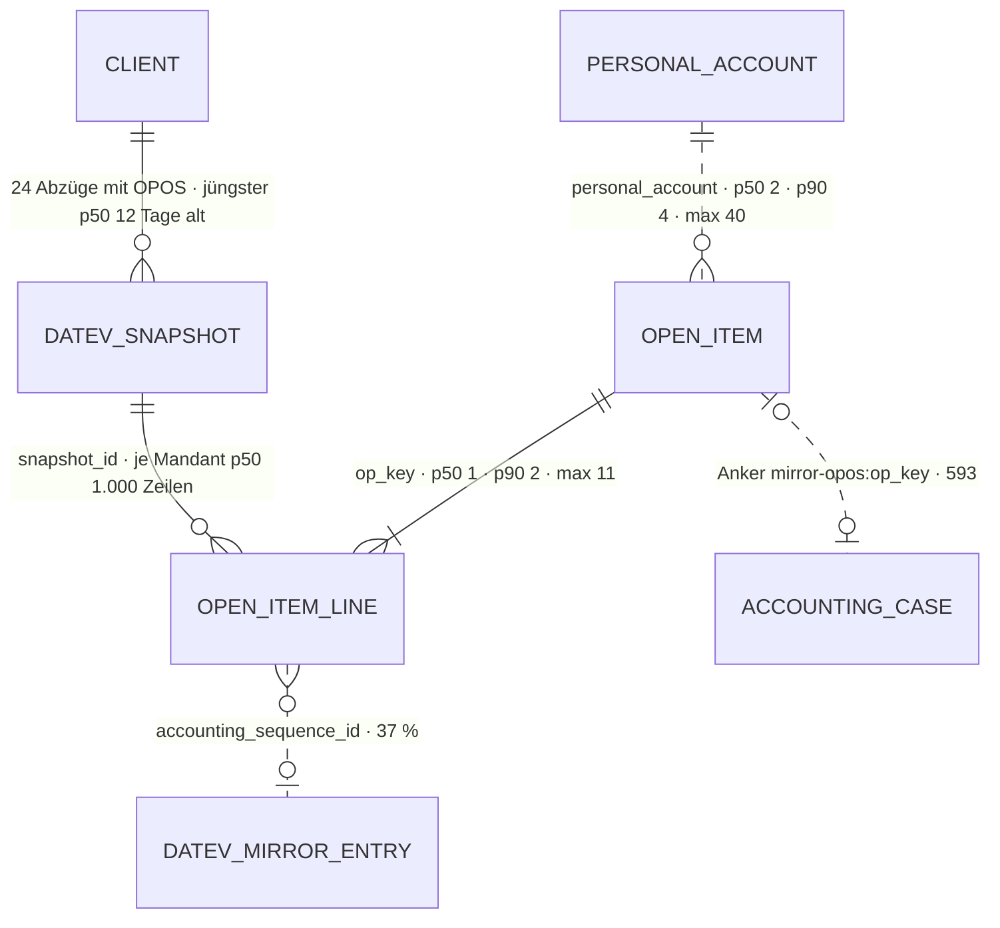

# Offener Posten · `open-item` — Entitätsprofil

| | |
|---|---|
| Status | **analysiert** |
| GLOSSARY | kein eigener Eintrag — der offene Posten steht in `### OPOS-Vortrag (open item carryover)`, `### Sammelsachverhalt und OPOS-Pool (collective case / open item pool)` und im Abschnitt „Tabellen" (`client_open_item`). Englisch `open item`, Ordner `entities/open-item/` (besteht seit 0029) |
| Tabelle | `ludwig.client_datev_open_items` — je DATEV-Abzug (Snapshot) die Zeilen der OPOS-Liste. **Der Posten ist keine Zeile, sondern eine Klammer:** alle Zeilen mit demselben `op_key` (Personenkonto + Belegfeld 1) sind ein Posten — Sollstellung, Teilzahlungen, Raten |
| Typen | im Spiegel: `datev-truth/domain/open-item.ts` — `OPEN_ITEM_AGE_BUCKETS`, `OPEN_ITEM_AGE_LABEL`, `openItemAgeBucket()`, `groupByAge()`, `OpenItemLink`. **Nicht im Spiegel:** der Posten selbst (`OposStichtagItem`), die Klammer (`OposKlammer`, `OposKlammerLine`) und der Abgleich (`OposAbgleichReport`) — alle in `datev-truth/application/opos-stichtag-core.ts` → L-325. Das Set hält eine Abschrift: `entities/open-item/open-item.ts` (`OpenItem`) |
| Status-Achsen | `open_item_settlement` (offen · nach Stichtag ausgeglichen) · `open_item_line_kind` (Sollstellung · Sollstellung offen · Zahlung) · `ledger_account_type` für die Art (Debitor · Kreditor). Beide eigenen Achsen sind berechnet, nicht gespeichert, und haben deutsche Werte (L-326) |
| Wichtigkeit | App-Roadmap (9be34746) Rang 9, 12 Punkte: „Row und Altersgruppe stehen (0029), Seitenprofil liegt, Liste und Profil fehlen — kleinster Schritt zur fertigen Seite" |
| Datenstand | Staging über den Pooler, **2026-09-11**, schreibgeschützte Sitzung: **59.962 Zeilen** in 24 Abzügen von 7 Mandanten, 3.255 davon nicht ausgeglichen. Gemessen am **jüngsten Abzug je Mandant**: 12.875 Zeilen, **947 offene Zeilen = 658 offene Posten** (423 Debitoren, 235 Kreditoren). „Offen" ist hier `is_cleared = false` im jüngsten Abzug — eine Näherung an die Stichtagsrechnung der App, nicht diese. Nur `SELECT`, keine Kundendaten; Beispielwerte erfunden. Perzentile diskret |
| Bestandswarnung | **71 % der offenen Posten sind über 90 Tage überfällig** (470 von 658). Das ist kein Messfehler, sondern der Grund, warum die Liste die ältesten zuerst zeigt |
| Rückfrage | gestellt am 2026-09-11 an `ludwig-manager` — Defaults gelten, bis sie beantwortet ist |
| Analyse von / am | Claude, 2026-09-11 (Skill `entitaet-analysieren`) |

## Was sie ist

Ein offener Posten ist eine Rechnung, die in DATEV zu einem Stichtag noch nicht
ausgeglichen war — eine Aussage über den DATEV-Bestand, kein Vorgang in Ludwig.
Die Kanzlei sucht darin den Posten, zu dem eine Zahlung gehört, und sieht, wen
sie nicht mehr mahnen darf; sie bucht und mahnt hier nicht.

**Anzeige-Regeln**, wörtlich:

- „‚Offen' ist ohne Stichtag keine Aussage." (`docs/seiten/opos.md`, Rang 1)
- „Diese Liste ist rekonstruiert, nicht gemessen. […] Jede Angabe hier ist so
  alt wie der Abzug — das macht die Herkunft zu einem Datenpunkt und nicht zu
  einer Fußnote." (`opos.md`, Job)
- „Ein offener Posten trägt keine Sachverhalts-Id; die Brücke ist das
  Personenkonto plus die Belegnummer. Eine erfundene Kante wäre schlimmer als
  keine." (`opos.md`)
- „Ein NEGATIVER Rest ist kein Ausgleich, sondern ein Guthaben aus Stornos —
  der Posten ist offen." (`isOposItemSettled()`, F173)
- „Ohne Fälligkeitsdatum `notDue`: ein Posten, dessen Frist niemand kennt, ist
  nicht überfällig — er ist unbestimmt, und ‚überfällig' wäre eine
  Behauptung." (`openItemAgeBucket()`) — dazu L-327.
- „Die Mahnstufe wird gezeigt, nicht gesetzt — sie kommt aus dem Snapshot."
  (`opos.md`)
- Ein genäherter Betrag trägt „≈" und den Grund (`OpenItemRow`, 0029).

**Nicht dieser Posten:** die offenen Zahlungs-Erwartungen der Stapelabnahme
(Schritt 5 liest seit F123 Ludwigs Erwartungen, nicht den Spiegel — Profil
`expectation`, Roadmap #10) und die Ausgleichs-Zuordnung (`OpenItemLinkRow`,
Roadmap #11).

## Schaubild



## Datenpunkte

Die Einheit ist der Posten (`OposStichtagItem`), nicht die Zeile. Füllgrad: alle
Zeilen · offene Zeilen im jüngsten Abzug.

| Datenpunkt | Quelle | Rolle | Füllgrad | heute in | änderbar | Rang | ab Form | Beleg |
|---|---|---|---|---|---|---|---|---|
| Personenkonto (`personal_account`) mit Art (`kind`) | Spalten | Identität | 100 % · 100 % | `OpenItemRow`, Seite, DATEV-Reiter | nie | 1 | S | heute in · „die einzige Brücke zum Rest der Buchhaltung" (`opos.md` Zweifel 3). Den **Namen** trägt kein Typ (L-325) |
| Belegnummer (`external_document_number`) | Spalte | Identität | 100 % · 100 % | `OpenItemRow`, DATEV-Reiter (Kachel) | nie | 2 | S | Länge p50 8 · p90 10 · max 36 |
| Offen zum Stichtag (`openAtStichtag`, genähert: `amountApprox`) | `abgeleitet: opos-stichtag-core.ts` (`application/`) → L-325 | Maß | 100 % (`open_amount`) | `OpenItemRow`, Seite, DATEV-Reiter | nie | 3 | S | `opos.md` Rang 4 · Restbeträge p50 niedrig vierstellig, p90 fünfstellig |
| Fällig (`due_date`) und Altersklasse | Spalte + `abgeleitet: openItemAgeBucket()` | Zeit | 59 % · **90 %** | `OpenItemRow`, Gruppenzeile `OpenItemAgeGroup` | nie | 4 | S; die Klasse als Gruppe in L | Füllgrad · `opos.md` Nebenjob „Nach Alter gruppieren" |
| Ausgleich (`clearedAfterStichtag`) | `abgeleitet: opos-stichtag-core.ts` → L-325 | Zustand | 100 % | `OpenItemRow` (`StatusBadge open_item_settlement`) | nie | 5 | S | Registry · `opos.md` Rang 5 |
| Brutto (`gross_amount`) | Spalte | Maß | 100 % | `OpenItemRow`, DATEV-Reiter | nie | 6 | S | heute in |
| Rechnungsdatum (`invoice_date`) | Spalte | Zeit | 100 % | `OpenItemRow`, DATEV-Reiter | nie | 7 | S | heute in |
| Buchungstext (`description`) | Spalte | Erklärung | 99 % · 100 % | `OpenItemRow`, DATEV-Reiter | nie | 8 | S — kurz genug: p50 13 · p90 32 · max 60 | Länge · heute in |
| Mahnstufe (`dunning_level`) | Spalte | Zustand | 1 % · **17 % über 0** | `OpenItemRow`, DATEV-Reiter (Badge) | nie | 9 | S, nur über 0 | `opos.md` Zweifel 1 · 0029 M8 |
| Gegenkonto (`contra_account`) | Spalte | Kontext | 100 % | `OposStichtagItem` („gegengebucht auf 6300", F97) — keine Anzeige | nie | 10 | M | Füllgrad · Read-Model |
| Stapel der Sollstellung (`accounting_sequence_id`) | Spalte | Kontext | 37 % | DATEV-Reiter | nie | 11 | M | heute in |
| DATEV-Beleg (`document_link`) | Spalte | Kontext | 13 % · 45 % | DATEV-Reiter (gekürzte GUID) | nie | 12 | M, als Weg — die GUID selbst nur in den Rohdaten | heute in |
| Zeilen der Klammer (`OposKlammer.lines`: Datum, Zeilenart, Text, Soll, Haben, Saldo) | `abgeleitet: opos-stichtag-core.ts` → L-325 | Maß | — | DATEV-Reiter „Zeilen der Klammer" | nie | 13 | M, eingeklappt | heute in · Kardinalität unten |
| Stand des Abzugs (`client_datev_snapshots.as_of`) | Eltern | Zeit | 100 % | Seite (Kachel „DATEV-Stand", Banner), DATEV-Reiter | nie | — (Kopf der Liste) | L | `opos.md` Job („misslungen, wenn … ohne das zu sagen") |

Ausgelassen (Technik): `id`, `tenant_id`, `client_id`, `snapshot_id`, `op_key`
(der Anker, nie als Text), `wire_id`, `posting_record_number`, `is_condensed`
(0 % der offenen), `balancing_type`, `amount_debit`/`amount_credit` (gehen in die
Zeilen der Klammer), `evidence_type` (geht in die Zeilenart), `debit_credit`,
`tax_rate`, `payment_method`, `term_of_payment_id`, `due_days`,
`dunning_date1/2`, `has_dunning_block`, `has_interest_block`,
`open_item_indicator`, `open_item_number` (60 % der offenen; die Klammer führt
`op_key`), `created_at`. Sie stehen in den Rohdaten des Abzugs, nicht am Posten.

Freitext-Grenzen: keine Kürzung nötig — Buchungstext max 60, Belegnummer max 36
(die Zeile kürzt trotzdem, weil DATEV 36 zulässt; 0029 M2).

## Relationen

| Relation | Richtung | Kardinalität | Rolle | ab Form | Darstellung | Beleg |
|---|---|---|---|---|---|---|
| Mandant (`client_id`) | Eltern | 7 Mandanten · offene Posten je Mandant p50 86 · p90 128 · max 128 | Kontext | — | nie, die Seite setzt ihn | Staging |
| Abzug (`snapshot_id` → `client_datev_snapshots`) | Eltern | 24 Abzüge mit OPOS · der jüngste je Mandant p50 12 · max 30 Tage alt | Zeit | L | „Stand" im Kopf der Liste; `SnapshotCard` (0027) | Staging · `opos.md` Job |
| Zeilen der Klammer (dieselbe Tabelle, `op_key`) | Kind | offene: p50 1 · p90 2 · max 11 (109 Posten mit mehr als einer) · je OP-Nummer über alle Abzüge p50 2 · p90 4 · max 26 | Maß | M | Liste in der Karte, eingeklappt (p50 1: kein Abriss) | Staging · DATEV-Reiter |
| Personenkonto (`personal_account`, ohne FK) | Eltern | offene Posten je Konto p50 2 · p90 4 · max 40 (210 Konten) | Identität | S | Nummer mit Weg zum Kontoblatt (`OpenItemRow href`); am Konto oder Partner dieselbe Liste | Staging · Seite |
| Sachverhalt (Anker `batch_opos_reference = 'mirror-opos:<op_key>'`, ohne FK) | ohne FK | 593 Sachverhalte mit Anker, je Posten höchstens einer · OPOS-Pool 0 | Kontext | M | vom Sachverhalt aus: `OpenItemCard` im DATEV-Reiter; vom Posten aus kein Weg (`opos.md`) | Staging · GLOSSARY „OPOS-Vortrag" |
| Spiegelbuchung (`accounting_sequence_id`, ohne FK) | ohne FK | 37 % | Kontext | M | Stapelnummer als Text; der Weg zur Spiegelbuchung → Profil `datev-mirror-entry` | Spaltenkommentar |
| Buchungshistorie (`compareOposWithHistory()`, über `op_key`) | ohne FK | je Posten ein Paar oder keins | Zustand | L | eigene Liste „Abgleich" (Backlog 0171, B1) | Seite, `opos.md` Rang 6 |
| Historie (`platform_audit_events`) | — | keine — der Posten ist ein Abzug, kein Vorgang | — | — | entfällt | Schema |

## Heutige Darstellung

| Komponente | Form | zeigt | fehlt | zu viel |
|---|---|---|---|---|
| `OpenItemRow`, `OpenItemAgeGroup` (Set, 0029 fertig) | Zeile, Gruppenzeile | Art, Konto, Belegnummer, Datum, Fällig, Text, Mahnstufe, Ausgleich, Brutto, Offen; Klasse mit Zahl und Summe | der Name des Personenkontos (L-325) | — |
| `open-items/page.tsx` (App, 299 Z.; bis F210 `opos`) | Seite mit Liste | Stichtag im Kopf, drei `KpiTile`, Banner „nach dem letzten Abzug", Tabellenkopf von Hand, `OpenItemAgeGroup` + `OpenItemRow`, `Pagination`, Fußnote zu Genäherten, Abgleich als zweite Tabelle | ein Leerfall, der Erfolg und Lücke trennt (`opos.md` Zweifel 4) | der Tabellenkopf steht zweimal — hier und im Showcase (`CaseTabs`, `OpenItemsCard`) |
| `CaseDatevTruthTab` (App, `datev-truth/ui`) | Karte im Sachverhalt | Belegnummer, Konto, Brutto, Rechnungsdatum, Offen (≈), Fälligkeit, Text, Mahnstufe, Stapel, DATEV-Beleg; „nicht mehr offen"; Zeilen der Klammer mit laufendem Saldo | — | drei `KpiTile` für Stammdaten eines Postens; Zeilenart als handgebaute `Badge` mit anderer Tönung als die Registry (Zahlung `neutral` statt `success`); rohes `<table>` |
| `Step5List` (App, Stapelabnahme) | Block „DATEV-Stand" am Posten der Erwartung | nichts: `rows={[]}` | alles — der Block ist nie verdrahtet (L-328) | ein Leersatz, der eine Aussage behauptet |
| Showcase `CaseTabs` (Set) · Plausibilität und Technik | Liste in einer Karte | `OpenItemRow` × n unter eigenem Kopf | — | eigener Tabellenkopf (`OpenItemsCard`) |

## Listen

| Liste | Job | Grundgesamtheit | Sortierung | Spalten (Ränge) | Filter | Massenaktion | Leerfall | Umfang p50 · p90 | Beleg |
|---|---|---|---|---|---|---|---|---|---|
| `OpenItemList` „zum Stichtag" | **J-07** — Wenn **eine Zahlung eingeht oder eine Mahnung ansteht**, will **die Kanzlei** **wissen, welche Rechnungen zu einem Stichtag offen waren**, damit **sie den Posten findet, zu dem die Zahlung gehört — und keinen mahnt, der längst bezahlt hat** | offen zum Stichtag, beide Arten, ein Mandant | Altersklasse, älteste zuerst (`groupByAge`) | 1–9 | keiner — der Stichtag ist die Grundgesamtheit, kein Filter (`opos.md` Zweifel 4) | keine | zwei: Erfolg (Stichtag ≤ Abzug, „kein Posten offen") ≠ Lücke (Stichtag nach dem Abzug) — offene Frage 2 | 86 · 128 | Staging · `open-items/page.tsx` · `opos.md` |
| dieselbe `OpenItemList` „eines Personenkontos" | Wenn **die Sachbearbeiterin einen Sachverhalt prüft**, will **sie sehen, was auf seinem Personenkonto sonst noch offen ist**, damit **sie erkennt, ob die Zahlung einen anderen Posten meint** | offen zum Stichtag, ein Personenkonto | wie oben | 2–9 (Art und Konto sind gleich) | keiner | keine | ein Satz: „auf diesem Konto ist sonst nichts offen" (Erfolg) | 2 · 4 | Staging · Showcase `CaseTabs` Plausibilität (0152 Nachtrag: „Personenkonto, offene Posten, Ausgleich") |
| „Abgleich mit der Buchungshistorie" | Wenn **die Liste von DATEV abweicht**, will **die Kanzlei** **sehen, welcher Posten nur in der OPOS-Liste, nur in der Historie oder mit anderem Rest steht**, damit **sie der Liste trauen kann** | Paare OPOS ↔ Historie über `op_key` | Abweichungsart | Paar | — | keine | „alles stimmt überein" | — | `opos.md` Rang 6 · `compareOposWithHistory()` |

Die ersten beiden sind **eine** Komponente: sie unterscheiden sich nur in der
Grundgesamtheit, die der Aufrufer als Daten übergibt; dass Art und Konto fehlen,
ist ein Spalten-Prop. Eine Partnerseite bekäme dieselbe Liste (Wunsch der
App-Roadmap; heute kein Screen). Die dritte ist eine Liste aus Paaren, keine
Liste von Posten — Backlog 0171.

Umfang und Mechanik: p90 128 Posten je Mandant, max 128 — `Pagination` wie heute
auf der Seite; Filtern im Client entfällt, weil nicht gefiltert wird.

## Formen

| Form | Größe | Empfehlung | Grund (§7 Nr.) | zeigt (Ränge) | Relationen | setzt auf | ersetzt |
|---|---|---|---|---|---|---|---|
| `OpenItemCell` | XS | nein | keine fremde Zeile trägt die Kennung eines Postens: die Ausgleichs-Zuordnung zeigt auf Buchungen, die Erwartung und die Bankzeile auf keinen Posten (App-Roadmap nannte sie — kein Aufrufer belegt es) | | | | |
| `OpenItemRow`, `OpenItemAgeGroup` | S | **besteht** (0029 fertig) | 1 | 1–9 | — | — | — |
| `OpenItemCard` | M | ja | 1 — existiert als Karte im DATEV-Reiter des Sachverhalts; 2 — Kontext einer anderen Entität; Schritt 5 verlangt sie (L-328) | 1–13 und der Stand des Abzugs; der Fall „im jüngsten Abzug nicht mehr offen"; Zeilen der Klammer eingeklappt | Zeilen der Klammer als Liste | `Card`, `FieldList`, `StatusBadge` (`open_item_settlement`, `open_item_line_kind`), `AmountCell`, `Disclosure`, `Table` | die OPOS-Karte in `CaseDatevTruthTab` samt „Zeilen der Klammer" |
| `OpenItemList` | L | ja | 6 — zwei Listen-Jobs, eine Komponente; 1 — die Seite und der Showcase bauen den Tabellenkopf je selbst | Kopfzeile, Altersgruppen, Zeilen 1–9; die zwei Leerfälle; der Stand des Abzugs im Kopf | — | `Card`, `CardHead`, `Table`/`HeadRow`, `StatusHeader`, `OpenItemRow`, `OpenItemAgeGroup`, `EmptyState`, `Pagination` | die Tabelle in `open-items/page.tsx`, `OpenItemsCard` im Showcase |
| `OpenItemView` | L | nein | keine Route je Posten; der Posten hat keine Id, nur einen Anker | | | | |
| `OpenItemDrawer` | L | nein | 5 greift nicht: der Sachverhalt zeigt den Posten selbst (Karte), Schritt 5 bettet die Karte ein — kein Ort schlägt ihn nach, ohne ihn zeigen zu können | | | | |
| `OpenItemEditor` | XL | nein | kein Punkt mit änderbar = Nutzer — DATEV ist die Quelle, die Liste ist schreibgeschützt | | | | |

Bau-Reihenfolge: `OpenItemCard` → `OpenItemList` (die Zeile steht).

## Zuschnitt

| Form / Liste | Marke | Grund | Backlog |
|---|---|---|---|
| `OpenItemCard` | jetzt | existiert im DATEV-Reiter; Schritt 5 wartet darauf | — |
| `OpenItemList` (Stichtag, Personenkonto) | jetzt | ersetzt die Tabelle der Seite und den Showcase-Kopf; die letzte Lücke der Seite `open-items` | — |
| Abgleich mit der Buchungshistorie | Backlog | eine Liste aus Paaren auf **B1** (`ReconciliationTable`, 0161 fertig); gehört mit der Ausgleichs-Zuordnung (#11) in einen Zug; `OposAbgleichReport` liegt in `application/` (L-325) | `docs/backlog/0171-open-item-history-reconciliation.md` |
| `OpenItemCell`, `OpenItemView`, `OpenItemDrawer`, `OpenItemEditor` | verworfen | kein Grund aus §7 Nr. 1–6 (Tabelle „Formen") | — |

## Befunde für `ludwig/app`

- **L-325** — Der Posten, die Klammer und der Abgleich haben keinen Typ im
  Spiegel und deutsche Feldnamen; den Namen des Personenkontos trägt keiner.
- **L-326** — `open_item_settlement` und `open_item_line_kind` haben deutsche
  Werte.
- **L-327** — „Noch nicht fällig" heißt meistens „ohne Fälligkeit": 33 von 34
  Posten dieser Klasse haben keine.
- **L-328** — Schritt 5 zeigt den DATEV-Stand nie (`rows={[]}`).

## Offene Fragen

1. Welcher Stichtag gilt ohne Wahl — heute oder der Stand des Abzugs? Heute
   liegt fast immer nach dem Abzug (p50 12 Tage), der Banner stünde bei jedem
   Besuch. — ohne Antwort: **der Stand des jüngsten Abzugs**; heute bleibt
   wählbar und bringt dann den Banner.
2. Der Leerfall (`opos.md` Zweifel 4, beim Owner offen). — ohne Antwort:
   Stichtag bis zum Abzug → Erfolg „Zum … war kein Posten offen"; Stichtag
   danach → Lücke „Nach dem Abzug vom … — was seitdem entstand, fehlt".
3. Bekommen Posten ohne Fälligkeit eine eigene Gruppe? — ohne Antwort: **ja**,
   „ohne Fälligkeit" als letzte Gruppe, sobald die Klasse aus der Domäne kommt
   (L-327); bis dahin wie heute.

## Prüfung

Gehört dem zweiten Agenten.

| Zeile / Form | Einwand | Ergebnis | Geprüft von / am |
|---|---|---|---|

## Weiter

Prüfprompt (neue Sitzung, anderer Agent):

```
Prüfe das Entitätsprofil docs/entitaeten/open-item.md nach Skill entitaet-analysieren §5–§9.
Zuerst jede Zeile mit Beleg „Annahme": belege oder widerlege sie mit Füllgrad, heutiger
Komponente oder GLOSSARY. Dann die Ränge: deck die Punkte ab Rang k ab — erkennt eine
Sachbearbeiterin den Vorgang noch? Dann die Formen: hat jede empfohlene einen Grund aus
§7, fehlt eine, die die App heute hat? Dann die Listen: hat jede einen Job-Satz, und ist
jede Ausprägung nach §8 eine eigene Komponente wert oder nur ein Prop? Zuletzt der Zuschnitt:
sind höchstens fünf Formen „jetzt", und trägt jede Backlog-Zeile ihren Grund? Trag jeden
Einwand in „Prüfung" ein, ändere die
Tabellen, wo du sicher bist, und setze den Status auf „geprüft". Kundendaten bleiben in
der Datenbank; nur SELECT.
```

Startprompt (neue Sitzung, nach Status `geprüft`):

```
Für die Entität Offener Posten (`open-item`) liegt das geprüfte Profil unter
docs/entitaeten/open-item.md. Schreibe mit Skill spec-schreiben je Form eine Spec, in dieser
Reihenfolge — nur die Formen mit Marke „jetzt" aus dem Abschnitt Zuschnitt:
OpenItemCard, OpenItemList. Was dort „Backlog" trägt, bleibt liegen. Jede Spec verlinkt das Profil als
Quelle und nimmt Datenpunkte, Ränge, Relationen und „ersetzt" von dort, nicht aus dem
Chat; die Punkte einer Form sind die Ränge bis zu ihrer Größe, in derselben Reihenfolge.
Danach baut Skill v3-komponente jede Spec in derselben Reihenfolge, die größere Form
komponiert die kleinere. Abgenommen wird von einem anderen Agenten gegen die Spec. Nur
eigene Dateien stagen. Setze am Ende den Status des Profils auf „in Specs" und trage die
Backlog-Nummern ein.
```
