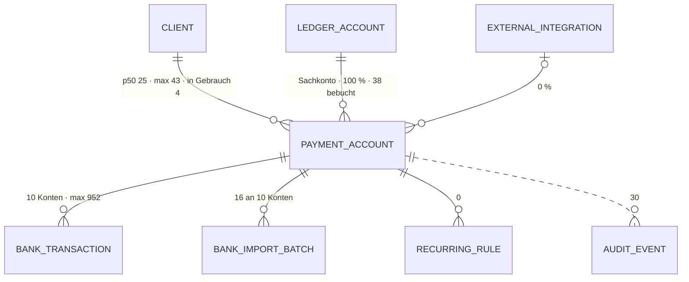

# Zahlungskonto · `payment account` — Entitätsprofil

| | |
|---|---|
| Status | **analysiert** |
| GLOSSARY | `### Payment account`, `### Statement expectation (Auszugserwartung)`, `### Payment account retirement` (Zahlungsweg-Abschaltung) — Ordner `entities/payment-account/`; Verrechnungskonto-Kategorie bleibt im Profil `account` |
| Tabelle | `ludwig.client_payment_accounts` — „Eigene Bank-/Kassen-/Kreditkartenkonten des Mandanten mit IBAN" (Tabellenkommentar). Keine Subtypen; `kind` ist „nur UI-Kategorisierung (IBAN-Feld, Icon), nicht Routing-Trigger" (GLOSSARY) |
| Typen | `bank-transactions/domain/payment-account-options.ts` — `PaymentAccountFacts`, `PaymentAccountOption`, `isPaymentAccountInUse()`, `toPaymentAccountOptions()`. **Nicht im Spiegel:** die Wortliste der Art (`core/accounting/payment-account-kind.ts`) → L-312; `PaymentAccountWithStats` (`bank-transactions/infrastructure/bank-transactions-queries.ts:230`) → L-314 |
| Status-Achsen | `kontoauszug_erwartung` (erwartet · erwartet (Hand) · keine · keine (Hand)) · `zahlungsweg` (aktiv · abgeschaltet, aus `valid_until`) · `integration` (am Integrationssatz). **In Gebrauch** ist abgeleitet (`isPaymentAccountInUse()`), keine Achse |
| Wichtigkeit | **mittel** — Roadmap der App (9be34746) Rang 5 |
| Datenstand | Staging über den Pooler, **2026-09-11**, schreibgeschützte Sitzung: **195 Zahlungskonten, 7 Mandanten** (p50 25 · max 43 je Mandant). Nur `SELECT`, keine Kundendaten; Beispielwerte erfunden |
| Bestandswarnung | **Nur 23 von 195 Konten sind in Gebrauch** (Auszugserwartung, Bewegung oder Auto-Zuordnung — `isPaymentAccountInUse()`), 4 je Mandant; der Rest ist der vom Onboarding promotete SKR-Bankblock. Nur 10 Konten tragen Bankzeilen (4 · 17 · 27 · 31 · 36 · 67 · 71 · 76 · 145 · 952). IBAN 6 %, Integration 0 %, Befristung 0 % |
| Rückfrage | gestellt und **beantwortet** am 2026-09-11 (`ludwig-manager`, aus dem App-Stand): die Defaults der drei Fragen gelten; acht Anwendungsfälle zugeordnet, einer neu (Konten des Stapels → 0168); `PaymentAccountField` bleibt der einzige Picker |
| Analyse von / am | Claude, 2026-09-11 (Skill `entitaet-analysieren`) |

## Was sie ist

Ein Zahlungskonto ist ein eigenes Konto des Mandanten, über das Geld fließt —
Bank, Kasse, Kreditkarte, PayPal, Mitarbeiter-Auslagen. Die Sachbearbeiterin
sieht jede Woche, welches Konto Bewegung hat und wo Zahlungen ohne Sachverhalt
liegen; bei der Einrichtung legt sie fest, welches Konto Auszüge liefern muss,
welches eine Zahlungsart automatisch bekommt und welches abgeschaltet wird.

**Anzeige-Regeln** (wörtlich):

- „`kind` ist nur UI-Kategorisierung (IBAN-Feld, Icon), nicht
  Routing-Trigger." (GLOSSARY, Payment account)
- „Ausgeblendet wird nichts: eine falsch abgeleitete Erwartung darf niemanden
  aussperren. Die weiteren Konten stehen hinten, nicht draußen."
  (`payment-account-options.ts`)
- „Das Aktivitätsfenster ist der Rahmen jeder Lückenprüfung — außerhalb ist ein
  fehlender Auszug keine Lücke." (GLOSSARY, Statement expectation)
- „Abgeschaltet wird ausschließlich nach menschlicher Bestätigung … — nie
  automatisch." (GLOSSARY, Payment account retirement)
- Auszugserwartung: „mit Erwartung ist ein fehlender Auszug ein Blocker, ohne
  nur eine Warnung" (GLOSSARY) — die Erwartung ist deshalb kein Nebenfeld.

## Schaubild



## Datenpunkte

| Datenpunkt | Quelle | Rolle | Füllgrad | heute in | änderbar | Rang | ab Form | Beleg |
|---|---|---|---|---|---|---|---|---|
| Name (`display_name`) | Spalte | Identität | 100 % · p50 18 · max 40 Zeichen | `banks/page.tsx`, `bankkonten/page.tsx`; im Set `PaymentAccountField`, `SourceDocumentFacts` | Nutzer | 1 | XS | Füllgrad · heute in |
| Art (`kind`) | Spalte | Identität (Art) | 100 % — `bank` 133 · `employee_clearing` 22 · `cash` 21 · `credit_card` 16 · `paypal` 3 · `other` 0 | `banks/page.tsx`, `bankkonten/page.tsx` (lokale Wörter) | Nutzer | 2 | XS (Zeichen), S (Wort) | Füllgrad · GLOSSARY; Wortliste nicht im Spiegel und zweimal lokal kopiert (L-312) |
| Kennung (IBAN maskiert · Kartenkennung `external_account_id`) | Spalten | Identität | 6 % · 7 % — Bank 12 von 133, Kreditkarte 13 von 16 | `banks/page.tsx`, `bankkonten/page.tsx`; im Set IBAN im `title` (`SourceDocumentFacts`) | Nutzer | 3 | S | Füllgrad; fehlt sie, heißt das „nur Sachkonto, kein Auszugskanal" (Roadmap) |
| Sachkonto (`fy_ledger_account_id`) | Eltern | Kontext | 100 % · 38 davon bebucht | `banks/page.tsx` (`ledgerAccountNumber`/`Name`), `bankkonten/page.tsx` | Nutzer | 4 | S | Füllgrad · heute in |
| In Gebrauch (`isPaymentAccountInUse()`) | abgeleitet: erwartet Auszüge ∨ Bankzeilen ∨ Auto-Zuordnung | Zustand | 23 von 195 | im Set `PaymentAccountField` (geführt / weitere) | Server | 5 | S | Domäne · Staging |
| Auszugserwartung (`expects_statements` · `expects_statements_manual`) | Spalte · Spalte | Zustand (`kontoauszug_erwartung`) | 4 erwartet (3 von Hand, 1 abgeleitet), 3 „keine (Hand)" | `bankkonten/page.tsx` (`StatementExpectationCell`) | Server · Nutzer (Hand) | 6 | S | Füllgrad · GLOSSARY (Gate 1a) |
| Bewegung im Jahr (Zu-/Abfluss, Netto, Anzahl, erste/letzte) | abgeleitet aus den Bankzeilen (`PaymentAccountWithStats`) | Maß | an 10 Konten | `banks/page.tsx` (`txInflow`, `txOutflow`, `txNet`, `txCount`, `minDate`, `maxDate`) | Server | 7 | S | heute in; VM in der Infrastruktur (L-314) |
| Auto-Zuordnung (`auto_assign_payment_method`) | Spalte | Zustand | 6 % — Kasse 6 · Kreditkarte 3 · PayPal 3; UNIQUE je Zahlungsart | `bankkonten/page.tsx` (`AutoAssignOverview`, mit Kanal-Lücken) | Nutzer | 8 | M | Füllgrad unter 20 % · Wortliste der Zahlungsart nur lokal (L-313) |
| Anbindung (`external_integration_id` → Status) | Eltern | Zustand (`integration`) | 0 % | `banks/page.tsx` (`integrationLabel`), `bankkonten/page.tsx` (`IntegrationCell`) | Nutzer | 9 | L, nur wenn gesetzt | Füllgrad |
| Aktivitätsfenster (`statement_activity_from` · `_to`) | Spalten | Zeit | 2 % | `bankkonten/page.tsx` | Server | 10 | L | Füllgrad · GLOSSARY (Rahmen der Lückenprüfung); Deckung je Monat über `PeriodGrid` (0162, Story `StatementCoverage`) |
| Bank (`bank_name` · `bic` · `blz`) | Spalten | Identität | 1 % · 4 % · 0 % | `PaymentAccountForm` | Nutzer | 11 | L | Füllgrad |
| Befristung und Abschalt-Vorschlag (`valid_from` · `valid_until`; letzte Bewegung abgeleitet) | Spalten · abgeleitet | Zeit · Zustand (`zahlungsweg`) | 0 % gesetzt | `PaymentChannelActivitySection` (`a.retirement`, `a.lastMovement`, `a.validUntil`) | Nutzer (Bestätigung) | 12 | L | Füllgrad · GLOSSARY (Retirement) |
| Kontoinhaber (`metadata.account_holder`) | Spalte (jsonb) | Kontext | 49 % (95) · `datev_bank` 12 | — | Server | 13 | L | Staging |

Ausgelassen (Technik): `id`, `tenant_id`, `client_id`, `created_at`,
`updated_at`, der Rest von `metadata`.

Freitext-Grenzen: Name max 40 — nie gekürzt.

## Relationen

| Relation | Richtung | Kardinalität | Rolle | ab Form | Darstellung | Beleg |
|---|---|---|---|---|---|---|
| Bankzeilen (`client_bank_transactions.payment_account_id`) | Kind | 10 von 195 Konten · 4 bis 952 | Maß | S | **Zähler** und Summen in S · die Liste ist der **Kontoauszug** (`BankTransactionList` 0085, Seitenprofil `kontoauszug`) — eigene Route, das Konto ist ihr Kopf | Staging |
| Importläufe (`client_bank_import_batches`) | Kind | 16 an 10 Konten; `period_from/to`, `opening_balance`/`closing_balance`, `statement_sequence` | Zeit | L | Deckung je Monat über `PeriodGrid` (B2) · Saldo über B6 | Staging · Roadmap |
| Sachkonto (`fy_ledger_account_id`) | Eltern | 100 % | Kontext | S | **Inline** `AccountCell` → Profil `account` | Staging |
| Integration (`client_external_integrations`) | Eltern | 0 % | Zustand | L | **Inline** mit Achse `integration` | Staging |
| Wiederkehr-Regeln (`payment_account_id`) | Kind | 0 | Kontext | — | Nennung in `RecurringRuleFacts` über `PaymentAccountCell` | Staging |
| Belege (Zahlungskonto am Kontoauszug-PDF) | Kind, abgeleitet | nicht gemessen | Kontext | — | Nennung in `SourceDocumentFacts` über `PaymentAccountCell` | Set |
| Verlauf (`platform_audit_events`, `resource_kind = payment_account`) | ohne FK | 30 — `bank_import.csv` 23 · `bank_import.statement_lines` 6 · `payment_account.updated` 1 | Verantwortung | L | Liste über `LogBrowser` | Staging |

## Heutige Darstellung

| Komponente | Form | zeigt | fehlt | zu viel |
|---|---|---|---|---|
| `[year]/banks/page.tsx` (180 Z.) | Liste, Tabelle inline | Name, Art, IBAN, Sachkonto, Anbindung, Zu-/Abfluss, Netto, Anzahl, erste/letzte Bewegung | Auszugserwartung, offene Zahlungen je Konto | — |
| `configuration/bankkonten/page.tsx` (372 Z.) | Konfiguration, Zellen inline (`StatementExpectationCell`, `AutoAssignOverview`, `IntegrationCell`) | Name, Art, IBAN, Sachkonto, Auszugserwartung, Aktivitätsfenster, Anbindung, Auto-Zuordnung mit Kanal-Lücken | — | **eigene Wortlisten** für Art (Z. 205, „Kredit-/EC-Karte") und Zahlungsart (Z. 207) |
| `PaymentAccountForm` (313 Z.) · `PaymentAccountIbanForm` (nicht gemountet) · `PaymentAccountIntegrationLink` | Editor | die änderbaren Felder | — | zwei Formulare für eine Entität |
| `PaymentChannelActivitySection` (164 Z.) | Abschalt-Vorschläge | letzte Bewegung, Vorschlag, Befristung | — | eine dritte Wortliste der Art (Z. 14) |
| Kopf von `KontoauszugView` (631 Z.) | Kopf | Kontoname, Nummer, Zeitraum (Seitenprofil `kontoauszug` Rang 1) | — | — |

**Aus der Rückfrage** (Manager, 2026-09-11) — die Anwendungsfälle der App und
wo sie hier stehen: (a) `banks/page.tsx` → `PaymentAccountList`; (b) die
Kontoauszugsseite mit `DatevCoveragePanel` → `PeriodGrid` (Story
`StatementCoverage`); (c) `configuration/bankkonten` (UPSERT,
Abschalt-Vorschläge) → `PaymentAccountSettingsList` + `PaymentAccountEditor`;
(d) die Belegseite: das Zahlungskonto eines Kontoauszugs wird nur noch am Beleg
angegeben, führender Zustand „Angabe nötig" (L-266/L-268, F213) →
`PaymentAccountField` + `PaymentAccountCell` in der Mängel-Box; (e)
Regel-Editor und `RecurringRuleFacts` → `PaymentAccountCell`; (f) **die
Stapelabnahme je Zahlungskonto** — Schritt 1 (Mengengerüst) und Schritt 4
(Bankabgleich, Gates mit `forRelease` als aufklappbare Zeilen, F204) — eine
Liste „Konten des Stapels", die dieser Schnitt nicht nannte → 0168; (g) das
Onboarding legt Zahlungskonten aus DATEV an (zwei Schreiber per UPSERT) —
keine Oberfläche; (h) der Guard „Zahlungskonto-Bindung" (Kontonummer ↔
Zahlungskonto) — nur Server.

**Im Set:** `PaymentAccountField` (0145 — der Picker trennt geführte von
weiteren Konten über `isPaymentAccountInUse()`), die Zeile „Zahlungskonto" in
`SourceDocumentFacts` (Name, IBAN im `title`) und in `RecurringRuleFacts` —
dort steht heute die **rohe Id** (`rule.paymentAccountId`, Z. 262; Befund beim
Bauen, gehört zu 0134), `PeriodGrid` mit Story `StatementCoverage` (0162),
`BankTransactionList` (0085).

## Listen

| Liste | Job | Grundgesamtheit | Sortierung | Spalten (Ränge) | Filter | Massenaktion | Leerfall | Umfang p50 · p90 | Beleg |
|---|---|---|---|---|---|---|---|---|---|
| `PaymentAccountList` „Konten mit Bewegung" | Wenn **die Sachbearbeiterin die Woche beginnt**, will sie **sehen, welches Konto Bewegung hat und wo Zahlungen ohne Sachverhalt liegen**, damit **sie weiß, welchen Auszug sie öffnen muss** | Konten in Gebrauch mit Bewegung im Jahr oder Auszugserwartung | Bewegung absteigend (**Annahme** zur heutigen Reihenfolge) | 1–7 + offene Zahlungen | keine | keine | „Kein Konto hat in diesem Jahr Bewegung — Auszug importieren." | 4 je Mandant → keine Pagination, kein Filter | Staging · `banks/page.tsx` |
| `PaymentAccountSettingsList` „Bankkonten & Kasse konfigurieren" | Wenn **ein Mandant eingerichtet wird**, will **die Kanzlei festlegen, welche Konten Auszüge liefern, welches Konto welche Zahlungsart bekommt und welche abgeschaltet werden**, damit **der Buchungslauf nur für geführte Konten Auszüge fordert** | alle Zahlungskonten des Mandanten, geführte zuerst (Abschnitte „in Gebrauch" / „weitere") | Auto-Zuordnung, Art, Name (Reihenfolge der Query) | 1–4, 6, 8, 9, 12 | in Gebrauch | Abschaltung bestätigen (Vorschläge mit Häkchen) | „Keine Zahlungskonten — sie entstehen mit dem DATEV-Abgleich." | 25 · 43 je Mandant → Abschnitte, keine Pagination | Staging · `bankkonten/page.tsx`, `PaymentChannelActivitySection` |

Die beiden unterscheiden sich in drei von fünf Merkmalen (Grundgesamtheit,
Spaltensatz, Massenaktion) — nach §8 zwei Komponenten (Frage 2, bestätigt).
Eine dritte Ausprägung kennt die Stapelabnahme: **„Konten des Stapels"** mit
Deckung (Schritt 1) und Gates (Schritt 4) je Konto — eigene Grundgesamtheit,
eigener Spaltensatz, aufklappbare Zeilen; nach §8 wieder eine eigene
Komponente, vertagt als 0168, bis die Stapelabnahme ein Seitenprofil hat.

## Formen

| Form | Größe | Empfehlung | Grund (§7 Nr.) | zeigt (Ränge) | Relationen | setzt auf | ersetzt |
|---|---|---|---|---|---|---|---|
| `PaymentAccountCell` | XS | ja | 3 — FK-Ziel von Bankzeile, Importlauf und Regel; genannt in `SourceDocumentFacts` (auch in der Mängel-Box „Angabe nötig", F213), `RecurringRuleFacts` (heute rohe Id), an der Bankzeile und im Import | 1–2 (Name, Zeichen der Art); IBAN im `title` | — | `EntityIcon` (`bank-account`), `Link` auf den Kontoauszug | die Nennungen in `SourceDocumentFacts` und `RecurringRuleFacts` |
| `PaymentAccountRow` | S | ja | 1 — Zeile von `banks/page.tsx` und `bankkonten/page.tsx` | 1–7 | Sachkonto als `AccountCell` | `Row`/`DataTable`-Spalten, `StatusBadge` (`kontoauszug_erwartung`), `AmountCell` | die Tabellen-Zeilen beider Seiten |
| `PaymentAccountList` | L | ja | 6 — Job „Konten mit Bewegung" | Zeile + Rahmen | — | `DataTable`, `PaymentAccountRow`, `EmptyState` | Tabelle in `banks/page.tsx` |
| `PaymentAccountSettingsList` | L | ja | 6 — Job „konfigurieren", eigene Ausprägung nach §8 | Zeile (Konfigurations-Spalten) + Abschnitte + Abschalt-Vorschläge | — | `DataTable` (Gruppen), `PaymentAccountRow`, `SelectionBar` für die Bestätigung | `bankkonten/page.tsx` (Zellen inline), `PaymentChannelActivitySection` |
| `PaymentAccountEditor` | XL | ja | 4 — änderbar = Nutzer: Name, Art, IBAN/BIC/Bank, Kartenkennung, Auszugserwartung (Hand), Auto-Zuordnung, Befristung | 1–4, 6, 8, 11, 12 | Sachkonto als `AccountField` | `Field`, `Select`, `AccountField` | `PaymentAccountForm`, `PaymentAccountIbanForm` |
| `PaymentAccountField` | S | **✓ gebaut** (0145) — bleibt | 3 — Auswahl am Kontoauszug, an der Regel, am Import | | | | |
| `PaymentAccountFacts` | L | nein | der Kopf des Kontoauszugs ist ein `CardHead` mit drei Werten (Seitenprofil `kontoauszug` Rang 1) — **Abweichung von der Roadmap** → Frage 1 | | | | |
| `PaymentAccountCard` | M | nein | kein Screen zeigt das Konto als Karte; die Konfiguration ist eine Tabelle | | | | |
| `PaymentAccountView` · `PaymentAccountDrawer` | L | nein | die Route `banks/[accountId]` ist der Kontoauszug, das Konto ihr Kopf; wer ein Konto nennt, will dorthin | | | | |

Bau-Reihenfolge: `PaymentAccountCell` → `PaymentAccountRow` →
`PaymentAccountList` → `PaymentAccountSettingsList` → `PaymentAccountEditor`.

## Zuschnitt

| Form / Liste | Marke | Grund | Backlog |
|---|---|---|---|
| `PaymentAccountCell` | jetzt | trägt die Nennung in Beleg, Regel, Bankzeile, Import — heute steht dort die rohe Id | — |
| `PaymentAccountRow` | jetzt | trägt beide Listen | — |
| `PaymentAccountList` | jetzt | ersetzt die Tabelle in `banks/page.tsx` | — |
| `PaymentAccountSettingsList` | jetzt | ersetzt die Konfigurationsseite und die Abschalt-Vorschläge | — |
| `PaymentAccountEditor` | jetzt | ersetzt zwei Formulare | — |
| „Konten des Stapels" (Deckung und Gate je Konto) | Backlog | eigene Ausprägung nach §8; hängt am Seitenprofil der Stapelabnahme (0167) | `docs/backlog/0168-payment-account-coverage-list.md` |
| `PaymentAccountFacts` · `Card` · `View` · `Drawer` | verworfen | siehe Formen | — |

Fünf Formen „jetzt" — die Obergrenze.

## Befunde für `ludwig/app`

Alle zusätzlich als Zeile in `docs/befunde-app.md`.

- **L-312** Die Wortliste der Kontoart liegt in `core/accounting/payment-account-kind.ts` und wird nicht gespiegelt. Zwei Stellen halten eigene, abweichende Kopien: `bankkonten/page.tsx` Z. 205 („Kredit-/EC-Karte") und `PaymentChannelActivitySection.tsx` Z. 14 („Kreditkarte").
- **L-313** Die Zahlungsart der Auto-Zuordnung (`bank_transfer`, `direct_debit`, `credit_card`, `paypal`, `cash`, `other`) hat Wörter nur lokal in `bankkonten/page.tsx` Z. 207.
- **L-314** `PaymentAccountWithStats` (Bewegung, Anzahl, erste/letzte Bewegung, Anbindung) liegt in `bank-transactions/infrastructure/bank-transactions-queries.ts:230` und wird nicht gespiegelt. Die Domäne kennt nur die Teilmenge `PaymentAccountFacts`.

## Offene Fragen

**Beantwortet am 2026-09-11** (`ludwig-manager`, aus dem App-Stand): alle drei
Defaults gelten.

1. **Kein `PaymentAccountFacts`** (Roadmap: der Kopf des Kontoauszugs) — das Seitenprofil `kontoauszug` setzt dort einen `CardHead` mit Name, Nummer, Zeitraum. — ohne Antwort: keine eigene Form; die Konfigurationswerte zeigt der Editor.
2. **Die Konfiguration ist eine eigene Liste** (`PaymentAccountSettingsList`), nicht dieselbe mit Props — drei von fünf Merkmalen weichen ab. — ohne Antwort: zwei Komponenten.
3. **Welche Wortliste der Art gilt?** `payment-account-kind.ts` („Mitarbeiter-Auslagen", „Kreditkarte") oder die lokale Kopie der Konfiguration („Kredit-/EC-Karte")? — ohne Antwort: die aus `core/`, sobald sie gespiegelt ist (F210-Fenster).

## Prüfung

Gehört dem zweiten Agenten. Er prüft zuerst alle Zeilen mit Beleg `Annahme`,
dann die Ränge gegen „Heutige Darstellung", dann die Formen gegen §7.

| Zeile / Form | Einwand | Ergebnis | Geprüft von / am |
|---|---|---|---|
| | | | |

## Weiter

Prüfprompt (neue Sitzung, anderer Agent):

```
Prüfe das Entitätsprofil docs/entitaeten/payment-account.md nach Skill entitaet-analysieren §5–§9.
Zuerst jede Zeile mit Beleg „Annahme": belege oder widerlege sie mit Füllgrad, heutiger
Komponente oder GLOSSARY. Dann die Ränge: deck die Punkte ab Rang k ab — erkennt eine
Sachbearbeiterin den Vorgang noch? Dann die Formen: hat jede empfohlene einen Grund aus
§7, fehlt eine, die die App heute hat? Dann die Listen: hat jede einen Job-Satz, und ist
jede Ausprägung nach §8 eine eigene Komponente wert oder nur ein Prop? Zuletzt der Zuschnitt:
sind höchstens fünf Formen „jetzt", und trägt jede Backlog-Zeile ihren Grund? Trag jeden
Einwand in „Prüfung" ein, ändere die
Tabellen, wo du sicher bist, und setze den Status auf „geprüft". Kundendaten bleiben in
der Datenbank; nur SELECT.
```

Startprompt (neue Sitzung, nach Status `geprüft`):

```
Für die Entität Zahlungskonto (`payment account`) liegt das geprüfte Profil unter
docs/entitaeten/payment-account.md. Schreibe mit Skill spec-schreiben je Form eine Spec, in dieser
Reihenfolge — nur die Formen mit Marke „jetzt" aus dem Abschnitt Zuschnitt:
PaymentAccountCell, PaymentAccountRow, PaymentAccountList, PaymentAccountSettingsList, PaymentAccountEditor. Was dort „Backlog" trägt, bleibt liegen. Jede Spec verlinkt das Profil als
Quelle und nimmt Datenpunkte, Ränge, Relationen und „ersetzt" von dort, nicht aus dem
Chat; die Punkte einer Form sind die Ränge bis zu ihrer Größe, in derselben Reihenfolge.
RecurringRuleFacts und SourceDocumentFacts nennen das Konto danach über PaymentAccountCell (heute rohe Id bzw. eigene Zeile).
Danach baut Skill v3-komponente jede Spec in derselben Reihenfolge, die größere Form
komponiert die kleinere. Abgenommen wird von einem anderen Agenten gegen die Spec. Nur
eigene Dateien stagen. Setze am Ende den Status des Profils auf „in Specs" und trage die
Backlog-Nummern ein.
```
