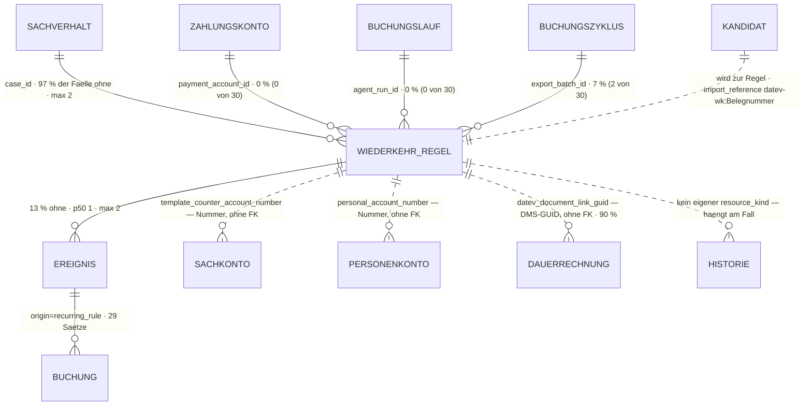

# Wiederkehr-Regel · `recurring rule` — Entitätsprofil

| | |
|---|---|
| Status | **analysiert** |
| GLOSSARY | `### Recurring rule (Wiederkehr-Regel)` — englisch `recurring rule`, Ordner `entities/recurring-rule/` |
| Tabelle | `ludwig.client_accounting_case_rule` (ex `client_recurring_charge_rule`, Rename 2026-06-16). **Keine Subtypen** — eine Tabelle, keine 1:1-Spezialisierung |
| Typen | `src/ludwig/modules/recurring-rules/domain/` — `rule.ts` (`RecurringRule`, `RuleBookingMode`, `RuleDirection`, `RuleExpectedInterval`/`RULE_INTERVAL_LABEL`, `RuleDocumentNumberStrategy`, `RuleProfileSource`, `RuleBookingTemplate`, `RuleTemplateLine`, `matchTransaction()`, `matchSourceDoc()`, `accrualAmount()`, `effectiveAmountTolerance()`, `amountDeviation()`, `isRuleDueInPeriod()`, `accrualDueDate()`, `deriveRuleProfile()`, `prefillFromTransaction()`) · `rule-summary.ts` (`describeRecurringRule()`, `describeRuleSchedule()`, `hasAnyCriterion()`) · `booking-preview.ts` (`buildRulePreview()`, `needsModeReview()`) · `derive-recurring-candidates.ts` (`RecurringCandidate`, `RecurringCandidateClass`) |
| Status-Achsen | `regel_modus` (`booking_mode`) · `dauersachverhalt_uebernahme` (berechnet, gehört dem **Kandidaten**, nicht der Regel) · `ereignis`/`buchung` an den Kindern. **Ohne Achse, obwohl farbig gezeigt:** `is_active` (Befund L-241) |
| Wichtigkeit | **mittel** — zweiter Ring (Datenmodell-Review 2026-08-27 §7: „Match-Kriterien + Buchungsvorlage für Dauersachverhalte") |
| Datenstand | Staging über den Pooler, 2026-09-08, **30 Regeln an 29 Sachverhalten**. Lokal 0 Zeilen; **keine Seeds** (`client_accounting_case_rule` kommt in keiner `supabase/seed*.sql` vor), **keine Story-Fixtures**, **kein `testdata/`** — nachgesehen. Bei 30 Zeilen ist **eine Zeile 3,3 %**; jeder Füllgrad unten steht deshalb mit der absoluten Zahl daneben. Nur `SELECT`, keine Kundendaten im Dokument; Beispielwerte sind erfunden (Musterfirma GmbH, 1.800,00 €) |
| Bestandswarnung | **Der ganze Bestand ist einseitig.** 29 von 30 Regeln stammen aus dem F91-Onboarding-Import (`import_reference` beginnt mit `datev-wk:`), angelegt zwischen 2026-08-21 und 2026-09-07, über drei Mandanten. Es gibt **keine einzige von Hand oder vom Agenten aus einer Zahlung gebaute Regel**. Neun Spalten stehen deshalb auf 0 % — das ist kein Beweis, dass sie tot sind (siehe Befund L-248) |
| Rückfrage | gestellt am 2026-09-08 (Abschnitt „Offene Fragen"), **unbeantwortet** — die Defaults gelten, der Zuschnitt steht |
| Analyse von / am | Claude, 2026-09-08 (Skill `entitaet-analysieren`) |

## Was sie ist

Eine Wiederkehr-Regel ist der **Automat an einem Dauersachverhalt**: sie sagt,
woran Ludwig eine wiederkehrende Zahlung (und seit F94 auch einen
wiederkehrenden Beleg) erkennt, und was daraus gebucht wird. Sie ist keine
Liste von Verträgen und kein eigener Vorgang — sie hängt an genau einem
Sachverhalt mit `kind='recurring_charge'` und **erzeugt Ereignisse**:
Sollstellung (`accrual`) zur Fälligkeit, Zahlungs-Ereignis (`payment_in/out`)
beim Treffer, und je Ereignis einen Buchungsvorschlag mit
`origin='recurring_rule'`.

Die Sachbearbeiterin fragt sie drei Dinge, in dieser Reihenfolge: *wen betrifft
sie, was tut sie bei einem Treffer, und greift sie überhaupt noch?*

### „recurring" heißt dreierlei — dieses Profil meint eines davon

Der GLOSSARY führt drei Einträge, in denen dasselbe Wort steht. Sie hängen in
einer Kette zusammen, sind aber drei verschiedene Dinge, und dieses Profil
beschreibt nur das dritte:

| Was | Wo | Was es heißt |
|---|---|---|
| **Dauerrechnung** (`billing_mode = 'recurring'`) | `client_source_docs_invoices.billing_mode` · GLOSSARY `### Billing mode` | Azure-Klassifikation **am Rechnungsbeleg**: „einmal ausgestellt, gilt für viele künftige Perioden" (Miete, Leasing, Wartungsvertrag). `regular` sind auch die monatlich wiederkehrenden Einzelrechnungen (Telekom, Abo) — die Unterscheidung ist **eine Aussage über den Beleg**, nicht über die Wiederholung |
| **Dauersachverhalt** (LDSV, `kind = 'recurring_charge'`) | `client_accounting_case.kind` · GLOSSARY `### Accounting case`, `### Dauersachverhalt mit wiederkehrenden Buchungen` | Die fachliche Klammer, die „**offen über mehrere Realisierungen**" bleibt. 105 Fälle im Bestand |
| **Wiederkehr-Regel** — *dieses Profil* | `ludwig.client_accounting_case_rule` · GLOSSARY `### Recurring rule` | Das Regelwerk **am** Dauersachverhalt. 30 Zeilen im Bestand, an 29 der 105 Dauersachverhalte |

Die Kette: eine `recurring`-Rechnung **eröffnet** einen Dauersachverhalt, und
der **trägt** eine Wiederkehr-Regel. Der GLOSSARY-Eintrag `Billing mode`
schreibt das auch so — verlinkt dabei aber `[[Recurring rule]]`, obwohl der
Satz den *Sachverhalt* meint (Befund L-247).

**Merksatz für jede Form:** die Dauerrechnung ist ein *Beleg*, der
Dauersachverhalt ein *Vorgang*, die Regel eine *Konfiguration*. Nur die Regel
hat Kriterien.

### Anzeige-Regeln, wörtlich

- „Deterministische Regel an einem Dauersachverhalt (`kind='recurring_charge'`):
  Match-Kriterien gegen Bank-Transaktionen (Richtung, Name, IBAN, Betrag ±
  Toleranz, Zweck-Regex) + Buchungs-Vorlage." (GLOSSARY)
- „Eine Regel ganz ohne Kriterien trifft **NICHTS** (kein versehentlicher
  Catch-all)." (`rule.ts`, `matchTransaction`) — eine Regel ohne Kriterium ist
  nicht „leer", sondern **wirkungslos**; `describeRecurringRule()` schreibt
  genau diesen Satz und die Form muss ihn zeigen.
- „Code, der `booking_mode` als binär behandelt (‚bucht bei Zahlung, sonst
  Sollstellung'), ist ein stiller Bug — bei `match_only` entsteht **GAR KEIN**
  Vorschlag." (Registry-Kommentar zu `regel_modus`)
- „`expected_interval`/`expected_day_of_month`: Fälligkeits-Erwartung für
  `list_overdue_recurring` und Fälligkeits-Anker der Sollstellung." (GLOSSARY)
  — und im `RegelwerkTab` wörtlich als Fußnote: „Rhythmus und Zahltag steuern
  nur den Überfälligkeits-Check … sie sind **kein Match-Kriterium**."
- „`valid_from`/`valid_until`: Laufzeit der Dauerbuchung, **rein informativ**;
  abgelaufene Vorlagen importiert der DATEV-Import mit `is_active=false`."
  (GLOSSARY) — die Laufzeit sagt also nicht, ob die Regel gilt; `is_active` tut
  es.
- „Gegenkonto der Regel als **NUMMER** — die Regel ist jahresfrei, die
  Kontozeile nicht. Aufgelöst wird im Wirtschaftsjahr der entstehenden
  Buchung." (Spaltenkommentar `template_counter_account_number`) — dieselbe
  Begründung an `personal_account_number`. **Eine Form darf hier nie eine
  Konto-Id erwarten.**
- „Beide gesetzt = die **großzügigere** gewinnt." (Spaltenkommentar
  `match_amount_tolerance_percent`, Ableitung `effectiveAmountTolerance()`) —
  die Zeile zeigt die geltende Toleranz, nicht zwei Zahlen nebeneinander.
- „Die Belegnummer ist die Identität — **aber nur beim LDSV MIT WK**."
  (GLOSSARY `LDSV mit WK`, F94-T94.6). Beim Dauersachverhalt mit Monatsbelegen
  ist die Identität der **Vertrag** (`match_contract_number`) bzw. die
  Gegenpartei.
- „Mehrere Regeln pro Case erlaubt (kein Unique auf `case_id`)."
  (Tabellenkommentar) — die Oberfläche hält sich heute nicht daran (Befund
  L-245). Im Bestand hat **ein** Sachverhalt zwei Regeln.

### Was sie erzeugt, und was nur ihre Beschreibung ist

Die Frage aus dem Auftrag — zwei Dateien, zwei sehr verschiedene Jobs —
beantwortet §1 so:

- **`booking-preview.ts` (`buildRulePreview()`) ist keine Entität**, sondern
  eine **Ableitung der Regel**. Sie rechnet aus Modus, Richtung, aufgelösten
  Konten und Vorlage den Buchungssatz aus, der bei einem Treffer *entstünde*.
  Ihre Ausgabeform (`PreviewPosting`: Soll, Haben, Betrag, BU-Schlüssel) ist
  ein **Buchungssatz** — also die Entität `journal-entry` in ihrer Lesform.
  Sie ist deshalb ein Datenpunkt dieses Profils (Rang 9) und wird mit
  `JournalEntryCell`/`JournalEntryCard` gezeigt, deren `@when` sie schon
  namentlich nennt („a preview of a recurring entry"). **Kein eigener
  Baustein.**
- **`derive-recurring-candidates.ts` (`RecurringCandidate`) ist eine zweite
  Entität** — kein Subtyp der Regel. Belege: andere Quelle (DATEV-Buchungs­
  historie aus `ops_datev_ingest_staging`, nicht unsere Tabelle), **keine
  Persistenz** („on-read, keine Kandidaten-Persistenz", GLOSSARY F91), eigener
  Lebenszyklus (er existiert nur während der Onboarding-Übernahme und
  verschwindet mit ihr), eigene Registry-Achse (`dauersachverhalt_uebernahme`
  mit vier Werten) und eine eigene Review-Oberfläche. Er *wird* keine Regel —
  seine Bestätigung **legt** über `create_recurring_case` Sachverhalt und Regel
  an, verknüpft über `import_reference = 'datev-wk:<Belegnummer>'`.
- **Trotzdem kein eigenes Profil, sondern ein Abschnitt hier** (§1 Nr. 3): er
  hat keine Tabelle, sein GLOSSARY-Eintrag fehlt (Befund L-246), und seine
  einzige Oberfläche hängt an einer Onboarding-Seite ohne Seitenprofil. Seine
  beiden Formen stehen als **0130** auf dem Backlog. Offene Frage 2 stellt das
  zur Entscheidung.

## Schaubild



Eltern oben, Kinder unten, FK-lose Verweise gestrichelt. Drei Beziehungen
stehen **in keiner Kantenliste**: die beiden Konten hängen über ihre *Nummer*
(bewusst, weil die Regel jahresfrei ist — Datenmodell-Review J2, umgesetzt),
und die Dauerrechnung nur über eine DMS-GUID.

## Datenpunkte

Kumulativ: was S zeigt, zeigt M auch. Füllgrade aus **30 Zeilen** Staging —
eine Zeile ist 3,3 %, deshalb steht überall die absolute Zahl daneben.

| Datenpunkt | Quelle | Rolle | Füllgrad | heute in | änderbar | Rang | ab Form | Beleg |
|---|---|---|---|---|---|---|---|---|
| Gegenpartei-Kriterium (`matchCounterpartyName`) | Spalte | Identität | **100 %** (30/30; p50 23 · p90 35 · max 46 Zeichen) | `RegelwerkTab` (im Klartext-Satz), `ZuordnungTab` (Kriterien-Tabelle), `RuleEditorForm` (erstes Feld), `RuleOverviewItem` (Query ohne Oberfläche) | Nutzer | 1 | XS | Füllgrad · erstes Feld des Editors · `describeRecurringRule()` setzt ihn an die Spitze des Satzes. **Die Regel hat kein eigenes Namensfeld** — woran ein Mensch sie erkennt, ist die Gegenpartei, auf die sie zielt |
| Buchungsweise (`bookingMode`) | Spalte, Achse `regel_modus` | Zustand | **100 %** (`accrue_then_settle` 29 · `book_on_payment` 1 · `match_only` **0**) | `RegelwerkTab` (`StatusBadge axis="regel_modus"`), `Schritt3Wiederkehrend` (mit **falscher** lokaler Map, Befund L-243) | Nutzer | 2 | XS | Füllgrad · eigene Registry-Achse · Registry-Kommentar: „erscheint überall als farbiger Chip" |
| Gültigkeit (`isActive`) | Spalte | Zustand **ohne Achse** → Befund L-241 | **100 %** (aktiv 29 · inaktiv 1) | `RegelwerkTab` (handgeschriebenes `Badge tone="success" dot` / `tone="neutral"`), `RuleEditorForm` (Kästchen „Regel aktiv") | Nutzer | 3 | XS | Eine inaktive Regel ordnet nichts zu und stellt nichts soll — das ist der zweite Zustand neben dem Modus. `valid_until` ist **kein** Ersatz (0 % gefüllt, laut GLOSSARY „rein informativ") |
| Erwarteter Betrag | `abgeleitet: accrualAmount()` — `template.amount`, sonst `matchAmount` | Maß | 97 % (29/30); **in allen 30 Zeilen sind beide Felder gleich** | `Schritt5` („Erwartet"), `Schritt3Wiederkehrend` („Vorlage-Betrag"), `RegelwerkTab` (in der Buchungssatz-Vorschau) | Nutzer | 4 | S | Füllgrad · Spalte der einzigen gebauten Liste. Die Trennung Vorlagenbetrag ↔ Match-Kriterium ist absichtlich (`accrualAmount`-Kommentar, F40 Teil C) — die Form zeigt **einen** Betrag und nimmt ihn aus der Ableitung, nicht aus einer Spalte |
| Rhythmus (`expectedInterval`) | Spalte, `RULE_INTERVAL_LABEL` — **kein Status** („reines Vokabular ohne Farbe", `rule.ts`) | Zeit | **100 %** (alle 30 `monthly`; `quarterly`/`yearly` kommen nicht vor) | `Schritt5` (**roh englisch**, Befund L-243), `RegelwerkTab`, `RuleEditorForm`, Kandidaten-Tabelle | Nutzer | 5 | S | Füllgrad · Spalte der Fälligkeitsliste · steuert `list_overdue_recurring` |
| Sachverhalt (`caseId`) | Spalte → `client_accounting_case` | Kontext | 100 % (30/30) | `Schritt5` (Nummer + Titel/Gegenpart als Zeilenanrede), `RuleOverviewItem` | nie | 6 | **S, aber nur außerhalb des Falls** | In der einzigen gebauten Liste ist er die **Anrede der Zeile**. Im Regelwerk-Reiter setzt ihn die Route — dort entfällt er (§5, Rolle Kontext) |
| Richtung (`expectedDirection`) | Spalte | Identität | 93 % (`payment_in` 26 · `payment_out` 2 · NULL 2) | `RegelwerkTab` (im Satz: „Zahlungseingang"/„Zahlungsausgang"/„passenden Umsatz"), `ZuordnungTab`, `RuleEditorForm` | Nutzer | 7 | S | Füllgrad · sie unterscheidet eine debitorische von einer kreditorischen Regel und bestimmt Soll/Haben (`proposalSides`, `accrualSides`) |
| Belegnummer der Dauerbuchung (`datevDocumentNumber`) | Spalte | Identität | 97 % (29/30; **immer genau 8 Zeichen**) | **nirgends** | nie (Import) | 8 | M | GLOSSARY: „Die Belegnummer ist die Identität — aber nur beim LDSV MIT WK". Sie geht als `external_document_number` in **Belegfeld 1** jedes Sollstellungs- und Settle-Vorschlags und trägt damit den OPOS-Ausgleich. Dass sie in keiner Komponente steht, ist die Lücke, die `RecurringRuleFacts` schließt |
| Wirkung — Buchungssatz-Vorschau | `abgeleitet: buildRulePreview()` | Erklärung | immer berechenbar; leer nur bei `match_only` (**0** im Bestand) | `RegelwerkTab` (Abschnitt „Wirkung", Z. 217 ff.) | Server | 9 | M | heute ein eigener Abschnitt im Reiter · die Ausgabe ist ein Buchungssatz und gehört in `JournalEntryCell`, nicht in eine eigene Tabelle |
| Gegenkonto (`template.counterAccountNumber`) | Spalte — **Nummer, keine Id** | Kontext | 97 % (29/30; 4–5 Zeichen) | `RegelwerkTab` (in der Vorschau), `RuleEditorForm`, `Schritt3Wiederkehrend` | Nutzer | 10 | M | Füllgrad · Spaltenkommentar („die Regel ist jahresfrei, die Kontozeile nicht") → Profil `account`, Auflösung beim Aufrufer |
| Personenkonto (`personalAccountNumber`) | Spalte — **Nummer, keine Id** | Kontext | 97 % (29/30; 5 Zeichen) | `RegelwerkTab` (Vorschau), `RuleEditorForm` (nur bei `accrue_then_settle` sichtbar) | Nutzer | 11 | M | Füllgrad · **Pflicht für die Sollstellung**: `deriveRuleProfile()` hebt den Modus nur, wenn ein Personenkonto dasteht („ein abgeleiteter Wert, der nicht funktioniert, ist schlechter als der Default") |
| Klartext-Satz | `abgeleitet: describeRecurringRule()` | Erklärung | immer | `RegelwerkTab` (Kopf des Reiters) | Server | 12 | M | Er besteht aus den Rängen 1, 2, 4, 7 und **ersetzt sie nicht** — er fasst sie zu einem Satz zusammen und trägt den einen Fall, den keine Einzelangabe zeigt: „Diese Regel hat noch keine Match-Kriterien und greift daher bei keiner Zahlung." |
| Rhythmus-Satz | `abgeleitet: describeRuleSchedule()` | Erklärung | `null`, wenn Rhythmus, Zahltag und Laufzeit alle fehlen | `RegelwerkTab` (Abschnitt „Erwartung") | Server | 13 | M | benennt auch den Sonderfall „ohne Startdatum nicht verankerbar" — ein Quartals-Rhythmus ohne `validFrom` ist nie fällig (`isRuleDueInPeriod`) |
| Erwarteter Zahltag (`expectedDayOfMonth`) | Spalte | Zeit | 97 % (29/30; **1.** 22 · **2.** 3 · **28.** 3 · **10.** 1) | `RegelwerkTab`, `RuleEditorForm`, Kandidaten-Tabelle | Nutzer | 14 | M | Füllgrad · Anker von `accrualDueDate()`. Laut Spaltenkommentar „rein informativ für den Agenten — die Überfälligkeits-Auswertung prüft nur den Zeitraum" |
| Laufzeit (`validFrom` · `validUntil`) | Spalten | Zeit | 97 % (29/30) · **0 %** (0/30) | `RegelwerkTab` („Laufzeit"), sonst nirgends | nie (Import) | 15 | M | Füllgrad · **`validFrom` ist mehr als Information**: ohne ihn ist ein Quartals-/Jahres-Rhythmus nicht verankerbar. `validUntil` ist im Bestand leer — die Beendigung läuft über `is_active` |
| Buchungstext der Vorlage (`template.description`) | Spalte | Erklärung | **100 %** (30/30; p50 38 · p90 58 · max 60 Zeichen) | `RuleEditorForm` (Feld „Buchungstext") — **in keiner Lesform** | Nutzer | 16 | M | Füllgrad · er wird auf jede erzeugte Buchungszeile geschrieben und ist damit das, was die Kanzlei später in DATEV liest. Keine Kürzung nötig (p90 58) |
| Geltende Betrags-Toleranz | `abgeleitet: effectiveAmountTolerance()` aus `matchAmountTolerance` · `matchAmountTolerancePercent` | Maß | 100 % (alle 30 auf **0,00**) · **0 %** (0/30) | `ZuordnungTab`, `RuleEditorForm`, im Klartext-Satz („±…") | Nutzer | 17 | M | Spaltenkommentar: „Beide gesetzt = die großzügigere gewinnt." Die Form zeigt **eine** Zahl aus der Ableitung. Dazu gehört `amountDeviation()`: ein Treffer, den nur die Prozent-Toleranz trägt, erzeugt eine Klärung ([E8]) — heute nirgends sichtbar |
| Belegseite der Regel (`matchContractNumber` · `matchDocumentTextRegex` · `matchesDocuments`) | Spalten | Identität · Zustand | **0 %** (0/30) · **0 %** (0/30) · **97 % `true`** (29/30) | **nirgends** — auch der `ZuordnungTab` zeigt nur die Zahlungsseite | Nutzer (`matchesDocuments` abgeleitet) | 18 | M | F94: dieselbe Regel bindet auch die **Monatsrechnung** an den Dauersachverhalt (`matchSourceDoc`). Dass 29 Regeln `matchesDocuments = true` tragen, ohne ein Beleg-Kriterium zu haben, ist Befund L-248 — getragen wird der Treffer dann allein vom Personenkonto |
| Weitere Zahlungs-Kriterien (`matchCounterpartyIban` · `matchPurposeRegex`) | Spalten | Identität | **0 %** (0/30) · **0 %** (0/30) | `ZuordnungTab`, `RuleEditorForm` | Nutzer | 19 | L | Füllgrad 0 %, aber die Ableitung `prefillFromTransaction()` setzt die IBAN als **stärkstes** Kriterium, sobald eine Regel aus einer Zahlung gelernt wird — der Bestand kennt diesen Pfad nur nicht (Bestandswarnung). Im Bestand tragen 29 Regeln genau **zwei** Kriterien (Name + Betrag), eine trägt **eins** |
| Zuordnungs-Notiz (`matchingNote`) | Spalte | Erklärung | **0 %** (0/30) | `MatchingNoteForm` (68 Z., ein Feld), eingebettet im `ZuordnungTab` | Nutzer | 20 | L | Spaltenkommentar: „Kein Match-Kriterium." Sie steht heute in einem eigenen Formular ohne jeden Kontext |
| Split-Vorlage (`template.lines`) | Spalte (jsonb) | Maß | **0 %** (0/30) | `RegelwerkTab` (eine Vorschauzeile je Zeile), `RuleEditorForm` **nur lesend** | nie über die Oberfläche | 21 | L | GLOSSARY: „N Gegenkonto-Zeilen … Vorschlag entsteht nur, wenn die Zeilensumme den Zahlbetrag deckt." Dazu die Prozent-Vorlage (F94-T94.7, `resolvePercentLines()`), die jeden Betrag deckt. Beide im Bestand unbelegt |
| Belegnummern-Strategie (`documentNumberStrategy`) | Spalte | Kontext | **100 %** (`period_key` 26 · `from_document` 3 · `fixed` 1) | `Schritt3Wiederkehrend` als „Belegfeld-Strategie" — **roher englischer Wert** (Befund L-242) | nie (Ableitung/Agent) | 22 | L | GLOSSARY `Belegnummern-Strategie` · `fixed` „bricht ab der zweiten Periode den OPOS-Ausgleich" — genau die eine Zeile im Bestand, die ihn trägt, ist damit der Fall, den man sehen will |
| Herkunft des Profils (`profileSource`) | Spalte | Verantwortung | 97 % (`onboarding` 24 · `derived` 5 · NULL 1) | **nirgends** | nie | 23 | L | GLOSSARY: „Ohne die Herkunft wäre eine falsche Ableitung später nicht auffindbar." Genau dafür muss sie sichtbar sein — heute ist sie es nicht, und sie hat kein deutsches Wort (Befund L-242) |
| Zahlungskonto (`paymentAccountId`) | Spalte → `client_payment_accounts` | Kontext | **0 %** (0/30) | `RuleEditorForm` (Auswahl „Zahlungskonto") | Nutzer | 24 | L | Spaltenkommentar: „Ohne Wert wird das Konto der jeweiligen Transaktion genutzt." Das Fehlen bedeutet also etwas — die Vorschau schreibt dann „Bank (aus Zahlung)" |
| Steuerschlüssel der Vorlage (`template.taxKey` · `taxRatePercent`) | Spalten | Kontext | 10 % (3/30) · **0 %** (0/30) | `RegelwerkTab` (in der Vorschau, „BU x"), `RuleEditorForm` | Nutzer | 25 | L | Füllgrad · gehört zum Buchungssatz, nicht zur Regel-Identität → `TaxKeyField` |
| Priorität (`priority`) | Spalte | Kontext | 100 % — **alle 30 auf `100`** | nirgends; `RuleEditorForm` schleppt sie still mit | nie über die Oberfläche | 26 | L | Sie entscheidet, welche Regel gewinnt, wenn mehrere greifen. Im Bestand ist sie **wirkungslos**, weil alle gleich sind — und die Oberfläche zeigt sie nicht, obwohl ein Sachverhalt zwei Regeln tragen darf (Befund L-245) |
| Idempotenz-Anker (`importReference`) · Buchungslauf (`agentRunId`) · Buchungszyklus (`exportBatchId`) | Spalten | Verantwortung · Kontext | 97 % (alle `datev-wk:`) · **0 %** · 7 % (2/30) | nirgends | nie | 27 | L | Server-Stempel. `importReference` sagt als einziges Feld, **woher** die Regel kommt — bei 29 von 30 aus dem F91-Onboarding |
| DMS-Beleglink (`datevDocumentLinkSystem` · `datevDocumentLinkGuid`) | Spalten | Kontext | 90 % (`ddms` 26 · `bedi` 1 · NULL 3) | nirgends | nie | 28 | L | Spaltenkommentar: „Reine Beleg-Referenz … kein Idempotenz-Anker." Die einzige Spur von der Regel zur Dauerrechnung |

**Ausgelassen (Technik):** `id`, `tenant_id`, `client_id`, `created_at`,
`updated_at`.

**Freitext-Grenzen:** keine nötig. `match_counterparty_name` p90 35,
`template_description` p90 58, `datev_document_number` immer 8 Zeichen — alles
passt in eine Zelle. Der einzige echte Freitext ist `matching_note` (4000
Zeichen laut Formular, im Bestand **nie gesetzt**); er wird ab L gezeigt und
gehört in `LongText`, nicht in eine Zelle.

**Was bewusst kein Datenpunkt ist:** die Ableitungen `matchTransaction()` und
`matchSourceDoc()`. Sie beantworten „trifft diese eine Zahlung?", nicht „was
ist diese Regel" — ihr Ergebnis gehört an die Bankzeile bzw. den Beleg, nicht
an die Regel. Die Live-Trefferzahl im Editor (`RuleEditorForm` Z. 128–152) ist
davon der einzige Abkömmling, den eine Form braucht, und sie kommt als Prop.

## Relationen

| Relation | Richtung | Kardinalität | Rolle | ab Form | Darstellung | Beleg |
|---|---|---|---|---|---|---|
| Sachverhalt (`client_accounting_case`) | Eltern | 100 %. Umgekehrt: **97 % aller Sachverhalte ohne Regel**; von **105 Dauersachverhalten tragen 75 keine** (71 %), max 2 je Fall | Kontext | S (nur außerhalb des Falls) | **Inline** `CaseCell` → Profil `accounting-case` | Staging · `Schritt5` benennt jede Zeile so |
| Ereignisse (`client_accounting_event.recurring_rule_id`) | Kind | 13 % ohne (4/30) · p50 1 · p90 1 · **max 2**; Arten: `accrual` 26 · `payment_in` 1 | Maß + Zustand | S | **Zähler** in S („n Perioden") · **Liste** in L über `CaseTimeline` (0040) → Profil `accounting-case` | Staging · Unique `(recurring_rule_id, accrual_period)`: eine Sollstellung je Regel und Monat |
| Buchungen (`client_journal_entry`) | Kind **über das Ereignis** | keine eigene Kante; **29 Sätze** mit `origin='recurring_rule'` (von 614 im Bestand) | Zustand | M | **eigene Form** `JournalEntryCell` → Profil `journal-entry`; heute die Tabelle „Automatisierte Buchungen" im `RegelwerkTab` | Staging · `JOURNAL_ORIGIN.recurring_rule` („Wird nicht nach DATEV exportiert") |
| Buchungssatz-Vorschau | **keine Kante** — `abgeleitet: buildRulePreview()` | genau eine je Regel, 1–n Sätze (n = Split-Zeilen) | Erklärung | M | **eigene Form** `JournalEntryCell`, dessen `@when` sie namentlich nennt | `booking-preview.ts` · `RegelwerkTab` Z. 217 ff. |
| Gegenkonto · Personenkonto (`client_ledger_accounts`) | **ohne FK** — über die **Nummer** | 97 % · 97 % | Kontext | M | **Inline** `AccountCell` → Profil `account`. Die Auflösung ins Wirtschaftsjahr macht der Aufrufer, nicht die Form | Spaltenkommentare · Datenmodell-Review J2 |
| Zahlungskonto (`client_payment_accounts`) | Eltern | **0 %** (0/30) | Kontext | L | **Inline**; NULL heißt „Konto der jeweiligen Transaktion", nicht „unbekannt" | Spaltenkommentar |
| Dauerrechnung (`client_source_docs_invoices`) | **ohne FK** — nur über die DMS-GUID | 90 % tragen einen Beleglink; keine Kante ins eigene Beleg-Register | Kontext | L | **Inline** → Profil `source-document`. Heute unerreichbar: die GUID zeigt ins DMS, nicht auf unseren Beleg | `datev_document_link_*`-Kommentare |
| Buchungslauf · Buchungszyklus | Eltern | 0 % · 7 % | Kontext | L | **Inline** (Server-Stempel, kein Fachwert) | Spaltenkommentare |
| Historie (`platform_audit_events`) | **ohne FK, und ohne eigenen `resource_kind`** | **0** Ereignisse mit `resource_kind='recurring_rule'`. Die Regel-Ereignisse hängen am Fall: `case.rule_created_by_agent` 6 · `case.rule_updated_by_agent` 3 · `case.recurring_created_by_agent` 79 · `onboarding.recurring_cases_created` 3 | Verantwortung | L | **Liste am Fall**, nicht an der Regel → Profil `accounting-case`. „Wer hat diese Regel wann geändert" ist an der Regel heute nicht beantwortbar (Befund L-249) | Staging · `HistorieTab.tsx` Z. 23 („Wiederkehr-Regel angelegt") |
| Kandidat (`RecurringCandidate`) | **Vorläufer, keine Kante** | on-read aus `ops_datev_ingest_staging`, keine Persistenz | Kontext | — | eigene Formen, eigener Abschnitt unten; Backlog 0130 | GLOSSARY F91 |
| Mandant · Tenant | Eltern | 100 % | Kontext | — | setzt die Route | Schema |

## Der Kandidat — was noch keine Regel ist

Zweite Entität ohne Tabelle (§1). Sie steht hier, weil sie ohne die Regel nicht
verständlich ist, und **nicht** in einem eigenen Profil, weil ihr die Tabelle,
der GLOSSARY-Eintrag und das Seitenprofil fehlen.

- **Was er ist:** ein aus der DATEV-Buchungshistorie abgeleiteter Vorschlag
  „hier sollte ein Dauersachverhalt mit Regel entstehen". Identität ist die
  **Belegnummer** (`documentNumber`). Erkennung ist herkunfts-agnostisch: der
  `WK`-Marker ist nur Konfidenz-Signal (`wkBadge`), gezählt wird eine Reihe von
  mindestens `RECURRING_MIN_RUN` = 3 Sollstellungen.
- **Sein Zustand** ist die Achse `dauersachverhalt_uebernahme` mit vier Werten:
  `uebernehmen` · `bereits_angelegt` · `beendet_erkannt` · `nicht_uebernehmbar`.
  Der Registry-Kommentar nennt zwei Fallstricke, die jede Form tragen muss:
  `bereits_angelegt` ist ein **Pseudowert der Oberfläche** (er kommt aus dem
  Flag `alreadyExists`, nicht aus `klass`, und überstimmt die Klasse), und
  `nicht_uebernehmbar` heißt **nicht** „kommt nie".
- **Seine Datenpunkte** (aus `RecurringCandidate`): `documentNumber`,
  `klass`, `reason`, `reviewFlag` (Lücke von 2 Intervallen oder mehrere
  Personenkonten), `wkBadge`, `personalAccountNumber`, `direction`, `interval`,
  `sollMonths[]`, `lastSollMonth`, `gapIntervals`, `templateMonth`,
  `templateLines[]`, `grossTotal`, `expectedDayOfMonth`, `validFrom`,
  `documentLink`, `description`, `notes[]`.
- **Heute gezeigt** werden davon acht (siehe unten). Unsichtbar bleiben unter
  anderem `description` (der **Titelvorschlag**), `direction`, `gapIntervals`,
  `sollMonths`, `validFrom`, `expectedDayOfMonth` und `documentLink`.
- **Kardinalität** ist am Bestand nicht messbar (keine Persistenz). Belegbar
  ist nur das Ergebnis: 29 der 30 Regeln stammen aus bestätigten Kandidaten.

## Heutige Darstellung

`ui-repraesentationen.md` §1 führt für die Wiederkehr-Regel **drei**
Komponenten (`RegelwerkTab`, `RuleEditorForm`, `MatchingNoteForm`). Es sind
**acht** Stellen — die fünf fehlenden stehen unten und sind am 2026-09-08
nachgelesen.

| Komponente | Form | zeigt | fehlt | zu viel |
|---|---|---|---|---|
| `modules/accounting-cases/ui/tabs/RegelwerkTab.tsx` (361 Z.) | L (Reiter im Sachverhalts-Detail, `?tab=regelwerk`) | Ränge 1–5, 7, 9–15, 17, 21, 25 in vier Abschnitten: Bedeutung (Klartext + Modus-Badge + aktiv/inaktiv), Wirkung (Buchungssatz-Vorschau), Erwartung (Rhythmus, Zahltag, Laufzeit), Automatisierte Buchungen. Editor eingeklappt darunter | Rang 8 (die Belegnummer der Dauerbuchung — die OPOS-Identität), 16 (Buchungstext), 18 (die ganze Belegseite), 22–24, 26 | **Nimmt nur EINE Regel** (`existingRule: RecurringRule \| null`); ein Sachverhalt mit zwei Regeln zeigt eine (Befund L-245). Die Warnung „Modus prüfen?" kann nie erscheinen (Befund L-244) |
| `modules/recurring-rules/ui/RuleEditorForm.tsx` (464 Z.) | XL (Editor) | 16 Felder: Gegenpartei-Name, IBAN, Betrag + Toleranz, Richtung, Rhythmus, Zahltag, Zweck-Regex, Buchungsweise, Personenkonto (nur bei Sollstellung), Zahlungskonto, Gegenkonto, BU-Schlüssel, USt-Satz, Vorlagenbetrag, Buchungstext, aktiv. Dazu die Live-Trefferzahl und die Rescan-Zähler nach dem Speichern | 13 Spalten sind **nicht** editierbar: `priority` (still mitgeschleppt), `validFrom`/`validUntil`, `datevDocumentNumber`, `documentNumberStrategy`, `profileSource`, `matchAmountTolerancePercent`, `matchContractNumber`, `matchDocumentTextRegex`, `matchesDocuments`, `matchingNote` (eigenes Formular), `template.lines` (nur lesend), `importReference` | — |
| `modules/accounting-cases/ui/tabs/ZuordnungTab.tsx` (194 Z.) | M (Kriterien-Tabelle, `?tab=zuordnung`) | Ränge 1, 7, 17, 19 als zweispaltige Tabelle „Kriterium \| Bedingung"; darin eingebettet `MatchingNoteForm` | die **ganze Belegseite** (Rang 18), obwohl F94 dieselbe Regel gegen Belege rechnet; die Prozent-Toleranz | nichts ist hier änderbar — jedes Kriterium schickt in den Regelwerk-Reiter zurück (Z. 158). Zweite Fassung derselben Kriterien-Anzeige |
| `modules/recurring-rules/ui/MatchingNoteForm.tsx` (68 Z.) | XL (Editor) | genau ein Feld: `matchingNote` | jeder Kontext — kein Abzeichen, kein Verweis auf die Regel, zu der die Notiz gehört | — |
| `modules/stapelabnahme/ui/Schritt5.tsx` Z. 74–110 (`ErwarteteZahlungen`) | **S (Zeile) + Liste** — die einzige gebaute Liste über Regeln | 4 Spalten: Sachverhalt (Nummer + Titel/Gegenpart), Erwartet (Rang 4), Rhythmus (Rang 5), Letzte Zahlung (Datum + Betrag) | Buchungsweise (Rang 2) und Gültigkeit (Rang 3) — man sieht nicht, ob die ausbleibende Zahlung überhaupt hätte gebucht werden sollen | Der Rhythmus steht **roh englisch** (`monthly`) im Text, obwohl `RULE_INTERVAL_LABEL` im selben Modul liegt (Befund L-243) |
| `modules/stapelabnahme/ui/Schritt3Wiederkehrend.tsx` (≈650 Z.) | M (Karte je Dauersachverhalt) + Massenaktion „Wiederkehrende Buchungen freigeben" | die Regel als generische `{label, value}`-Paare (`wiederkehrende.ts` Z. 202–221): Modus, Vorlage-Betrag, Intervall, Periode, Vormonat, Belegfeld-Strategie | jede Struktur — die Regel hat hier keine Form, nur eine Feldliste | **Zwei lokale Label-Maps** (`wiederkehrende.ts` Z. 77–88). `MODUS` bildet `fixed`/`variable`/`document_driven` ab — **keiner** der drei echten `booking_mode`-Werte; auf dem Bildschirm steht deshalb `accrue_then_settle` (Befund L-243). Die Belegfeld-Strategie steht ebenfalls roh |
| `modules/recurring-rules/infrastructure/rule-overview-queries.ts` (205 Z.) | — (**Query ohne Oberfläche**) | `RuleOverviewItem` mit 22 Feldern, je Mandant über alle Sachverhalte, sortiert `is_active desc, case_number asc, priority asc` | **jede Anzeige**: kein Aufrufer, der einzige Verweis ist der Barrel-Export `server.ts` Z. 19–20. Die Verwaltungssicht aus F40 Teil B ist gebaut und nie angeschlossen (Befund L-252) | im Zeilen-Modell zu viel: die vollen Split-Zeilen und das aufgelöste Bankkonto — das ist Detail-, keine Zeilen-Fracht |
| `app/(app)/admin/tenants/[tenantId]/clients/[clientId]/page.tsx` Z. 812–911 (`RecurringCandidatesTable`) | S (Zeile) + Liste — **des Kandidaten**, nicht der Regel | 8 Spalten: Kästchen · Belegnummer + `WK`-Abzeichen · Personenkonto (Name, Nummer, Notizen) · Bruttosumme · Intervall · letzter Soll-Monat · Vorlage-Zeilen als **ein Textstring** · Übernahme-Abzeichen + Grund | `description` (der Titelvorschlag!), `direction`, `gapIntervals`, `sollMonths`, `templateMonth`, `validFrom`, `expectedDayOfMonth`, `documentLink`; `section.notes[]` wird nie gerendert | Die Übernahme-Klasse ist **vier handgeschriebene `Badge`-Zweige** (Z. 884–893), obwohl die Kopfzeile derselben Tabelle die Achse schon über `StatusHeader` benutzt (Z. 836–840) — und sie sind bereits abgedriftet (Befund L-251). Zwei handgebaute Leerfälle statt `EmptyState`. Keine Sammelaktion: nur Kästchen je Zeile, geerntet vom seitenweiten „Review abschließen" |

**Kein Storybook, keine Fixtures.** Für keine der acht Stellen gibt es eine
Story, keinen Seed und keine Testdatei in Zeilenform — die einzigen Fixtures
sind DATEV-Buchungszeilen für den Kandidaten-Ableiter
(`__tests__/fixtures/datev-postings-*.json`).

## Listen

Drei Listen-Jobs, davon **einer** heute gebaut.

| Liste | Job | Grundgesamtheit | Sortierung | Spalten (Ränge) | Filter | Massenaktion | Leerfall | Umfang p50 · p90 | Beleg |
|---|---|---|---|---|---|---|---|---|---|
| `RecurringRuleList` „Erwartete Zahlungen ohne Eingang" | Wenn **ein Buchungszyklus zur Abnahme steht**, will **die Buchhalterin** **sehen, welche erwartete Dauerzahlung im Zeitraum nicht kam**, damit **sie nachfragt, statt den Stapel blind freizugeben** | aktive Regeln mit Rhythmus, deren Zahlung im Monat des Stapelbeginns fehlt (`listOverdueRecurringCharges`) | heute keine (Query-Reihenfolge) | 6 (Sachverhalt als `CaseCell`), 4, 5 + letzte Zahlung; **dazu 2 und 3**, die heute fehlen | keiner | **keine** — und das ist richtig: „Auskunft, keine Aufgabe" (`Schritt5.tsx`, `sachverhalt.md` S18). Sie blockiert die Freigabe nicht | „keine ausbleibende Zahlung" (Erfolg) — heute wird die ganze Liste bei 0 Treffern **ausgeblendet**, was den Erfolg verschweigt | im Bestand nicht messbar (hängt am Stapelzeitraum); Obergrenze sind die 29 aktiven Regeln | `Schritt5.tsx` Z. 74–110 · `OverdueRecurringItem` |
| `RecurringRuleList` „Regelwerk des Mandanten" — **Backlog 0131** | Wenn **ein Mandant übernommen ist**, will **die Sachbearbeiterin** **alle Dauerbuchungs-Regeln nebeneinander sehen**, damit **sie erkennt, welche stillsteht, welche kein Personenkonto hat und welche doppelt greift** | alle Regeln eines Mandanten, sachverhaltsübergreifend | `is_active desc, case_number asc, priority asc` (steht in der Query) | 1–7, 10, 11, 22 | Gültigkeit, Buchungsweise | keine | „noch keine Regel angelegt" (Vorrat) ≠ „keine Treffer" (Filter) | **1 · 3 · 26** Regeln je Mandant (drei Mandanten im Bestand) → unter 20 im Regelfall: **keine Pagination, Filter im Client** | `rule-overview-queries.ts` (gebaut, ohne Oberfläche) |
| `RecurringCandidateList` „Dauersachverhalte übernehmen" — **Backlog 0130** | Wenn **ein Mandant onboardet wird**, will **die Kanzlei** **die aus der DATEV-Historie erkannten Dauerbuchungen in einem Zug übernehmen**, damit **die Dauersachverhalte samt Regel stehen, bevor die erste Zahlung kommt** | die Kandidaten des jüngsten Wirtschaftsjahres aus `ops_datev_ingest_staging` | heute Ableitungs-Reihenfolge | Belegnummer, Übernahme-Klasse (`StatusBadge axis="dauersachverhalt_uebernahme"`), Personenkonto, Bruttosumme, Rhythmus, letzter Soll-Monat, Vorlage | Übernahme-Klasse | **ja** — Auswahl je Zeile; „alle/keine" fehlt heute und gehört dazu | „keine wiederkehrenden Buchungsgruppen erkannt" — heute zwei handgebaute `<div>` statt `EmptyState` | nicht messbar (keine Persistenz) | Admin-Seite Z. 812–911 |

**Warum die zweite Liste eine eigene Komponente wird** (§8): sie unterscheidet
sich von der ersten in **drei** der fünf Merkmale — Grundgesamtheit (alle
Regeln statt der überfälligen), Sortierung (dreistufig statt keiner) und
Spaltensatz (zehn statt vier). Die **Zeile** bleibt dieselbe (R17); nur der
Rahmen um sie wird ein zweiter.

Keine der drei Listen hat eine eigene Route: die erste ist ein Schritt der
Stapelabnahme, die zweite hat noch gar keinen Ort, die dritte ist ein Abschnitt
der Onboarding-Übernahme. Ein Seitenprofil unter `docs/seiten/` braucht
deshalb heute keine — 0131 und 0130 klären ihren Ort vor dem Bau.

## Formen

| Form | Größe | Empfehlung | Grund (§7 Nr.) | zeigt (Ränge) | Relationen | setzt auf | ersetzt |
|---|---|---|---|---|---|---|---|
| `RecurringRuleCell` | XS | **verworfen** | Nr. 3 trifft formal (FK-Ziel von `client_accounting_event`), aber **keine fremde Zeile nennt sie**: der Zeitstrahl zeigt das Ereignis, die Buchung zeigt nur die Herkunft „Regelwerk", und die einzige gebaute Liste benennt jede Zeile über ihren **Sachverhalt**. §7 schließt mit „Eine Form ohne Screen wird nicht empfohlen" | | | | |
| `RecurringRuleRow` | S | **ja** | **Nr. 1** — existiert als handgeschriebene 4-Spalten-Zeile in `Schritt5.tsx` (Z. 88–107) · **Nr. 2** — Kind des Sachverhalts: dieselbe Zeile trägt die zweite Regel eines Falls, die der `RegelwerkTab` heute verschluckt · **Nr. 6** — drei Listen-Jobs | 1–7; der Sachverhalt (6) als `CaseCell` nur außerhalb seines Falls | Ereignisse als Zähler („n Perioden") | `Row`, `CaseCell`, `StatusBadge` (`regel_modus`), `Badge`, `AmountCell`, `MonoCell` | die Zeile in `Schritt5.tsx` samt lokaler Formatierung |
| `RecurringRuleFacts` | M | **ja** | **Nr. 1** — existiert **zweifach gerendert**: die vier Abschnitte des `RegelwerkTab` (361 Z.) und die Kriterien-Tabelle des `ZuordnungTab` (194 Z.) zeigen dieselbe Regel in zwei Fassungen, die auseinandergehen (der Reiter kennt die Wirkung, der Zuordnungs-Reiter die Kriterien; die Belegseite kennt keiner). Dazu die dritte, generische Fassung in `Schritt3Wiederkehrend` | 8–18 (+ 19–28 mit `all`), gruppiert wie heute: **Auslöser** · **Wirkung** · **Erwartung** | Gegen- und Personenkonto als `AccountCell`; die Vorschau als `JournalEntryCell` | `FieldList`, `AccountCell`, `JournalEntryCell`, `AmountCell`, `Time`, `MonoCell`, `StatusBadge` | die vier Abschnitte aus `RegelwerkTab`, die Kriterien-Tabelle aus `ZuordnungTab`, `regelZeilen()` aus `wiederkehrende.ts` |
| `RecurringRuleList` | L | **ja** | **Nr. 6** — ein Listen-Job mit Screen (Schritt 5 der Stapelabnahme). Sie folgt der Zeile und kann nicht vor ihr entstehen | wie `RecurringRuleRow` | — | `Table`/`DataTable`, `RecurringRuleRow`, `EmptyState`, `Disclosure` | `ErwarteteZahlungen` in `Schritt5.tsx` |
| `RecurringRuleEditor` | XL | **ja** | **Nr. 4** — 16 Punkte mit änderbar = Nutzer, und die App hat dafür **zwei** Formulare (`RuleEditorForm` 464 Z. + `MatchingNoteForm` 68 Z.). Kein `InlineEdit`: eine Regel wird von null gebaut, und ihre Kriterien müssen **zusammen** geprüft werden — die Live-Trefferzahl ist die Kontrolle „passt sie so?" | die Punkte mit änderbar = Nutzer, in der Reihenfolge der Ränge | — | `Field`, `AmountInput`, `AccountField`, `TaxKeyField`, `Combobox`, `RecurringRuleFacts` (Vorschau), `Callout` | `RuleEditorForm` **und** `MatchingNoteForm` |
| `RecurringRuleView` | L | **verworfen** | Die Regel hat **keine eigene Route**. Ihr Detail ist der Reiter „Wiederkehrende Buchung" im `CaseDetailView` (0050), und der besteht aus `RecurringRuleFacts` + `RecurringRuleEditor`. Ein View, der nur diese beiden umschließt, wäre eine leere Hülle | | | | |
| `RecurringRuleDrawer` | L | **verworfen** | Nr. 5 verlangt eine verweisende Stelle **und** einen View, dem der Drawer folgt (0052 Zone 3). Den View gibt es nicht. Wer aus der Fälligkeitsliste heraus nachschlägt, will ohnehin den **Sachverhalt** sehen — dafür steht `CaseDrawer` (0098) | | | | |
| `RecurringCandidateRow` + `RecurringCandidateList` | S · L | **Backlog (0130)** | Nr. 1 (existiert als `RecurringCandidatesTable`, 100 Z. inline in einer 952-Zeilen-Seitendatei) + Nr. 6 (ein Listen-Job). Vertagt, weil sie einer **zweiten Entität** gehören, deren GLOSSARY-Eintrag fehlt (L-246) und deren Seite kein Profil hat | Belegnummer, Übernahme-Klasse, Personenkonto, Bruttosumme, Rhythmus, letzter Soll-Monat, Vorlage-Zeilen | Vorlage-Zeilen als `JournalEntryCell` | `Table`, `StatusBadge` (`dauersachverhalt_uebernahme`), `SelectionScope`, `EmptyState` | `RecurringCandidatesTable` |
| `RecurringRuleList` „Regelwerk des Mandanten" | L | **Backlog (0131)** | Nr. 6 — der Job ist belegt und die Query steht fertig (`listRulesOverviewForClient`, 205 Z.), aber **kein Screen zeigt sie**; ihr Ort ist offen (§8) | 1–7, 10, 11, 22 | — | `DataTable`, `RecurringRuleRow`, `FilterBar`, `EmptyState` | die tote Query bekäme endlich einen Aufrufer |

**Bau-Reihenfolge:** `RecurringRuleRow` → `RecurringRuleList` →
`RecurringRuleFacts` → `RecurringRuleEditor`. Das sind **vier** — unter der
Grenze aus §9, mit Absicht: die Familie hat heute keinen einzigen Baustein im
Set, und der Editor ist mit 16 Feldern die größte Einzelaufgabe.

Die Liste steht vor den Fakten, weil sie die einzige Form ist, die heute einen
Screen ablöst; die Fakten stehen vor dem Editor, weil der Editor sie als
Vorschau zeigt („passt die Regel so?").

## Zuschnitt

| Form / Liste | Marke | Grund | Backlog |
|---|---|---|---|
| `RecurringRuleRow` | **jetzt** | trägt alle drei Listen; existiert heute handgeschrieben in `Schritt5.tsx` | — |
| `RecurringRuleList` „Erwartete Zahlungen" | **jetzt** | löst die einzige gebaute Regel-Liste ab; Leerfall ist heute unterschlagen | — |
| `RecurringRuleFacts` | **jetzt** | existiert zweifach gerendert (`RegelwerkTab`, `ZuordnungTab`) und ein drittes Mal als generische Feldliste; trägt den Regelwerk-Reiter des `CaseDetailView` | — |
| `RecurringRuleEditor` | **jetzt** | 16 Punkte mit änderbar = Nutzer; ersetzt zwei Formulare; bei **71 % Dauersachverhalten ohne Regel** ist das Anlegen der Normalfall, nicht der Rand | — |
| `RecurringRuleCell` | verworfen | keine fremde Zeile nennt die Regel; wo sie genannt würde, steht der Sachverhalt | — |
| `RecurringRuleView` | verworfen | keine eigene Route; das Detail ist ein Reiter des `CaseDetailView` aus Facts + Editor | — |
| `RecurringRuleDrawer` | verworfen | kein View, dem er folgen könnte; nachgeschlagen wird der Sachverhalt (`CaseDrawer`, 0098) | — |
| `RecurringCandidateRow` + `RecurringCandidateList` | Backlog | zweite Entität ohne GLOSSARY-Eintrag (L-246) und ohne Seitenprofil der Onboarding-Übernahme | `docs/backlog/0130-recurring-candidate-list.md` |
| `RecurringRuleList` „Regelwerk des Mandanten" | Backlog | Job belegt, Query fertig, **kein Screen** — der Ort ist offen | `docs/backlog/0131-recurring-rule-overview-list.md` |

## Befunde für `ludwig/app`

Zusätzlich als Zeilen in `docs/befunde-app.md` eingetragen (L-240 bis L-252).

- **B1 (L-240)** — **Zwei Anzeige-Typen der Regel sind nicht spiegelbar.**
  `OverdueRecurringItem` liegt in `accounting-cases/application/agent-reads-core.ts`
  (Z. 4278–4295), `RuleOverviewItem` in
  `recurring-rules/infrastructure/rule-overview-queries.ts` (Z. 25–51) — beides
  `application`/`infrastructure`, also außerhalb des Spiegels. Beides sind
  genau die Zeilen-Modelle, die `RecurringRuleRow` braucht; ohne sie erfindet
  die Zeile ihren eigenen Typ, was `spec-schreiben` §5 verbietet.
- **B2 (L-241)** — **`is_active` wird farbig gezeigt, hat aber keine Achse.**
  `RegelwerkTab` Z. 180–186 baut `<Badge tone="success" dot>aktiv</Badge>` /
  `<Badge tone="neutral">inaktiv</Badge>` von Hand. Entweder eine Achse in der
  Registry (mit Beschreibung je Wert) oder die Farbe weg — derselbe Fall wie
  L-53 bei `CaseKindCell`. Bis dahin zeigt `RecurringRuleRow` die Gültigkeit
  als Wort ohne Farbe.
- **B3 (L-242)** — **`document_number_strategy` und `profile_source` haben
  keine deutschen Wörter im Code.** Keine Registry-Achse, keine Label-Map, kein
  `*_LABEL`. `document_number_strategy` ist zu 100 % gefüllt (`period_key` 26 ·
  `from_document` 3 · `fixed` 1) und steht in `Schritt3Wiederkehrend` **roh
  englisch** auf dem Bildschirm; `profile_source` (97 %) wird nirgends gezeigt,
  obwohl der GLOSSARY sagt: „Ohne die Herkunft wäre eine falsche Ableitung
  später nicht auffindbar." Gleiche Bauform wie L-99.
- **B4 (L-243)** — **Zwei Fehler im laufenden UI, beide dieselbe Ursache:
  lokale Wörter statt der vorhandenen Quelle.** (a) `Schritt5.tsx` Z. 99 gibt
  `i.expectedInterval` direkt aus — auf dem Bildschirm steht `monthly`, obwohl
  `RULE_INTERVAL_LABEL` im selben Modul liegt und der `RegelwerkTab` sie
  benutzt. (b) `stapelabnahme/application/wiederkehrende.ts` Z. 77–88 hält zwei
  eigene Maps: `MODUS` bildet `fixed`/`variable`/`document_driven` ab —
  **keiner** der drei echten `booking_mode`-Werte —, sodass `MODUS[ruleMode]`
  immer danebengreift und der Rohwert `accrue_then_settle` erscheint (29 von 30
  Regeln); `INTERVALL` führt zusätzlich `weekly`, das der DB-CHECK nicht
  erlaubt.
- **B5 (L-244)** — **`needsModeReview()` prüft ein Präfix, das es nicht gibt.**
  `booking-preview.ts` fragt `importReference.startsWith("datev-wkb")`; der
  Import schreibt laut GLOSSARY und laut Bestand `datev-wk:<Belegnummer>` —
  **0 von 30** Zeilen beginnen mit `datev-wkb`, **29** mit `datev-wk:`. Die
  Warnung „Modus prüfen?" im `RegelwerkTab` kann deshalb nie erscheinen.
- **B6 (L-245)** — **Die Oberfläche kennt nur eine Regel je Sachverhalt.** Der
  Tabellenkommentar sagt ausdrücklich „Mehrere Regeln pro Case erlaubt (kein
  Unique auf `case_id`)", und im Bestand hat **ein** Sachverhalt zwei.
  `RegelwerkTab` nimmt `existingRule: RecurringRule | null` — die zweite Regel
  ist unsichtbar, und `priority` (die entscheidet, welche gewinnt) wird weder
  gezeigt noch bearbeitet.
- **B7 (L-246)** — **Kein GLOSSARY-Eintrag für den Dauersachverhalt-Kandidaten.**
  `RecurringCandidate` hat eine Registry-Achse
  (`dauersachverhalt_uebernahme`, vier Werte), eine eigene Review-Oberfläche
  und drei Klassen — aber keinen Eintrag; der Begriff steht nur in den Notes
  von `Recurring rule` und `LDSV mit WK`.
- **B8 (L-247)** — **„recurring" heißt dreierlei, und der GLOSSARY benennt die
  Kollision nicht.** `billing_mode='recurring'` (Dauerrechnung am Beleg),
  `kind='recurring_charge'` (Dauersachverhalt) und die Wiederkehr-Regel. Der
  Eintrag `Billing mode` schreibt „`recurring` eröffnet einen
  **Dauersachverhalt** ([[Recurring rule]] …)" — der Verweis zeigt auf die
  Regel, der Satz meint den Sachverhalt.
- **B9 (L-248)** — **Der Bestand kann die halbe Regel nicht bestätigen.** Neun
  Spalten sind zu 0 % gefüllt (`match_counterparty_iban`,
  `match_purpose_regex`, `match_contract_number`, `match_document_text_regex`,
  `template_lines`, `match_amount_tolerance_percent`, `matching_note`,
  `payment_account_id`, `valid_until`), und `match_amount_tolerance` steht in
  allen 30 Zeilen auf 0,00 — weil **jede** Regel aus dem F91-Import stammt und
  keine aus einer Zahlung gelernt wurde. Das ist kein Beweis für tote Spalten;
  es heißt, dass die Ränge 19–21 an dieser Stelle nicht durch Füllgrad belegbar
  sind. Wer die Ränge prüft, braucht Regeln aus dem Agenten-Pfad.
- **B10 (L-249)** — **`matches_documents` ist bei 29 von 30 Regeln `true`,
  obwohl keine ein Beleg-Kriterium trägt.** `match_contract_number` und
  `match_document_text_regex` sind zu 0 % gefüllt; getragen wird der
  Beleg-Treffer dann allein vom Personenkonto (`matchSourceDoc`). Das heißt in
  der Sache „jeder Beleg dieses Kreditors gehört an diesen Dauersachverhalt" —
  ist das gemeint? Dazu kommt: die **ganze Belegseite** der Regel ist in keiner
  Oberfläche sichtbar, auch nicht im `ZuordnungTab`.
- **B11 (L-250)** — **Die Regel hat keinen eigenen `resource_kind` in der
  Historie.** `platform_audit_events` kennt **18 benannte** `resource_kind`-Werte (dazu 14
  Ereignisse ohne Wert), `recurring_rule` ist keiner; die Regel-Ereignisse hängen am Fall (`case.rule_created_by_agent` 6,
  `case.rule_updated_by_agent` 3). „Wer hat diese Regel wann geändert" ist an
  der Regel nicht beantwortbar. Entweder ein eigener `resource_kind`, oder der
  Entscheid „Regel-Historie bleibt am Fall" gehört ins GLOSSARY.
- **B12 (L-251)** — **Zwei Stellen bauen Zustände von Hand nach, obwohl die
  Achse danebensteht.** In der Kandidaten-Tabelle (Admin-Seite Z. 884–893) sind
  es vier `Badge`-Zweige, während die **Kopfzeile derselben Tabelle** die Achse
  über `StatusHeader` schon benutzt (Z. 836–840) — und sie sind abgedriftet:
  die Achse kennt `bereits_angelegt`, die Zelle schreibt „bereits angelegt",
  und das `⚠` für `reviewFlag` steht in keiner Achse. Dazu die zwei
  handgebauten Leerfälle statt `EmptyState`.
- **B13 (L-252)** — **Die Verwaltungssicht des Regelwerks ist gebaut und nie
  angeschlossen.** `recurring-rules/infrastructure/rule-overview-queries.ts`
  (205 Z.) liefert `listRulesOverviewForClient` → `RuleOverviewItem` mit 22
  Feldern, mandantenweit über alle Sachverhalte, sortiert
  `is_active desc, case_number asc, priority asc`. **Kein Aufrufer**; der
  einzige Verweis außerhalb der Datei ist der Barrel-Export in `server.ts`
  Z. 19–20, und keine der 45 Routen unter `app/(app)/**` fragt Regeln
  sachverhaltsübergreifend ab. Damit fehlt der einzige Ort, an dem die zweite
  Regel eines Sachverhalts (L-245) und eine ungeprüfte
  `profile_source='onboarding'`-Ableitung (24 von 30) überhaupt auffallen
  könnten. Entweder anschließen (Aufgabe 0131 hier) oder löschen.

**Nichts zu melden:** die Datenmodell-Empfehlung J2 („Kontonummern statt
Ein-Jahres-Zeiger an der Regel") ist umgesetzt — `template_counter_account_number`
und `personal_account_number` stehen im Schema, `fy_*_account_id` gibt es nicht
mehr. Der Review-Text von 2026-08-27 ist an dieser Stelle veraltet.

## Offene Fragen

1. **Fehlende Anwendungsfälle** — Listen, Ansichten oder Auswahl-Dialoge für
   die Wiederkehr-Regel, die es heute in der App noch nicht gibt? *Ohne
   Antwort: es bleibt bei der einen gebauten Liste und den vier Formen oben;
   das Regelwerk des Mandanten (0131) und die Kandidaten-Übernahme (0130)
   stehen auf dem Backlog.*
2. **Bekommt der Dauersachverhalt-Kandidat ein eigenes Profil?** Er ist eine
   eigene Entität (andere Quelle, eigener Lebenszyklus, eigene Achse), hat aber
   keine Tabelle, keinen GLOSSARY-Eintrag und kein Seitenprofil. *Ohne Antwort:
   er bleibt der Abschnitt „Der Kandidat" in diesem Profil; seine beiden Formen
   liegen als 0130 auf dem Backlog und bekommen erst ein eigenes Profil, wenn
   L-246 erledigt ist und die Onboarding-Übernahme ein Seitenprofil hat.*
3. **Trägt die Zeile die Regel oder den Sachverhalt?** Die Regel hat kein
   eigenes Namensfeld, und die einzige gebaute Liste benennt jede Zeile über
   ihren Sachverhalt (Nummer + Titel). *Ohne Antwort: `RecurringRuleRow`
   beginnt mit dem Gegenpartei-Kriterium (Rang 1, 100 % gefüllt) und trägt den
   Sachverhalt als `CaseCell` daneben; in einer Liste, die ihren Sachverhalt
   verlässt, steht der `CaseCell` vorn. Entschieden wird das in der Spec zur
   Zeile, nicht hier.*

## Prüfung

Gehört dem zweiten Agenten. Er prüft zuerst alle Zeilen mit Beleg `Annahme`
(hier: keine — jede Zeile trägt Füllgrad, Fundstelle oder GLOSSARY-Satz),
dann die Ränge gegen „Heutige Darstellung", dann die Formen gegen §7.

| Zeile / Form | Einwand | Ergebnis | Geprüft von / am |
|---|---|---|---|
| | | | |

## Weiter

Prüfprompt (neue Sitzung, anderer Agent):

```
Prüfe das Entitätsprofil docs/entitaeten/recurring-rule.md nach Skill entitaet-analysieren
§5–§9. Das Profil führt keine Zeile mit Beleg „Annahme"; prüfe stattdessen jede Zeile,
deren Beleg „heute in" oder „nirgends" heißt, gegen die genannte Datei in ../app, und jede
Zahl gegen denselben Bestand (30 Zeilen ludwig.client_accounting_case_rule, Staging über
den Pooler, Port 6543, nur SELECT, nur Aggregate). Achte dabei besonders auf drei Stellen.

Erstens die Ränge: der Bestand ist einseitig — 29 von 30 Regeln kommen aus dem
F91-Onboarding-Import, neun Spalten stehen auf 0 %. Hält Rang 1 (Gegenpartei-Kriterium)
auch für eine Regel, die aus einer Zahlung gelernt wurde und laut prefillFromTransaction()
statt des Namens eine IBAN trägt? Deck die Punkte ab Rang k ab: erkennt eine
Sachbearbeiterin die Regel noch?

Zweitens die Formen: hat jede empfohlene einen Grund aus §7, und tragen die drei
verworfenen ihren? Prüf besonders RecurringRuleView und RecurringRuleDrawer — stimmt es,
dass die Regel keine eigene Route hat und dass aus der Fälligkeitsliste heraus der
Sachverhalt nachgeschlagen wird, nicht die Regel? Und prüf RecurringRuleFacts: existiert
sie wirklich zweifach gerendert, oder zählst du RegelwerkTab und ZuordnungTab als eine
Stelle?

Drittens die Antwort aus §1: ist der Kandidat (RecurringCandidate) wirklich eine zweite
Entität und die Buchungssatz-Vorschau (buildRulePreview) wirklich nur eine Ableitung?
Widerlege oder bestätige beides an den Dateien, nicht am Text dieses Profils.

Dann die Listen: hat jede einen Job-Satz, und ist die zweite nach §8 eine eigene Komponente
wert oder nur ein columns-Prop? Zuletzt der Zuschnitt: sind höchstens fünf Formen „jetzt",
und trägt jede Backlog-Zeile ihren Grund? Prüf auch die dreizehn Befunde L-240 bis L-252 —
besonders L-244 (Präfix datev-wkb gegen datev-wk) und L-243 (die Map MODUS in
stapelabnahme/application/wiederkehrende.ts), beides sind behauptete Fehler im laufenden
UI. Trag jeden Einwand in „Prüfung" ein, ändere die Tabellen, wo du sicher bist, und setze
den Status auf „geprüft". Kundendaten bleiben in der Datenbank; nur SELECT.
```

Startprompt (neue Sitzung, nach Status `geprüft`):

```
Für die Entität Wiederkehr-Regel (`recurring rule`) liegt das geprüfte Profil unter
docs/entitaeten/recurring-rule.md. Schreibe mit Skill spec-schreiben je Form eine Spec, in
dieser Reihenfolge — nur die Formen mit Marke „jetzt" aus dem Abschnitt Zuschnitt:
RecurringRuleRow, RecurringRuleList, RecurringRuleFacts, RecurringRuleEditor. Was dort
„Backlog" trägt (0130, 0131), bleibt liegen; was „verworfen" trägt (Cell, View, Drawer),
wird nicht gebaut.

Jede Spec verlinkt das Profil als Quelle und nimmt Datenpunkte, Ränge, Relationen und
„ersetzt" von dort, nicht aus dem Chat; die Punkte einer Form sind die Ränge bis zu ihrer
Größe, in derselben Reihenfolge. Neue Dateien in src/ui/v3/entities/recurring-rule/.

Fünf Vorgaben aus dem Profil, die keine Spec neu verhandeln darf. Erstens: die Regel nennt
Konten als NUMMER, nie als Id — die Auflösung ins Wirtschaftsjahr macht der Aufrufer.
Zweitens: der Betrag kommt aus accrualAmount(), die Toleranz aus effectiveAmountTolerance()
— die Form rechnet nichts selbst. Drittens: booking_mode ist NICHT binär; match_only
erzeugt gar keinen Vorschlag, und das muss die Form sagen können, obwohl der Wert im
Bestand nicht vorkommt. Viertens: eine Regel ohne Kriterium ist nicht leer, sondern
wirkungslos — describeRecurringRule() schreibt den Satz, die Form zeigt ihn. Fünftens: die
Buchungssatz-Vorschau ist ein Buchungssatz und wird mit JournalEntryCell gezeigt, nicht mit
einer eigenen Tabelle.

Bis L-241 erledigt ist, zeigt die Gültigkeit (is_active) ein Wort ohne Farbe; bis L-242
erledigt ist, nimmt die Form die Wörter für document_number_strategy und profile_source als
Prop und zeigt einen Wert ohne Wort roh an, damit die Lücke sichtbar bleibt statt still zu
verschwinden. Die Zeilen-Typen aus L-240 fehlen im Spiegel: bis dahin nimmt die Zeile ihre
Felder einzeln als Props, sie definiert kein eigenes Zeilenmodell.

Danach baut Skill v3-komponente jede Spec in derselben Reihenfolge; die größere Form
komponiert die kleinere. CSS als eigener Abschnitt am Ende von src/styles/v3.css, nicht
einsortiert; Klassenpräfix vorher greppen. Hier arbeiten mehrere Sitzungen im selben
Arbeitsbaum — nur eigene Dateien stagen, kein git add -A. pnpm typecheck und pnpm build
müssen grün sein, jede Story im Browser angesehen (pnpm storybook, Port 6107). Abgenommen
wird von einem anderen Agenten gegen die Spec; wer baut, nimmt nicht selbst ab. Setze am
Ende den Status des Profils auf „in Specs" und trage die Spec-Nummern ein.
```
