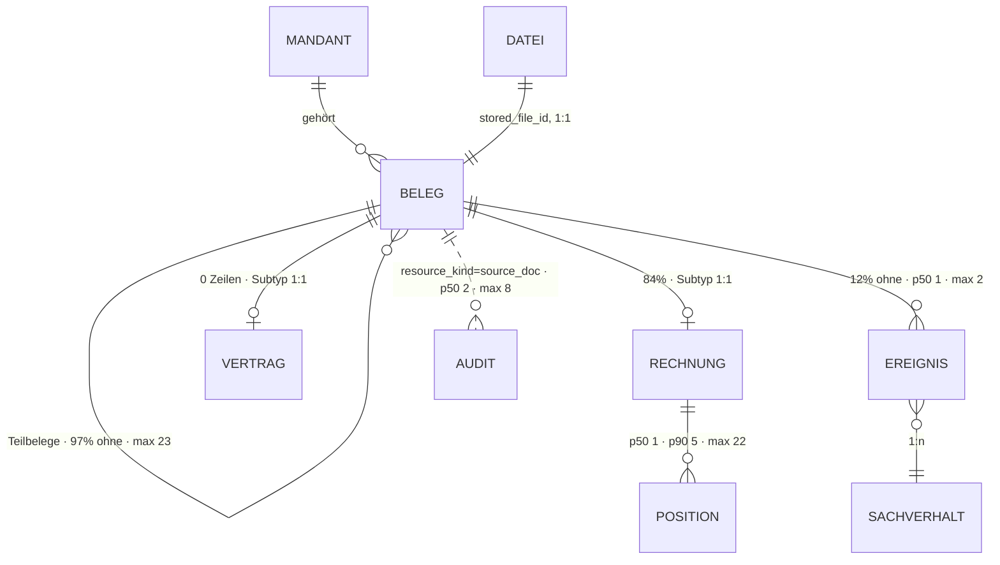

# Beleg · `source document` — Entitätsprofil

| | |
|---|---|
| Status | **in Specs** — 0074 · 0075 · 0076 (alle drei freigegeben, Status `in Arbeit`) |
| GLOSSARY | `### Source document supertype & specializations (Beleg-Supertyp)` — englisch `source document`, Ordner `entities/source-document/` |
| Tabelle | `ludwig.client_source_docs` (Supertyp) + `…_invoices` · `…_contracts` (1:1-Subtypen, Class-Table-Inheritance) |
| Typen | `src/ludwig/modules/source-docs/domain/` — `source-doc-type.ts` (`SOURCE_DOC_TYPE_LABELS`, `sourceDocTypeLabel()`), `document-form-labels.ts`, `document-form-mapping.ts` (`SourceDocType`, `DocCategory`, `DocDirection`), `tabs.ts`; `modules/contracts/domain/contract.ts` — `ContractDetailData`, `CONTRACT_TYPE_LABELS` |
| Status-Achsen | `beleg_inbox` (Supertyp-`status`) · `beleg` (Pipeline, lebt am **Rechnungs-Subtyp**) · `beleg_stage` · `beleg_kategorie` · `beleg_richtung` · `dokumentgruppe` |
| Wichtigkeit | **hoch** — Kern-ER-Bild; der Rechnungs-Subtyp ebenfalls hoch, der Vertrags-Subtyp mittel (Datenmodell-Review §7) |
| Datenstand | Staging über den Pooler, 2026-09-04, **384 Belege** (318 mit Rechnungs-Zeile, 0 mit Vertrags-Zeile), 6 Mandanten. Nachgerechnet 2026-09-04 (Prüfung): alle Füllgrade, Textlängen und Kardinalitäten unten stimmen |
| Rückfrage | gestellt und **beantwortet** am 2026-09-04 (Owner) — Ausprägungen füllen die Ränge, Vertrag lesend jetzt, keine fehlenden Anwendungsfälle |
| Namenswahl | `SourceDocument*`, nicht `Document*` — Owner 2026-09-04: „Document ist ein Name, der oft in use ist". `Document` ist zudem ein DOM-Global, und der Präfix folgt dem Datenmodell (`client_source_docs`, `source_doc_id`, `SourceDocType`). Deutsch bleibt **Beleg** — in jedem Label und im Storybook-Pfad |
| Analyse von / am | Claude, 2026-09-04 (Skill `entitaet-analysieren`) |
| Prüfung von / am | Claude, 2026-09-04 (zweiter Agent, §5–§9) — 24 Zeilen bestätigt, 11 geändert, 1 offen; siehe Abschnitt „Prüfung" |

## Was sie ist

Ein Beleg ist **jedes** eingegangene Quell-Dokument eines Mandanten — die
Rechnung genauso wie der Vertrag, der Kontoauszug, die Reisekostenabrechnung
oder das Sammel-PDF. Er wird hochgeladen, automatisch eingeordnet und ist
fertig, wenn an ihm nichts mehr zu tun ist. Die Sachbearbeiterin fragt ihn
zwei Dinge: *was ist das, und ist es durch?*

Anzeige-Regeln aus dem GLOSSARY, wörtlich:

- „**`Beleg` ist der generische Oberbegriff für jedes eingehende
  Quell-Dokument; `Rechnung` ist nur EINE fachliche Ausprägung davon.**"
- „**Reads & UI zeigen IMMER alle Belege über die Supertyp-Ebene** (Listen,
  Timeline, Sachverhalt). Subtypen liefern nur zusätzliche Detail-Felder zur
  Anreicherung. Niemals auf `invoices` filtern, wo ‚Belege' gemeint sind —
  sonst verschwinden Verträge / Bankauszüge aus der Ansicht."
- „**Neue Belegart = neuer Subtyp + neuer Diskriminator-Wert + neuer
  Renderer-Registry-Eintrag**, NICHT Sonderpfade im bestehenden Code."
- Vier orthogonale Achsen, die **nicht** in ein Enum gemischt werden dürfen:
  `document_form` (Verarbeitungs-Form) · `document_kind` (buchhalterische
  Natur) · `doc_direction` (Richtung, nur am Rechnungs-Subtyp) ·
  `doc_category` (Folgeprozess).
- `completed_at IS NULL` = der Beleg steht noch in der Todo-Liste; das ist
  **orthogonal** zum Pipeline-Status („Pipeline durchgelaufen" ≠ „fertig").
- `doc_direction = NULL` heißt **nicht anwendbar**, nicht „unbekannt".
- `document_date` NULL bleibt NULL — es wird nicht ersatzweise mit dem
  Upload-Tag gefüllt. Die Perioden-Achse der Liste ist `received_date`.

## Die eine Regel dieses Profils: der Rang ist gemeinsam, der Füller ist Ausprägung

Der Owner hat den Punkt vor der Analyse gesetzt, die Daten stützen ihn: 84 %
der Belege sind Rechnungen, die restlichen 16 % haben **andere Felder** —
und heute keine eigene Darstellung (`ui-repraesentationen.md` B4: „Beleg 22
Komponenten · Rechnung 21 · alle anderen Belegarten zusammen 2").

Die Konsequenz für jede Form dieser Familie:

> Die **Reihenfolge** der Datenpunkte ist über alle Belegarten dieselbe.
> Welches Feld einen Rang füllt, entscheidet die Ausprägung — über eine
> **Registry**, nicht über ein `if (isInvoice)`. Liefert eine Ausprägung für
> einen Rang keinen Füller, greift der **Rückfall** dieses Rangs; gibt es
> auch den nicht, entfällt die Zeile. Es gibt kein „—" für ein Feld, das es
> bei dieser Belegart gar nicht gibt.

Die Regel gilt **ab der Zeile**, nicht erst in der Karte (Owner 2026-09-04,
offene Frage 2): schon `SourceDocumentRow` füllt Maß und Kennung je Ausprägung.

**Der Schlüssel der Registry ist nicht `source_doc_type` allein** (Prüfung
2026-09-04). Drei Gründe, alle nachgerechnet:

1. **Diskriminator und Subtyp-Zeile stimmen in 10 von 384 Fällen nicht
   überein** — 7 Belege tragen `invoice`, haben aber keine Rechnungs-Zeile
   (die Registry renderte einen leeren Rechnungsblock), 3 Belege tragen
   `other` und haben eine (die Registry verstecke Felder, die es gibt).
   Befund B9. Die App entscheidet heute deshalb über die **Existenz der
   Zeile**: `isInvoice = Boolean(invoice)` (`documents/[sourceDocId]/page.tsx`),
   `availableDocTabs({ isInvoice })`.
2. `sourceDocTypeLabel()` fällt für `other` und NULL bewusst auf das
   **Belegform**-Label zurück („Sammel-PDF", „Lohnabrechnung") — schon das
   Label je Ausprägung kommt aus zwei Feldern.
3. Der Invoice-Flow der Inbox hängt ebenfalls an der Form, nicht am Typ
   (`formQualifiesForInvoiceFlow`).

Also: **Registry-Schlüssel ist `source_doc_type`, Fallback-Schlüssel die
Belegform, und der Eintrag rendert nur, was seine Subtyp-Zeile wirklich
liefert.**

Die Registry ist im Code schon angelegt und ausdrücklich als leer vermerkt
(`source-doc-type.ts`: „Dies ist der Keim einer Renderer-Registry"). Sie zu
füllen ist die Arbeit dieser Familie.

Der Wertebereich hat **sieben** Werte plus NULL — DB-CHECK und
`SOURCE_DOC_TYPE_LABELS` sind deckungsgleich. Rang 5 fällt in jeder Zeile
zuletzt auf den **Dateinamen** zurück (100 % gefüllt, siehe Datenpunkte); so
macht es die App heute in vier von sechs Listen.

| Ausprägung (`source_doc_type`) | Bestand | Subtyp-Tabelle | Rang 3 (Maß) | Rang 5 (Kennung) | eigene Punkte ab M |
|---|---:|---|---|---|---|
| Rechnung `invoice` | 322 (84 %) | `…_invoices`, 318 Zeilen (315 davon an `invoice`) | Brutto (`invoice_total_value`) | Rechnungsnummer, sonst Dateiname | Netto/USt, Fälligkeit, Zahlungsziel, Leistungszeitraum, Zahlstatus, USt-IdNr., Original-Währung, Positionen |
| Sonstiger Beleg `other` | 37 (10 %) | keine (3 Ausreißer mit Rechnungs-Zeile → B9) | — | Dateiname | nur Supertyp-Punkte; Label kommt aus der Belegform |
| Kontoauszug `bank_statement_pdf` | 10 (3 %) | **keine, und keine geplant** (B2) | — | Dateiname | nichts am Beleg. Zeitraum, Salden und Zeilen liegen am Import-Batch — erreichbar erst mit B11. Nur 4 der 10 sind echte Auszüge |
| Kreditkartenabrechnung `credit_card_statement` | 8 (2 %) | **keine, und keine geplant** (B2) | — | Dateiname | nichts am Beleg — 7 von 8 sind Deckblätter einer Dokumentgruppe, die Positionen **sind** die Kind-Belege. Der Gruppen-Block hängt an der Relation, nicht an der Belegart |
| Reisekostenabrechnung `travel_expense_report` | 4 (1 %) | **keine, und keine geplant** (B2) | — | Dateiname | wie oben — 3 von 4 sind Deckblätter. Pauschalen ohne Einzelbeleg haben keinen Ort, das ist die Eigenbeleg-Lücke der App, kein Subtyp-Thema |
| Vertrag `contract` | 2 (0,5 %) | `…_contracts`, **0 Zeilen** → Befund B1 | Primärbetrag (`primary_amount`) | Vertragsgegenstand (`contract_subject`), sonst Dateiname | Vertragstyp, Laufzeit (Start/Ende/Monate/unbefristet), buchungsrelevante Fakten mit Provenienz |
| Erklärung `declaration` | 0 | **keine, und keine geplant** (B2) | — | Dateiname | kein Schema, kein Bestand — und im TS-Typ fehlt der Wert ganz (B10) |
| ohne Typ `NULL` | 1 (0,3 %) | keine | — | Dateiname | keine. `sourceDocTypeLabel(null)` heißt bewusst „Beleg", nie „Rechnung" — das ist der Default-Eintrag der Registry, kein Sonderfall |

## Schaubild



## Datenpunkte

Füllgrad ist der Anteil an **allen 384 Belegen**, nicht an den Rechnungen —
sonst sähe ein Rechnungsfeld voller aus, als es für die Familie ist.

| Datenpunkt | Quelle | Rolle | Füllgrad | heute in | änderbar | Rang | ab Form | Beleg |
|---|---|---|---|---|---|---|---|---|
| Gegenpart (`classCounterpartyName`) | Spalte, denormalisiert aus `class_companies` | Identität | **90 % gesamt, aber je Ausprägung: Rechnung 95 % · Kontoauszug 70 % · Kreditkarte 63 % · Sonstiger 57 % · Vertrag 50 %** | Belegliste (`PartnerCell`), `StuckDocumentsTable`, `BelegeTab`, `SourceDocFactsCard` | nie | 1 | XS | Füllgrad · heute in 4 Komponenten |
| Dateiname (`originalFileName`) | Relation `ops_stored_files` (1:1, `NOT NULL`) | Identität | **100 % — in jeder Ausprägung** | `StuckDocumentsTable` (führende Spalte), `DocumentInbox` (führend), `InboxInvoiceSubmissionList`, Belegliste + `BelegeTab` + `BelegDrawer` als Rückfall | nie | 1b | XS | Füllgrad · vier von sechs Listen führen heute mit ihm oder fallen auf ihn zurück |
| Belegart (`sourceDocType` + `classDocumentForm`) | `abgeleitet: sourceDocTypeLabel()` | Identität | 100 % | `BelegeTab`, `SourceDocFactsCard`, Inbox | Nutzer (`ClassificationEditor`) | 2 | XS | GLOSSARY „Oberbegriff ↔ Ausprägung" · Füllgrad |
| Erledigt (`completedAt` + `completedReason` + `completedVia`) | Spalte | Zustand | 89 % | Belegliste (Spalte „Erledigt"), `DocCompletionControl` | Nutzer | — (Zustand) | XS | GLOSSARY „Document completion" |
| Maß der Ausprägung — Brutto bzw. Primärbetrag | Subtyp | Maß | 81 % (Rechnung) · 0 % (Vertrag) | Belegliste, `BelegeTab`, `BelegSummary`, `GlanceCard` | nie | 3 | S | Füllgrad · **Nutzer** (Owner 2026-09-04: je Ausprägung füllen) |
| Belegdatum (`documentDate`, bei Rechnungen `invoiceDate`) | Spalte | Zeit | 97 % | Belegliste, `BelegeTab`, `SourceDocDateEditor` | Nutzer | 4 | S | Füllgrad · GLOSSARY „NULL bleibt NULL" |
| Kennung der Ausprägung — Rechnungsnummer, Vertragsgegenstand, **sonst Dateiname** | Subtyp / Rückfall `ops_stored_files` | Identität | 79 % (Rechnung) · mit Rückfall **100 %** | Belegliste (`InvoiceNumberCell`, Rückfallkette Nr. → Dateiname → Kurz-ID), `BelegeTab` (dieselbe Kette), `StuckDocumentsTable` | nie | 5 | S | Füllgrad · **Nutzer** (Owner 2026-09-04: je Ausprägung füllen) · die Rückfallkette ist in vier Listen gebaut |
| Sachverhalt (`caseNumber`) | Relation über `document_received`-Ereignis | Kontext | 88 % | Belegliste (`CaseCell`), `StuckDocumentsTable` | Server | 6 | S | Kardinalität aus §Relationen |
| Eingangsdatum (`receivedDate`) | Spalte, `NOT NULL` | Zeit | 100 % | Belegliste (Spalte „Eingang", **Sortierschlüssel**), `StuckDocumentsTable` | Server / DATEV-Import | 7 | S | GLOSSARY „Perioden-Achse der Belegliste" |
| Einordnung: Kategorie (`docCategory`) | Spalte, abgeleitet aus `document_form` | Zustand | **46 %** → Befund B3 | Belegliste (`ClassificationStack`) | nie (deterministisch) | — (Zustand) | S | Füllgrad · GLOSSARY „vierte orthogonale Achse" |
| Einordnung: Richtung (`docDirection`) | Subtyp Rechnung | Zustand | 64 % | Belegliste, `GlanceCard` | nie | — (Zustand) | S | Füllgrad · GLOSSARY „NULL = nicht anwendbar" |
| Einordnung: Belegform (`classDocumentForm`) | Spalte | Zustand | 100 % | Belegliste, `SourceDocFactsCard`, Inbox | Nutzer (Override) | — (Zustand) | S | Füllgrad |
| Einordnung: Beleg-Charakter (`classDocumentKind`) | Spalte | Zustand | 100 %, davon 83 % `original` | Belegliste, `SourceDocFactsCard` (nur wenn ≠ `original`) | nie | — (Zustand) | M | Füllgrad · heutige Regel „nur wenn ≠ original" |
| Einordnungs-Zustand (`status`) | Spalte, `NOT NULL` | Zustand | 100 %, davon **99,7 % `classified`** (1 × `classification_failed`) | `DocumentInbox` (Badge, Achse `beleg_inbox`) | Server | — (Zustand) | M | Füllgrad · Achse `beleg_inbox`. Der **einzige** Zustand, den jede Ausprägung trägt (B4) — aber im Bestand fast konstant, deshalb erst ab M und nie statt der Erledigung |
| Verarbeitung (`processingStatus`) | Subtyp Rechnung | Zustand | 83 % → Befund B4 | Belegliste (`StatusCell`), `SourceDocPipelineTab` | nie | — (Zustand) | S | Füllgrad · Achse `beleg` |
| Zusammenfassung (`classSummary`) | Spalte | Erklärung | 100 % | `BelegSummary`, `SourceDocFactsCard`, `StuckDocumentsTable` (Tooltip) | nie | 8 | M | Füllgrad · p50 188 · p90 260 · max 400 Zeichen |
| Sachverhalts-Zusammenfassung (`classCaseSummary`) | Spalte | Erklärung | 93 % | `SourceDocFactsCard` (schlägt `classSummary`) | nie | 9 | M | Füllgrad · p90 240 Zeichen |
| Vorschau (`storedFileId` → signierte URL) | Relation 1:1, `NOT NULL` | Identität | 100 % | `BelegPreview`, `BelegDrawer`, `ContractDetail` | nie | 10 | M | „ein Beleg *hat* ein Original" (0052 Zone 2) |
| Seitenzahl (`pageCount`) | Spalte | Maß | 100 % | — | nie | 11 | M | p50 1 · p90 3 · max 27 — Frühwarnsignal Sammel-PDF |
| Seitenbereich im Original (`splitPageRange`) | Spalte | Kontext | 20 % | `ParentDocNotice` | nie | 12 | M | Füllgrad — jeder fünfte Beleg ist ein Teilbeleg |
| Einordnungs-Konfidenz (`classConfidence`) | Spalte | Erklärung | 100 % | `SourceDocFactsCard`, Inbox | nie | 13 | M | Füllgrad |
| Manuell korrigiert (`classOverriddenAt`) | Spalte | Verantwortung | 3 % | `SourceDocFactsCard` | Nutzer | 14 | L | Spaltenkommentar „UI: is not null → Hinweis" |
| Agenten-Notiz (`agentComment`) | Spalte | Erklärung | 2 % | `get_case` (nicht in der UI) | Agent | 15 | L | Füllgrad · Spaltenkommentar |
| DATEV-Ablage (`datevRefSystem`/`_folder`/`_id`) | Spalte | Kontext | 65 % | `SourceDocFactsCard`, `DatevMetaImportPanel` | Nutzer (Import) | 16 | L | Füllgrad |
| Ersetzt am (`supersededAt` + `supersededNote`) | Spalte | Zustand | 4 % | `ParentDocNotice` | Agent | 17 | L | Füllgrad · GLOSSARY „superseded ≠ deleted" |
| Dokumentgruppe (`collectionKind`) | Spalte, nur am Sammeldokument | Zustand | 3 % | — (Achse `dokumentgruppe` existiert, wird nicht gezeigt) | Nutzer | 18 | L | Füllgrad |
| Einordnungs-Fehler (`classificationError`) | Spalte | Erklärung | 0,3 % (1 Zeile) | Inbox | nie | 19 | L | Füllgrad |
| USt-IdNr. des Gegenparts (`classCounterpartyVatId`) | Spalte, denormalisiert aus `class_companies` | Identität | 55 % | `DocumentInbox` | nie | 20 | L | Füllgrad · Spaltenkommentar „Erlaubt der Inbox-Liste eine UStID-Anzeige ohne JSON-Parse" |

Ausgelassen (Technik): `id`, `client_id`, `tenant_id`, `created_at`,
`updated_at`, `uploaded_at`, `classified_at` (Server-Stempel, 100 %),
`uploaded_by` (0 % gefüllt), `class_overridden_by` (0 %),
`completed_batch_id` (0 %), `class_companies`
(die denormalisierten Felder tragen die Anzeige), `class_page_segments`
(Maschinen-Plan), sowie am Rechnungs-Subtyp `markdown`,
`extraction_payload_json`, `extraction_notes_json`,
`line_description_embedding`, `document_hash_sha256`.

**Freitext-Grenzen:** `classSummary` und `classCaseSummary` werden ab
**260 Zeichen** gekürzt (p90); `completedReason` ab **280** (p90 277, max
868 — der Grund ist ein Tooltip, kein Absatz); `classCounterpartyName` ab
**36 Zeichen** in der Zeile (p90 33); der **Dateiname** ab **48 Zeichen** in
der Zeile (p50 44) und ab **88** in Karte und Drawer (p90 84, max 139) — die
Kürzung sitzt in der Mitte, die Endung bleibt lesbar.

## Relationen

| Relation | Richtung | Kardinalität | Rolle | ab Form | Darstellung | Beleg |
|---|---|---|---|---|---|---|
| Datei (`ops_stored_files`) | Eltern, 1:1 | 100 % | Identität | M | eigene Form: `SourceDocumentPreview` (das Original selbst) | `UNIQUE (stored_file_id)` |
| Rechnungs-Detail (`…_invoices`) | Kind, 1:0..1 | 83 % | Identität | S (Maß + Kennung) · M (voll) | **eigene Form je Ausprägung** — Registry-Eintrag; **die Existenz dieser Zeile, nicht der Diskriminator, entscheidet, ob der Rechnungsblock rendert** (B9) | 318 von 384, davon 315 an `source_doc_type='invoice'` |
| Vertrags-Detail (`…_contracts`) | Kind, 1:0..1 | **0 %** | Identität | M | Registry-Eintrag, gegen Schema gebaut | Tabelle leer, Befund B1 |
| Rechnungspositionen (`…_invoice_lines`) | Enkel über die Rechnung | 1 % ohne · p50 1 · p90 5 · max 22 | Maß | L | Liste — eigener Auftrag, nicht in dieser Familie | Staging |
| Ereignis → Sachverhalt | Kind → Eltern | 12 % ohne · p50 1 · p90 1 · max 2 | Kontext | S | Inline des Sachverhalts (`CaseCell`), ein Klick | Staging |
| Teilbelege (`parentSourceDocId`) | Kind, selbstbezüglich | 97 % ohne · p50 0 · p90 0 · max 23 | Kontext | M | Zähler (M) · Liste (L), eingebettet als `SourceDocumentRow` | Staging · `ChildDocsCard` |
| Sammel-Original (`parentSourceDocId`) | Eltern, selbstbezüglich | 20 % | Kontext | M | Inline mit Seitenbereich („Seiten 5–7 aus …") | Füllgrad `splitPageRange` |
| **Dokumentgruppe** (`collectionKind` am Original **und** `parentSourceDocId` am Kind, zusammen gelesen) | beide Richtungen | 89 von 384 (23 %): 12 Originale, 77 Teilbelege — davon **54 Rechnungen**, 13 Sonstige, nur 10 Container-Deckblätter | Kontext | M | **ein** Block, der an der Relation hängt, nicht an der Belegart — die Antwort der App-Seite auf B2, an der richtigen Stelle. Klammer-Typ fehlt bei allen 12 Originalen (B13), der Block muss auch ohne ihn vollständig sein | Staging · App-Seite 2026-09-04 |
| Historie (`platform_audit_events`) | ohne FK, `resource_kind ∈ {source_doc, source_doc_invoice, invoice}` | 0 % ohne · p50 2 · p90 3 · max 8 | Verantwortung | L | Liste über `LogList` — **15 Aktionsarten, 1 085 Ereignisse** über die drei Ressourcen-Arten (`source_doc` allein: 12 / 977). Wer nur auf `source_doc` filtert, verliert 10 % der Historie | Staging (nachgerechnet) |
| Volltext (`ops_document_text`) | Kind | — | Technik | — | nie zeigen — OCR-Text, gehört der Suche, nicht der Ansicht | Schema |
| DATEV-Stapelverzeichnis (`client_batch_account_directory`) | Kind | — | Technik | — | gehört dem DATEV-Stapel, nicht dieser Familie | Schema |
| Extraktions-Logs (`ops_extraction_logs`) | Kind | — | Technik | L | eigener Tab, nicht diese Familie | `ui-repraesentationen.md` B5 |

## Heutige Darstellung

| Komponente | Form | zeigt | fehlt | zu viel |
|---|---|---|---|---|
| Belegliste `/[year]/documents` | Liste | neun Spalten in dieser Reihenfolge: **Belegnummer** (Rückfall Dateiname → Kurz-ID) · Geschäftspartner · Einordnung · Eingang · Belegdatum · Betrag · Sachverhalt · Verarbeitung · Erledigt. Sortierung fest `received_date ↓, uploaded_at ↓`, 50 je Seite | nichts | die Seite trägt vier Tabs (`alle` · `klaerung` · `verarbeitung` · `problematisch`) — die letzten beiden rendern `StuckDocumentsTable`, nicht diese Tabelle |
| `StuckDocumentsTable` | Liste | Datei (führende Spalte, Dateiname als Linktext), Einordnung, Gegenpart, Eingang, Sachverhalt, Beleg-Zustand | das Belegdatum **als Wert** — gezeigt wird nur der Marker „ohne Belegdatum", gesetzt wird es auf der Detailseite | — |
| `BelegeTab` (am Sachverhalt) | Liste | Nr., Typ, Gegenpartei, Belegdatum, Brutto, Verarbeitung | Erledigt | — |
| `DocumentInbox` | Liste | Datei, Einordnung, Konfidenz, Zustand, je Zeile Aktionen | — | 983 Zeilen: Upload, Polling, Liste und Klassifikations-Editor in einer Datei |
| `InboxInvoiceSubmissionList` | Liste | Datei, Belegform, Größe, Zustand, Einreichen | — | — |
| `SourceDocFactsCard` (heißt im Code `SourceDocBelegTab.tsx`) | Karte | die **generischen** Punkte: Belegdatum, Eingang, Belegart, Belegform, Charakter, Gegenpartei, Konfidenz, DATEV-Ablage, Zusammenfassung | Erledigt-Zustand, Betrag | — |
| `GlanceCard` | Karte | die **Rechnungs-Punkte**: Belegnummer, Kreditor/Kunde, Netto/USt/Brutto, Fällig, USt-IdNr., DATEV-Konto, Original-Währung, Rolle, Charakter | — | dupliziert Belegdatum, Belegart, Charakter aus der generischen Karte |
| `ContractDetail` | Editor | die **Vertrags-Punkte**: Gegenstand, Typ, Start/Ende/Laufzeit/unbefristet, Primärbetrag, Zusammenfassung, buchungsrelevante Fakten — je Feld ein Provenienz-Marker (`ai-high` ab 0.85 · `ai-low` · `manual` · `missing` · `untracked`) und ein „als geprüft bestätigen" | — | 647 Zeilen, Anzeige und Bearbeitung in einem; **es gibt keine lesende Vertrags-Form** |
| `SourceDocFamily` | Karte | Original und Teilbelege einer Familie: Dateiname des Originals, je Kind Belegart + Erledigt-Haken, dazu „N von M erledigt" | — | dritte Erledigt-Darstellung neben Liste und Detail |
| `ContractFacts` / `DocFacts` (in `SachverhaltScreen`) | Karte | verzweigt auf `docType === "contract"`: „Vertragsdaten" gegen „Extrahierte Belegdaten" | — | genau der `if`-Sonderpfad, den die Registry ersetzen soll |
| `BelegSummary` | Karte | Lieferant, Rechnungsnr., Rechnungsdatum, Brutto, Zusammenfassung | alles Nicht-Rechnungs-hafte | die vier Labels sind Rechnungs-Labels für **jede** Belegart |
| `BelegPreview` | Vorschau | das PDF; Titel als Prop („Vertrag" beim Vertrag) | Seitenbereich bei Teilbelegen | — |
| **v3** `SourceDocumentFacts` (0052) | Karte | Lieferant, Rechnungsnr., Rechnungsdatum, Brutto, Zusammenfassung | **dasselbe Problem wie `BelegSummary`** — vier Rechnungs-Labels für alle Belegarten | — |
| **v3** `SourceDocumentDrawer` (0052) | Drawer | Kopf, Original, Kernfakten, Grenze, ein Ausgang | — | `status` erwartet die Achse `beleg` (Pipeline des **Rechnungs**-Subtyps) — ein Vertrag hat dort nie einen Wert (Befund B4) |

Drei Karten für dieselbe Größe M, aufgeteilt nach Belegart, die sich in den
generischen Punkten überschneiden: das ist genau der Sonderpfad, den die
GLOSSARY-Regel verbietet. Die Ausprägung soll den **Rest** liefern, nicht die
Karte ersetzen.

## Listen

| Liste | Job (ein Satz) | Grundgesamtheit | Sortierung | Spalten (Ränge) | Filter | Massenaktion | Leerfall | Umfang p50 · p90 | Beleg |
|---|---|---|---|---|---|---|---|---|---|
| **Belegliste des Jahres** | Wenn ein Buchungsmonat abgeschlossen werden soll, will die Kanzlei alle Belege der Periode nach Eingangsdatum durchgehen, damit kein unerledigter Beleg im Jahr zurückbleibt. | alle Belege des Mandanten mit `received_date` im Jahr, `status <> 'deleted'` | Eingangsdatum ↓, dann Upload ↓ | 1–7 + Einordnung + Verarbeitung + Erledigt | Suche, Zeitraum, Kategorie, Partner, Sachverhalts-Status, „nur unerledigte", „offene Klärung" | keine | „keine Belege in dieser Periode" ≠ „keine Treffer" | 66 · 102 (Staging, 6 Mandanten-Jahre; echte Kanzlei um Größenordnungen mehr) | `/[year]/documents` |
| **Stockende Belege** | Wenn die Pipeline etwas liegen lässt, will die Kanzlei sehen, welche Belege nicht weiterkommen, damit keiner still verschwindet. | zwei Ausprägungen: „in Verarbeitung" (Pipeline läuft) und „problematisch" (ohne Belegdatum oder ohne Extraktion, **jahresunabhängig**) — **keine eigene Route, sondern zwei Tabs der Belegliste** | älteste zuerst | Datei, Einordnung, Gegenpart, Eingang, Sachverhalt, Beleg-Zustand | keine | keine (Neustart je Zeile) | „keiner stockt" = Erfolg | 6 · 10 | `StuckDocumentsTable` (`variant="stuck" \| "inflight"`) |
| **Upload & Inbox** | Wenn ein Stapel PDFs hochgeladen wird, will die Kanzlei sofort sehen, was daraus wurde, damit sie eine Fehl-Einordnung korrigiert, bevor sie weiterläuft. | alle Belege des Mandanten, **jahresunabhängig** | Upload ↓ | Datei, Einordnung, Konfidenz, Zustand | keine | keine | „nichts hochgeladen" | 64 · 102 | `/document-inbox` |
| **Beleg einreichen** | Wenn der Buchungszyklus läuft, will die Kanzlei die eingeordneten Rechnungen an die Verarbeitung übergeben, damit sie im Zyklus gebucht werden. | `status='classified'` **und** qualifizierende Belegform | Upload ↑ | Datei, Belegform, Größe, Zustand | keine | **Einreichen** | „nichts einzureichen" = Erfolg | klein | **keine eigene Route mehr**: `review/*` ist am 2026-09-05 zurückgebaut, die Liste lebt als Zustand in Upload & Inbox (`/document-inbox`) — berichtigt 2026-09-08 |
| **Belege am Sachverhalt** | Wenn jemand einen Sachverhalt prüft, will er die Belege sehen, auf denen er beruht, damit er die Buchung gegen das Papier halten kann. | Belege am Sachverhalt (über `document_received`) | Belegdatum ↑ | 1–5 + Verarbeitung | keine | keine | **zwei**: „kein Beleg zu erwarten" (mit Begründung, Erfolg) ≠ „keine verbundenen Belege" | 0 · 1 · max 20 | `BelegeTab` |
| **Teilbelege** | Wenn ein Sammel-PDF zerlegt wurde, will die Kanzlei sehen, was daraus entstanden ist, damit sie die Spur vom Original zum Einzelbeleg behält. | Kinder mit `parent_source_doc_id = <dieser Beleg>` | Seitenbereich ↑ | 1–5 + Seitenbereich | keine | keine | entfällt (die Liste erscheint nur, wenn es Kinder gibt) | 0 · 0 · max 23 | `ChildDocsCard` |

Schnitt nach §8 (eigene Komponente nur bei eigenem Job **und** Unterschied in
≥ 2 von {Grundgesamtheit, Sortierung, Filter, Massenaktion, Spaltensatz}):

- **Belegliste, Inbox und Beleg-einreichen** unterscheiden sich in
  Grundgesamtheit und Spaltensatz, teils in der Sortierung und der
  Massenaktion. Das ist `DataTable` (0057) mit je einem Spaltensatz, nicht
  drei Komponenten; Vorbild `AccountEntries` (A11a).

  **Seitenprofile sind es zwei, nicht drei** (berichtigt 2026-09-08):
  `review/*` ist am 2026-09-05 zurückgebaut, und „Beleg einreichen" hat
  seither keine eigene Route — die Liste lebt als Zustand innerhalb von
  Upload & Inbox. Ihr Spaltensatz `SUBMIT_COLUMNS` bleibt: verloren hat sie
  ihre Route, nicht ihren Job.
- **Stockende Belege**: zwei Ausprägungen, Unterschied nur in
  Grundgesamtheit und Leerfall → **ein** Spaltensatz mit `variant`-Prop,
  genau wie heute. Und weil beide Tabs derselben Route sind, teilen sie sich
  das Seitenprofil der Belegliste — es sind drei Seitenprofile, nicht vier
  (Prüfung 2026-09-04).
- **Belege am Sachverhalt** und **Teilbelege**: p90 = 1 bzw. 0, keine
  Sortierung, kein Filter, keine Pagination — das ist keine Tabelle,
  sondern `SourceDocumentRow` × n mit Leerfall. Sie teilen sich eine kurze
  `SourceDocumentList`; der Unterschied ist der Leerfall, also eine Prop.
- **Subtypen bekommen keine eigene Liste.** Es gibt keine
  „Rechnungsliste" und keine „Vertragsliste" — die Belegart ist Spalte
  und Filter. Das ist zugleich die GLOSSARY-Regel.

## Formen

| Form | Größe | Empfehlung | Grund (§7 Nr.) | zeigt (Ränge) | Relationen | setzt auf | ersetzt |
|---|---|---|---|---|---|---|---|
| `SourceDocumentCell` | XS | **ja** | 3 — FK-Ziel von `client_accounting_event`; wird in fremden Zeilen genannt | 1, 1b, 2 + Erledigt — **mit der Rückfallkette Kennung → Dateiname → Kurz-ID**, wie sie vier Listen heute schon bauen | — | `Badge`, `MonoCell`, `LongText` | `InvoiceNumberCell` (Belegliste), der Mono-Link in `BelegeTab`, den Datei-Link in `StuckDocumentsTable` |
| `SourceDocumentClass` | XS | **ja** | 1 — existiert als `ClassificationStack`; die vier Achsen gehören zusammen und in eine Hand | Einordnung (4 Achsen) | — | `StatusBadge` (`beleg_kategorie`, `beleg_richtung`, `dokumentgruppe`) | `ClassificationStack` |
| `SourceDocumentRow` | S | **ja** | 1 — existiert in **sechs** Listen; 2 — Kind des Sachverhalts | 1, 1b, 2–7 + Zustände; **Maß und Kennung je Ausprägung, Dateiname als Rückfall** | Sachverhalt als Inline, Teilbelege als Zähler | `Row`, `SourceDocumentCell`, `SourceDocumentClass`, `Amount`, `Time` | die Zeilen von Belegliste, `StuckDocumentsTable`, `BelegeTab`, `DocumentInbox`, `InboxInvoiceSubmissionList`, `ChildDocsCard` |
| `SourceDocumentPreview` | M | **ja** | 1 — existiert als `BelegPreview` und ein zweites Mal inline im v3-`SourceDocumentDrawer` | 10 + Seitenbereich (12) | Datei, Sammel-Original | `EmptyState`, `Card` (**`Section` gibt es in v3 nicht** — Prüfung 2026-09-04) | `BelegPreview`, das `<iframe>` in `SourceDocumentDrawer` |
| `SourceDocumentFacts` **umbauen** + Ausprägungs-Registry | M | **ja** | 1 — existiert dreifach (`SourceDocFactsCard`, `GlanceCard`, `ContractDetail`); der Owner-Punkt hängt hier | generisch 1–9, 11–13 · je Ausprägung ihre eigenen Punkte | Rechnungs-Detail, Vertrags-Detail als Registry-Einträge | `FieldList`, `Amount`, `Time`, `MonoCell` | `BelegSummary`, `SourceDocFactsCard`, den Fakten-Teil von `GlanceCard` und `ContractDetail` |
| `SourceDocumentCard` | M | **Backlog (0071)** | 1 trifft zu, aber schwächer als es aussah: die drei Karten, auf die sie sich beruft, sind **dieselben**, die `SourceDocumentFacts` schon ersetzt — der Beleg ist einmal gezählt, nicht zweimal. §7 Nr. 2 trägt hier nicht: am Sachverhalt steht der Beleg heute als **Zeile** (`BelegeTab`) und als **Drawer**, nicht als Karte. Sie blockiert nichts im Jetzt-Satz, und 0071 nennt sie ohnehin als Voraussetzung — also entsteht sie dort (Prüfung 2026-09-04, §9 „höchstens fünf") | Kopf (1, 1b, 2, Erledigt) + Vorschau + Fakten | wie `SourceDocumentFacts` | `Card`, `SourceDocumentPreview`, `SourceDocumentFacts`, `SourceDocumentClass` | `BelegSummary` im Kontext, `SourceDocFamily` |
| `SourceDocumentDrawer` | L | **gebaut (0052)** | 5 — aus Sachverhalt, Buchung und Klammer heraus nachgeschlagen | Kopf, Original, Kernfakten, Grenze, ein Ausgang | — | `Drawer`, `SourceDocumentFacts` | `BelegDrawer` |
| `SourceDocumentList` + `SourceDocumentColumns` | L | Backlog | 6 — sechs Listen-Jobs; **`DataTable` (0057) ist gebaut und steht auf Abnahme** — es hängt nur noch an den drei Seitenprofilen | wie `SourceDocumentRow` | — | `DataTable`, `SourceDocumentRow`, `EmptyState` | die sechs Listen |
| `SourceDocumentView` | L | Backlog | 1 — die Detailseite mit sechs Tabs; braucht ein Seitenprofil | alles ab 20 % Füllgrad | Historie, Positionen, Teilbelege als Listen | `EntityHeader`, `Tabs`, `SourceDocumentFacts`, `LogList`, `InlineEdit` | `SourceDocFamily`, `InvoiceSidebar`, `DocTabsBar` |
| `SourceDocumentEditor` | XL | **Backlog (0071)** | §7 Nr. 4 **trifft zu** (sechs Punkte mit änderbar = Nutzer) und Nr. 1 auch — die App hat dafür fünf Editoren (`DocCompletionControl`, `SourceDocDateEditor`, `ClassificationEditor`, `DatevMetaImportPanel`, `SourceDocActions`). „Verworfen" wäre nach §9 nur ohne jeden §7-Grund richtig. Der Zuschnitt bleibt wie beschrieben — kein Formular, sondern `InlineEdit` je Wert im View — aber er ist ein **Auftrag**, keine Ablehnung. 0071 muss die fünf Editoren unter „Ersetzt" aufnehmen | die Punkte mit änderbar = Nutzer, je einzeln | — | `InlineEdit`, `SourceDocumentView` | die fünf Editoren oben |
| `SourceDocumentPicker` | S | **verworfen** | keine Stelle wählt einen bestehenden Beleg aus einer Liste; ein Beleg wird an den Sachverhalt **hochgeladen** (`CaseAttachDocumentButton` → `FileDrop`), nicht ausgesucht. | | | | |

**Bau-Reihenfolge:** `SourceDocumentCell` + `SourceDocumentClass` → `SourceDocumentRow` →
`SourceDocumentPreview` → `SourceDocumentFacts` (Umbau). Das sind **fünf** Formen — die
Grenze aus §9. Der bereits gebaute `SourceDocumentDrawer` wird im selben Zug
nachgezogen: er verliert sein inline-`<iframe>` an `SourceDocumentPreview` und
bekommt die generischen Fakten statt der vier Rechnungs-Labels. Die Karte
folgt mit der Detailansicht (0071), die sie ohnehin voraussetzt.

## Zuschnitt

| Form / Liste | Marke | Grund | Backlog |
|---|---|---|---|
| `SourceDocumentCell` + `SourceDocumentClass` | jetzt — **0074** | Bausteine von Zeile, Karte und Liste; `SourceDocumentCell` trägt die Rückfallkette Kennung → Dateiname → Kurz-ID | — |
| `SourceDocumentRow` | jetzt — **0074** | trägt sechs Listen, ohne sie ist keine davon zu bauen | — |
| `SourceDocumentPreview` | jetzt — **0075** | trägt Karte, Drawer und View; heute zweimal dieselbe Datei | — |
| `SourceDocumentFacts` (Umbau + Registry) | jetzt — **0076** | der Owner-Punkt: Ausprägungen mit eigenen Feldern; heute dreimal getrennt gebaut. Registry-Einträge jetzt: Rechnung (Daten) und Vertrag (**lesend, gegen das Schema** — Owner 2026-09-04) | — |
| `SourceDocumentDrawer` nachziehen | jetzt — **0076** (Teil von `SourceDocumentFacts` und `SourceDocumentPreview`) | er benutzt beide; sonst driften v3 und v3 auseinander. Keine neue Form — die sechste wäre eine zu viel | — |
| `SourceDocumentCard` | **Backlog** | §9 lässt fünf Formen „jetzt" zu, die Liste stand auf sechs. Die Karte blockiert nichts, ihr §7-Nr.-1-Beleg ist derselbe wie der von `SourceDocumentFacts`, und 0071 nennt sie schon als Voraussetzung — sie entsteht dort. **0071 „Setzt voraus" ist beim Aufgreifen anzupassen** | `0071` |
| Belegliste, Inbox, Einreichen (`SourceDocumentColumns`) | Backlog | `DataTable` (0057) ist gebaut; es fehlen die **drei** Seitenprofile (die stockenden Belege sind zwei Tabs der Belegliste, keine vierte Seite) | `0070` |
| `SourceDocumentView` + Seitenprofil `beleg-detail.md` | Backlog | sechs Tabs, drei davon rechnungsspezifisch; braucht ein Seitenprofil. Nimmt nach der Prüfung `SourceDocumentCard` und die `InlineEdit`-Werte des Editors mit auf | `0071` |
| Positionen (`InvoiceLines`) | Backlog | Enkel-Entität mit eigenem Profil-Bedarf (Rechnungsposition, §7 „mittel") | `0072` |
| `ContractFacts` bearbeitbar (`ContractDetail`-Nachfolger) | Backlog | 0 Zeilen im Bestand; die **lesende** Vertrags-Ausprägung entsteht jetzt, der Editor wartet auf Daten | `0073` |
| `SourceDocumentEditor` | **Backlog** | nicht „verworfen": §7 Nr. 1 und Nr. 4 treffen beide zu (fünf Editoren in der App, sechs Punkte mit änderbar = Nutzer). Die Werte werden `InlineEdit` im View — das ist ein Zuschnitt, keine Ablehnung | `0071` |
| `SourceDocumentPicker` | verworfen | kein Screen wählt einen bestehenden Beleg aus | — |

## Befunde für `ludwig/app`

- **B1 — `client_source_docs_contracts` ist leer (0 Zeilen)** — *beantwortet
  von der App-Seite am 2026-09-04:* **kein Schreibpfad-Fehler.** Alle sieben
  Audit-Ereignisse hängen an **einem** Beleg, den es nicht mehr gibt
  (Mandanten-Wipe nach 2026-07-20; das Audit-Log ist Seitenkanal und
  überlebt das per Design). Die zwei heutigen `contract`-Belege ohne
  Subtyp-Zeile sind Altbestand von vor dem F87-Kern. Die Tabelle war auf
  Staging nie produktiv befüllt — **der Vertragsrenderer wird gegen das
  Schema gebaut, nicht gegen Daten.** Das bestätigt den Owner-Entscheid
  (offene Frage 3) und macht die Vertrags-Stories zu erfundenen Werten mit
  Ansage.
- **B2 — Vier Belegarten ohne Subtyp** — *beantwortet von der App-Seite am
  2026-09-04: **Absicht**, keine Subtyp-Tabellen geplant.* Kontoauszug,
  Kreditkartenabrechnung und Reisekostenabrechnung sind keine Belege mit
  eigenen Fachfeldern, sondern **Container bzw. Deckblätter**; ihre Struktur
  liegt nicht am Beleg, sondern daneben:

  | Belegart | Wo die Struktur wirklich liegt |
  |---|---|
  | Kontoauszug | `client_bank_import_batches` (Zeitraum, Anfangs-/Endsaldo, Auszugsnummer, Zeilenzahl, Zahlungskonto) + `client_bank_transactions`. Der Beleg ist Ablage und Provenienz (bank.md R10) |
  | Kreditkartenabrechnung | das Deckblatt verprobt, es bucht nicht (belege.md R25–R27); die Abrechnungspositionen **sind** die Kind-Belege |
  | Reisekostenabrechnung | dasselbe — Positionen sind Kind-Belege, die Erstattung ein Bank-Umsatz |

  Dazu aus dem Bestand: von den 10 `bank_statement_pdf` sind nur 4 echte
  Auszüge; die anderen 6 sind Zinsabrechnungen, Reconciliation-Übersichten
  und eine Zahlungsdienstleister-Übersicht. Der Wert ist heute das
  Sammelbecken „Bankdokument, keine Rechnung" — ein Subtyp mit Pflichtfeldern
  wäre bei 6 von 10 leer.

  **Was für dieses Repo daraus folgt — und wo wir der App-Seite
  widersprechen:** Sie schlägt vor, der Registry-Eintrag dieser drei sei
  „Container: Gruppe + Batch". Der Eintrag ist richtig, sein **Ort** nicht:
  die Container-Eigenschaft hängt nicht an der Belegart. Nachgerechnet:

  - 89 von 384 Belegen (23 %) stehen in einer Dokumentgruppe — 12 als
    Original, 77 als Teilbeleg.
  - Von den 77 Teilbelegen sind **54 Rechnungen** und 13 „Sonstige"; nur 10
    sind Kreditkarten- oder Reisekosten-Deckblätter.
  - Kein einziger der 10 Kontoauszüge steht in einer Gruppe.

  Die Gruppe ist also eine **Relation, keine Ausprägung**. Sie bekommt
  deshalb keinen Registry-Eintrag je Belegart, sondern **einen Block, der an
  der Relation hängt** und für jeden Beleg mit `collectionKind` oder
  `parentSourceDocId` erscheint — gleich welcher Art. Das trifft die Absicht
  der App-Seite („EIN Deckblatt-Renderer für alle drei Container-Typen, kein
  Renderer je Typ") genauer als der Vorschlag selbst.

  Die Batch-Fakten (Zeitraum, Salden, Zeilenzahl, Sprung zu den
  Auszugszeilen) gehören nicht hierher, sondern in die
  Kontoauszugspositions-Familie — und hängen ohnehin an einer Kante, die es
  noch nicht hart gibt (B11).
- **B3 — `doc_category` ist nur zu 46 % gefüllt** — *beantwortet von der
  App-Seite am 2026-09-04:* die F87-Migration ist **bewusst backfill-frei**.
  Seit 2026-08-20 fehlt die Kategorie nur noch bei `other`-Belegen
  (Sammel-PDF, `other`, `unknown` — 23 Stück), und das ist Absicht: **ein
  Container hat keine Kategorie, sie entsteht je Teilbeleg.** Die restlichen
  ~170 sind Staging-Altbestand aus Juli/August; ein Backfill über die
  Mapping-Tabelle ist deterministisch und wird mitgenommen.
  **Regel für dieses Repo:** ein Filter oder ein Badge über die Kategorie
  führt NULL als „unklassifiziert / Container" — nicht als Fehler und nicht
  als Lücke. Die Zeile zeigt dafür kein Badge (siehe Datenpunkte), der
  Filter bekommt einen eigenen Eintrag.
- **B4 — Die Achse `beleg` (Verarbeitung) lebt am Rechnungs-Subtyp.** Für
  einen Vertrag oder Kontoauszug gibt es dort nie einen Wert; die Achse des
  **Supertyps** ist `beleg_inbox`. Der v3-`SourceDocumentDrawer` erwartet in
  `status` heute die Achse `beleg` (`axis="beleg"`, fest verdrahtet) — für
  16 % der Belege ist das kein gültiger Zustand. Nachtrag aus der Prüfung:
  `beleg_inbox` ist als Ersatz **nur die halbe Antwort** — im Bestand tragen
  383 von 384 Belegen denselben Wert (`classified`). Der Zustand, der eine
  Nicht-Rechnung wirklich unterscheidet, ist die **Erledigung**; sie steht
  deshalb ab XS, `beleg_inbox` erst ab M.
- **B5 — Der Beleg-Charakter (`document_kind`) hat keine Registry-Achse**,
  obwohl die Belegliste ihn als Badge zeigt (`ClassificationStack`) und
  `DOCUMENT_KIND_LABEL` existiert. Vier Einordnungs-Achsen, drei in der
  Registry.
- **B6 — Für „Gegenpart des Belegs" fehlt eine Ableitung.** Die Belegliste
  rechnet sie in `PartnerCell` aus `docDirection` + `vendorName` /
  `customerName`, `BelegeTab` nimmt `class_counterparty_name`, der Drawer
  „Lieferant". Drei Wege zu einem Namen; eine Funktion
  `documentCounterparty()` in `src/ludwig/modules/source-docs/domain/` fehlt.
- **B7 — `listInvoicesForClient` liest vom Supertyp und liefert alle
  Belegarten.** Der Name behauptet das Gegenteil und ist die vermutlich
  häufigste Quelle des Missverständnisses „Beleg = Rechnung". Kosmetisch,
  aber billig zu beheben.
- **B8 — Kein Befund, eine Entscheidung für dieses Repo — korrigiert in der
  Prüfung:** Die App begründet das fehlende Registry-Eintrag damit, die
  Erledigung sei binär und habe keinen eigenen Werteraum
  (`COMPLETED_LEGEND`, von Hand geschrieben). **Das stimmt nicht:**
  `completed_via` ist CHECK-beschränkt auf sechs Werte und zu 73 % gefüllt —
  `booking` 171 · `manual` 77 · `no_booking_required` 26 · `superseded` 7 ·
  `case_closed` 1 · NULL 61, dazu 41 offene Belege. Die v3-Achse
  `beleg_erledigung` trägt deshalb **`completed_via` plus „Offen"** (für
  `completed_at IS NULL`), nicht zwei Werte; der Freitext
  `completed_reason` bleibt der Tooltip daneben. Die App zeigt die
  Erledigung heute in **drei** verschiedenen Formen — Häkchen in der
  Belegliste, Häkchen in `SourceDocFamily`, Badge mit Wort nur in
  `DocCompletionControl`. V7/V11 sind in zwei von drei verletzt.
- **B9 — Diskriminator und Subtyp-Zeile laufen auseinander** — *mit der
  App-Seite geklärt am 2026-09-04.* Es sind **zwei** Fälle mit
  entgegengesetzter Wahrheit, nicht einer:
  - 7 Belege tragen `source_doc_type='invoice'` ohne Zeile in `…_invoices` —
    alle vom 2026-07-31, vor dem F87-Kern, alle erledigt. Hier hat die
    **Zeile** recht: es gibt nichts zu zeigen.
  - 3 tragen `other` **mit** einer Zeile — und alle drei haben
    `class_overridden_at` gesetzt: ein Mensch hat die Belegform von
    `invoice` auf `other` korrigiert, die Rechnungs-Zeile blieb stehen
    (App-seitig `P26`, „Belegform-Override räumt die Rechnungs-Pipeline
    nicht auf"). Hier hat der **Diskriminator** recht: er ist die Korrektur.

  Daher die Regel der Familie: **der Ausprägungs-Block erscheint nur, wenn
  Diskriminator und Subtyp-Zeile übereinstimmen.** Widersprechen sie sich,
  stehen allein die Supertyp-Punkte — die Form behauptet nichts, was eine
  der beiden Quellen bestreitet. Der Vergleich ist generisch (jeder
  Registry-Eintrag nennt seinen `source_doc_type`), kein Zweig je Belegart.
  Sie fällt weg, sobald `P26` entschieden ist. Register: L-35.
- **B10 — `SourceDocType` fehlt der Wert `declaration`** (beim Schreiben von
  0074 aufgefallen). DB-CHECK und `SOURCE_DOC_TYPE_LABELS` führen sieben
  Werte, die TS-Union in `document-form-mapping.ts` sechs. *Beantwortet von
  der App-Seite am 2026-09-04:* **Absicht** — die Union ist der Typ des
  Mapping-**Ergebnisses** (was geschrieben wird), und `declaration` hat
  keinen Schreiber. Lesend sind sieben Werte richtig, `SOURCE_DOC_TYPE_LABELS`
  führt alle sieben. 0074 weitet die Union lokal; das ist bestätigt.
  Register-Eintrag L-44, erledigt.
- **B11 — Die Kante Beleg → Bank-Umsätze ist weich** (von der App-Seite am
  2026-09-04 bestätigt und übernommen). Es gibt zwei Wege und keinen
  Fremdschlüssel: `client_bank_transactions.raw_payload->>'source_doc_id'`
  samt `external_transaction_id = '<source_doc_id>#<n>'` (Abtipp-Weg; im
  Bestand 79 Umsätze an 6 Belegen), und
  `client_bank_import_batches.stored_file_id = client_source_docs.stored_file_id`
  (Intake-Upload F133, 0 Zeilen). Der Batch trägt die Kopfdaten des
  Kontoauszugs, kennt den Beleg aber nicht. Die App-Seite schlägt
  `client_bank_import_batches.source_doc_id` als nullable FK vor;
  Owner-Entscheid steht aus. **Solange das offen ist, kann keine Beleg-Form
  Zeitraum, Salden oder Zeilenzahl eines Kontoauszugs zeigen** — es steht im
  Ausbau von 0076, nicht in der Schnittstelle.
- **B12 — Doku-Lücke im GLOSSARY — erledigt am 2026-09-04.** Der Eintrag
  „Source document supertype & specializations" sagte „neue Belegart = neuer
  Subtyp + …", aber nicht, dass **Container-Belegarten bewusst keinen Subtyp
  haben**; wer die Regel wörtlich nahm, hielt den Zustand für einen Fehler —
  so ist es dieser Analyse ergangen. Die App-Seite hat den Punkt 4 ergänzt,
  samt Import-Batch und dem Hinweis, dass der Registry-Eintrag an der
  Gruppen-Relation hängt.
- **B13 — Der Klammer-Typ wird nie vergeben** (App-Seite `P28`, 2026-09-04).
  Von 12 Sammel-Originalen tragen 8 `not_connected` und 4 gar keinen Wert;
  keine der vier Klammer-Familien aus belege.md R25–R27 kommt vor. Ursache
  liegt im Klassifikator, nicht in der Persistenz. **Für die Formen heißt
  das:** der Deckblatt-Block muss ohne Klammer-Typ vollständig aussehen —
  das ist im Bestand der Normalfall, nicht die Ausnahme.

## Offene Fragen

Alle drei am 2026-09-04 vom Owner beantwortet — die Antworten stehen als
Beleg `Nutzer` in den Tabellen, nicht als Annahme.

1. **Fehlen Anwendungsfälle?** — *beantwortet:* nein, „reicht erstmal". Es
   bleibt bei den sechs Listen und den Formen oben; die drei Belegarten ohne
   eigene Darstellung bekommen keine zusätzliche Ansicht, sondern die
   Supertyp-Punkte.
2. **Wie weit geht die Ausprägung in die Zeile?** — *beantwortet:* **je
   Ausprägung füllen.** Der Rang „Maß" trägt bei der Rechnung das Brutto, beim
   Vertrag den Primärbetrag, beim Kontoauszug nichts; der Rang „Kennung"
   trägt die Rechnungsnummer bzw. den Vertragsgegenstand. Leer bleibt leer —
   kein „—" für ein Feld, das es bei dieser Belegart nicht gibt. Damit gilt
   die Regel dieses Profils auch in der Zeile, nicht erst in der Karte.
   *Präzisierung aus der Prüfung 2026-09-04:* „leer bleibt leer" gilt für das
   **Maß**. Bei der **Kennung** greift vorher der Dateiname — die App baut
   diese Rückfallkette heute in vier von sechs Listen, und ohne sie hätte
   eine Nicht-Rechnung keinen Anker, an dem man sie wiedererkennt.
3. **Vertrag ohne Daten?** — *beantwortet:* **ja**, die lesende
   Vertrags-Ausprägung entsteht jetzt gegen Schema und `ContractDetailData`.
   Der Vertrags-Editor bleibt 0073, bis die Extraktion Zeilen schreibt: ohne
   einen einzigen Vertrag im Bestand hätte die Abnahme keinen Nachweis.

## Prüfung

Zweiter Agent, 2026-09-04, gegen Skill `entitaet-analysieren` §5–§9. Quellen:
Staging über den Pooler (nur `SELECT`, nur Aggregate), `datenmodell.json`,
GLOSSARY, `status-registry.ts`, `src/ludwig/modules/**/domain/`, die
App-Komponenten unter `modules/source-docs`, `/invoices`, `/document-inbox`,
`/contracts`.

**Belege zuerst.** In den Tabellen steht **keine einzige** Zeile mit dem Beleg
`Annahme`. Alle 24 Datenpunkt-Zeilen tragen Füllgrad, GLOSSARY-Satz,
Spaltenkommentar, „heute in …" oder `Nutzer`; jeder dieser Werte wurde
nachgerechnet und stimmt — Füllgrade, Textlängen (188/260/400 · 240 ·
277/868 · 33), Seitenzahlen (1/3/27), Kardinalitäten (Teilbelege 97 %/0/0/23,
Ereignis 12 %/1/1/2, Positionen 1 %/1/5/22), Bestand (384 · 318 · 0 · 6
Mandanten) und der Listenumfang (66/102). Der einzige Beleg vom Grad
`Schema` ist die **Vertrags-Ausprägung** (B1); sie ist gegen
`client_source_docs_contracts` und `ContractDetailData` geprüft und trägt
alle genannten Felder — der Beleg hält.

| Zeile / Form | Einwand | Ergebnis | Geprüft von / am |
|---|---|---|---|
| Regel „der Rang ist gemeinsam" | Der Registry-Schlüssel `source_doc_type` trägt nicht: Diskriminator und Rechnungs-Zeile widersprechen sich in **10 von 384** Fällen (7 `invoice` ohne Zeile, 3 `other` mit Zeile). Die App entscheidet deshalb über `isInvoice = Boolean(invoice)`, nicht über den Typ; `sourceDocTypeLabel` zieht zusätzlich die Belegform heran | **geändert** — Schlüssel ist der Typ, Fallback-Schlüssel die Belegform, gerendert wird, was die Subtyp-Zeile hergibt. Neuer Befund B9 | Claude, 2026-09-04 |
| Ausprägungs-Tabelle | Sie deckt **sechs** Werte ab, der CHECK und `SOURCE_DOC_TYPE_LABELS` haben **sieben** (`declaration` fehlt) plus NULL (1 Beleg im Bestand). Die tragende Regel war für zwei Fälle ungeprüft | **geändert** — zwei Zeilen ergänzt; NULL ist der Default-Eintrag der Registry („Beleg"), nicht ein Sonderfall | Claude, 2026-09-04 |
| Rang 1 (Gegenpart) | Der Füllgrad 90 % ist der Rechnungs-Durchschnitt. Je Ausprägung: Rechnung 95 %, Kontoauszug 70 %, Kreditkarte 63 %, Sonstiger Beleg 57 %, Vertrag 50 %. Zusammen mit „—" auf Rang 3 und 5 bliebe für eine Nicht-Rechnung eine Zeile aus Belegart und zwei Daten — der §5-Test „erkennt sie den Vorgang noch?" fällt für 16 % der Belege durch | **geändert** — Füllgrad je Ausprägung ausgewiesen; neuer Datenpunkt **Dateiname**, Rang 1b, ab XS, 100 % in jeder Ausprägung | Claude, 2026-09-04 |
| Rang 5 (Kennung) | Dreimal verschieden beschrieben: Datenpunkt-Zeile „Rechnungsnummer bzw. Dateiname", Ausprägungs-Tabelle „—", offene Frage 2 „Rechnungsnummer bzw. Vertragsgegenstand". Eine Spec kann daraus nichts ableiten. Die App hat die Antwort längst: vier von sechs Listen bauen die Kette Nummer → Dateiname → Kurz-ID | **geändert** — eine Rückfallkette, überall dieselbe; „—" gestrichen | Claude, 2026-09-04 |
| Zuschnitt | **Sechs** Formen mit Marke „jetzt" (Cell, Class, Row, Preview, Facts, Card), §9 lässt fünf zu. Die Karte beruft sich auf dieselben drei App-Karten wie `SourceDocumentFacts` (derselbe Beleg zweimal gezählt), sie blockiert nichts, und 0071 nennt sie ohnehin als Voraussetzung | **geändert** — `SourceDocumentCard` auf Backlog (0071); „jetzt" steht auf fünf. Der Drawer-Nachzug ist keine neue Form | Claude, 2026-09-04 |
| `SourceDocumentEditor` „verworfen" | §9 erlaubt „verworfen" nur, wenn **kein** §7-Grund greift. Hier greifen zwei: Nr. 4 (sechs Punkte mit änderbar = Nutzer) und Nr. 1 (`DocCompletionControl`, `SourceDocDateEditor`, `ClassificationEditor`, `DatevMetaImportPanel`, `SourceDocActions`). Der Zuschnitt („kein Formular, `InlineEdit` je Wert") ist richtig, die Marke war es nicht | **geändert** — Marke „Backlog (0071)"; 0071 muss die fünf Editoren unter „Ersetzt" aufnehmen | Claude, 2026-09-04 |
| Supertyp-Zustand fehlt | `client_source_docs.status` (Achse `beleg_inbox`, 100 %) hatte keine Zeile, obwohl B4 ihn als **den** Supertyp-Zustand benennt und `DocumentInbox` ihn zeigt. Zugleich trägt er im Bestand für 383 von 384 Belegen denselben Wert — als Erkennungsmerkmal taugt er heute nicht | **geändert** — Zeile ergänzt, ab M; B4 um diesen Nachtrag erweitert | Claude, 2026-09-04 |
| B8 (Erledigung) | „binär, kein eigener Werteraum" ist widerlegt: `completed_via` ist auf sechs Werte beschränkt und zu 73 % gefüllt (booking 171 · manual 77 · no_booking_required 26 · superseded 7 · case_closed 1) | **geändert** — die v3-Achse trägt `completed_via` plus „Offen"; dazu der Befund, dass die App die Erledigung dreifach und zweimal ohne Wort zeigt | Claude, 2026-09-04 |
| Fehlende Spalten und Relationen | `class_counterparty_vat_id` (55 %, laut Spaltenkommentar in der Inbox gezeigt) und `classified_at` (100 %) standen weder als Datenpunkt noch unter „ausgelassen"; in §6 fehlten `ops_document_text` und `client_batch_account_directory` | **geändert** — VAT-ID als Rang 20 (L), `classified_at` ausgelassen, beide Relationen als Technik ergänzt | Claude, 2026-09-04 |
| Historie | „16 Aktionsarten, 1 065 Ereignisse" — nachgerechnet sind es 12/977 unter `resource_kind='source_doc'`, zusammen mit `source_doc_invoice` (81) und `invoice` (27) **15/1 085**. Wer nur auf `source_doc` filtert, verliert 10 % | **geändert** — Zahlen und die drei Ressourcen-Arten stehen jetzt in der Zeile | Claude, 2026-09-04 |
| Backlog-Gründe | 0070 begründet die Vertagung mit `DataTable` (0057) — die ist gebaut und steht auf Abnahme. Es bleibt der Grund „Seitenprofile fehlen", und es sind **drei**, nicht vier: die stockenden Belege sind zwei Tabs der Belegliste, keine eigene Route | **geändert** — Grund korrigiert. 0071/0072/0073 tragen ihre Gründe unverändert | Claude, 2026-09-04 |
| `Section` in `SourceDocumentPreview` | „setzt auf `Section`, `EmptyState`" — einen Export `Section` gibt es in `src/ui/v3` nicht | **geändert** — `EmptyState`, `Card` | Claude, 2026-09-04 |
| Listen | Alle sechs tragen einen Job-Satz in der Form aus `docs/seiten/TEMPLATE.md`; der §8-Schnitt hält: eine `SourceDocumentRow`, drei Spaltensätze auf `DataTable`, eine kurze `SourceDocumentList` mit Leerfall-Prop, kein Subtyp bekommt eine eigene Liste (deckt sich mit der App: **kein** Listenfilter filtert auf `source_doc_type`) | **bestätigt**, ergänzt um Sortierung, Seitengröße 50 und die Tab-Struktur der Belegliste | Claude, 2026-09-04 |
| `SourceDocumentPicker` verworfen | Gegengeprüft: kein Picker, keine Combobox, kein `<select>` und kein Mehrfach-Auswahl-Zustand über `sourceDocId` in der ganzen App; jeder Weg zum Beleg am Sachverhalt ist ein Upload | **bestätigt** — §7 Nr. 3 zweite Hälfte greift nicht, „verworfen" ist richtig | Claude, 2026-09-04 |
| Rang 1 gegen die Spaltenordnung der App | **offen.** Vier von sechs Listen führen mit der Kennung, nicht mit dem Gegenpart — nach §4 („was ein Mensch schon ausgewählt hat") spräche das für Kennung auf Rang 1. §5 sagt das Gegenteil („die Nummer ist Rang 3, der Mensch denkt Telekom, 89 €, März"). Das Profil folgt §5; die Rückfallkette entschärft den Widerspruch, hebt ihn aber nicht auf. Entscheidung gehört dem Owner, nicht der Prüfung — mit der Zeile von `SourceDocumentRow` als Anschauungsmaterial | **offen** | Claude, 2026-09-04 |

## Weiter

Prüfprompt (neue Sitzung, anderer Agent):

```
Prüfe das Entitätsprofil docs/entitaeten/source-document.md nach Skill entitaet-analysieren §5–§9.
Zuerst jede Zeile mit Beleg „Annahme" oder „Schema": belege oder widerlege sie mit Füllgrad,
heutiger Komponente oder GLOSSARY. Dann die Ränge: deck die Punkte ab Rang k ab — erkennt
eine Sachbearbeiterin den Beleg noch, auch wenn er kein Rechnung ist? Prüf dabei besonders
die Regel „der Rang ist gemeinsam, der Füller ist Ausprägung": trägt sie für alle sechs
Werte von source_doc_type? Dann die Formen: hat jede empfohlene einen Grund aus §7, fehlt
eine, die die App heute hat? Dann die Listen: hat jede einen Job-Satz, und ist jede
Ausprägung nach §8 eine eigene Komponente wert oder nur ein Prop? Zuletzt der Zuschnitt:
sind höchstens fünf Formen „jetzt", und trägt jede Backlog-Zeile ihren Grund? Trag jeden
Einwand in „Prüfung" ein, ändere die Tabellen, wo du sicher bist, und setze den Status auf
„geprüft". Kundendaten bleiben in der Datenbank; nur SELECT.
```

Startprompt (neue Sitzung — die drei Specs stehen auf `in Arbeit`):

```
Baue die Beleg-Familie nach den Specs docs/backlog/0074-source-document-row.md,
0075-source-document-preview.md und 0076-source-document-facts.md, in dieser Reihenfolge,
mit Skill v3-komponente. Alle drei stehen auf „in Arbeit" — vom Owner freigegeben, offene
Fragen entschieden. Quelle für Datenpunkte, Ränge, Relationen und „ersetzt" ist das geprüfte
Profil docs/entitaeten/source-document.md, nicht der Chat.

Die tragende Regel, die in allen dreien gilt und deren Verletzung ein Abnahmekriterium ist:
die Reihenfolge der Datenpunkte ist über alle Belegarten dieselbe; welches Feld einen Rang
füllt, entscheidet eine Registry in source-document-detail.ts — und ihr Eintrag greift nur,
wenn Diskriminator (source_doc_type) und Subtyp-Zeile übereinstimmen. Kein `if (isInvoice)`
in einer Komponente, kein „—" für ein Feld, das es bei dieser Belegart nicht gibt; die
Kennung fällt auf den Dateinamen zurück.

Jede Spec hat einen Abschnitt „Für den Bau" mit Dateien, Barrel-Eintrag, CSS-Präfix und
Reihenfolge. Zwei Dinge entstehen dabei neu und sind in 0074 beschrieben: die lokale Union
SourceDocCompletionVia (L-47) und die Registry-Achse beleg_erledigung (L-41) — letztere in
der geteilten Datei status-registry.ts, als angehängter Block, und nur dieser Block wird
gestaget. Dasselbe gilt für src/styles/v3.css: ein eigener Abschnitt am Ende je Aufgabe,
nicht einsortiert. Hier arbeiten mehrere Sitzungen im selben Arbeitsbaum — kein git add -A.

0076 ändert mit SourceDocumentDrawer eine bereits abgenommene Komponente (0052): die vier
Zustände, das Fünf-Zonen-Schema und die acht Stories bleiben, was sich ändert steht in der
Spec. Die Abnahme prüft beides — das Neue und dass 0052 weiter erfüllt ist.

pnpm typecheck muss grün sein, jede Story im Browser angesehen (pnpm storybook, Port 6107).
Abgenommen wird von einem anderen Agenten gegen die Spec; wer baut, nimmt nicht selbst ab.
```
